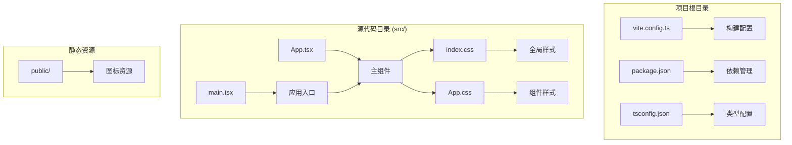
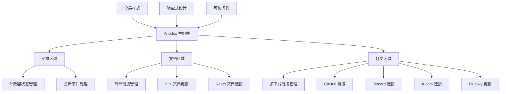
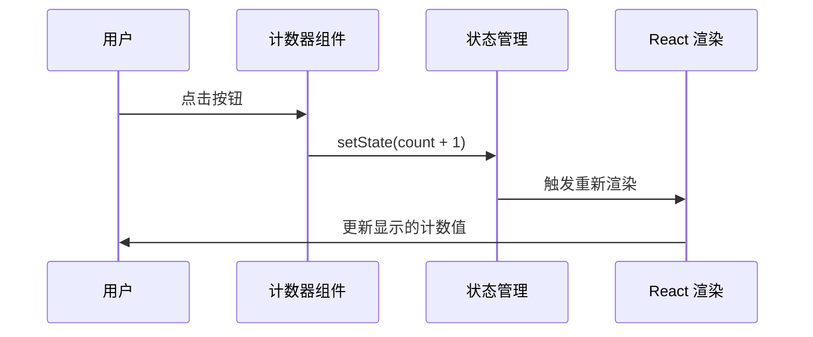
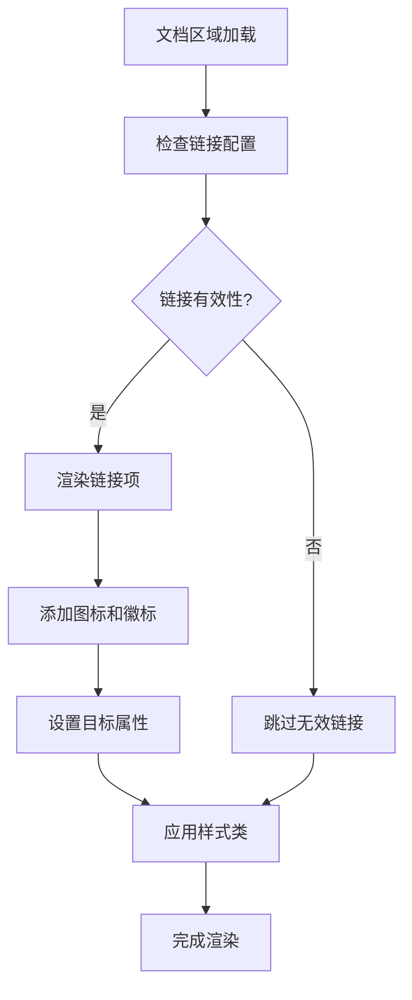
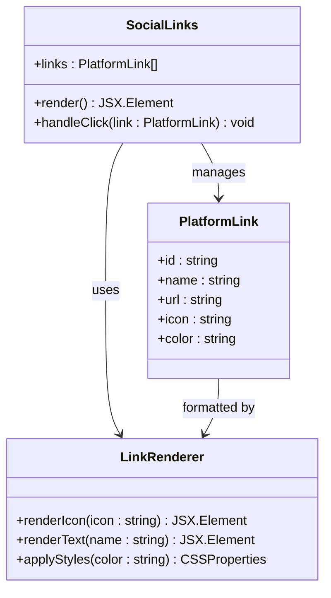
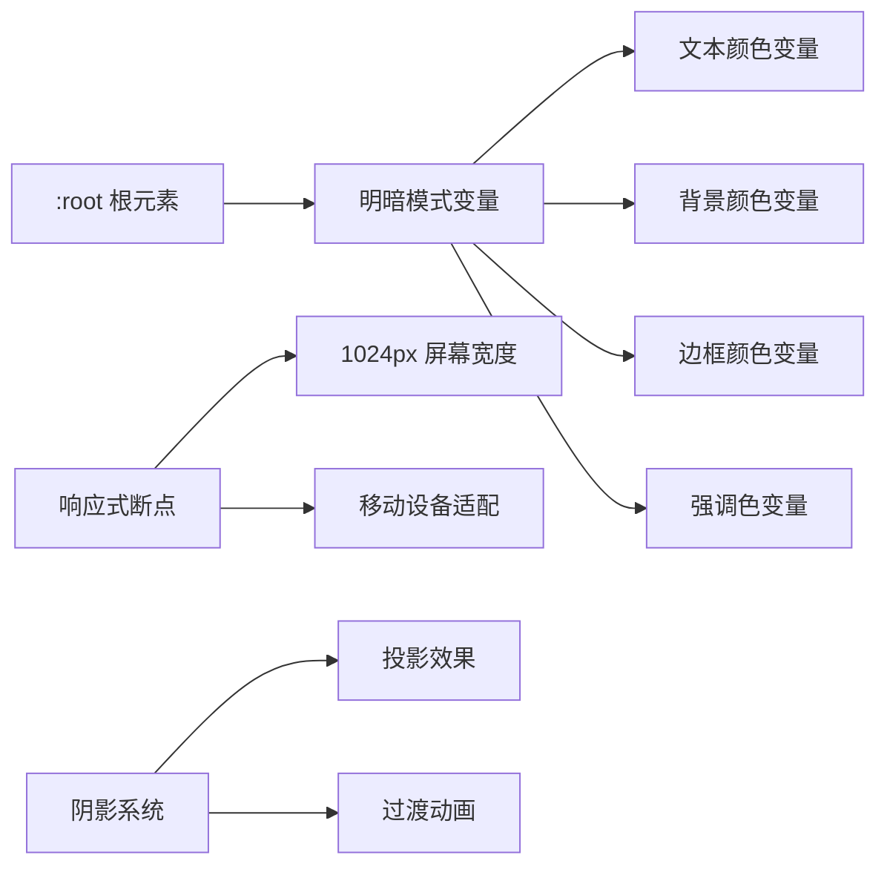

# 功能组件详解

<cite>
**本文档引用的文件**
- [src/App.tsx](file://src/App.tsx)
- [src/App.css](file://src/App.css)
- [src/index.css](file://src/index.css)
- [src/main.tsx](file://src/main.tsx)
- [vite.config.ts](file://vite.config.ts)
- [package.json](file://package.json)
- [README.md](file://README.md)
</cite>

## 目录
1. [简介](#简介)
2. [项目结构](#项目结构)
3. [核心组件](#核心组件)
4. [架构概览](#架构概览)
5. [详细组件分析](#详细组件分析)
6. [依赖分析](#依赖分析)
7. [性能考虑](#性能考虑)
8. [故障排除指南](#故障排除指南)
9. [结论](#结论)

## 简介

Rainbow Learning 是一个基于 React + TypeScript + Vite 构建的现代化学习应用模板。该项目展示了如何在单一组件中实现三种核心功能区域：交互式英雄计数器、文档资源导航和多平台社交链接管理。通过精心设计的样式系统和响应式布局，为用户提供直观的学习体验。

该应用采用现代前端技术栈，集成了 TailwindCSS 样式框架、Framer Motion 动画库和 Zustand 状态管理方案，为后续的功能扩展奠定了坚实基础。

## 项目结构

项目采用标准的 Vite + React + TypeScript 结构，主要文件组织如下：



**图表来源**
- [vite.config.ts:1-12](file://vite.config.ts#L1-L12)
- [package.json:1-36](file://package.json#L1-L36)
- [src/main.tsx:1-11](file://src/main.tsx#L1-L11)

**章节来源**
- [vite.config.ts:1-12](file://vite.config.ts#L1-L12)
- [package.json:1-36](file://package.json#L1-L36)
- [tsconfig.json:1-8](file://tsconfig.json#L1-L8)

## 核心组件

### 英雄区域交互式计数器

英雄区域是应用的核心交互组件，实现了状态驱动的计数器功能。该组件展示了 React Hooks 的最佳实践，特别是 useState 钩子的使用。

**关键特性：**
- 响应式状态管理
- 用户交互反馈
- 状态持久化（在当前会话中）
- 可访问性支持

**状态管理机制：**
- 使用 `useState` Hook 维护计数状态
- 单击事件处理器更新状态
- 自动重新渲染 UI

**章节来源**
- [src/App.tsx:7-31](file://src/App.tsx#L7-L31)

### 文档区域外部链接集成

文档区域提供了学习资源的快速访问入口，集成了多个外部平台的链接。该组件展示了如何在 React 中实现外部链接的最佳实践。

**链接管理：**
- Vite 官方文档链接
- React 官方文档链接
- 外部链接安全策略
- 图标与文本的组合展示

**章节来源**
- [src/App.tsx:36-56](file://src/App.tsx#L36-L56)

### 社交区域多平台链接管理

社交区域是应用中最复杂的链接管理系统，支持四个不同的社交平台。该组件展示了如何在有限的空间内有效管理多个外部链接。

**平台支持：**
- GitHub - 代码托管和开源社区
- Discord - 实时聊天和社区讨论
- X.com (Twitter) - 平台动态和新闻
- Bluesky - 新兴社交网络平台

**设计特点：**
- SVG 图标与平台标识的结合
- 响应式布局适配移动设备
- 悬停效果增强用户体验
- 可访问性友好的语义化标记

**章节来源**
- [src/App.tsx:57-114](file://src/App.tsx#L57-L114)

## 架构概览

应用采用单组件架构模式，所有功能都集中在单一的 App.tsx 文件中。这种设计简化了项目的复杂度，特别适合小型到中型的应用程序。



**图表来源**
- [src/App.tsx:1-123](file://src/App.tsx#L1-L123)
- [src/App.css:1-185](file://src/App.css#L1-L185)
- [src/index.css:1-114](file://src/index.css#L1-L114)

## 详细组件分析

### 英雄区域组件分析

英雄区域是应用的核心交互组件，实现了完整的计数器功能。该组件展示了现代 React 开发的最佳实践。

#### 状态管理架构



**图表来源**
- [src/App.tsx:24-30](file://src/App.tsx#L24-L30)

#### 组件属性接口定义

虽然当前实现使用了内联样式，但可以扩展为支持更多自定义选项：

```typescript
interface CounterProps {
  initialValue?: number;
  onChange?: (count: number) => void;
  className?: string;
  disabled?: boolean;
}
```

**章节来源**
- [src/App.tsx:7-31](file://src/App.tsx#L7-L31)

### 文档区域组件分析

文档区域实现了学习资源的统一入口，展示了如何在 React 中管理多个外部链接。

#### 链接管理流程



**图表来源**
- [src/App.tsx:42-55](file://src/App.tsx#L42-L55)

#### 外部链接集成模式

文档区域采用了标准化的链接集成模式：
- 统一的链接格式规范
- 图标与文本的视觉层次
- 响应式布局适配
- 可访问性支持

**章节来源**
- [src/App.tsx:36-56](file://src/App.tsx#L36-L56)

### 社交区域组件分析

社交区域是最复杂的组件，需要管理四个不同平台的链接。该组件展示了如何在有限空间内有效组织多个外部链接。

#### 多平台链接管理架构



**图表来源**
- [src/App.tsx:57-114](file://src/App.tsx#L57-L114)

#### 平台链接配置

| 平台 | 链接 | 图标 | 颜色主题 |
|------|------|------|----------|
| GitHub | 代码托管 | GitHub 图标 | 默认 |
| Discord | 实时聊天 | Discord 图标 | 默认 |
| X.com | 社交媒体 | X 图标 | 默认 |
| Bluesky | 新兴平台 | Bluesky 图标 | 深色模式优化 |

**章节来源**
- [src/App.tsx:57-114](file://src/App.tsx#L57-L114)

### 样式系统分析

应用采用了基于 CSS 变量的主题系统，支持明暗模式切换。

#### 主题变量架构



**图表来源**
- [src/index.css:3-53](file://src/index.css#L3-L53)
- [src/App.css:73-96](file://src/App.css#L73-L96)

**章节来源**
- [src/index.css:1-114](file://src/index.css#L1-L114)
- [src/App.css:1-185](file://src/App.css#L1-L185)

## 依赖分析

项目使用了现代化的前端技术栈，每个依赖都有明确的作用和价值。

```mermaid
graph TB
subgraph "运行时依赖"
A[react] --> B[React 核心库]
C[react-dom] --> D[DOM 操作]
E[@supabase/supabase-js] --> F[数据库服务]
G[zustand] --> H[状态管理]
I[framer-motion] --> J[动画效果]
K[tailwindcss] --> L[样式框架]
M[@tailwindcss/vite] --> N[Tailwind 插件]
end
subgraph "开发依赖"
O[vite] --> P[构建工具]
Q[@vitejs/plugin-react] --> R[React 支持]
S[typescript] --> T[类型检查]
U[eslint] --> V[代码质量]
end
```

**图表来源**
- [package.json:12-34](file://package.json#L12-L34)

### 核心依赖说明

**React 生态系统：**
- React 19.x 提供最新的 React 特性和性能优化
- React DOM 负责虚拟 DOM 到真实 DOM 的映射
- Vite React 插件提供开发时的热重载和快速构建

**样式和动画：**
- TailwindCSS 提供实用优先的样式解决方案
- Framer Motion 实现流畅的动画和过渡效果
- CSS 变量系统支持主题定制和响应式设计

**状态管理：**
- Zustand 提供轻量级的状态管理解决方案
- 适合中小型应用的状态共享需求

**开发工具链：**
- TypeScript 提供静态类型检查
- ESLint 确保代码质量和一致性
- Vite 提供快速的开发环境和构建工具

**章节来源**
- [package.json:1-36](file://package.json#L1-L36)

## 性能考虑

### 渲染优化策略

应用采用了多种性能优化策略来确保良好的用户体验：

**组件拆分：**
- 将大型组件拆分为更小的可维护单元
- 减少不必要的重新渲染
- 提高代码的可测试性

**样式优化：**
- 使用 CSS 变量减少重复样式定义
- 响应式设计避免过度的媒体查询
- 内联关键 CSS 提升首屏渲染速度

**资源管理：**
- 图片资源按需加载
- SVG 图标内联减少 HTTP 请求
- 缓存策略优化静态资源加载

### 性能监控建议

对于生产环境，建议实施以下监控措施：

1. **核心 Web 指标 (CWV)** 监控
2. **组件渲染时间测量**
3. **内存使用情况跟踪**
4. **用户交互延迟分析**

## 故障排除指南

### 常见问题及解决方案

**问题：链接无法打开外部网站**
- 检查 `target="_blank"` 属性设置
- 确认浏览器允许新标签页打开
- 验证链接 URL 格式正确性

**问题：样式不生效或显示异常**
- 检查 CSS 变量是否正确定义
- 验证 TailwindCSS 配置
- 确认响应式断点设置

**问题：计数器状态不更新**
- 检查 useState Hook 的使用
- 验证事件处理器绑定
- 确认状态更新函数的调用

**问题：构建失败或编译错误**
- 检查 TypeScript 配置文件
- 验证依赖版本兼容性
- 确认 Vite 配置正确

### 调试技巧

**开发工具使用：**
- React DevTools 分析组件树
- 浏览器开发者工具检查样式
- 控制台日志调试状态变化

**性能分析：**
- 使用 React Profiler 分析渲染性能
- 检查内存泄漏和不必要的重渲染
- 优化大型列表的渲染

**章节来源**
- [src/App.tsx:24-30](file://src/App.tsx#L24-L30)
- [src/App.tsx:44-54](file://src/App.tsx#L44-L54)
- [src/App.tsx:65-111](file://src/App.tsx#L65-L111)

## 结论

Rainbow Learning 应用展示了如何在现代前端技术栈下构建简洁而功能丰富的用户界面。通过精心设计的组件架构和样式系统，该应用成功地实现了三个核心功能区域的集成。

### 主要成就

**架构设计：**
- 单组件架构简化了项目结构
- 清晰的职责分离便于维护
- 可扩展的设计支持未来功能添加

**用户体验：**
- 直观的交互设计提升用户满意度
- 响应式布局适配各种设备
- 可访问性支持确保包容性

**技术实现：**
- 现代化工具链提高开发效率
- 类型安全保证代码质量
- 性能优化确保流畅体验

### 扩展建议

基于当前的实现，建议考虑以下扩展方向：

1. **组件模块化** - 将现有功能拆分为独立的可复用组件
2. **状态管理优化** - 引入更复杂的状态管理方案
3. **国际化支持** - 添加多语言本地化功能
4. **主题系统增强** - 提供更多自定义选项
5. **动画效果丰富** - 使用 Framer Motion 实现更复杂的过渡效果

该应用为学习 React 开发和现代前端技术提供了优秀的参考案例，其设计理念和实现方式值得在更大规模的项目中借鉴和扩展。