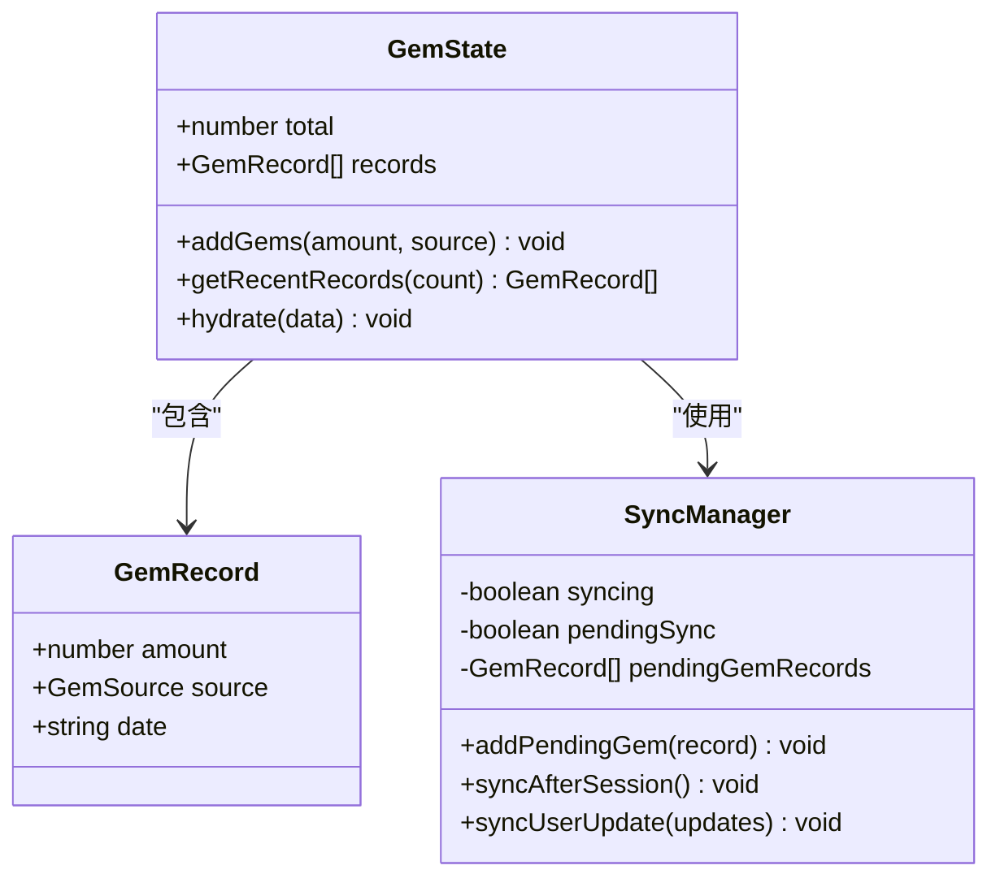
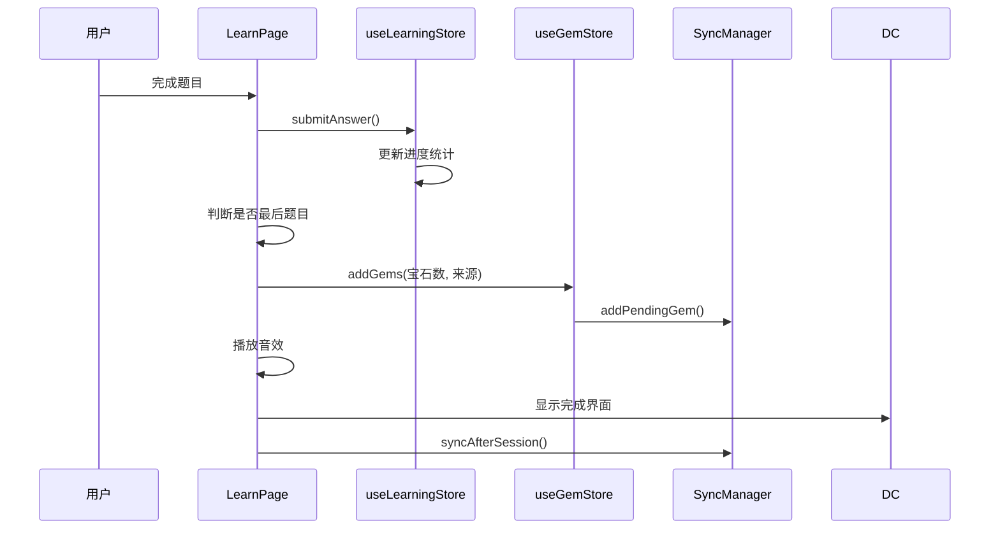
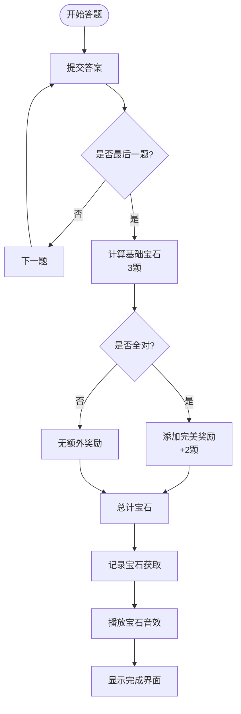
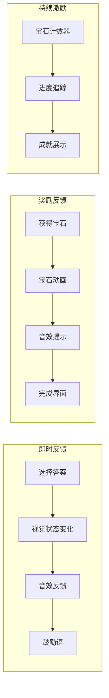
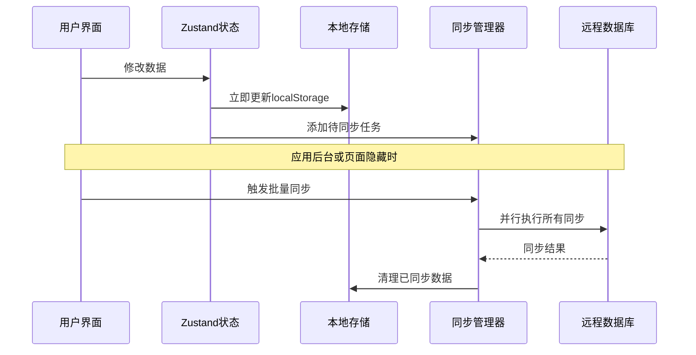
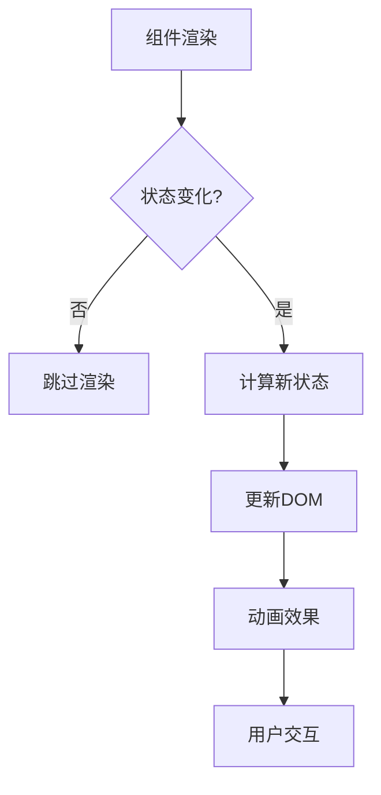

# 奖励机制

<cite>
**本文档引用的文件**
- [src/store/useGemStore.ts](file://src/store/useGemStore.ts)
- [src/store/useLearningStore.ts](file://src/store/useLearningStore.ts)
- [src/store/useUserStore.ts](file://src/store/useUserStore.ts)
- [src/lib/db/syncManager.ts](file://src/lib/db/syncManager.ts)
- [src/pages/LearnPage.tsx](file://src/pages/LearnPage.tsx)
- [src/components/DailyComplete.tsx](file://src/components/DailyComplete.tsx)
- [src/components/FeedbackOverlay.tsx](file://src/components/FeedbackOverlay.tsx)
- [src/components/GemCounter.tsx](file://src/components/GemCounter.tsx)
- [src/lib/sounds.ts](file://src/lib/sounds.ts)
- [src/data/encouragements.ts](file://src/data/encouragements.ts)
- [src/types/index.ts](file://src/types/index.ts)
- [src/lib/storage.ts](file://src/lib/storage.ts)
</cite>

## 目录
1. [简介](#简介)
2. [系统架构概览](#系统架构概览)
3. [核心组件分析](#核心组件分析)
4. [奖励机制详解](#奖励机制详解)
5. [音效与反馈系统](#音效与反馈系统)
6. [数据存储与同步](#数据存储与同步)
7. [性能考虑](#性能考虑)
8. [故障排除指南](#故障排除指南)
9. [总结](#总结)

## 简介

彩虹学习应用采用基于宝石的奖励机制，通过游戏化设计激励儿童学习中文汉字。该系统通过多种奖励方式（每日完成、完美得分、复习完成）为用户提供即时反馈和长期激励，创造积极的学习体验。

## 系统架构概览

```mermaid
graph TB
subgraph "用户界面层"
LP[LearnPage]
DC[DailyComplete]
FO[FeedbackOverlay]
GC[GemCounter]
end
subgraph "状态管理层"
GS[useGemStore]
LS[useLearningStore]
US[useUserStore]
end
subgraph "数据持久化层"
SM[SyncManager]
LS[LocalStorage]
DB[(Supabase数据库)]
end
subgraph "音效与反馈层"
S[sounds.ts]
E[encouragements.ts]
end
LP --> GS
LP --> LS
LP --> DC
LP --> FO
DC --> GS
FO --> S
GS --> SM
LS --> SM
SM --> DB
SM --> LS
S --> E
```

**图表来源**
- [src/pages/LearnPage.tsx:1-288](file://src/pages/LearnPage.tsx#L1-L288)
- [src/store/useGemStore.ts:1-50](file://src/store/useGemStore.ts#L1-L50)
- [src/lib/db/syncManager.ts:1-112](file://src/lib/db/syncManager.ts#L1-L112)

## 核心组件分析

### 宝石状态管理器

宝石状态管理器是奖励系统的核心组件，负责管理用户的宝石数量、获取记录和同步机制。

**图表来源**
- [src/store/useGemStore.ts:7-15](file://src/store/useGemStore.ts#L7-L15)
- [src/types/index.ts:44-49](file://src/types/index.ts#L44-L49)
- [src/lib/db/syncManager.ts:15-31](file://src/lib/db/syncManager.ts#L15-L31)

### 学习进度管理器

学习进度管理器跟踪用户的每日学习进度，计算正确率并决定奖励发放。

**图表来源**
- [src/pages/LearnPage.tsx:144-159](file://src/pages/LearnPage.tsx#L144-L159)
- [src/store/useLearningStore.ts:119-140](file://src/store/useLearningStore.ts#L119-L140)
- [src/store/useGemStore.ts:23-35](file://src/store/useGemStore.ts#L23-L35)

**章节来源**
- [src/store/useGemStore.ts:1-50](file://src/store/useGemStore.ts#L1-L50)
- [src/store/useLearningStore.ts:1-185](file://src/store/useLearningStore.ts#L1-L185)
- [src/store/useUserStore.ts:1-51](file://src/store/useUserStore.ts#L1-L51)

## 奖励机制详解

### 奖励类型与规则

系统定义了三种主要的宝石奖励来源：

| 奖励来源 | 触发条件 | 基础宝石数 | 特殊奖励 | 总宝石数 |
|---------|----------|------------|----------|----------|
| daily_complete | 完成当日5道题目 | 3 | - | 3 |
| perfect_score | 全部答对 | 3 | +2 | 5 |
| review_complete | 复习完成 | 3 | - | 3 |

### 奖励计算逻辑

**图表来源**
- [src/pages/LearnPage.tsx:144-159](file://src/pages/LearnPage.tsx#L144-L159)

### 奖励发放流程

宝石奖励的发放遵循严格的流程控制，确保数据一致性和用户体验：

1. **进度检查**：确认当前是否为最后一个题目
2. **基础计算**：设置基础奖励为3颗宝石
3. **特殊判定**：检查是否达到完美得分（全部答对）
4. **奖励叠加**：如完美得分则额外奖励2颗宝石
5. **数据更新**：通过状态管理器更新宝石总数
6. **音效反馈**：播放宝石收集音效
7. **界面展示**：在完成界面显示获得的宝石数量

**章节来源**
- [src/pages/LearnPage.tsx:144-159](file://src/pages/LearnPage.tsx#L144-L159)
- [src/store/useGemStore.ts:23-35](file://src/store/useGemStore.ts#L23-L35)

## 音效与反馈系统

### 多层次反馈设计

系统通过视觉、听觉和触觉反馈创造丰富的学习体验：

### 音效系统架构

音效系统采用Web Audio API实现，提供高质量的音频体验：

| 音效类型 | 频率范围(Hz) | 波形类型 | 用途 |
|---------|-------------|----------|------|
| 答对音效 | 261.63-392.0 | 正弦波 | 答案正确反馈 |
| 答错音效 | 196.0 | 正弦波 | 答案错误反馈 |
| 宝石音效 | 523.25-783.99 | 三角波 | 宝石收集提示 |
| 鼓励语音 | 预录制 | MP3文件 | 积极鼓励语 |

**章节来源**
- [src/lib/sounds.ts:54-130](file://src/lib/sounds.ts#L54-L130)
- [src/data/encouragements.ts:1-39](file://src/data/encouragements.ts#L1-L39)

## 数据存储与同步

### 本地存储策略

系统采用混合存储策略，在保证响应速度的同时确保数据安全：

**图表来源**
- [src/lib/db/syncManager.ts:34-90](file://src/lib/db/syncManager.ts#L34-L90)

### 同步机制设计

同步管理器采用异步批量处理策略，优化性能和用户体验：

1. **延迟同步**：答题过程中的数据先写入本地存储
2. **批量处理**：学习会话完成后统一同步到服务器
3. **并行执行**：同时处理多个数据类型的同步请求
4. **错误恢复**：单个同步失败不影响其他数据
5. **幂等性**：重复同步不会产生重复数据

**章节来源**
- [src/lib/db/syncManager.ts:1-112](file://src/lib/db/syncManager.ts#L1-L112)
- [src/lib/storage.ts:1-32](file://src/lib/storage.ts#L1-L32)

## 性能考虑

### 状态管理优化

系统采用Zustand进行状态管理，相比Redux具有更好的性能表现：

- **原子化状态**：每个状态独立管理，减少不必要的重渲染
- **选择器模式**：组件只订阅需要的状态片段
- **中间件支持**：内置持久化和调试功能

### 渲染性能优化

### 内存管理

- **垃圾回收**：及时清理不再使用的状态和事件监听器
- **缓存策略**：合理使用缓存避免重复计算
- **资源释放**：音频资源在不需要时及时释放

## 故障排除指南

### 常见问题及解决方案

| 问题类型 | 症状描述 | 可能原因 | 解决方案 |
|---------|----------|----------|----------|
| 宝石不增加 | 点击后宝石数不变 | 状态更新失败 | 检查addGems函数调用 |
| 同步失败 | 离线后数据未上传 | 网络连接问题 | 重试同步或检查网络状态 |
| 音效无声 | 答对/答错无声音 | 浏览器限制或音频上下文问题 | 用户手势后重新初始化音频 |
| 进度丢失 | 刷新后学习进度消失 | 本地存储权限问题 | 检查浏览器存储设置 |

### 调试工具

系统提供了完善的调试支持：

- **状态监控**：实时查看宝石、学习进度等状态
- **同步日志**：记录所有同步操作的详细信息
- **性能指标**：监控渲染性能和内存使用情况

**章节来源**
- [src/lib/db/syncManager.ts:80-89](file://src/lib/db/syncManager.ts#L80-L89)

## 总结

彩虹学习应用的奖励机制通过精心设计的游戏化元素，有效提升了儿童学习中文汉字的兴趣和参与度。系统的核心优势包括：

1. **多层次激励**：通过不同类型的奖励满足用户的成就感需求
2. **即时反馈**：视觉、听觉和触觉反馈创造沉浸式学习体验
3. **数据安全**：本地存储与云端同步相结合，确保数据可靠性
4. **性能优化**：高效的渲染和状态管理保证流畅的用户体验
5. **可扩展性**：模块化的架构设计便于功能扩展和维护

该奖励机制不仅提高了学习效果，更重要的是培养了儿童持续学习的兴趣和自信心，为后续的教育应用开发提供了优秀的参考范例。