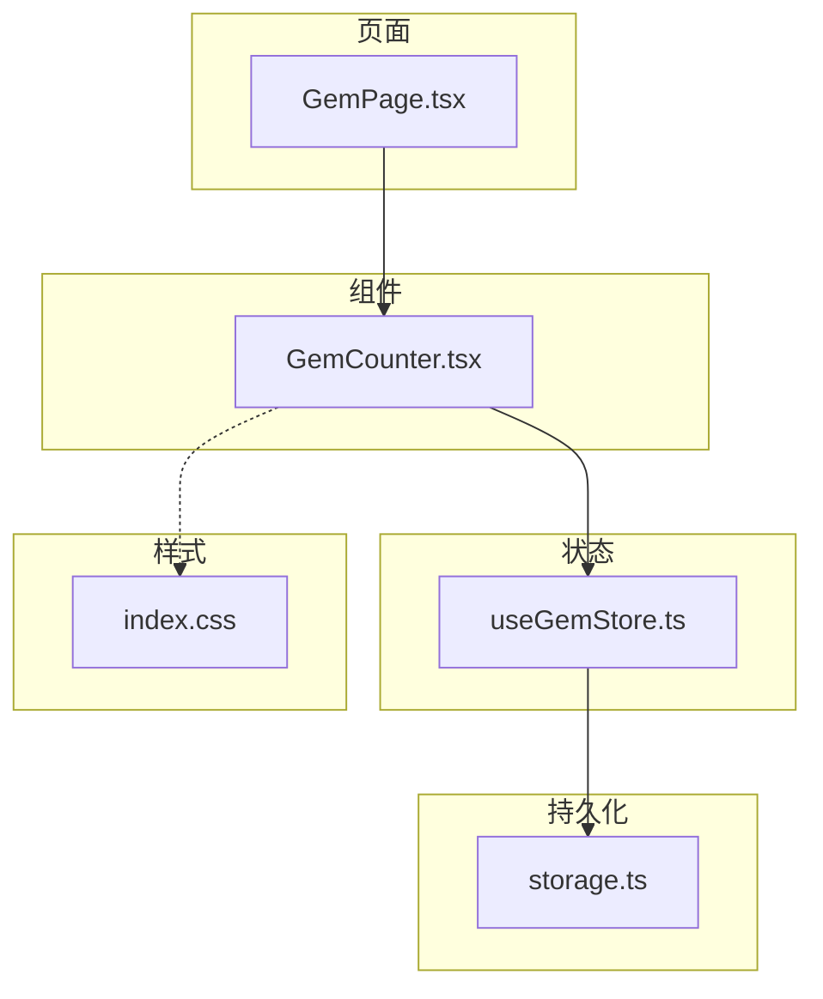
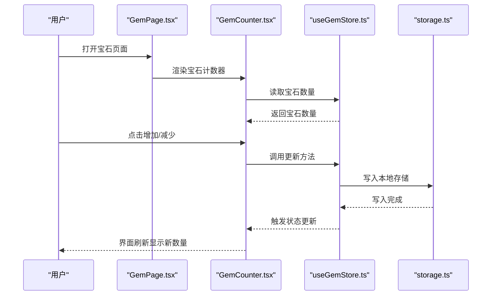
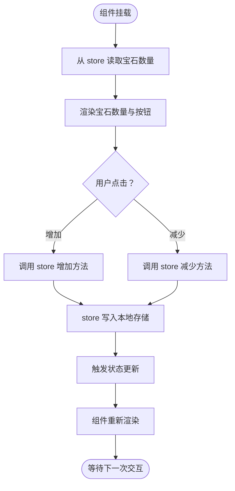
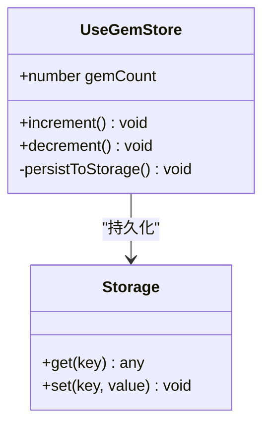
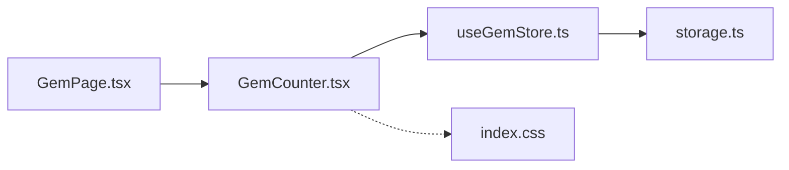

# 宝石计数器

<cite>
**本文引用的文件**   
- [GemCounter.tsx](file://src/components/GemCounter.tsx)
- [useGemStore.ts](file://src/store/useGemStore.ts)
- [GemPage.tsx](file://src/pages/GemPage.tsx)
- [storage.ts](file://src/lib/storage.ts)
- [index.css](file://src/index.css)
</cite>

## 目录
1. [简介](#简介)
2. [项目结构](#项目结构)
3. [核心组件](#核心组件)
4. [架构总览](#架构总览)
5. [详细组件分析](#详细组件分析)
6. [依赖分析](#依赖分析)
7. [性能考虑](#性能考虑)
8. [故障排查指南](#故障排查指南)
9. [结论](#结论)
10. [附录](#附录)

## 简介
本项目是一个面向学习类应用的“宝石计数器”功能，用于展示与持久化用户的宝石数量。该功能通过 React 组件提供 UI，使用 Zustand store 管理状态，并通过本地存储实现数据持久化。页面入口位于独立路由页面中，便于在应用中导航访问。

## 项目结构
围绕“宝石计数器”的相关代码主要分布在以下位置：
- 组件层：负责渲染宝石计数显示与交互
- 状态层：集中管理宝石数量的读写与变更
- 持久化层：将宝石数量保存到浏览器本地存储
- 页面层：作为路由页面承载宝石计数器组件
- 样式层：全局样式定义（如颜色、字体等）

图表来源
- [GemPage.tsx](file://src/pages/GemPage.tsx)
- [GemCounter.tsx](file://src/components/GemCounter.tsx)
- [useGemStore.ts](file://src/store/useGemStore.ts)
- [storage.ts](file://src/lib/storage.ts)
- [index.css](file://src/index.css)

章节来源
- [GemCounter.tsx](file://src/components/GemCounter.tsx)
- [useGemStore.ts](file://src/store/useGemStore.ts)
- [GemPage.tsx](file://src/pages/GemPage.tsx)
- [storage.ts](file://src/lib/storage.ts)
- [index.css](file://src/index.css)

## 核心组件
- 宝石计数器组件：负责展示当前宝石数量，并提供增加/减少等操作入口；从 store 订阅宝石数量变化并触发重渲染。
- 宝石状态管理：以 Zustand store 形式暴露宝石数量与操作方法（如增加、减少），并在变更时同步到本地存储。
- 本地存储：封装了读取与写入本地存储的通用能力，供 store 调用以实现数据持久化。
- 页面入口：将宝石计数器组件嵌入到页面布局中，作为可访问的路由页面。

章节来源
- [GemCounter.tsx](file://src/components/GemCounter.tsx)
- [useGemStore.ts](file://src/store/useGemStore.ts)
- [GemPage.tsx](file://src/pages/GemPage.tsx)
- [storage.ts](file://src/lib/storage.ts)

## 架构总览
整体采用“页面 → 组件 → Store → 存储”的分层架构，职责清晰、耦合度低：
- 页面仅负责承载与布局
- 组件专注 UI 渲染与用户交互
- Store 负责业务状态与副作用（持久化）
- 存储模块提供统一的本地存取接口

图表来源
- [GemPage.tsx](file://src/pages/GemPage.tsx)
- [GemCounter.tsx](file://src/components/GemCounter.tsx)
- [useGemStore.ts](file://src/store/useGemStore.ts)
- [storage.ts](file://src/lib/storage.ts)

## 详细组件分析

### 宝石计数器组件（GemCounter）
- 职责
  - 从 store 订阅宝石数量
  - 渲染宝石图标与数值
  - 提供增加/减少按钮或交互
  - 处理边界情况（如非负数限制）
- 关键流程
  - 初始化：读取 store 中的宝石数量并渲染
  - 交互：用户点击后调用 store 的更新方法
  - 持久化：store 内部自动写入本地存储
  - 更新：store 变更触发组件重新渲染
- 错误处理
  - 对非法输入进行校验（如负数）
  - 捕获可能的存储异常并降级处理
- 性能优化
  - 仅订阅必要字段，避免不必要的重渲染
  - 防抖/节流可选（如需高频操作）

图表来源
- [GemCounter.tsx](file://src/components/GemCounter.tsx)
- [useGemStore.ts](file://src/store/useGemStore.ts)
- [storage.ts](file://src/lib/storage.ts)

章节来源
- [GemCounter.tsx](file://src/components/GemCounter.tsx)

### 宝石状态管理（useGemStore）
- 职责
  - 维护宝石数量状态
  - 提供增加、减少等方法
  - 在状态变更后持久化到本地存储
- 数据结构
  - 宝石数量：数字类型
- 复杂度
  - 时间复杂度：O(1) 的增删改操作
  - 空间复杂度：O(1)，仅保存一个数值
- 依赖关系
  - 依赖本地存储模块进行持久化
- 错误处理
  - 捕获存储失败并记录日志或回退策略
  - 保证状态一致性（即使存储失败也保持内存状态正确）

图表来源
- [useGemStore.ts](file://src/store/useGemStore.ts)
- [storage.ts](file://src/lib/storage.ts)

章节来源
- [useGemStore.ts](file://src/store/useGemStore.ts)

### 本地存储（storage）
- 职责
  - 统一封装本地存储的读取与写入
  - 提供键值对存取能力
- 关键点
  - 安全地序列化/反序列化数据
  - 处理存储容量不足或权限问题
- 性能
  - 单次读写为 O(1)
  - 建议批量操作时合并写入以减少 I/O

章节来源
- [storage.ts](file://src/lib/storage.ts)

### 宝石页面（GemPage）
- 职责
  - 作为路由页面承载宝石计数器组件
  - 提供页面级布局与标题
- 集成点
  - 引入宝石计数器组件
  - 可选引入全局样式或主题变量

章节来源
- [GemPage.tsx](file://src/pages/GemPage.tsx)

### 样式（index.css）
- 作用
  - 定义全局样式变量（如颜色、字号）
  - 为宝石计数器相关元素提供基础样式支持
- 建议
  - 将宝石主题色抽离为 CSS 变量，便于扩展

章节来源
- [index.css](file://src/index.css)

## 依赖分析
- 组件依赖
  - GemCounter 依赖 useGemStore
- 状态依赖
  - useGemStore 依赖 storage
- 页面依赖
  - GemPage 依赖 GemCounter
- 样式依赖
  - 组件间接依赖 index.css 中的全局样式

图表来源
- [GemPage.tsx](file://src/pages/GemPage.tsx)
- [GemCounter.tsx](file://src/components/GemCounter.tsx)
- [useGemStore.ts](file://src/store/useGemStore.ts)
- [storage.ts](file://src/lib/storage.ts)
- [index.css](file://src/index.css)

章节来源
- [GemPage.tsx](file://src/pages/GemPage.tsx)
- [GemCounter.tsx](file://src/components/GemCounter.tsx)
- [useGemStore.ts](file://src/store/useGemStore.ts)
- [storage.ts](file://src/lib/storage.ts)
- [index.css](file://src/index.css)

## 性能考虑
- 最小化重渲染：仅订阅必要的状态字段，避免整棵状态树变更导致的过度渲染
- 持久化频率：在高频操作中考虑批处理或节流，降低本地存储 I/O 次数
- 初始加载：首次启动时异步读取本地存储，避免阻塞 UI 渲染
- 内存占用：仅维护单一数值状态，内存开销极低

## 故障排查指南
- 常见问题
  - 宝石数量未持久化：检查本地存储是否可用、是否存在权限问题
  - 界面不更新：确认 store 是否正确触发状态更新，组件是否订阅了相应字段
  - 数值异常：检查是否有非法输入导致负数或溢出
- 定位步骤
  - 在 store 的更新方法中添加日志，观察是否执行成功
  - 在 storage 的写入处捕获异常并输出错误信息
  - 在组件中打印当前状态，确认是否与预期一致
- 恢复策略
  - 若存储失败，保留内存状态不变，提示用户稍后再试
  - 提供重置或修复入口，允许用户手动恢复默认值

章节来源
- [useGemStore.ts](file://src/store/useGemStore.ts)
- [storage.ts](file://src/lib/storage.ts)

## 结论
“宝石计数器”以清晰的层次结构与低耦合设计实现了宝石数量的展示与持久化。通过组件—状态—存储的分层模式，既保证了可维护性，也为后续扩展（如多币种、排行榜、任务奖励等）预留了良好空间。建议在后续迭代中完善错误处理与性能监控，进一步提升用户体验与稳定性。

## 附录
- 术语
  - 宝石：应用内的一种积分或货币单位
  - 持久化：将数据保存到本地存储，以便下次启动仍可使用
- 扩展方向
  - 增加宝石获取途径（完成任务、签到等）
  - 支持宝石消费（兑换道具、解锁内容）
  - 添加动画反馈与音效增强体验