# 学习系统

<cite>
**本文档引用的文件**
- [README.md](file://README.md)
- [package.json](file://package.json)
- [src/App.tsx](file://src/App.tsx)
- [src/main.tsx](file://src/main.tsx)
- [src/components/Layout.tsx](file://src/components/Layout.tsx)
- [src/pages/HomePage.tsx](file://src/pages/HomePage.tsx)
- [src/pages/LearnPage.tsx](file://src/pages/LearnPage.tsx)
- [src/pages/MathLearnPage.tsx](file://src/pages/MathLearnPage.tsx)
- [src/data/questions.json](file://src/data/questions.json)
- [src/data/math-questions.json](file://src/data/math-questions.json)
- [src/store/useLearningStore.ts](file://src/store/useLearningStore.ts)
- [src/store/useMathLearningStore.ts](file://src/store/useMathLearningStore.ts)
- [src/store/useGemStore.ts](file://src/store/useGemStore.ts)
- [src/store/useErrorBankStore.ts](file://src/store/useErrorBankStore.ts)
- [src/store/useUserStore.ts](file://src/store/useUserStore.ts)
- [src/hooks/useAppInit.ts](file://src/hooks/useAppInit.ts)
- [src/lib/supabase.ts](file://src/lib/supabase.ts)
- [src/types/index.ts](file://src/types/index.ts)
- [src/components/FeedbackOverlay.tsx](file://src/components/FeedbackOverlay.tsx)
- [src/components/ProgressBar.tsx](file://src/components/ProgressBar.tsx)
- [src/components/OptionCard.tsx](file://src/components/OptionCard.tsx)
- [src/components/DailyComplete.tsx](file://src/components/DailyComplete.tsx)
- [src/components/math/MathProgressBar.tsx](file://src/components/math/MathProgressBar.tsx)
- [src/components/math/MathFeedbackOverlay.tsx](file://src/components/math/MathFeedbackOverlay.tsx)
- [src/components/math/MathDailyComplete.tsx](file://src/components/math/MathDailyComplete.tsx)
- [src/components/math/MathOptionCard.tsx](file://src/components/math/MathOptionCard.tsx)
- [src/components/math/MathFloatingDecorations.tsx](file://src/components/math/MathFloatingDecorations.tsx)
- [src/components/math/PatternRenderer.tsx](file://src/components/math/PatternRenderer.tsx)
- [src/components/math/CountingRenderer.tsx](file://src/components/math/CountingRenderer.tsx)
- [src/components/math/ComparisonRenderer.tsx](file://src/components/math/ComparisonRenderer.tsx)
- [src/components/math/ShapeRenderer.tsx](file://src/components/math/ShapeRenderer.tsx)
- [src/data/math-encouragements.ts](file://src/data/math-encouragements.ts)
- [src/index.css](file://src/index.css)
</cite>

## 更新摘要
**变更内容**
- 新增数学学习模块，包含完整的数学题目系统和学习界面
- 添加数学学习状态管理，支持每日数学学习进度跟踪
- 扩展宝石奖励机制，支持数学学习的专属奖励
- 新增多题型渲染组件：找规律、数一数、比大小、图形识别
- 增强反馈系统，支持数学学习的专属鼓励语和动画效果
- 扩展练习模式，支持数学题目的独立练习功能

## 目录
1. [简介](#简介)
2. [项目结构](#项目结构)
3. [核心组件](#核心组件)
4. [架构概览](#架构概览)
5. [详细组件分析](#详细组件分析)
6. [数学学习系统](#数学学习系统)
7. [依赖关系分析](#依赖关系分析)
8. [性能考虑](#性能考虑)
9. [故障排除指南](#故障排除指南)
10. [结论](#结论)

## 简介

这是一个基于 React + TypeScript + Vite 构建的儿童学习系统，名为"快乐学堂"。该系统现已扩展为双学科学习平台，专注于汉字学习和数学学习，提供互动式的学习体验，包含每日学习计划、错题复习、宝石奖励机制等功能。

系统采用现代化的技术栈，包括：
- React 19.2.6 用于构建用户界面
- TypeScript 提供类型安全
- Vite 8.0.12 作为构建工具
- Zustand 5.0.14 作为状态管理库
- Supabase 2.108.2 作为后端服务
- Framer Motion 12.40.0 用于动画效果
- TailwindCSS 4.3.1 用于样式设计

**更新亮点**
- **双学科支持** - 同时支持中文学习和数学学习两个学科
- **数学题库系统** - 包含20道找规律、15道数一数、15道比大小、15道图形识别题目
- **专属数学界面** - 独立的数学学习页面，使用糖果主题装饰
- **多题型支持** - 支持四种数学题型：找规律、数一数、比大小、图形识别
- **数学奖励机制** - 专门的数学学习宝石奖励系统

## 项目结构

该项目采用模块化组织方式，主要目录结构如下：

```mermaid
graph TB
subgraph "根目录"
A[public/] --> A1[audio/]
B[src/] --> B1[assets/]
B --> B2[components/]
B --> B3[data/]
B --> B4[hooks/]
B --> B5[lib/]
B --> B6[pages/]
B --> B7[store/]
B --> B8[types/]
B --> B9[App.tsx]
B --> B10[main.tsx]
end
subgraph "前端资源"
A1 --> A11[correct/]
A1 --> A12[wrong/]
end
subgraph "组件层"
B2 --> B21[BottomNav.tsx]
B2 --> B22[DailyComplete.tsx]
B2 --> B23[FeedbackOverlay.tsx]
B2 --> B24[GemCounter.tsx]
B2 --> B25[Layout.tsx]
B2 --> B26[OptionCard.tsx]
B2 --> B27[ProgressBar.tsx]
B2 --> B28[StarAnimation.tsx]
B2 --> B29[UserAvatar.tsx]
B2 --> B2a[math/]
B2a --> B2a1[MathProgressBar.tsx]
B2a --> B2a2[MathFeedbackOverlay.tsx]
B2a --> B2a3[MathDailyComplete.tsx]
B2a --> B2a4[MathOptionCard.tsx]
B2a --> B2a5[MathFloatingDecorations.tsx]
B2a --> B2a6[PatternRenderer.tsx]
B2a --> B2a7[CountingRenderer.tsx]
B2a --> B2a8[ComparisonRenderer.tsx]
B2a --> B2a9[ShapeRenderer.tsx]
end
subgraph "页面层"
B6 --> B61[HomePage.tsx]
B6 --> B62[LearnPage.tsx]
B6 --> B63[MathLearnPage.tsx]
B6 --> B64[GemPage.tsx]
B6 --> B65[ReviewPage.tsx]
B6 --> B66[ProfilePage.tsx]
end
subgraph "状态管理"
B7 --> B71[useLearningStore.ts]
B7 --> B72[useMathLearningStore.ts]
B7 --> B73[useGemStore.ts]
B7 --> B74[useErrorBankStore.ts]
B7 --> B75[useUserStore.ts]
end
subgraph "数据层"
B3 --> B31[encouragements.ts]
B3 --> B32[math-encouragements.ts]
B3 --> B33[questions.json]
B3 --> B34[math-questions.json]
end
subgraph "库函数"
B5 --> B51[sounds.ts]
B5 --> B52[storage.ts]
B5 --> B53[supabase.ts]
B5 --> B54[db/]
end
```

**图表来源**
- [src/App.tsx:1-43](file://src/App.tsx#L1-L43)
- [src/main.tsx:1-11](file://src/main.tsx#L1-L11)

**章节来源**
- [package.json:1-37](file://package.json#L1-L37)
- [README.md:1-74](file://README.md#L1-L74)

## 核心组件

### 应用入口点

应用的启动流程从 main.tsx 开始，创建 React 根节点并渲染 App 组件。

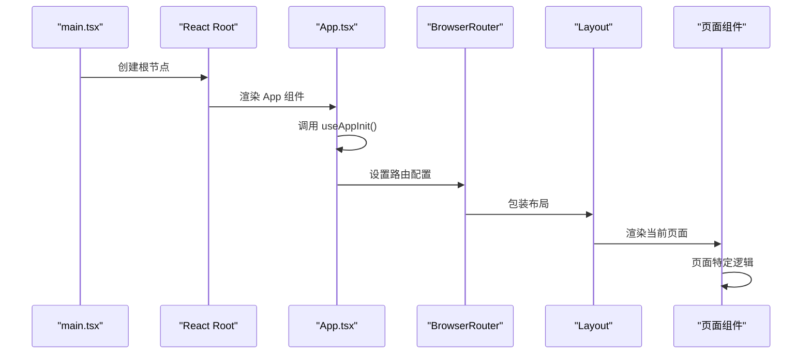

**图表来源**
- [src/main.tsx:1-11](file://src/main.tsx#L1-L11)
- [src/App.tsx:1-43](file://src/App.tsx#L1-L43)
- [src/components/Layout.tsx:1-26](file://src/components/Layout.tsx#L1-L26)

### 学习管理系统

系统的核心是学习管理系统，通过 Zustand 状态管理实现。主要包含以下状态存储：

#### 中文学习存储 (useLearningStore)
- 管理每日中文学习进度
- 控制题目序列和当前索引
- 处理答题结果和统计
- 实现题目随机抽取和去重

#### 数学学习存储 (useMathLearningStore)
- **新增** 管理每日数学学习进度
- **新增** 支持四种数学题型的题目序列
- **新增** 数学学习专用的状态管理和统计
- **新增** 数学题目随机抽取和去重机制

#### 宝石存储 (useGemStore)
- 管理用户获得的宝石数量
- 记录宝石获取历史
- 支持宝石消费和统计
- **更新** 支持数学学习的专属宝石奖励

#### 错题本存储 (useErrorBankStore)
- 跟踪用户的错误题目
- 实现间隔重复算法
- 管理复习计划和进度

#### 用户存储 (useUserStore)
- 管理用户基本信息
- 支持头像和名称更新
- 同步用户设置到云端

**章节来源**
- [src/store/useLearningStore.ts:1-185](file://src/store/useLearningStore.ts#L1-L185)
- [src/store/useMathLearningStore.ts:1-164](file://src/store/useMathLearningStore.ts#L1-L164)
- [src/store/useGemStore.ts:1-50](file://src/store/useGemStore.ts#L1-L50)
- [src/store/useErrorBankStore.ts:1-105](file://src/store/useErrorBankStore.ts#L1-L105)
- [src/store/useUserStore.ts:1-51](file://src/store/useUserStore.ts#L1-L51)

## 架构概览

系统采用分层架构设计，清晰分离关注点：

```mermaid
graph TB
subgraph "表现层 (Presentation Layer)"
A[App.tsx] --> B[Layout.tsx]
B --> C[HomePage.tsx]
B --> D[LearnPage.tsx]
B --> E[MathLearnPage.tsx]
B --> F[GemPage.tsx]
B --> G[ReviewPage.tsx]
B --> H[ProfilePage.tsx]
end
subgraph "组件层 (Component Layer)"
I[OptionCard.tsx] --> J[ProgressBar.tsx]
I --> K[FeedbackOverlay.tsx]
I --> L[UserAvatar.tsx]
I --> M[BottomNav.tsx]
I --> N[math/]
N --> N1[MathOptionCard.tsx]
N --> N2[MathProgressBar.tsx]
N --> N3[MathFeedbackOverlay.tsx]
N --> N4[PatternRenderer.tsx]
N --> N5[CountingRenderer.tsx]
N --> N6[ComparisonRenderer.tsx]
N --> N7[ShapeRenderer.tsx]
end
subgraph "状态管理层 (State Management)"
O[useLearningStore.ts] --> P[useMathLearningStore.ts]
O --> Q[useGemStore.ts]
O --> R[useErrorBankStore.ts]
O --> S[useUserStore.ts]
end
subgraph "数据访问层 (Data Access)"
T[questions.json] --> U[math-questions.json]
V[encouragements.ts] --> W[math-encouragements.ts]
X[supabase.ts] --> Y[数据库操作]
end
subgraph "基础设施层 (Infrastructure)"
Z[storage.ts] --> AA[本地存储]
AB[sounds.ts] --> AC[音频播放]
AD[syncManager] --> AE[数据同步]
```

**图表来源**
- [src/App.tsx:1-43](file://src/App.tsx#L1-L43)
- [src/components/Layout.tsx:1-26](file://src/components/Layout.tsx#L1-L26)
- [src/store/useLearningStore.ts:1-185](file://src/store/useLearningStore.ts#L1-L185)

### 数据流架构

系统采用单向数据流模式，确保状态变更的可预测性：

```mermaid
flowchart TD
A[用户交互] --> B[组件事件处理器]
B --> C[Zustand 状态存储]
C --> D[本地持久化 (localStorage)]
C --> E[Supabase 同步]
D --> F[应用状态更新]
E --> F
F --> G[UI 重新渲染]
G --> A
H[初始化流程] --> I[迁移本地数据]
I --> J[从云端拉取数据]
J --> K[Hydrate 状态]
K --> L[应用就绪]
```

**图表来源**
- [src/hooks/useAppInit.ts:1-189](file://src/hooks/useAppInit.ts#L1-L189)
- [src/store/useLearningStore.ts:173-183](file://src/store/useLearningStore.ts#L173-L183)

**章节来源**
- [src/hooks/useAppInit.ts:1-189](file://src/hooks/useAppInit.ts#L1-L189)

## 详细组件分析

### 学习页面 (LearnPage)

学习页面是系统的核心交互组件，提供完整的答题体验：

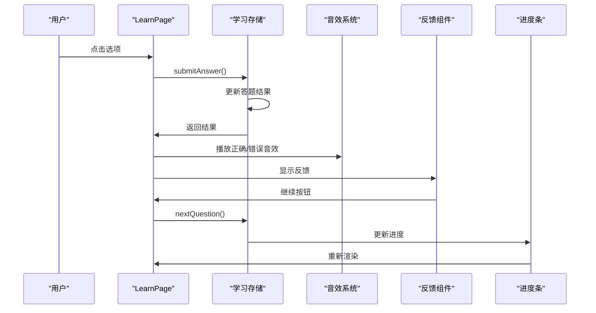

**图表来源**
- [src/pages/LearnPage.tsx:74-124](file://src/pages/LearnPage.tsx#L74-L124)
- [src/pages/LearnPage.tsx:126-159](file://src/pages/LearnPage.tsx#L126-L159)

#### 选项卡片组件 (OptionCard)

选项卡片负责处理用户的选择交互和视觉反馈：

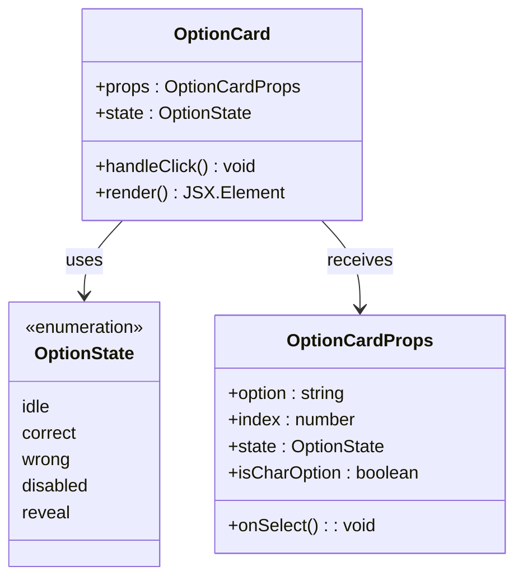

**图表来源**
- [src/pages/LearnPage.tsx:19](file://src/pages/LearnPage.tsx#L19)

**章节来源**
- [src/pages/LearnPage.tsx:1-288](file://src/pages/LearnPage.tsx#L1-L288)

### 错题复习系统

系统实现了基于间隔重复算法的智能复习机制：

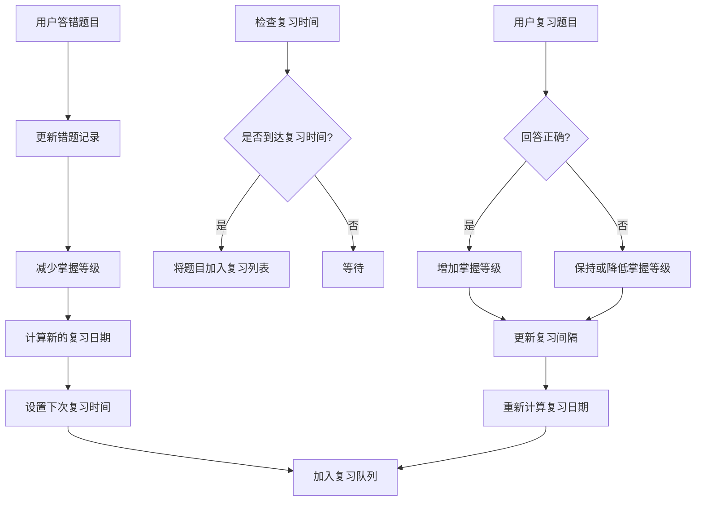

**图表来源**
- [src/store/useErrorBankStore.ts:32-76](file://src/store/useErrorBankStore.ts#L32-L76)
- [src/store/useErrorBankStore.ts:78-85](file://src/store/useErrorBankStore.ts#L78-L85)

**章节来源**
- [src/store/useErrorBankStore.ts:1-105](file://src/store/useErrorBankStore.ts#L1-L105)

### 宝石奖励系统

宝石系统作为激励机制，鼓励用户持续学习：

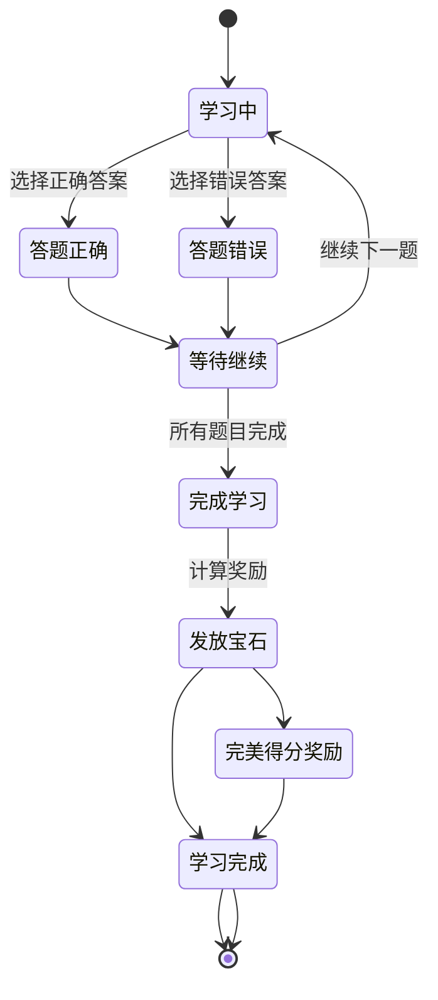

**图表来源**
- [src/pages/LearnPage.tsx:144-156](file://src/pages/LearnPage.tsx#L144-L156)
- [src/store/useGemStore.ts:23-35](file://src/store/useGemStore.ts#L23-L35)

**章节来源**
- [src/store/useGemStore.ts:1-50](file://src/store/useGemStore.ts#L1-L50)

### 用户界面组件

系统包含多个精心设计的 UI 组件：

#### 布局组件 (Layout)
- 提供统一的页面框架
- 包含头部导航和底部导航
- 支持响应式设计

#### 进度条组件 (ProgressBar)
- **更新** 显示当前学习进度的星标可视化指示器
- 支持动画效果，当前题目显示脉冲动画
- 响应式适配，使用星标符号表示进度状态

#### 反馈覆盖层 (FeedbackOverlay)
- **更新** 从底部抽屉布局重构为中心化模态界面
- 提供即时答题反馈，支持正确/错误状态
- 包含鼓励消息和模态对话框设计
- 正确时显示庆祝动画效果

#### 选项卡片组件 (OptionCard)
- **更新** 增强颜色编码方案和发光效果
- 每个选项使用不同的柔和底色（粉色、蓝色、绿色）
- 正确答案显示发光边框和装饰效果
- 支持多种状态动画和交互反馈

#### 日常完成组件 (DailyComplete)
- **更新** 扩展支持练习和常规模式
- 练习模式显示不同主题和消息
- 支持再来一次功能
- 区分正式学习和练习模式的不同界面

**章节来源**
- [src/components/Layout.tsx:1-26](file://src/components/Layout.tsx#L1-L26)
- [src/components/ProgressBar.tsx:1-36](file://src/components/ProgressBar.tsx#L1-L36)
- [src/components/FeedbackOverlay.tsx:1-122](file://src/components/FeedbackOverlay.tsx#L1-L122)
- [src/components/OptionCard.tsx:1-78](file://src/components/OptionCard.tsx#L1-L78)
- [src/components/DailyComplete.tsx:1-78](file://src/components/DailyComplete.tsx#L1-L78)

### 练习模式系统

系统新增了练习模式功能，允许用户在正式学习之外进行额外练习：

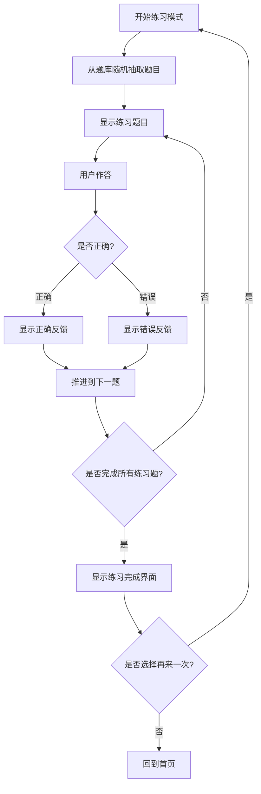

**图表来源**
- [src/pages/LearnPage.tsx:162-179](file://src/pages/LearnPage.tsx#L162-L179)
- [src/pages/LearnPage.tsx:182-192](file://src/pages/LearnPage.tsx#L182-L192)

**章节来源**
- [src/pages/LearnPage.tsx:162-192](file://src/pages/LearnPage.tsx#L162-L192)

## 数学学习系统

### 数学学习页面 (MathLearnPage)

数学学习页面是新增的核心交互组件，提供完整的数学学习体验：

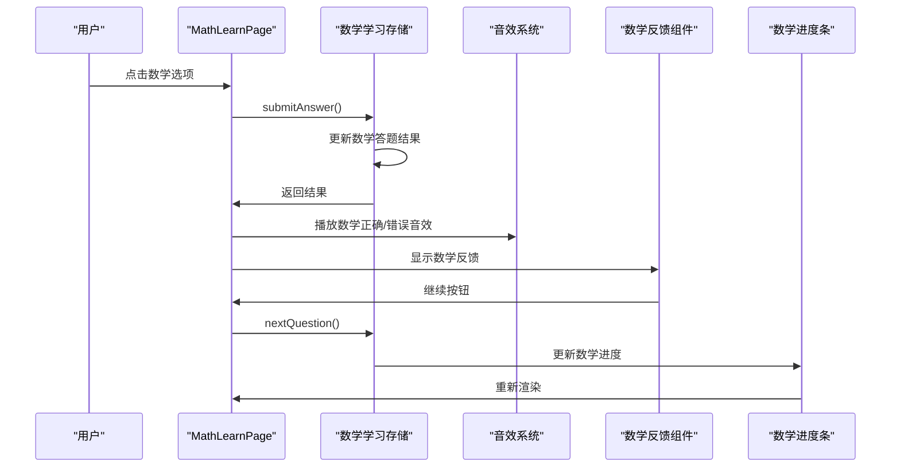

**图表来源**
- [src/pages/MathLearnPage.tsx:82-131](file://src/pages/MathLearnPage.tsx#L82-L131)
- [src/pages/MathLearnPage.tsx:133-163](file://src/pages/MathLearnPage.tsx#L133-L163)

#### 数学题型渲染器

系统支持四种数学题型，每种题型都有专门的渲染组件：

##### 找规律题型 (PatternRenderer)
- **新增** 支持数字、字母、表情符号等多种规律模式
- **新增** 动画展示规律序列，增强学习体验
- **新增** 三个选项的排列组合

##### 数一数题型 (CountingRenderer)
- **新增** 支持网格和散落两种布局模式
- **新增** 随机散落位置的动画效果
- **新增** 不同数量的计数练习

##### 比大小题型 (ComparisonRenderer)
- **新增** 左右对比的视觉设计
- **新增** VS 标志的动态效果
- **新增** 两个选项的二选一模式

##### 图形识别题型 (ShapeRenderer)
- **新增** 2x2 网格的图形排列
- **新增** 异类图形的识别挑战
- **新增** 四个选项的复杂度

#### 数学选项卡片组件 (MathOptionCard)

数学选项卡片是专门为数学学习设计的交互组件：

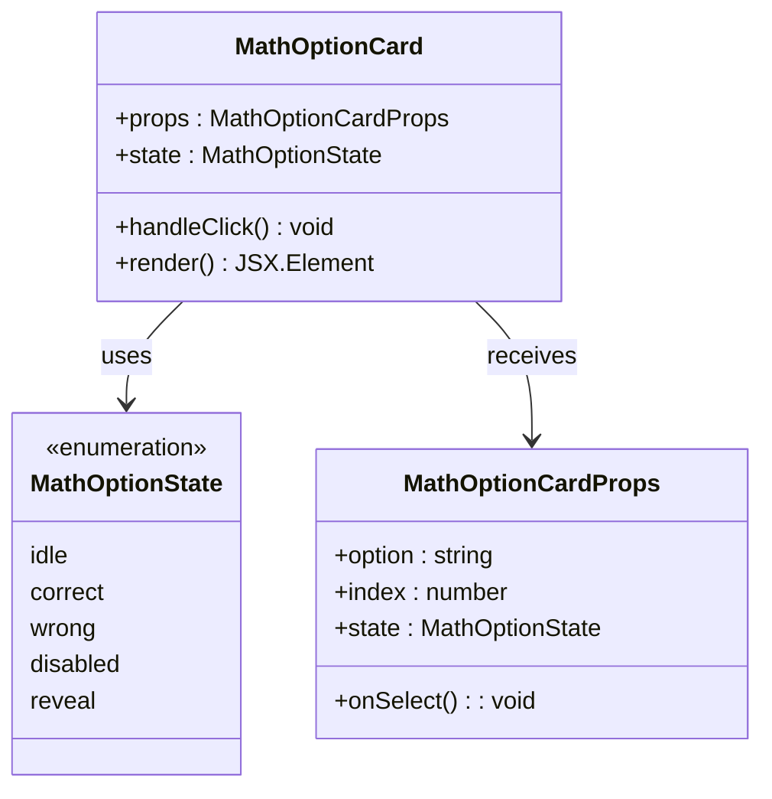

**图表来源**
- [src/components/math/MathOptionCard.tsx:17](file://src/components/math/MathOptionCard.tsx#L17)

**章节来源**
- [src/pages/MathLearnPage.tsx:1-353](file://src/pages/MathLearnPage.tsx#L1-L353)
- [src/components/math/MathOptionCard.tsx:1-69](file://src/components/math/MathOptionCard.tsx#L1-L69)

### 数学学习状态管理

数学学习状态管理是新增的核心功能，负责管理数学学习的所有状态：

#### 数学学习存储 (useMathLearningStore)
- **新增** 管理每日数学学习进度
- **新增** 支持四种数学题型的题目序列
- **新增** 数学学习专用的状态管理和统计
- **新增** 数学题目随机抽取和去重机制
- **新增** 数学学习会话的答案记录

#### 数学进度可视化
- **新增** 糖果主题的进度条设计
- **新增** 完成：🍬 糖果、当前：🍭 糖豆、待做：☆ 星星
- **新增** 动画效果和脉冲动画

#### 数学反馈系统
- **新增** 专属的数学鼓励语系统
- **新增** 正确时的糖果雨动画效果
- **新增** 数学学习的专属模态对话框设计

**章节来源**
- [src/store/useMathLearningStore.ts:1-164](file://src/store/useMathLearningStore.ts#L1-L164)
- [src/components/math/MathProgressBar.tsx:1-36](file://src/components/math/MathProgressBar.tsx#L1-L36)
- [src/components/math/MathFeedbackOverlay.tsx:1-106](file://src/components/math/MathFeedbackOverlay.tsx#L1-L106)
- [src/data/math-encouragements.ts:1-26](file://src/data/math-encouragements.ts#L1-L26)

### 数学题库系统

系统包含完整的数学题库，涵盖四种主要的数学概念：

#### 找规律题库 (Pattern Questions)
- **新增** 20道找规律题目
- **新增** 从简单到复杂的难度递进
- **新增** 多种规律模式：重复、交替、递增等

#### 数一数题库 (Counting Questions)
- **新增** 15道计数题目
- **新增** 从1-10的基础计数
- **新增** 网格和散落两种布局

#### 比大小题库 (Comparison Questions)
- **新增** 15道比较大小题目
- **新增** 从基础比较到相等判断
- **新增** 相同数量和不同数量的对比

#### 图形识别题库 (Shape Recognition Questions)
- **新增** 15道图形识别题目
- **新增** 从简单形状到复杂组合
- **新增** 异类图形的识别挑战

**章节来源**
- [src/data/math-questions.json:1-71](file://src/data/math-questions.json#L1-L71)

### 数学练习模式

数学练习模式允许用户独立练习数学题目：

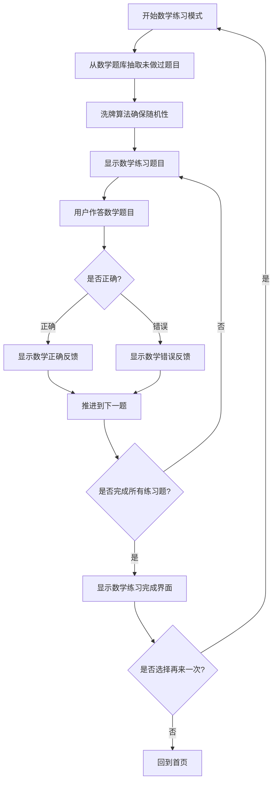

**图表来源**
- [src/pages/MathLearnPage.tsx:165-181](file://src/pages/MathLearnPage.tsx#L165-L181)

**章节来源**
- [src/pages/MathLearnPage.tsx:165-181](file://src/pages/MathLearnPage.tsx#L165-L181)

## 依赖关系分析

系统使用多种外部依赖来实现核心功能：

```mermaid
graph TB
subgraph "前端框架"
A[react@19.2.6]
B[react-dom@19.2.6]
C[react-router-dom@7.18.0]
end
subgraph "状态管理"
D[zustand@5.0.14]
end
subgraph "动画库"
E[framer-motion@12.40.0]
end
subgraph "样式系统"
F[tailwindcss@4.3.1]
G[@tailwindcss/vite@4.3.1]
end
subgraph "数据库服务"
H[@supabase/supabase-js@2.108.2]
end
subgraph "开发工具"
I[vite@8.0.12]
J[typescript@~6.0.2]
K[eslint@^10.3.0]
end
A --> D
A --> E
A --> F
A --> H
D --> H
H --> I
```

**图表来源**
- [package.json:12-35](file://package.json#L12-L35)

### 数据模型

系统定义了清晰的数据结构来表示各种实体：

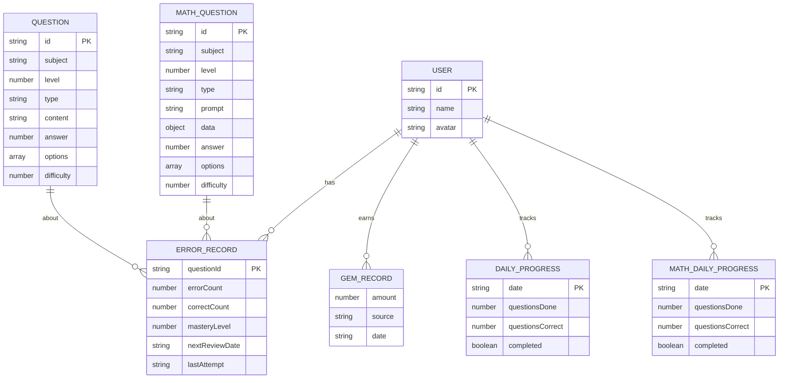

**图表来源**
- [src/types/index.ts:1-118](file://src/types/index.ts#L1-L118)

**章节来源**
- [src/types/index.ts:1-118](file://src/types/index.ts#L1-L118)

## 性能考虑

系统在设计时考虑了多个性能优化方面：

### 状态管理优化
- 使用 Zustand 替代 Redux，减少样板代码
- 实现局部状态更新，避免不必要的重渲染
- 使用持久化中间件，支持数据缓存

### 渲染性能
- 采用 React.memo 优化组件重渲染
- 使用 Framer Motion 的 GPU 加速动画
- 实现虚拟滚动处理大量数据

### 网络性能
- 实现增量同步，减少数据传输
- 使用缓存策略避免重复请求
- 支持离线模式，保证用户体验

### 动画性能优化
- **新增** 数学学习的专用动画优化
- **新增** 糖果主题动画的硬件加速
- **更新** 模态对话框使用 CSS backdrop-filter 减少重绘
- **优化** 组件动画使用 transform 属性而非改变布局属性

### 数学学习性能
- **新增** 数学题型渲染的优化策略
- **新增** 大量动画元素的性能监控
- **新增** 移动端动画性能的特别优化

## 故障排除指南

### 常见问题及解决方案

#### 应用无法启动
1. 检查 Node.js 版本是否满足要求
2. 确认所有依赖已正确安装
3. 验证环境变量配置

#### 数据同步失败
1. 检查 Supabase 连接配置
2. 验证网络连接状态
3. 查看浏览器控制台错误信息

#### 学习进度丢失
1. 检查 localStorage 权限
2. 验证浏览器隐私设置
3. 确认数据迁移是否成功

#### 练习模式异常
1. 检查题目数据完整性
2. 验证练习模式状态管理
3. 确认题目抽取逻辑正常

#### 数学学习问题
1. **新增** 检查数学题库数据格式
2. **新增** 验证数学学习状态管理
3. **新增** 确认数学题型渲染组件正常工作
4. **新增** 检查数学专属音效和动画

**章节来源**
- [src/hooks/useAppInit.ts:36-45](file://src/hooks/useAppInit.ts#L36-L45)

## 结论

这个学习系统展现了现代前端开发的最佳实践，通过合理的架构设计和丰富的功能特性，为儿童提供了寓教于乐的学习体验。系统现已扩展为双学科学习平台，主要优势包括：

1. **模块化设计** - 清晰的组件分离和职责划分
2. **状态管理** - 基于 Zustand 的轻量级状态管理
3. **用户体验** - 流畅的动画效果和直观的交互设计
4. **数据持久化** - 支持本地存储和云端同步
5. **扩展性** - 易于添加新功能和学科

**更新亮点**
- **双学科支持** - 同时支持中文学习和数学学习
- **数学题库系统** - 完整的数学题目集合
- **数学专属界面** - 独立的数学学习页面设计
- **多题型支持** - 四种数学题型的完整覆盖
- **数学奖励机制** - 专门的数学学习激励系统
- **练习模式扩展** - 支持数学题目的独立练习
- **反馈系统升级** - 数学学习的专属鼓励语和动画
- **视觉设计增强** - 糖果主题的数学学习界面

未来可以考虑的功能增强包括：
- 添加更多数学概念和题型
- 实现数学学习的个性化路径
- 增强数学学习的数据分析
- 支持数学学习的成就系统
- 扩展数学练习模式的难度分级
- 添加数学学习的家长监控功能