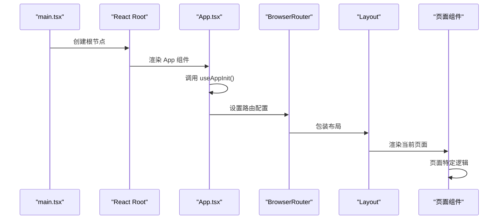
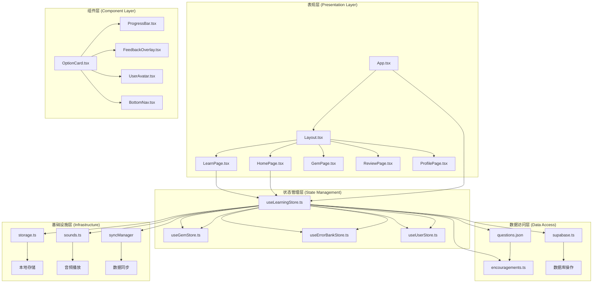
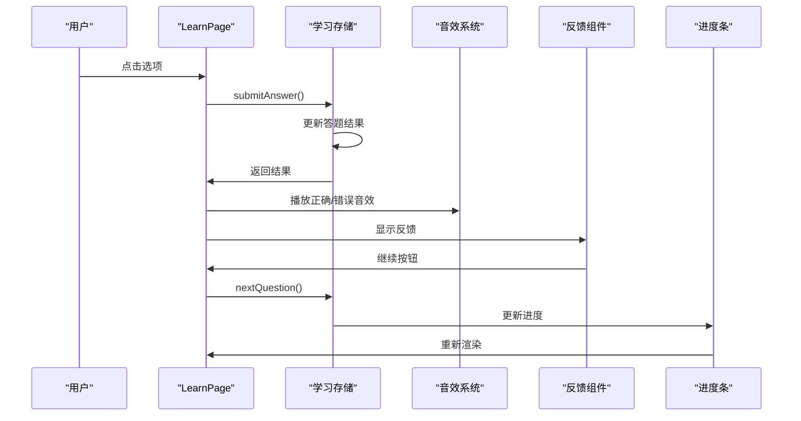
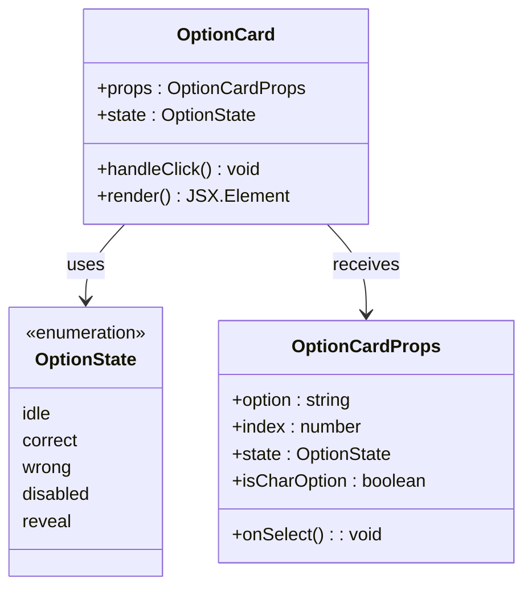
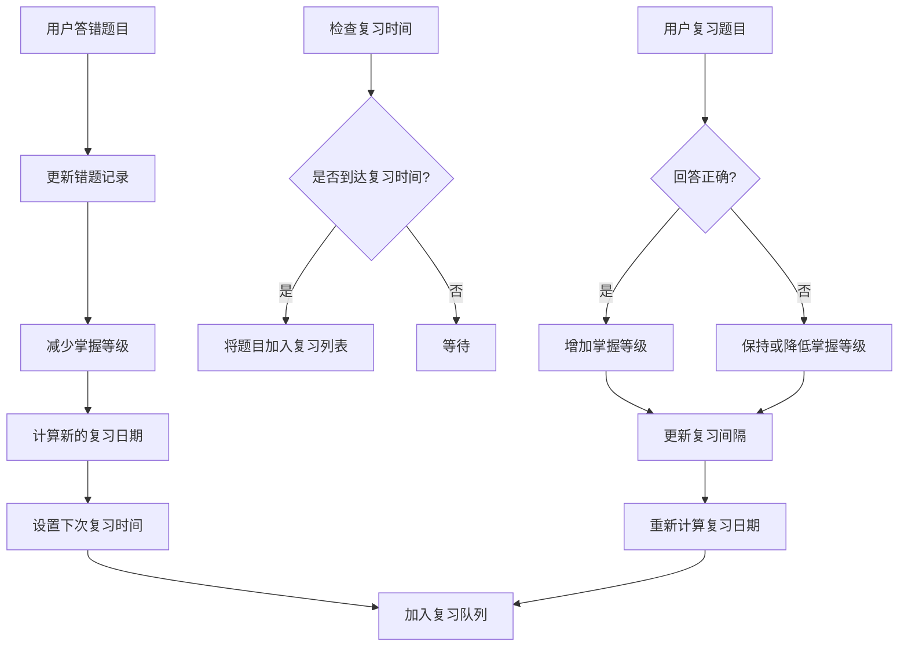
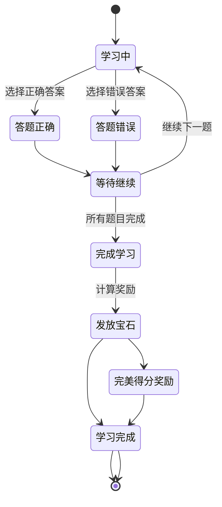
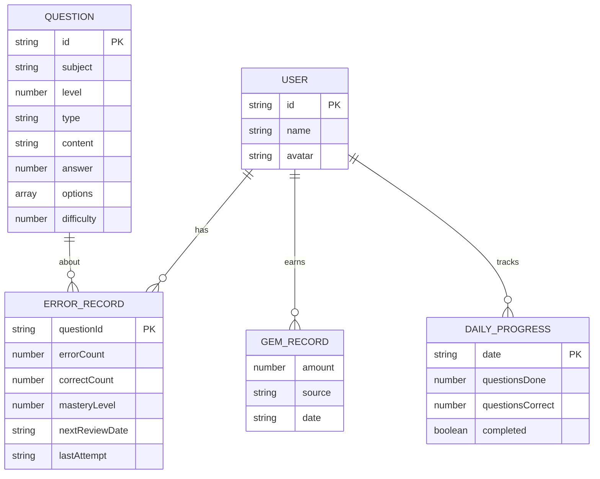

# 学习系统

<cite>
**本文档引用的文件**
- [README.md](file://README.md)
- [package.json](file://package.json)
- [src/App.tsx](file://src/App.tsx)
- [src/main.tsx](file://src/main.tsx)
- [src/components/Layout.tsx](file://src/components/Layout.tsx)
- [src/pages/HomePage.tsx](file://src/pages/HomePage.tsx)
- [src/pages/LearnPage.tsx](file://src/pages/LearnPage.tsx)
- [src/data/questions.json](file://src/data/questions.json)
- [src/store/useLearningStore.ts](file://src/store/useLearningStore.ts)
- [src/store/useGemStore.ts](file://src/store/useGemStore.ts)
- [src/store/useErrorBankStore.ts](file://src/store/useErrorBankStore.ts)
- [src/store/useUserStore.ts](file://src/store/useUserStore.ts)
- [src/hooks/useAppInit.ts](file://src/hooks/useAppInit.ts)
- [src/lib/supabase.ts](file://src/lib/supabase.ts)
- [src/types/index.ts](file://src/types/index.ts)
</cite>

## 目录
1. [简介](#简介)
2. [项目结构](#项目结构)
3. [核心组件](#核心组件)
4. [架构概览](#架构概览)
5. [详细组件分析](#详细组件分析)
6. [依赖关系分析](#依赖关系分析)
7. [性能考虑](#性能考虑)
8. [故障排除指南](#故障排除指南)
9. [结论](#结论)

## 简介

这是一个基于 React + TypeScript + Vite 构建的儿童学习系统，名为"快乐学堂"。该系统专注于汉字学习，提供互动式的学习体验，包含每日学习计划、错题复习、宝石奖励机制等功能。

系统采用现代化的技术栈，包括：
- React 19.2.6 用于构建用户界面
- TypeScript 提供类型安全
- Vite 8.0.12 作为构建工具
- Zustand 5.0.14 作为状态管理库
- Supabase 2.108.2 作为后端服务
- Framer Motion 12.40.0 用于动画效果
- TailwindCSS 4.3.1 用于样式设计

## 项目结构

该项目采用模块化组织方式，主要目录结构如下：

```mermaid
graph TB
subgraph "根目录"
A[public/] --> A1[audio/]
B[src/] --> B1[assets/]
B --> B2[components/]
B --> B3[data/]
B --> B4[hooks/]
B --> B5[lib/]
B --> B6[pages/]
B --> B7[store/]
B --> B8[types/]
B --> B9[App.tsx]
B --> B10[main.tsx]
end
subgraph "前端资源"
A1 --> A11[correct/]
A1 --> A12[wrong/]
end
subgraph "组件层"
B2 --> B21[BottomNav.tsx]
B2 --> B22[DailyComplete.tsx]
B2 --> B23[FeedbackOverlay.tsx]
B2 --> B24[GemCounter.tsx]
B2 --> B25[Layout.tsx]
B2 --> B26[OptionCard.tsx]
B2 --> B27[ProgressBar.tsx]
B2 --> B28[StarAnimation.tsx]
B2 --> B29[UserAvatar.tsx]
end
subgraph "页面层"
B6 --> B61[HomePage.tsx]
B6 --> B62[LearnPage.tsx]
B6 --> B63[GemPage.tsx]
B6 --> B64[ReviewPage.tsx]
B6 --> B65[ProfilePage.tsx]
end
subgraph "状态管理"
B7 --> B71[useLearningStore.ts]
B7 --> B72[useGemStore.ts]
B7 --> B73[useErrorBankStore.ts]
B7 --> B74[useUserStore.ts]
end
subgraph "数据层"
B3 --> B31[encouragements.ts]
B3 --> B32[questions.json]
end
subgraph "库函数"
B5 --> B51[sounds.ts]
B5 --> B52[storage.ts]
B5 --> B53[supabase.ts]
B5 --> B54[db/]
end
```



**图表来源**
- [src/App.tsx:1-40](file://src/App.tsx#L1-L40)
- [src/main.tsx:1-11](file://src/main.tsx#L1-L11)

**章节来源**
- [package.json:1-37](file://package.json#L1-L37)
- [README.md:1-74](file://README.md#L1-L74)

## 核心组件

### 应用入口点

应用的启动流程从 main.tsx 开始，创建 React 根节点并渲染 App 组件。



**图表来源**
- [src/main.tsx:1-11](file://src/main.tsx#L1-L11)
- [src/App.tsx:1-40](file://src/App.tsx#L1-L40)
- [src/components/Layout.tsx:1-26](file://src/components/Layout.tsx#L1-L26)

### 学习管理系统

系统的核心是学习管理系统，通过 Zustand 状态管理实现。主要包含以下状态存储：

#### 学习进度存储 (useLearningStore)
- 管理每日学习进度
- 控制题目序列和当前索引
- 处理答题结果和统计
- 实现题目随机抽取和去重

#### 宝石存储 (useGemStore)
- 管理用户获得的宝石数量
- 记录宝石获取历史
- 支持宝石消费和统计

#### 错题本存储 (useErrorBankStore)
- 跟踪用户的错误题目
- 实现间隔重复算法
- 管理复习计划和进度

#### 用户存储 (useUserStore)
- 管理用户基本信息
- 支持头像和名称更新
- 同步用户设置到云端

**章节来源**
- [src/store/useLearningStore.ts:1-185](file://src/store/useLearningStore.ts#L1-L185)
- [src/store/useGemStore.ts:1-50](file://src/store/useGemStore.ts#L1-L50)
- [src/store/useErrorBankStore.ts:1-105](file://src/store/useErrorBankStore.ts#L1-L105)
- [src/store/useUserStore.ts:1-51](file://src/store/useUserStore.ts#L1-L51)

## 架构概览

系统采用分层架构设计，清晰分离关注点：



**图表来源**
- [src/App.tsx:1-40](file://src/App.tsx#L1-L40)
- [src/components/Layout.tsx:1-26](file://src/components/Layout.tsx#L1-L26)
- [src/store/useLearningStore.ts:1-185](file://src/store/useLearningStore.ts#L1-L185)

### 数据流架构

系统采用单向数据流模式，确保状态变更的可预测性：

```mermaid
flowchart TD
A[用户交互] --> B[组件事件处理器]
B --> C[Zustand 状态存储]
C --> D[本地持久化 (localStorage)]
C --> E[Supabase 同步]
D --> F[应用状态更新]
E --> F
F --> G[UI 重新渲染]
G --> A
H[初始化流程] --> I[迁移本地数据]
I --> J[从云端拉取数据]
J --> K[Hydrate 状态]
K --> L[应用就绪]
```

**图表来源**
- [src/hooks/useAppInit.ts:1-189](file://src/hooks/useAppInit.ts#L1-L189)
- [src/store/useLearningStore.ts:173-183](file://src/store/useLearningStore.ts#L173-L183)

**章节来源**
- [src/hooks/useAppInit.ts:1-189](file://src/hooks/useAppInit.ts#L1-L189)

## 详细组件分析

### 学习页面 (LearnPage)

学习页面是系统的核心交互组件，提供完整的答题体验：



**图表来源**
- [src/pages/LearnPage.tsx:74-124](file://src/pages/LearnPage.tsx#L74-L124)
- [src/pages/LearnPage.tsx:126-159](file://src/pages/LearnPage.tsx#L126-L159)

#### 选项卡片组件 (OptionCard)

选项卡片负责处理用户的选择交互和视觉反馈：



**图表来源**
- [src/pages/LearnPage.tsx:19](file://src/pages/LearnPage.tsx#L19)

**章节来源**
- [src/pages/LearnPage.tsx:1-288](file://src/pages/LearnPage.tsx#L1-L288)

### 错题复习系统

系统实现了基于间隔重复算法的智能复习机制：



**图表来源**
- [src/store/useErrorBankStore.ts:32-76](file://src/store/useErrorBankStore.ts#L32-L76)
- [src/store/useErrorBankStore.ts:78-85](file://src/store/useErrorBankStore.ts#L78-L85)

**章节来源**
- [src/store/useErrorBankStore.ts:1-105](file://src/store/useErrorBankStore.ts#L1-L105)

### 宝石奖励系统

宝石系统作为激励机制，鼓励用户持续学习：



**图表来源**
- [src/pages/LearnPage.tsx:144-156](file://src/pages/LearnPage.tsx#L144-L156)
- [src/store/useGemStore.ts:23-35](file://src/store/useGemStore.ts#L23-L35)

**章节来源**
- [src/store/useGemStore.ts:1-50](file://src/store/useGemStore.ts#L1-L50)

### 用户界面组件

系统包含多个精心设计的 UI 组件：

#### 布局组件 (Layout)
- 提供统一的页面框架
- 包含头部导航和底部导航
- 支持响应式设计

#### 进度条组件 (ProgressBar)
- 显示当前学习进度
- 支持动画效果
- 响应式适配

#### 反馈覆盖层 (FeedbackOverlay)
- 提供即时答题反馈
- 支持正确/错误状态
- 包含鼓励消息

**章节来源**
- [src/components/Layout.tsx:1-26](file://src/components/Layout.tsx#L1-L26)

## 依赖关系分析

系统使用多种外部依赖来实现核心功能：

```mermaid
graph TB
subgraph "前端框架"
A[react@19.2.6]
B[react-dom@19.2.6]
C[react-router-dom@7.18.0]
end
subgraph "状态管理"
D[zustand@5.0.14]
end
subgraph "动画库"
E[framer-motion@12.40.0]
end
subgraph "样式系统"
F[tailwindcss@4.3.1]
G[@tailwindcss/vite@4.3.1]
end
subgraph "数据库服务"
H[@supabase/supabase-js@2.108.2]
end
subgraph "开发工具"
I[vite@8.0.12]
J[typescript@~6.0.2]
K[eslint@^10.3.0]
end
A --> D
A --> E
A --> F
A --> H
D --> H
H --> I
```

**图表来源**
- [package.json:12-35](file://package.json#L12-L35)

### 数据模型

系统定义了清晰的数据结构来表示各种实体：



**图表来源**
- [src/types/index.ts:1-66](file://src/types/index.ts#L1-L66)

**章节来源**
- [src/types/index.ts:1-66](file://src/types/index.ts#L1-L66)

## 性能考虑

系统在设计时考虑了多个性能优化方面：

### 状态管理优化
- 使用 Zustand 替代 Redux，减少样板代码
- 实现局部状态更新，避免不必要的重渲染
- 使用持久化中间件，支持数据缓存

### 渲染性能
- 采用 React.memo 优化组件重渲染
- 使用 Framer Motion 的 GPU 加速动画
- 实现虚拟滚动处理大量数据

### 网络性能
- 实现增量同步，减少数据传输
- 使用缓存策略避免重复请求
- 支持离线模式，保证用户体验

## 故障排除指南

### 常见问题及解决方案

#### 应用无法启动
1. 检查 Node.js 版本是否满足要求
2. 确认所有依赖已正确安装
3. 验证环境变量配置

#### 数据同步失败
1. 检查 Supabase 连接配置
2. 验证网络连接状态
3. 查看浏览器控制台错误信息

#### 学习进度丢失
1. 检查 localStorage 权限
2. 验证浏览器隐私设置
3. 确认数据迁移是否成功

**章节来源**
- [src/hooks/useAppInit.ts:36-45](file://src/hooks/useAppInit.ts#L36-L45)

## 结论

这个学习系统展现了现代前端开发的最佳实践，通过合理的架构设计和丰富的功能特性，为儿童提供了寓教于乐的学习体验。系统的主要优势包括：

1. **模块化设计** - 清晰的组件分离和职责划分
2. **状态管理** - 基于 Zustand 的轻量级状态管理
3. **用户体验** - 流畅的动画效果和直观的交互设计
4. **数据持久化** - 支持本地存储和云端同步
5. **扩展性** - 易于添加新功能和学科

未来可以考虑的功能增强包括：
- 添加更多学科支持
- 实现更复杂的个性化学习路径
- 增强数据分析和报告功能
- 支持多设备同步