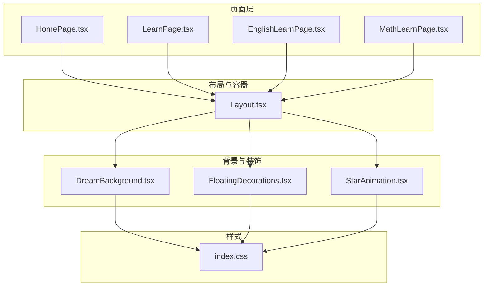
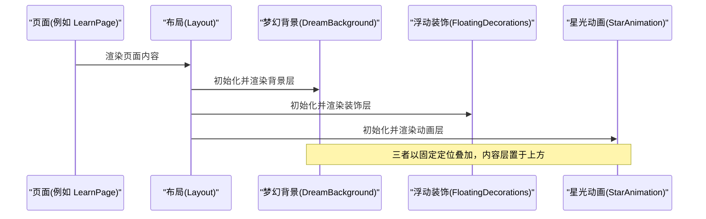
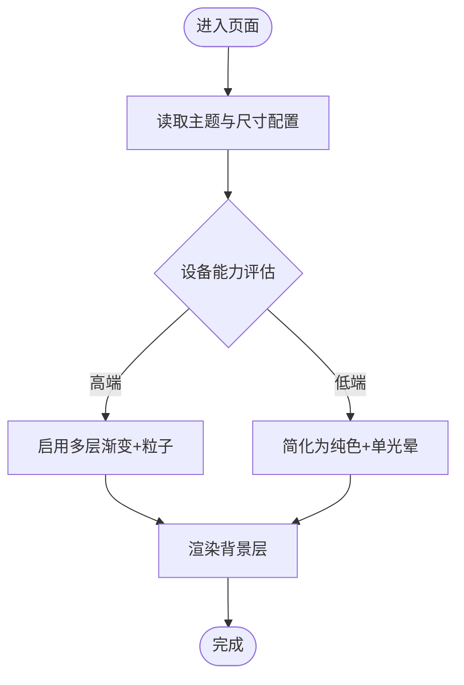
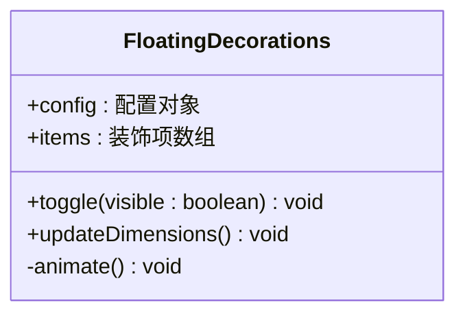
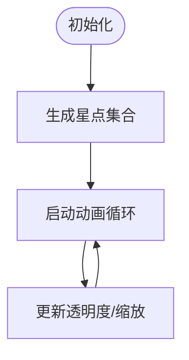
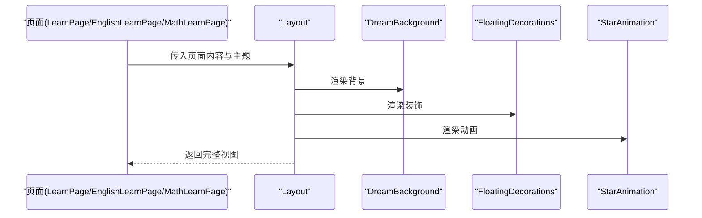
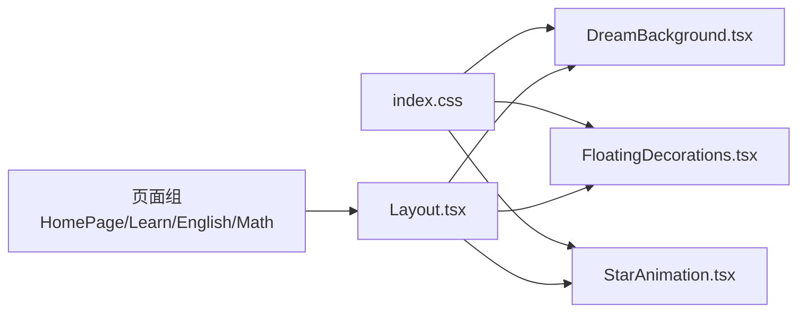

# 梦幻背景组件

<cite>
**本文引用的文件**   
- [DreamBackground.tsx](file://src/components/DreamBackground.tsx)
- [FloatingDecorations.tsx](file://src/components/FloatingDecorations.tsx)
- [StarAnimation.tsx](file://src/components/StarAnimation.tsx)
- [Layout.tsx](file://src/components/Layout.tsx)
- [HomePage.tsx](file://src/pages/HomePage.tsx)
- [LearnPage.tsx](file://src/pages/LearnPage.tsx)
- [EnglishLearnPage.tsx](file://src/pages/EnglishLearnPage.tsx)
- [MathLearnPage.tsx](file://src/pages/MathLearnPage.tsx)
- [index.css](file://src/index.css)
</cite>

## 目录
1. [简介](#简介)
2. [项目结构](#项目结构)
3. [核心组件](#核心组件)
4. [架构总览](#架构总览)
5. [详细组件分析](#详细组件分析)
6. [依赖关系分析](#依赖关系分析)
7. [性能考量](#性能考量)
8. [故障排查指南](#故障排查指南)
9. [结论](#结论)
10. [附录](#附录)

## 简介
本文件围绕“梦幻背景组件”进行系统化文档化，聚焦于页面级沉浸式视觉体验的构建与复用。该能力由三层协作实现：
- 背景层：提供全屏、可复用的梦幻背景渲染（含渐变、粒子、光晕等）。
- 装饰层：在背景之上叠加浮动装饰元素，增强空间感与动态氛围。
- 动画层：以轻量动画（如星光闪烁）提升细节表现力。

这些组件通过布局容器注入到各学习页面中，形成统一的视觉基调，同时保持业务逻辑与视觉呈现解耦。

## 项目结构
从组件组织看，本项目采用按功能域划分的目录结构，背景相关能力集中在 components 目录下，并通过 pages 中的具体页面组合使用。

图表来源
- [Layout.tsx](file://src/components/Layout.tsx)
- [DreamBackground.tsx](file://src/components/DreamBackground.tsx)
- [FloatingDecorations.tsx](file://src/components/FloatingDecorations.tsx)
- [StarAnimation.tsx](file://src/components/StarAnimation.tsx)
- [HomePage.tsx](file://src/pages/HomePage.tsx)
- [LearnPage.tsx](file://src/pages/LearnPage.tsx)
- [EnglishLearnPage.tsx](file://src/pages/EnglishLearnPage.tsx)
- [MathLearnPage.tsx](file://src/pages/MathLearnPage.tsx)
- [index.css](file://src/index.css)

章节来源
- [DreamBackground.tsx](file://src/components/DreamBackground.tsx)
- [FloatingDecorations.tsx](file://src/components/FloatingDecorations.tsx)
- [StarAnimation.tsx](file://src/components/StarAnimation.tsx)
- [Layout.tsx](file://src/components/Layout.tsx)
- [HomePage.tsx](file://src/pages/HomePage.tsx)
- [LearnPage.tsx](file://src/pages/LearnPage.tsx)
- [EnglishLearnPage.tsx](file://src/pages/EnglishLearnPage.tsx)
- [MathLearnPage.tsx](file://src/pages/MathLearnPage.tsx)
- [index.css](file://src/index.css)

## 核心组件
- 梦幻背景 DreamBackground
  - 职责：提供全屏背景渲染，包含渐变底色、柔和光晕、微粒子等基础视觉元素。
  - 特性：固定定位覆盖视口；支持主题色或预设配色方案；具备响应式适配。
  - 交互：通常不直接处理用户交互，作为纯展示层。
- 浮动装饰 FloatingDecorations
  - 职责：在背景上叠加若干半透明几何图形或图标，营造漂浮感。
  - 特性：随机分布、缓慢位移、透明度变化；可选开启/关闭以提升低端设备性能。
- 星光动画 StarAnimation
  - 职责：在背景中生成少量闪烁星点，增加层次感。
  - 特性：基于 CSS 动画或轻量 JS 驱动；可配置密度与大小范围。

章节来源
- [DreamBackground.tsx](file://src/components/DreamBackground.tsx)
- [FloatingDecorations.tsx](file://src/components/FloatingDecorations.tsx)
- [StarAnimation.tsx](file://src/components/StarAnimation.tsx)

## 架构总览
整体采用“容器注入 + 分层渲染”的模式：Layout 负责将背景、装饰与动画挂载到页面层级之下，确保内容区域不受影响且可滚动。

图表来源
- [Layout.tsx](file://src/components/Layout.tsx)
- [DreamBackground.tsx](file://src/components/DreamBackground.tsx)
- [FloatingDecorations.tsx](file://src/components/FloatingDecorations.tsx)
- [StarAnimation.tsx](file://src/components/StarAnimation.tsx)

## 详细组件分析

### 梦幻背景 DreamBackground
- 设计要点
  - 全屏覆盖：通过固定定位与 z-index 控制，确保始终位于内容下方。
  - 视觉层次：多层渐变叠加、径向光晕、噪点纹理等组合，避免单调。
  - 主题适配：根据页面类型或全局主题切换主色调。
- 数据流
  - 输入：主题配置、尺寸信息（来自父容器或窗口尺寸）。
  - 输出：无副作用，仅渲染静态/缓动背景。
- 错误处理
  - 对异常尺寸做降级处理（限制最大粒子数、禁用复杂滤镜）。
- 性能优化
  - 使用 will-change 与 transform 提升合成效率。
  - 大屏幕上减少粒子数量或改用更简单的背景图。

图表来源
- [DreamBackground.tsx](file://src/components/DreamBackground.tsx)
- [index.css](file://src/index.css)

章节来源
- [DreamBackground.tsx](file://src/components/DreamBackground.tsx)
- [index.css](file://src/index.css)

### 浮动装饰 FloatingDecorations
- 设计要点
  - 随机性与多样性：形状、大小、位置、速度均有一定随机性，避免重复感。
  - 可控开关：提供显隐开关，便于在不同场景下按需启用。
- 数据流
  - 输入：装饰项集合（可由配置或随机生成）、运动参数。
  - 输出：DOM 节点列表，随时间更新 transform 与 opacity。
- 错误处理
  - 当容器尺寸异常时，重新计算边界，防止溢出。
- 性能优化
  - 使用 requestAnimationFrame 统一调度，避免频繁重排。
  - 对不可见区域的装饰进行节流或隐藏。

图表来源
- [FloatingDecorations.tsx](file://src/components/FloatingDecorations.tsx)

章节来源
- [FloatingDecorations.tsx](file://src/components/FloatingDecorations.tsx)

### 星光动画 StarAnimation
- 设计要点
  - 低开销闪烁：通过 CSS 关键帧或最小化 JS 循环实现。
  - 可配置密度：根据屏幕宽度调整星点数量。
- 数据流
  - 输入：密度、大小范围、闪烁频率。
  - 输出：星点 DOM 节点，周期性变换透明度或缩放。
- 错误处理
  - 若动画被系统暂停（如后台标签页），自动降低刷新率。
- 性能优化
  - 合并动画批次，减少布局抖动。
  - 在小屏设备上减少星点数量。

图表来源
- [StarAnimation.tsx](file://src/components/StarAnimation.tsx)

章节来源
- [StarAnimation.tsx](file://src/components/StarAnimation.tsx)

### 布局容器 Layout
- 职责
  - 将背景、装饰、动画与页面内容组合，保证正确的层叠顺序与滚动行为。
  - 提供统一的边距、安全区适配与主题注入。
- 与页面的集成
  - 各学习页面（首页、英语、数学等）通过 Layout 包裹，获得一致的梦幻背景体验。

图表来源
- [Layout.tsx](file://src/components/Layout.tsx)
- [DreamBackground.tsx](file://src/components/DreamBackground.tsx)
- [FloatingDecorations.tsx](file://src/components/FloatingDecorations.tsx)
- [StarAnimation.tsx](file://src/components/StarAnimation.tsx)
- [LearnPage.tsx](file://src/pages/LearnPage.tsx)
- [EnglishLearnPage.tsx](file://src/pages/EnglishLearnPage.tsx)
- [MathLearnPage.tsx](file://src/pages/MathLearnPage.tsx)

章节来源
- [Layout.tsx](file://src/components/Layout.tsx)
- [HomePage.tsx](file://src/pages/HomePage.tsx)
- [LearnPage.tsx](file://src/pages/LearnPage.tsx)
- [EnglishLearnPage.tsx](file://src/pages/EnglishLearnPage.tsx)
- [MathLearnPage.tsx](file://src/pages/MathLearnPage.tsx)

## 依赖关系分析
- 组件内聚与耦合
  - DreamBackground、FloatingDecorations、StarAnimation 彼此独立，仅通过 Layout 组合，耦合度低。
  - 页面层仅依赖 Layout，间接获得背景能力，符合单一职责原则。
- 外部依赖
  - 样式依赖 index.css 中的通用类名与动画关键帧。
  - 运行时依赖浏览器动画 API（requestAnimationFrame/CSS Animation）。

图表来源
- [index.css](file://src/index.css)
- [DreamBackground.tsx](file://src/components/DreamBackground.tsx)
- [FloatingDecorations.tsx](file://src/components/FloatingDecorations.tsx)
- [StarAnimation.tsx](file://src/components/StarAnimation.tsx)
- [Layout.tsx](file://src/components/Layout.tsx)
- [HomePage.tsx](file://src/pages/HomePage.tsx)
- [LearnPage.tsx](file://src/pages/LearnPage.tsx)
- [EnglishLearnPage.tsx](file://src/pages/EnglishLearnPage.tsx)
- [MathLearnPage.tsx](file://src/pages/MathLearnPage.tsx)

章节来源
- [index.css](file://src/index.css)
- [DreamBackground.tsx](file://src/components/DreamBackground.tsx)
- [FloatingDecorations.tsx](file://src/components/FloatingDecorations.tsx)
- [StarAnimation.tsx](file://src/components/StarAnimation.tsx)
- [Layout.tsx](file://src/components/Layout.tsx)
- [HomePage.tsx](file://src/pages/HomePage.tsx)
- [LearnPage.tsx](file://src/pages/LearnPage.tsx)
- [EnglishLearnPage.tsx](file://src/pages/EnglishLearnPage.tsx)
- [MathLearnPage.tsx](file://src/pages/MathLearnPage.tsx)

## 性能考量
- 渲染路径
  - 背景层尽量使用 GPU 加速属性（transform、opacity），避免触发布局重排。
- 资源规模
  - 在大屏设备上降低粒子与星点数量，或在低端设备上切换到“精简模式”。
- 动画调度
  - 使用 requestAnimationFrame 合并更新，避免与滚动事件竞争。
- 内存占用
  - 及时清理不可见节点的动画监听器与定时器，防止泄漏。
- 可访问性
  - 尊重系统“减少动态效果”偏好，自动降级为静态背景。

[本节为通用指导，无需列出具体文件来源]

## 故障排查指南
- 背景未显示或被遮挡
  - 检查层叠顺序（z-index）与定位方式（fixed/absolute），确认内容层未被覆盖。
  - 验证容器高度是否撑满视口，必要时设置 min-height。
- 动画卡顿或掉帧
  - 降低装饰与星点数量，关闭不必要的滤镜。
  - 检查是否存在频繁的布局读写操作，改为批量更新。
- 移动端适配问题
  - 确认安全区与横竖屏切换时的尺寸重算逻辑。
  - 在 iOS Safari 上注意 transform 与 overflow 的组合行为。
- 主题切换异常
  - 检查主题变量是否正确注入到根节点，CSS 类名是否一致。

章节来源
- [DreamBackground.tsx](file://src/components/DreamBackground.tsx)
- [FloatingDecorations.tsx](file://src/components/FloatingDecorations.tsx)
- [StarAnimation.tsx](file://src/components/StarAnimation.tsx)
- [Layout.tsx](file://src/components/Layout.tsx)
- [index.css](file://src/index.css)

## 结论
梦幻背景组件通过“背景层 + 装饰层 + 动画层”的分层设计，实现了高内聚、低耦合的视觉基础设施。借助 Layout 的统一编排，各学习页面可快速获得一致的沉浸体验。在性能与可访问性方面，提供了明确的优化方向与降级策略，有助于在多样化设备上保持稳定表现。

[本节为总结性内容，无需列出具体文件来源]

## 附录
- 扩展建议
  - 引入主题系统：将颜色、密度、速度等参数抽象为配置对象，支持运行时切换。
  - 增加可观测性：埋点统计背景渲染耗时与掉帧情况，辅助持续优化。
  - 多端适配：针对平板与桌面端提供更丰富的视差与景深效果。

[本节为概念性内容，无需列出具体文件来源]