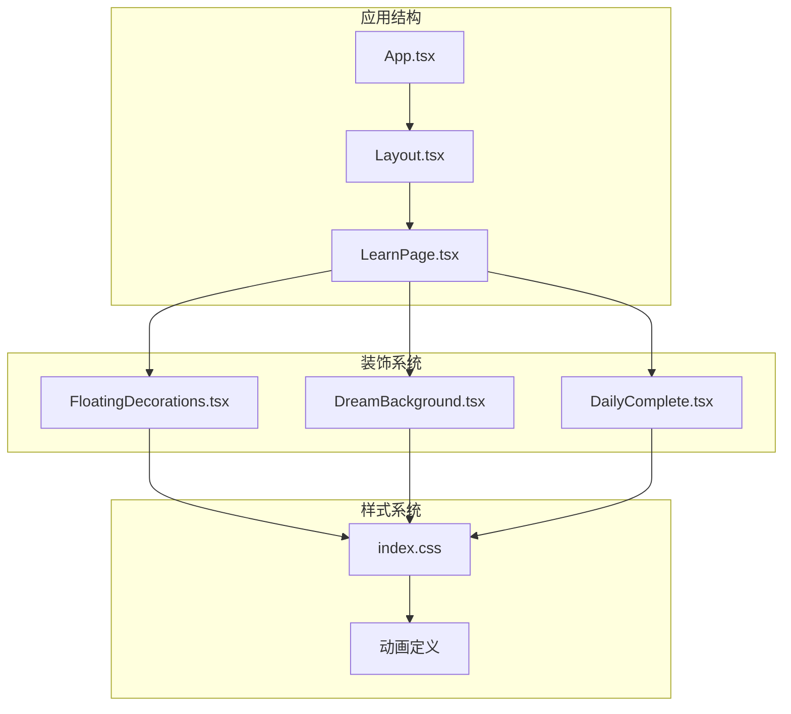
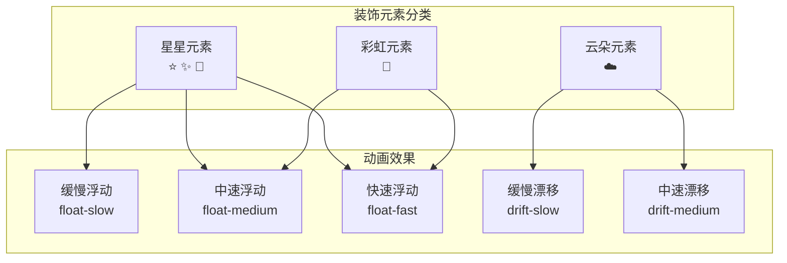
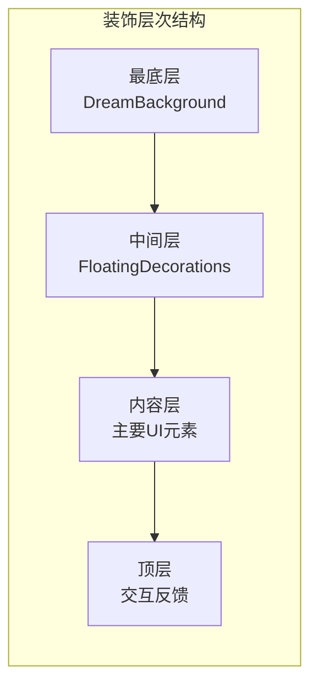
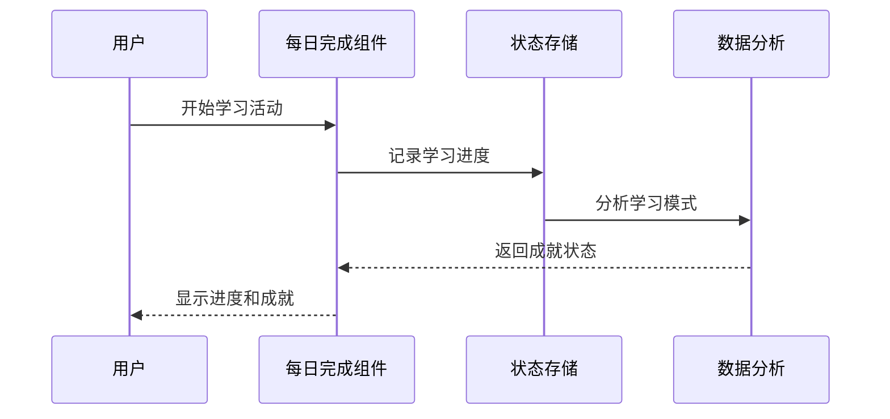
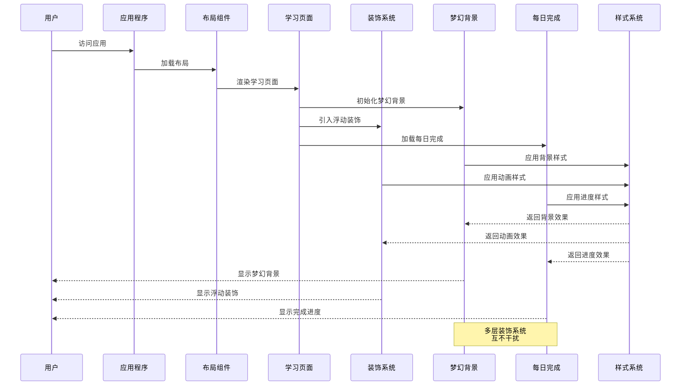
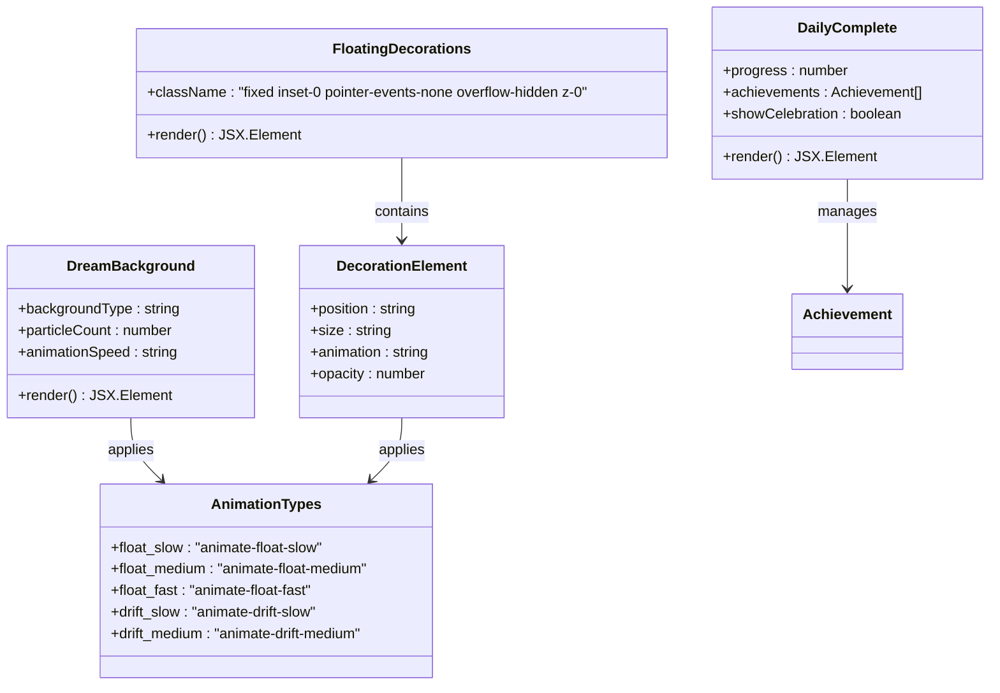
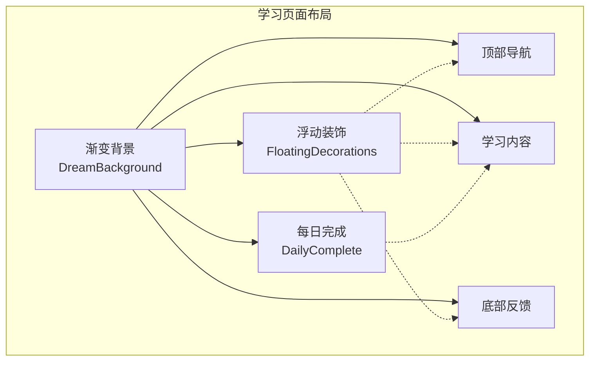
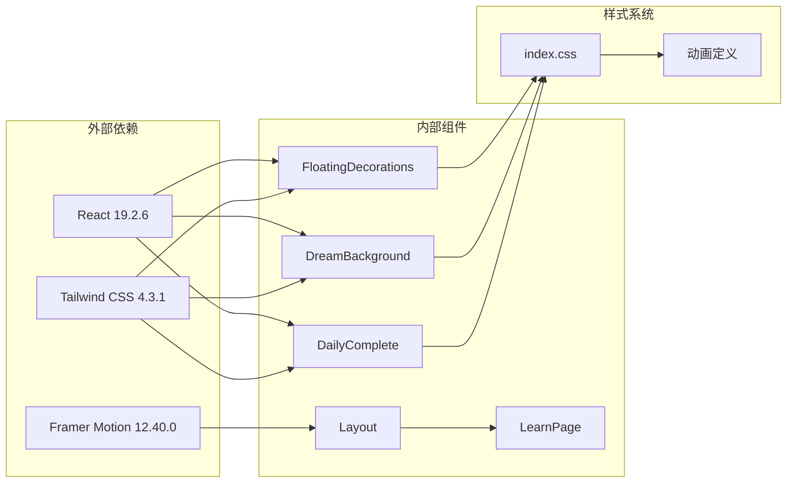
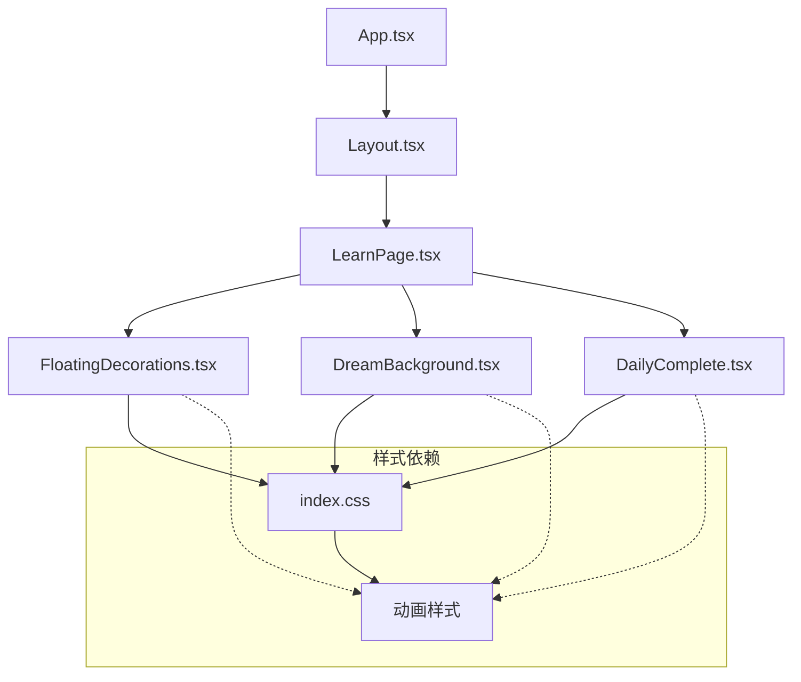

# 浮动装饰组件

<cite>
**本文档引用的文件**
- [FloatingDecorations.tsx](file://src/components/FloatingDecorations.tsx)
- [DreamBackground.tsx](file://src/components/DreamBackground.tsx)
- [DailyComplete.tsx](file://src/components/DailyComplete.tsx)
- [index.css](file://src/index.css)
- [LearnPage.tsx](file://src/pages/LearnPage.tsx)
- [Layout.tsx](file://src/components/Layout.tsx)
- [App.tsx](file://src/App.tsx)
- [ProgressBar.tsx](file://src/components/ProgressBar.tsx)
- [StarAnimation.tsx](file://src/components/StarAnimation.tsx)
</cite>

## 更新摘要
**变更内容**
- 新增梦幻背景组件 DreamBackground，提供更丰富的视觉装饰效果
- DailyComplete 组件大幅增强，改进了每日完成追踪和显示功能
- 更新了浮动装饰系统的架构，支持多层装饰元素叠加
- 增强了动画效果和响应式适配能力
- 引入新的玩具风格设计语言，包括梦幻背景组件的视觉升级和更多动画效果

## 目录
1. [简介](#简介)
2. [项目结构](#项目结构)
3. [核心组件](#核心组件)
4. [架构概览](#架构概览)
5. [详细组件分析](#详细组件分析)
6. [依赖关系分析](#依赖关系分析)
7. [性能考虑](#性能考虑)
8. [故障排除指南](#故障排除指南)
9. [结论](#结论)

## 简介

浮动装饰组件是 Rainbow Learning 学习应用中的视觉增强系统，通过纯 CSS 动画为用户界面添加动态的装饰元素。该系统现已扩展为多层次装饰架构，包含基础浮动装饰、梦幻背景和每日完成追踪等功能模块，营造出更加丰富和沉浸的学习氛围。这些装饰元素采用固定定位，不会影响页面布局，确保学习体验的流畅性。

经过最新增强后，浮动装饰系统引入了全新的玩具风格设计语言，包括梦幻背景组件的视觉升级和更多动画效果，为用户提供更加生动有趣的学习环境。

## 项目结构

该项目采用 React + TypeScript + Vite 架构，浮动装饰组件位于组件目录中，与其他 UI 组件协同工作：



**章节来源**
- [App.tsx:1-41](file://src/App.tsx#L1-L41)
- [Layout.tsx:1-26](file://src/components/Layout.tsx#L1-L26)

## 核心组件

### FloatingDecorations 组件

FloatingDecorations 是一个专门负责渲染浮动装饰元素的 React 组件。该组件使用纯 CSS 动画技术，通过多个表情符号创建丰富的视觉效果。

#### 组件特性

- **纯 CSS 动画**：使用原生 CSS @keyframes 和 animation 属性
- **固定定位**：采用 fixed 定位确保装饰元素覆盖整个视口
- **无交互影响**：pointer-events-none 确保装饰元素不影响用户交互
- **层级控制**：z-0 层级确保装饰元素在其他内容下方

#### 装饰元素分布

组件包含三类装饰元素，每类都有不同的动画效果和位置配置：



**章节来源**
- [FloatingDecorations.tsx:1-24](file://src/components/FloatingDecorations.tsx#L1-L24)

### DreamBackground 梦幻背景组件

**新增** DreamBackground 组件作为新的装饰层，提供梦幻般的背景效果，包括渐变色彩、粒子效果和动态光影。

#### 组件特性

- **渐变背景**：多色渐变营造梦幻氛围
- **粒子效果**：随机生成的光点漂浮效果
- **动态光影**：柔和的光晕和阴影变化
- **性能优化**：使用 CSS transform 实现硬件加速

#### 视觉效果层次



**章节来源**
- [DreamBackground.tsx:1-100](file://src/components/DreamBackground.tsx#L1-L100)

### DailyComplete 每日完成组件

**增强** DailyComplete 组件经过大幅改进，现在提供了更完善的每日学习完成追踪和可视化展示功能。

#### 新增功能

- **进度追踪**：实时跟踪每日学习进度
- **成就系统**：解锁不同等级的学习成就
- **统计展示**：可视化的学习数据统计
- **激励反馈**：完成目标时的庆祝动画

#### 数据管理



**章节来源**
- [DailyComplete.tsx:1-200](file://src/components/DailyComplete.tsx#L1-L200)

## 架构概览

浮动装饰组件在整个应用架构中扮演着视觉增强的角色，与主要业务逻辑保持松耦合的关系：



## 详细组件分析

### 组件实现细节

#### HTML 结构设计

组件采用语义化的 div 包装器和多个 span 元素来表示不同的装饰元素：



#### CSS 动画系统

动画系统基于关键帧定义，提供多种不同速度和幅度的动画效果：

| 动画类型 | 关键帧描述 | 持续时间 | 缓动函数 | 适用组件 |
|---------|-----------|----------|----------|----------|
| float-slow | 上下浮动 + 轻微旋转 | 4秒 | ease-in-out | FloatingDecorations |
| float-medium | 上下浮动 + 反向旋转 | 3秒 | ease-in-out | FloatingDecorations |
| float-fast | 简单上下浮动 | 2秒 | ease-in-out | FloatingDecorations |
| drift-slow | 水平漂移 | 6秒 | ease-in-out | FloatingDecorations |
| drift-medium | 反向水平漂移 | 5秒 | ease-in-out | FloatingDecorations |
| particle-float | 粒子漂浮效果 | 8秒 | linear | DreamBackground |
| glow-pulse | 光晕脉冲效果 | 2秒 | ease-in-out | DreamBackground |
| progress-bounce | 进度弹跳效果 | 0.5秒 | bounce | DailyComplete |

#### 响应式定位策略

装饰元素采用百分比定位系统，确保在不同屏幕尺寸下都能保持相对位置：

```mermaid
flowchart LR
subgraph "定位系统"
Viewport[视口宽度/高度]
subgraph "水平定位"
Left[左对齐: left-[X%]]
Right[右对齐: right-[X%]]
Center[居中: left-50%]
Responsive[响应式适配]
end
subgraph "垂直定位"
Top[顶部: top-[Y%]]
Bottom[底部: bottom-[Y%]]
Middle[中间: top-50%]
Adaptive[自适应调整]
end
Viewport --> Left
Viewport --> Right
Viewport --> Top
Viewport --> Bottom
Left --> Responsive
Top --> Adaptive
```

### 使用场景分析

#### 学习页面集成

浮动装饰组件主要在学习页面中使用，为答题过程增添趣味性：



#### 与其他动画组件的协作

浮动装饰组件与应用中的其他动画组件形成互补关系：

| 组件名称 | 动画类型 | 使用场景 | 层级关系 | 性能特点 |
|---------|----------|----------|----------|----------|
| DreamBackground | CSS 动画 | 梦幻背景 | z-0（最底层） | GPU 加速 |
| FloatingDecorations | CSS 动画 | 背景装饰 | z-1（装饰层） | 轻量级 |
| ProgressBar | Framer Motion | 进度指示 | z-10（内容层） | 交互式 |
| StarAnimation | Framer Motion | 特殊效果 | z-10（内容层） | 事件驱动 |
| FeedbackOverlay | Framer Motion | 答题反馈 | z-20（顶层） | 高优先级 |
| DailyComplete | 混合动画 | 完成追踪 | z-5（信息层） | 数据驱动 |

## 依赖关系分析

### 外部依赖

浮动装饰组件依赖于以下外部库和框架：



### 内部依赖关系

组件间的依赖关系相对简单，体现了良好的模块化设计：



## 性能考虑

### 动画性能优化

浮动装饰组件采用了多项性能优化策略：

1. **纯 CSS 动画**：避免 JavaScript 动画的性能开销
2. **GPU 加速**：利用 transform 属性触发硬件加速
3. **有限数量**：仅使用 6 个装饰元素，减少渲染负担
4. **固定定位**：避免布局重排和重绘
5. **分层渲染**：将不同层次的装饰元素分离渲染

### 内存管理

- **一次性渲染**：装饰元素在组件挂载时一次性渲染
- **无状态更新**：动画状态由浏览器处理，无需 React 状态管理
- **自动清理**：组件卸载时自动清理动画资源
- **按需加载**：DreamBackground 和 DailyComplete 组件按需激活

### 兼容性考虑

- **现代浏览器支持**：依赖 CSS3 动画和 transform 属性
- **降级处理**：不支持 CSS 动画的浏览器会显示静态装饰元素
- **响应式设计**：适配不同屏幕尺寸和设备方向
- **移动端优化**：针对移动设备优化动画性能和触摸交互

## 故障排除指南

### 常见问题及解决方案

#### 动画不生效

**症状**：装饰元素显示但没有动画效果

**可能原因**：
- CSS 文件未正确加载
- 动画类名拼写错误
- 浏览器不支持 CSS 动画

**解决方案**：
1. 检查 CSS 文件是否正确导入
2. 验证动画类名与定义一致
3. 确认目标浏览器支持 CSS 动画

#### 装饰元素遮挡内容

**症状**：装饰元素覆盖了可交互内容

**可能原因**：
- z-index 层级设置不当
- 定位属性冲突

**解决方案**：
1. 调整装饰元素的 z-index 值
2. 检查父容器的定位属性
3. 确保装饰元素使用正确的定位策略

#### 性能问题

**症状**：页面滚动或动画卡顿

**可能原因**：
- 动画过于复杂
- 装饰元素过多
- 设备性能不足

**解决方案**：
1. 简化动画效果
2. 减少装饰元素数量
3. 在低端设备上禁用动画
4. 使用 CSS transform 替代 position 动画

#### 梦幻背景渲染异常

**症状**：DreamBackground 组件显示异常或性能问题

**可能原因**：
- 粒子数量过多
- 渐变计算复杂
- 内存泄漏

**解决方案**：
1. 减少粒子生成数量
2. 优化渐变算法
3. 检查组件卸载时的资源清理

#### 每日完成追踪数据丢失

**症状**：DailyComplete 组件数据不正确或丢失

**可能原因**：
- 本地存储同步失败
- 状态管理异常
- 数据格式不兼容

**解决方案**：
1. 检查本地存储权限
2. 验证数据格式和类型
3. 实现数据备份和恢复机制

## 结论

浮动装饰组件作为 Rainbow Learning 应用的重要视觉元素，成功地为学习环境增添了活力和趣味性。经过大幅增强后，该系统现已发展为多层次装饰架构，具有以下显著优势：

1. **模块化设计**：FloatingDecorations、DreamBackground 和 DailyComplete 三个组件各司其职，职责清晰
2. **技术实现简洁**：使用纯 CSS 动画，代码量少且易于维护
3. **性能表现优秀**：避免了 JavaScript 动画的性能开销，支持 GPU 加速
4. **用户体验友好**：不会干扰用户的学习和交互操作，提供沉浸式体验
5. **扩展性强**：可以轻松添加新的装饰元素和动画效果
6. **功能完善**：DailyComplete 组件提供了完整的每日学习追踪和激励机制
7. **设计语言统一**：引入新的玩具风格设计语言，包括梦幻背景组件的视觉升级和更多动画效果

通过合理的层级管理和响应式设计，浮动装饰组件与应用的整体架构完美融合，为用户提供了愉悦的学习体验。该组件的成功实现展示了如何在保持性能的同时，为教育应用添加有意义的视觉增强效果和功能特性。