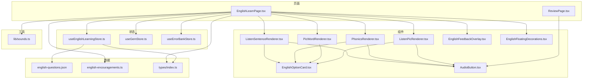
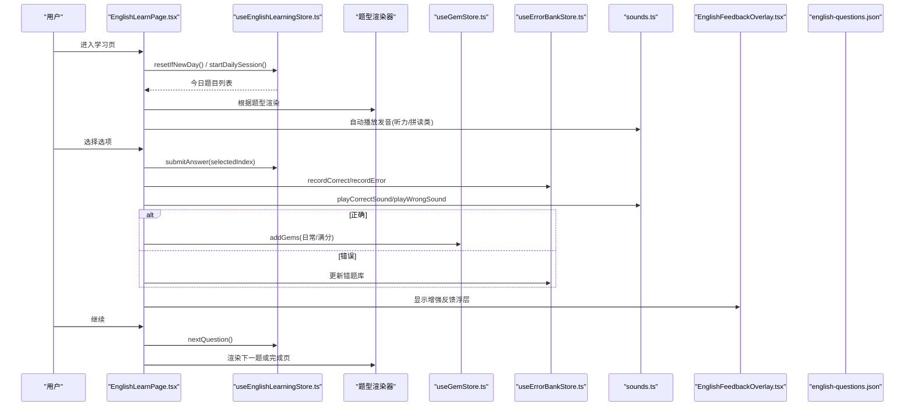
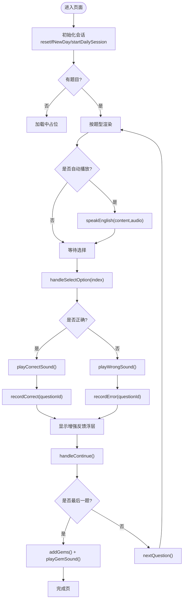
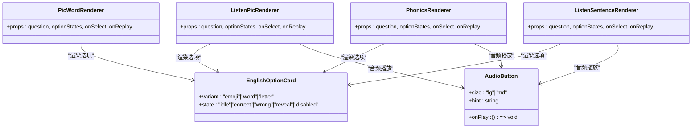
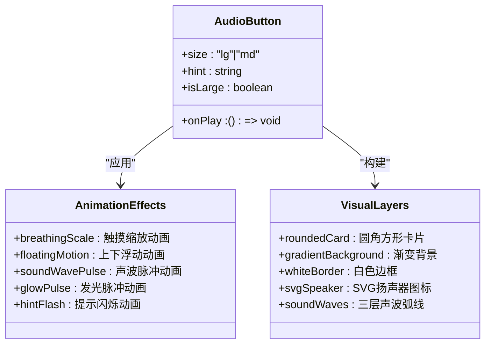
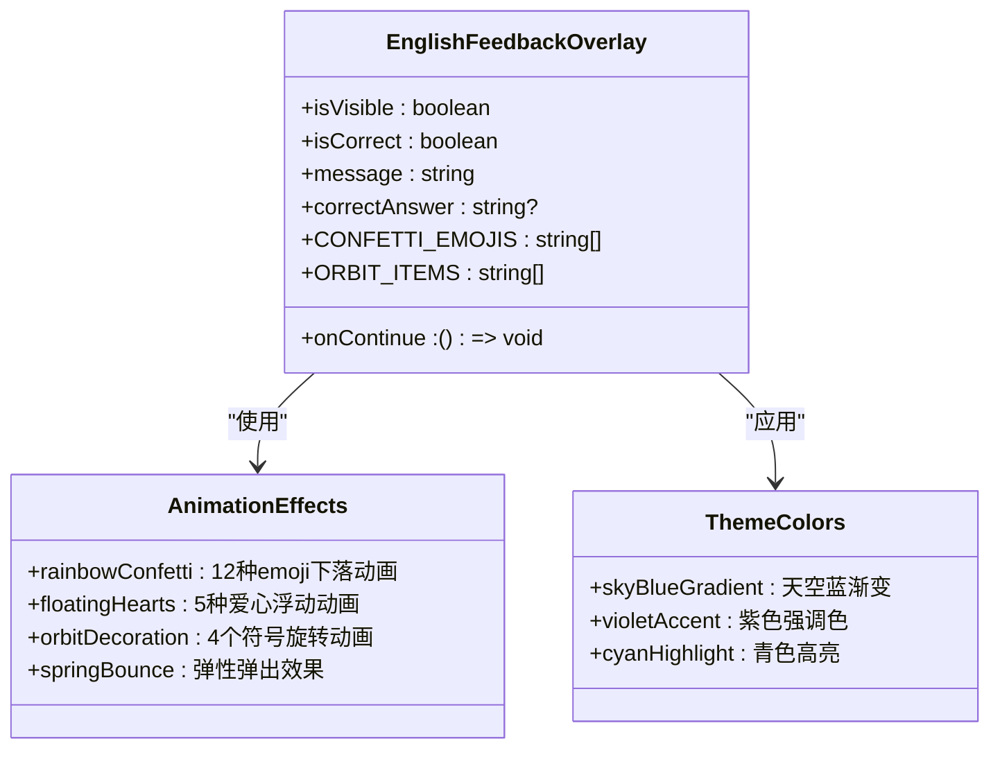
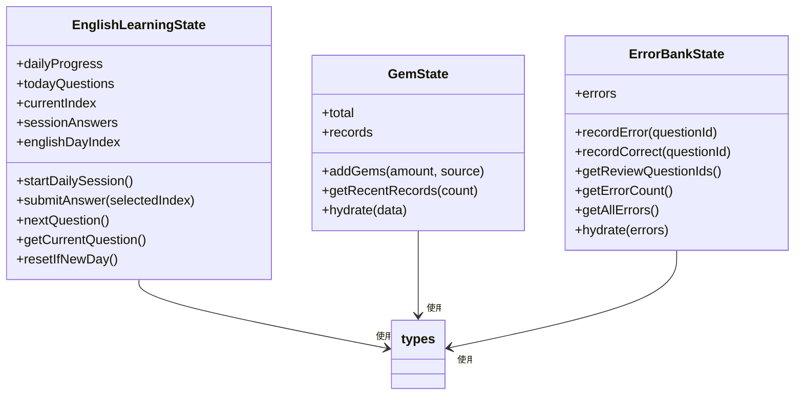
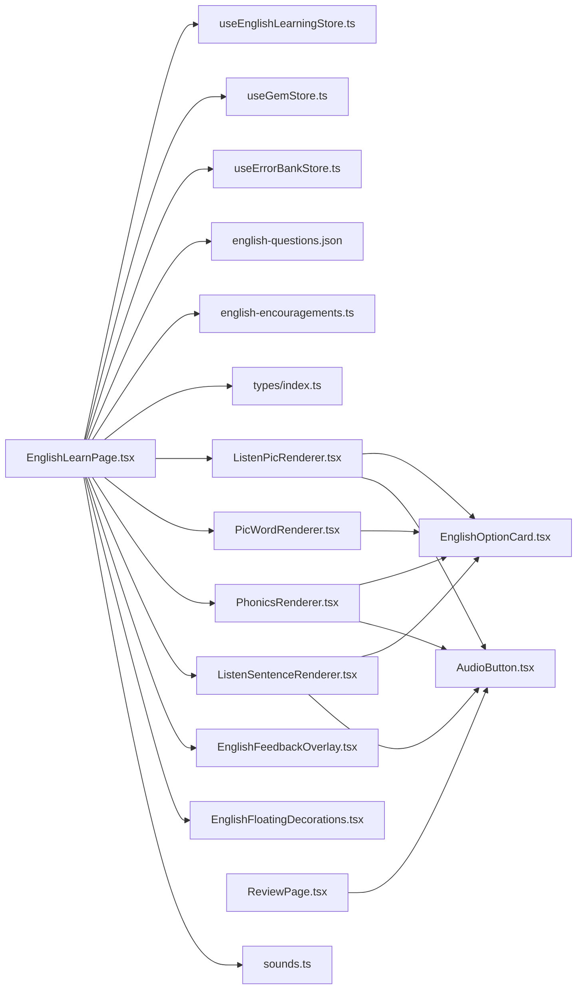

# 英语学习模块

<cite>
**本文引用的文件**   
- [EnglishLearnPage.tsx](file://src/pages/EnglishLearnPage.tsx)
- [useEnglishLearningStore.ts](file://src/store/useEnglishLearningStore.ts)
- [english-questions.json](file://src/data/english-questions.json)
- [index.ts](file://src/types/index.ts)
- [ListenPicRenderer.tsx](file://src/components/english/ListenPicRenderer.tsx)
- [PicWordRenderer.tsx](file://src/components/english/PicWordRenderer.tsx)
- [PhonicsRenderer.tsx](file://src/components/english/PhonicsRenderer.tsx)
- [ListenSentenceRenderer.tsx](file://src/components/english/ListenSentenceRenderer.tsx)
- [EnglishOptionCard.tsx](file://src/components/english/EnglishOptionCard.tsx)
- [AudioButton.tsx](file://src/components/english/AudioButton.tsx)
- [EnglishFeedbackOverlay.tsx](file://src/components/english/EnglishFeedbackOverlay.tsx)
- [sounds.ts](file://src/lib/sounds.ts)
- [english-encouragements.ts](file://src/data/english-encouragements.ts)
- [useGemStore.ts](file://src/store/useGemStore.ts)
- [useErrorBankStore.ts](file://src/store/useErrorBankStore.ts)
- [ReviewPage.tsx](file://src/pages/ReviewPage.tsx)
</cite>

## 更新摘要
**变更内容**   
- 音频按钮(AudioButton)完全重新设计，从简单emoji升级为复杂SVG扬声器图标
- 新增动画声波效果和多层视觉层次设计
- 支持大尺寸和中尺寸两种变体，适配不同使用场景
- 反馈覆盖层视觉设计更新，采用天空蓝到紫色渐变主题
- 增强了整体用户体验和视觉一致性

## 目录
1. [简介](#简介)
2. [项目结构](#项目结构)
3. [核心组件](#核心组件)
4. [架构总览](#架构总览)
5. [详细组件分析](#详细组件分析)
6. [依赖关系分析](#依赖关系分析)
7. [性能与体验优化](#性能与体验优化)
8. [故障排查指南](#故障排查指南)
9. [结论](#结论)

## 简介
本模块为"英语学习"学习路径，围绕每日固定题量、按天推进的学习节奏设计，支持多种题型（听音选图、看图选词、自然拼读、听句选图），提供即时反馈、鼓励语音、宝石奖励与错题复习机制。整体采用 React + TypeScript + Vite 技术栈，状态管理使用 Zustand 并持久化到本地存储，音频播放优先使用预录资源，失败时回退至浏览器语音合成。

**更新** 英语模块现已获得全面升级的音频按钮设计和现代化的反馈覆盖层，包括SVG扬声器图标、动画声波效果、主题化颜色方案和增强的视觉反馈系统。

## 项目结构
英语模块相关文件主要分布在以下目录：
- 页面层：英语主学习页、错题复习页
- 组件层：题型渲染器、选项卡片、发音按钮、反馈覆盖层等
- 数据层：题目 JSON、鼓励语
- 状态层：学习进度、宝石、错题本
- 工具层：声音播放封装

图表来源
- [EnglishLearnPage.tsx:1-338](file://src/pages/EnglishLearnPage.tsx#L1-L338)
- [ReviewPage.tsx:1-200](file://src/pages/ReviewPage.tsx#L1-L200)
- [useEnglishLearningStore.ts:1-149](file://src/store/useEnglishLearningStore.ts#L1-L149)
- [english-questions.json:1-800](file://src/data/english-questions.json#L1-L800)
- [index.ts:1-211](file://src/types/index.ts#L1-L211)
- [ListenPicRenderer.tsx:1-38](file://src/components/english/ListenPicRenderer.tsx#L1-L38)
- [PicWordRenderer.tsx:1-43](file://src/components/english/PicWordRenderer.tsx#L1-L43)
- [PhonicsRenderer.tsx:1-38](file://src/components/english/PhonicsRenderer.tsx#L1-L38)
- [ListenSentenceRenderer.tsx:1-42](file://src/components/english/ListenSentenceRenderer.tsx#L1-L42)
- [EnglishOptionCard.tsx:1-78](file://src/components/english/EnglishOptionCard.tsx#L1-L78)
- [AudioButton.tsx:1-121](file://src/components/english/AudioButton.tsx#L1-L121)
- [EnglishFeedbackOverlay.tsx:1-173](file://src/components/english/EnglishFeedbackOverlay.tsx#L1-L173)
- [EnglishFloatingDecorations.tsx:1-16](file://src/components/english/EnglishFloatingDecorations.tsx#L1-L16)
- [sounds.ts:1-165](file://src/lib/sounds.ts#L1-L165)
- [english-encouragements.ts:1-26](file://src/data/english-encouragements.ts#L1-L26)
- [useGemStore.ts:1-50](file://src/store/useGemStore.ts#L1-L50)
- [useErrorBankStore.ts:1-105](file://src/store/useErrorBankStore.ts#L1-L105)

章节来源
- [EnglishLearnPage.tsx:1-338](file://src/pages/EnglishLearnPage.tsx#L1-L338)
- [useEnglishLearningStore.ts:1-149](file://src/store/useEnglishLearningStore.ts#L1-L149)
- [english-questions.json:1-800](file://src/data/english-questions.json#L1-L800)
- [index.ts:1-211](file://src/types/index.ts#L1-L211)

## 核心组件
- 学习主页面：负责会话初始化、切题、答题交互、反馈展示、练习模式切换与完成结算。
- 题型渲染器：根据题型动态渲染不同 UI（听音选图、看图选词、自然拼读、听句选图）。
- 选项卡片：统一选项样式与动画，支持多态变体（emoji/单词/字母）。
- **增强型发音按钮**：全新设计的SVG扬声器图标，带动画声波效果和多层视觉层次，支持大中小尺寸变体。
- **现代化反馈覆盖层**：提供主题化的视觉反馈，包含彩虹星星撒花动画、轨道装饰、渐变背景遮罩等增强效果。
- 漂浮装饰：营造英语乐园氛围的浮动元素（鹦鹉、音符、贝壳、棕榈树等）。
- 状态管理：
  - 学习进度：按天加载题目、记录当日答题情况、推进天数。
  - 宝石系统：记录获得数量与来源，支持离线待同步。
  - 错题本：基于掌握度与间隔的复习计划。
- 声音工具：封装 Web Audio API 音效与英文朗读（预录优先，TTS 兜底）。

**更新** 音频按钮和反馈覆盖层经历了重大升级，提供了更加现代化和沉浸式的用户体验。

章节来源
- [EnglishLearnPage.tsx:1-338](file://src/pages/EnglishLearnPage.tsx#L1-L338)
- [ListenPicRenderer.tsx:1-38](file://src/components/english/ListenPicRenderer.tsx#L1-L38)
- [PicWordRenderer.tsx:1-43](file://src/components/english/PicWordRenderer.tsx#L1-L43)
- [PhonicsRenderer.tsx:1-38](file://src/components/english/PhonicsRenderer.tsx#L1-L38)
- [ListenSentenceRenderer.tsx:1-42](file://src/components/english/ListenSentenceRenderer.tsx#L1-L42)
- [EnglishOptionCard.tsx:1-78](file://src/components/english/EnglishOptionCard.tsx#L1-L78)
- [AudioButton.tsx:1-121](file://src/components/english/AudioButton.tsx#L1-L121)
- [EnglishFeedbackOverlay.tsx:1-173](file://src/components/english/EnglishFeedbackOverlay.tsx#L1-L173)
- [EnglishFloatingDecorations.tsx:1-16](file://src/components/english/EnglishFloatingDecorations.tsx#L1-L16)
- [useEnglishLearningStore.ts:1-149](file://src/store/useEnglishLearningStore.ts#L1-L149)
- [useGemStore.ts:1-50](file://src/store/useGemStore.ts#L1-L50)
- [useErrorBankStore.ts:1-105](file://src/store/useErrorBankStore.ts#L1-L105)
- [sounds.ts:1-165](file://src/lib/sounds.ts#L1-L165)

## 架构总览
英语模块采用"页面驱动 + 类型渲染 + 全局状态 + 工具库"的分层架构。页面负责流程编排，题型渲染器专注呈现，状态管理维护进度与结果，工具库处理音频与随机鼓励语。

图表来源
- [EnglishLearnPage.tsx:1-338](file://src/pages/EnglishLearnPage.tsx#L1-L338)
- [useEnglishLearningStore.ts:1-149](file://src/store/useEnglishLearningStore.ts#L1-L149)
- [useGemStore.ts:1-50](file://src/store/useGemStore.ts#L1-L50)
- [useErrorBankStore.ts:1-105](file://src/store/useErrorBankStore.ts#L1-L105)
- [sounds.ts:1-165](file://src/lib/sounds.ts#L1-L165)
- [EnglishFeedbackOverlay.tsx:1-173](file://src/components/english/EnglishFeedbackOverlay.tsx#L1-L173)
- [english-questions.json:1-800](file://src/data/english-questions.json#L1-L800)

## 详细组件分析

### 学习主页面（EnglishLearnPage）
职责
- 会话生命周期：新日重置、开始当日会话、判断是否已完成。
- 题型分发：根据 question.type 渲染对应 Renderer。
- 交互流程：防重复点击、判定正误、播放音效、记录错题/正确、展示反馈、推进题目。
- 练习模式：从题库中抽取未做过的题目进行额外练习。
- 完成结算：计算宝石奖励并播放音效。

关键流程
- 初始化：检查日期并重置；若今日无题则启动会话。
- 切题：重置选项状态；对听力/拼读类自动播放发音。
- 作答：提交答案、更新进度、记录错题/正确、播放音效、延迟显示反馈。
- 继续：在正式模式下推进到下一题或结算；在练习模式下推进或结束。

图表来源
- [EnglishLearnPage.tsx:1-338](file://src/pages/EnglishLearnPage.tsx#L1-L338)
- [sounds.ts:1-165](file://src/lib/sounds.ts#L1-L165)
- [useEnglishLearningStore.ts:1-149](file://src/store/useEnglishLearningStore.ts#L1-L149)
- [useErrorBankStore.ts:1-105](file://src/store/useErrorBankStore.ts#L1-L105)
- [useGemStore.ts:1-50](file://src/store/useGemStore.ts#L1-L50)

章节来源
- [EnglishLearnPage.tsx:1-338](file://src/pages/EnglishLearnPage.tsx#L1-L338)

### 题型渲染器
- 听音选图（ListenPicRenderer）：顶部播放按钮 + 三格 emoji 选项。
- 看图选词（PicWordRenderer）：大 emoji 题干 + 纵向单词选项。
- 自然拼读（PhonicsRenderer）：播放单词发音 + 三格首字母选项。
- 听句选图（ListenSentenceRenderer）：播放句子 + 三格场景 emoji 选项。

共同点
- 均接收统一的 props：question、optionStates、onSelect、onReplay。
- 通过 EnglishOptionCard 渲染选项，支持 idle/correct/wrong/reveal/disabled 状态与动画。
- 使用全新的 AudioButton 组件提供音频播放功能。

图表来源
- [ListenPicRenderer.tsx:1-38](file://src/components/english/ListenPicRenderer.tsx#L1-L38)
- [PicWordRenderer.tsx:1-43](file://src/components/english/PicWordRenderer.tsx#L1-L43)
- [PhonicsRenderer.tsx:1-38](file://src/components/english/PhonicsRenderer.tsx#L1-L38)
- [ListenSentenceRenderer.tsx:1-42](file://src/components/english/ListenSentenceRenderer.tsx#L1-L42)
- [EnglishOptionCard.tsx:1-78](file://src/components/english/EnglishOptionCard.tsx#L1-L78)
- [AudioButton.tsx:1-121](file://src/components/english/AudioButton.tsx#L1-L121)

章节来源
- [ListenPicRenderer.tsx:1-38](file://src/components/english/ListenPicRenderer.tsx#L1-L38)
- [PicWordRenderer.tsx:1-43](file://src/components/english/PicWordRenderer.tsx#L1-L43)
- [PhonicsRenderer.tsx:1-38](file://src/components/english/PhonicsRenderer.tsx#L1-L38)
- [ListenSentenceRenderer.tsx:1-42](file://src/components/english/ListenSentenceRenderer.tsx#L1-L42)
- [EnglishOptionCard.tsx:1-78](file://src/components/english/EnglishOptionCard.tsx#L1-L78)

### 增强型发音按钮（AudioButton）
**重大更新** 音频按钮经历了完全重新设计，从简单的🔊 emoji按钮升级为复杂的SVG扬声器图标。

核心特性
- **SVG扬声器图标**：使用矢量图形绘制清晰的扬声器形状，替代原有的emoji图标
- **动画声波效果**：三层脉冲声波弧线，依次产生透明度变化动画，模拟真实声波传播
- **多层视觉设计**：
  - 圆角方形卡片容器（大尺寸：w-32 h-32，中尺寸：w-16 h-16）
  - 天空到靛蓝渐变背景（from-sky-300 via-blue-400 to-indigo-400）
  - 白色半透明边框（border-white/50）
  - 发光脉冲效果（bg-white/20）
- **丰富的动画效果**：
  - 呼吸缩放动画（whileTap={{ scale: 0.88 }}）
  - 上下浮动动画（animate={{ y: [0, -6, 0] }}）
  - 声波透明度脉冲动画
  - 提示文字闪烁效果
- **双尺寸变体**：
  - 大尺寸（lg）：用于主学习界面，完整动画和提示文案
  - 中尺寸（md）：用于复习界面，简化动画和紧凑布局

图表来源
- [AudioButton.tsx:1-121](file://src/components/english/AudioButton.tsx#L1-L121)

章节来源
- [AudioButton.tsx:1-121](file://src/components/english/AudioButton.tsx#L1-L121)

### 现代化反馈覆盖层（EnglishFeedbackOverlay）
**视觉更新** 反馈覆盖层采用了与新的主题风格相匹配的现代化设计。

核心特性
- **主题化颜色方案**：采用天空蓝到紫色的渐变配色，体现英语学习的国际化特色。
- **丰富动画效果**：
  - 正确回答：彩虹星星撒花动画，12种不同emoji从天而降
  - 错误回答：温柔浮动爱心动画，5种彩色爱心持续飘动
  - 轨道装饰：4个音乐符号围绕中心吉祥物旋转
- **视觉层次设计**：
  - 半透明渐变背景遮罩，带毛玻璃效果
  - 发光外圈阴影，增强卡片立体感
  - 顶部渐变条，随正确/错误状态变化
- **响应式交互**：
  - 弹簧动画弹出效果
  - 点击缩放反馈
  - 延迟渐入动画序列

图表来源
- [EnglishFeedbackOverlay.tsx:1-173](file://src/components/english/EnglishFeedbackOverlay.tsx#L1-L173)

章节来源
- [EnglishFeedbackOverlay.tsx:1-173](file://src/components/english/EnglishFeedbackOverlay.tsx#L1-L173)

### 漂浮装饰（EnglishFloatingDecorations）
营造英语乐园主题的浮动装饰元素。

设计特点
- **主题元素**：彩虹鹦鹉🦜、音符🎵、贝壳🐚、棕榈树🌴、云朵☁️、彩虹🌈、星星⭐
- **动画效果**：缓慢漂移动画，营造轻松愉快的学习氛围
- **视觉层次**：不同透明度（20%-40%）创造深度感
- **布局策略**：分散在屏幕各处，避免遮挡主要内容

章节来源
- [EnglishFloatingDecorations.tsx:1-16](file://src/components/english/EnglishFloatingDecorations.tsx#L1-L16)

### 状态管理（Zustand）
- 学习进度（useEnglishLearningStore）
  - 按 day 序号从题库筛选当日题目，默认每天 10 题。
  - 记录 sessionAnswers 与 dailyProgress（完成数、正确数、是否完成）。
  - 推进 englishDayIndex，超过最大天数后视为全部完成。
- 宝石（useGemStore）
  - 记录 total 与 records，新增记录时触发待同步。
- 错题本（useErrorBankStore）
  - 基于 masteryLevel 与间隔表决定下次复习日期。
  - 答错降级掌握度，答对升级掌握度并调整复习间隔。

图表来源
- [useEnglishLearningStore.ts:1-149](file://src/store/useEnglishLearningStore.ts#L1-L149)
- [useGemStore.ts:1-50](file://src/store/useGemStore.ts#L1-L50)
- [useErrorBankStore.ts:1-105](file://src/store/useErrorBankStore.ts#L1-L105)
- [index.ts:1-211](file://src/types/index.ts#L1-L211)

章节来源
- [useEnglishLearningStore.ts:1-149](file://src/store/useEnglishLearningStore.ts#L1-L149)
- [useGemStore.ts:1-50](file://src/store/useGemStore.ts#L1-L50)
- [useErrorBankStore.ts:1-105](file://src/store/useErrorBankStore.ts#L1-L105)
- [index.ts:1-211](file://src/types/index.ts#L1-L211)

### 数据与类型
- 题目数据（english-questions.json）
  - 字段包含 id、subject、level、type、difficulty、day、prompt、content、pic、audio、options、answer。
  - 按 day 组织，便于每日固定题量与顺序推进。
- 类型定义（types/index.ts）
  - 英语题型：listen_pic、pic_word、phonics、listen_sentence。
  - 英语题目接口 EnglishQuestion 与通用 Question/MathQuestion 区分学科。
  - 每日进度 DailyProgress、宝石记录 GemRecord、错题记录 ErrorRecord 等。

章节来源
- [english-questions.json:1-800](file://src/data/english-questions.json#L1-L800)
- [index.ts:1-211](file://src/types/index.ts#L1-L211)

### 声音与反馈
- 英文发音（sounds.ts）
  - speakEnglish(text, src)：优先播放预录音频，失败时使用 SpeechSynthesis 兜底。
  - playCorrectSound()/playWrongSound()：Web Audio API 生成音效，并在结束后播放鼓励语音。
  - playGemSound()：清脆叮铃用于奖励反馈。
- 鼓励语（english-encouragements.ts）
  - 提供积极正向的中文+英文混合鼓励文案，随机选取。

章节来源
- [sounds.ts:1-165](file://src/lib/sounds.ts#L1-L165)
- [english-encouragements.ts:1-26](file://src/data/english-encouragements.ts#L1-L26)

## 依赖关系分析
- 页面依赖
  - 状态：useEnglishLearningStore、useGemStore、useErrorBankStore
  - 组件：各题型渲染器、进度条、**增强反馈浮层**、漂浮装饰、装饰组件
  - 数据：english-questions.json、english-encouragements.ts
  - 工具：sounds.ts、路由导航
- 组件依赖
  - 渲染器依赖 EnglishOptionCard 与 **增强型AudioButton**
  - **反馈覆盖层独立实现，不依赖业务逻辑**
  - 选项卡片不依赖业务逻辑，仅负责 UI 与动画
- 状态依赖
  - 学习进度依赖题目数据与日期工具
  - 宝石与错题本依赖本地持久化与同步管理器（外部）

图表来源
- [EnglishLearnPage.tsx:1-338](file://src/pages/EnglishLearnPage.tsx#L1-L338)
- [ReviewPage.tsx:1-200](file://src/pages/ReviewPage.tsx#L1-L200)
- [useEnglishLearningStore.ts:1-149](file://src/store/useEnglishLearningStore.ts#L1-L149)
- [useGemStore.ts:1-50](file://src/store/useGemStore.ts#L1-L50)
- [useErrorBankStore.ts:1-105](file://src/store/useErrorBankStore.ts#L1-L105)
- [english-questions.json:1-800](file://src/data/english-questions.json#L1-L800)
- [english-encouragements.ts:1-26](file://src/data/english-encouragements.ts#L1-L26)
- [index.ts:1-211](file://src/types/index.ts#L1-L211)
- [ListenPicRenderer.tsx:1-38](file://src/components/english/ListenPicRenderer.tsx#L1-L38)
- [PicWordRenderer.tsx:1-43](file://src/components/english/PicWordRenderer.tsx#L1-L43)
- [PhonicsRenderer.tsx:1-38](file://src/components/english/PhonicsRenderer.tsx#L1-L38)
- [ListenSentenceRenderer.tsx:1-42](file://src/components/english/ListenSentenceRenderer.tsx#L1-L42)
- [EnglishOptionCard.tsx:1-78](file://src/components/english/EnglishOptionCard.tsx#L1-L78)
- [AudioButton.tsx:1-121](file://src/components/english/AudioButton.tsx#L1-L121)
- [EnglishFeedbackOverlay.tsx:1-173](file://src/components/english/EnglishFeedbackOverlay.tsx#L1-L173)
- [EnglishFloatingDecorations.tsx:1-16](file://src/components/english/EnglishFloatingDecorations.tsx#L1-L16)
- [sounds.ts:1-165](file://src/lib/sounds.ts#L1-L165)

## 性能与体验优化
- 音频策略
  - 预录音频优先，失败自动回退到 TTS，避免阻塞与白屏。
  - 使用 AudioContext 生成短音效，减少网络请求与体积。
- 渲染优化
  - 题型渲染器仅关注展示，复杂逻辑集中在页面层，降低组件耦合。
  - 选项卡片复用同一套状态与动画，减少重复实现。
  - **反馈覆盖层使用 framer-motion 优化动画性能，避免重排重绘**。
  - **AudioButton使用SVG矢量图形，比emoji图标更清晰且支持精细动画**。
- 交互体验
  - 自动播放仅在听力/拼读类触发，避免不必要的干扰。
  - 反馈延迟 150ms 显示，确保视觉与听觉一致。
  - **增强反馈覆盖层提供丰富的视觉反馈，提升学习成就感**。
  - **AudioButton的多层动画效果提供更直观的音频播放反馈**。
- 可扩展性
  - 题型通过 type 分发，新增题型只需扩展渲染分支与对应 Renderer。
  - 题目数据按 day 组织，便于后续引入难度梯度与自适应出题。
  - **反馈覆盖层支持主题化配置，便于未来扩展更多主题风格**。
  - **AudioButton的尺寸变体设计便于在不同场景下复用**。

**更新** 新增了AudioButton重新设计和反馈覆盖层优化的相关内容。

## 故障排查指南
- 无法自动播放发音
  - 现象：进入页面后无声音。
  - 原因：浏览器限制需用户交互后才能播放音频。
  - 处理：确认首次交互后再触发播放；检查 speakEnglish 的 fallback 是否生效。
- 预录音频缺失
  - 现象：部分题目无声或报错。
  - 原因：音频文件不存在或跨域问题。
  - 处理：检查 audio 路径；确认 TTS 兜底已启用。
- 宝石未增加
  - 现象：完成学习后宝石不变。
  - 原因：未完成结算逻辑或未调用 addGems。
  - 处理：核对 last 题判断与 addGems 调用位置。
- 错题未记录
  - 现象：答错后错题库无变化。
  - 原因：未调用 recordError 或题目不在错题库中。
  - 处理：确认 handleSelectOption 中的记录逻辑与 masteryLevel 更新。
- **反馈覆盖层显示异常**
  - 现象：反馈浮层无法正常显示或动画卡顿。
  - 原因：framer-motion 依赖缺失或 CSS 冲突。
  - 处理：检查 framer-motion 安装状态；确认 z-index 层级设置正确。
- **AudioButton动画异常**
  - 现象：声波动画不显示或SVG图标渲染错误。
  - 原因：framer-motion版本不兼容或CSS类名冲突。
  - 处理：检查framer-motion依赖版本；确认Tailwind CSS配置正确。

**更新** 新增了AudioButton相关的故障排查指南。

章节来源
- [sounds.ts:1-165](file://src/lib/sounds.ts#L1-L165)
- [EnglishLearnPage.tsx:1-338](file://src/pages/EnglishLearnPage.tsx#L1-L338)
- [useGemStore.ts:1-50](file://src/store/useGemStore.ts#L1-L50)
- [useErrorBankStore.ts:1-105](file://src/store/useErrorBankStore.ts#L1-L105)
- [EnglishFeedbackOverlay.tsx:1-173](file://src/components/english/EnglishFeedbackOverlay.tsx#L1-L173)
- [AudioButton.tsx:1-121](file://src/components/english/AudioButton.tsx#L1-L121)

## 结论
英语模块以清晰的页面-组件-状态分层实现了稳定的学习流程与良好的用户体验。通过按天推进的题目组织、丰富的题型渲染、即时的音视频反馈以及完善的错题与奖励机制，既满足儿童学习的趣味性，也具备可扩展性与可维护性。

**更新** 随着AudioButton的全面重新设计和反馈覆盖层的现代化升级，英语模块现已拥有更加专业化和沉浸式的用户体验。SVG扬声器图标、动画声波效果和主题化颜色方案显著提升了界面的视觉吸引力和交互反馈质量，使学习过程更加生动有趣。

未来可在题目难度曲线、自适应复习与云端同步方面进一步增强，同时考虑为AudioButton提供更多自定义主题选项和动画效果。