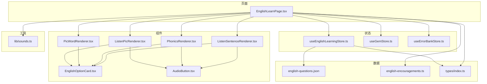
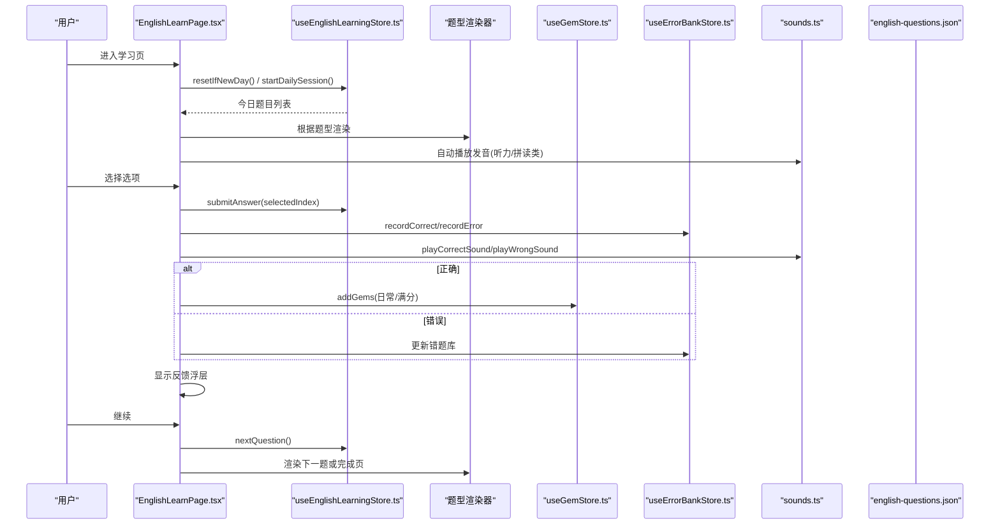
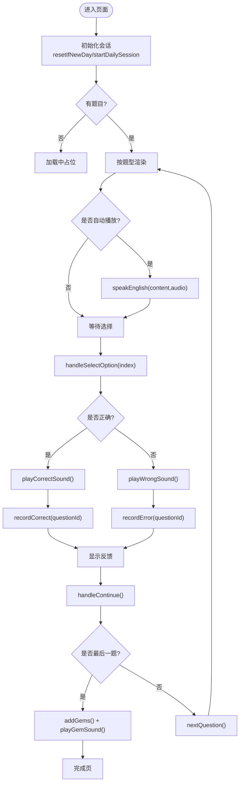
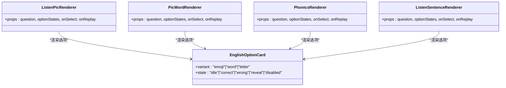
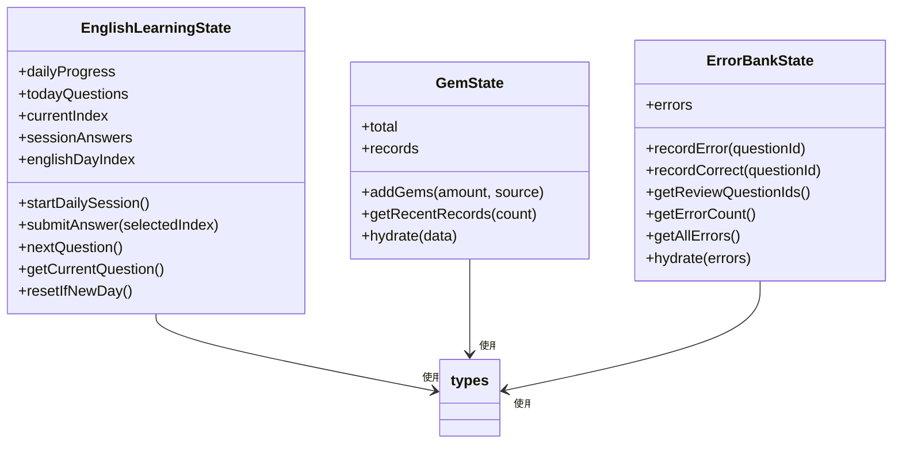
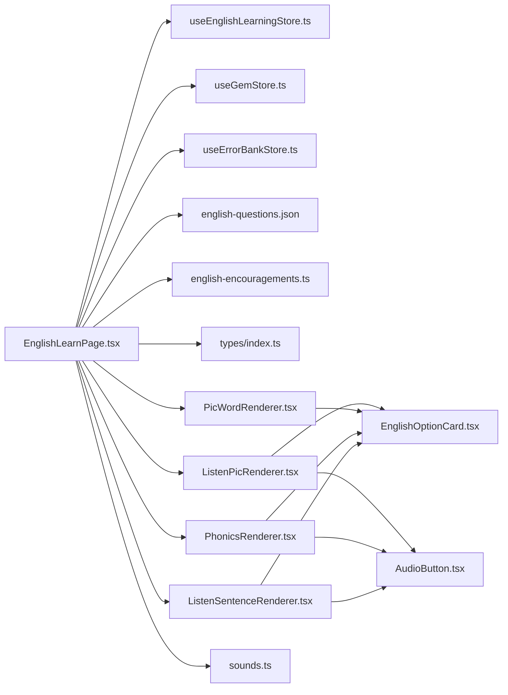

# 英语学习模块

<cite>
**本文引用的文件**   
- [EnglishLearnPage.tsx](file://src/pages/EnglishLearnPage.tsx)
- [useEnglishLearningStore.ts](file://src/store/useEnglishLearningStore.ts)
- [english-questions.json](file://src/data/english-questions.json)
- [index.ts](file://src/types/index.ts)
- [ListenPicRenderer.tsx](file://src/components/english/ListenPicRenderer.tsx)
- [PicWordRenderer.tsx](file://src/components/english/PicWordRenderer.tsx)
- [PhonicsRenderer.tsx](file://src/components/english/PhonicsRenderer.tsx)
- [ListenSentenceRenderer.tsx](file://src/components/english/ListenSentenceRenderer.tsx)
- [EnglishOptionCard.tsx](file://src/components/english/EnglishOptionCard.tsx)
- [AudioButton.tsx](file://src/components/english/AudioButton.tsx)
- [sounds.ts](file://src/lib/sounds.ts)
- [english-encouragements.ts](file://src/data/english-encouragements.ts)
- [useGemStore.ts](file://src/store/useGemStore.ts)
- [useErrorBankStore.ts](file://src/store/useErrorBankStore.ts)
</cite>

## 目录
1. [简介](#简介)
2. [项目结构](#项目结构)
3. [核心组件](#核心组件)
4. [架构总览](#架构总览)
5. [详细组件分析](#详细组件分析)
6. [依赖关系分析](#依赖关系分析)
7. [性能与体验优化](#性能与体验优化)
8. [故障排查指南](#故障排查指南)
9. [结论](#结论)

## 简介
本模块为“英语学习”学习路径，围绕每日固定题量、按天推进的学习节奏设计，支持多种题型（听音选图、看图选词、自然拼读、听句选图），提供即时反馈、鼓励语音、宝石奖励与错题复习机制。整体采用 React + TypeScript + Vite 技术栈，状态管理使用 Zustand 并持久化到本地存储，音频播放优先使用预录资源，失败时回退至浏览器语音合成。

## 项目结构
英语模块相关文件主要分布在以下目录：
- 页面层：英语主学习页
- 组件层：题型渲染器、选项卡片、发音按钮等
- 数据层：题目 JSON、鼓励语
- 状态层：学习进度、宝石、错题本
- 工具层：声音播放封装

图表来源
- [EnglishLearnPage.tsx:1-339](file://src/pages/EnglishLearnPage.tsx#L1-L339)
- [useEnglishLearningStore.ts:1-149](file://src/store/useEnglishLearningStore.ts#L1-L149)
- [english-questions.json:1-800](file://src/data/english-questions.json#L1-L800)
- [index.ts:1-211](file://src/types/index.ts#L1-L211)
- [ListenPicRenderer.tsx:1-38](file://src/components/english/ListenPicRenderer.tsx#L1-L38)
- [PicWordRenderer.tsx:1-43](file://src/components/english/PicWordRenderer.tsx#L1-L43)
- [PhonicsRenderer.tsx:1-38](file://src/components/english/PhonicsRenderer.tsx#L1-L38)
- [ListenSentenceRenderer.tsx:1-42](file://src/components/english/ListenSentenceRenderer.tsx#L1-L42)
- [EnglishOptionCard.tsx:1-78](file://src/components/english/EnglishOptionCard.tsx#L1-L78)
- [AudioButton.tsx:1-35](file://src/components/english/AudioButton.tsx#L1-L35)
- [sounds.ts:1-165](file://src/lib/sounds.ts#L1-L165)
- [english-encouragements.ts:1-26](file://src/data/english-encouragements.ts#L1-L26)
- [useGemStore.ts:1-50](file://src/store/useGemStore.ts#L1-L50)
- [useErrorBankStore.ts:1-105](file://src/store/useErrorBankStore.ts#L1-L105)

章节来源
- [EnglishLearnPage.tsx:1-339](file://src/pages/EnglishLearnPage.tsx#L1-L339)
- [useEnglishLearningStore.ts:1-149](file://src/store/useEnglishLearningStore.ts#L1-L149)
- [english-questions.json:1-800](file://src/data/english-questions.json#L1-L800)
- [index.ts:1-211](file://src/types/index.ts#L1-L211)

## 核心组件
- 学习主页面：负责会话初始化、切题、答题交互、反馈展示、练习模式切换与完成结算。
- 题型渲染器：根据题型动态渲染不同 UI（听音选图、看图选词、自然拼读、听句选图）。
- 选项卡片：统一选项样式与动画，支持多态变体（emoji/单词/字母）。
- 发音按钮：大尺寸可点击喇叭，带提示文案与呼吸动效。
- 状态管理：
  - 学习进度：按天加载题目、记录当日答题情况、推进天数。
  - 宝石系统：记录获得数量与来源，支持离线待同步。
  - 错题本：基于掌握度与间隔的复习计划。
- 声音工具：封装 Web Audio API 音效与英文朗读（预录优先，TTS 兜底）。

章节来源
- [EnglishLearnPage.tsx:1-339](file://src/pages/EnglishLearnPage.tsx#L1-L339)
- [ListenPicRenderer.tsx:1-38](file://src/components/english/ListenPicRenderer.tsx#L1-L38)
- [PicWordRenderer.tsx:1-43](file://src/components/english/PicWordRenderer.tsx#L1-L43)
- [PhonicsRenderer.tsx:1-38](file://src/components/english/PhonicsRenderer.tsx#L1-L38)
- [ListenSentenceRenderer.tsx:1-42](file://src/components/english/ListenSentenceRenderer.tsx#L1-L42)
- [EnglishOptionCard.tsx:1-78](file://src/components/english/EnglishOptionCard.tsx#L1-L78)
- [AudioButton.tsx:1-35](file://src/components/english/AudioButton.tsx#L1-L35)
- [useEnglishLearningStore.ts:1-149](file://src/store/useEnglishLearningStore.ts#L1-L149)
- [useGemStore.ts:1-50](file://src/store/useGemStore.ts#L1-L50)
- [useErrorBankStore.ts:1-105](file://src/store/useErrorBankStore.ts#L1-L105)
- [sounds.ts:1-165](file://src/lib/sounds.ts#L1-L165)

## 架构总览
英语模块采用“页面驱动 + 类型渲染 + 全局状态 + 工具库”的分层架构。页面负责流程编排，题型渲染器专注呈现，状态管理维护进度与结果，工具库处理音频与随机鼓励语。

图表来源
- [EnglishLearnPage.tsx:1-339](file://src/pages/EnglishLearnPage.tsx#L1-L339)
- [useEnglishLearningStore.ts:1-149](file://src/store/useEnglishLearningStore.ts#L1-L149)
- [useGemStore.ts:1-50](file://src/store/useGemStore.ts#L1-L50)
- [useErrorBankStore.ts:1-105](file://src/store/useErrorBankStore.ts#L1-L105)
- [sounds.ts:1-165](file://src/lib/sounds.ts#L1-L165)
- [english-questions.json:1-800](file://src/data/english-questions.json#L1-L800)

## 详细组件分析

### 学习主页面（EnglishLearnPage）
职责
- 会话生命周期：新日重置、开始当日会话、判断是否已完成。
- 题型分发：根据 question.type 渲染对应 Renderer。
- 交互流程：防重复点击、判定正误、播放音效、记录错题/正确、展示反馈、推进题目。
- 练习模式：从题库中抽取未做过的题目进行额外练习。
- 完成结算：计算宝石奖励并播放音效。

关键流程
- 初始化：检查日期并重置；若今日无题则启动会话。
- 切题：重置选项状态；对听力/拼读类自动播放发音。
- 作答：提交答案、更新进度、记录错题/正确、播放音效、延迟显示反馈。
- 继续：在正式模式下推进到下一题或结算；在练习模式下推进或结束。

图表来源
- [EnglishLearnPage.tsx:1-339](file://src/pages/EnglishLearnPage.tsx#L1-L339)
- [sounds.ts:1-165](file://src/lib/sounds.ts#L1-L165)
- [useEnglishLearningStore.ts:1-149](file://src/store/useEnglishLearningStore.ts#L1-L149)
- [useErrorBankStore.ts:1-105](file://src/store/useErrorBankStore.ts#L1-L105)
- [useGemStore.ts:1-50](file://src/store/useGemStore.ts#L1-L50)

章节来源
- [EnglishLearnPage.tsx:1-339](file://src/pages/EnglishLearnPage.tsx#L1-L339)

### 题型渲染器
- 听音选图（ListenPicRenderer）：顶部播放按钮 + 三格 emoji 选项。
- 看图选词（PicWordRenderer）：大 emoji 题干 + 纵向单词选项。
- 自然拼读（PhonicsRenderer）：播放单词发音 + 三格首字母选项。
- 听句选图（ListenSentenceRenderer）：播放句子 + 三格场景 emoji 选项。

共同点
- 均接收统一的 props：question、optionStates、onSelect、onReplay。
- 通过 EnglishOptionCard 渲染选项，支持 idle/correct/wrong/reveal/disabled 状态与动画。

图表来源
- [ListenPicRenderer.tsx:1-38](file://src/components/english/ListenPicRenderer.tsx#L1-L38)
- [PicWordRenderer.tsx:1-43](file://src/components/english/PicWordRenderer.tsx#L1-L43)
- [PhonicsRenderer.tsx:1-38](file://src/components/english/PhonicsRenderer.tsx#L1-L38)
- [ListenSentenceRenderer.tsx:1-42](file://src/components/english/ListenSentenceRenderer.tsx#L1-L42)
- [EnglishOptionCard.tsx:1-78](file://src/components/english/EnglishOptionCard.tsx#L1-L78)

章节来源
- [ListenPicRenderer.tsx:1-38](file://src/components/english/ListenPicRenderer.tsx#L1-L38)
- [PicWordRenderer.tsx:1-43](file://src/components/english/PicWordRenderer.tsx#L1-L43)
- [PhonicsRenderer.tsx:1-38](file://src/components/english/PhonicsRenderer.tsx#L1-L38)
- [ListenSentenceRenderer.tsx:1-42](file://src/components/english/ListenSentenceRenderer.tsx#L1-L42)
- [EnglishOptionCard.tsx:1-78](file://src/components/english/EnglishOptionCard.tsx#L1-L78)

### 发音按钮（AudioButton）
- 大尺寸圆形按钮，带呼吸缩放动画与点击缩放反馈。
- 支持尺寸变体与提示文案，提升儿童用户的可操作性与可读性。

章节来源
- [AudioButton.tsx:1-35](file://src/components/english/AudioButton.tsx#L1-L35)

### 状态管理（Zustand）
- 学习进度（useEnglishLearningStore）
  - 按 day 序号从题库筛选当日题目，默认每天 10 题。
  - 记录 sessionAnswers 与 dailyProgress（完成数、正确数、是否完成）。
  - 推进 englishDayIndex，超过最大天数后视为全部完成。
- 宝石（useGemStore）
  - 记录 total 与 records，新增记录时触发待同步。
- 错题本（useErrorBankStore）
  - 基于 masteryLevel 与间隔表决定下次复习日期。
  - 答错降级掌握度，答对升级掌握度并调整复习间隔。

图表来源
- [useEnglishLearningStore.ts:1-149](file://src/store/useEnglishLearningStore.ts#L1-L149)
- [useGemStore.ts:1-50](file://src/store/useGemStore.ts#L1-L50)
- [useErrorBankStore.ts:1-105](file://src/store/useErrorBankStore.ts#L1-L105)
- [index.ts:1-211](file://src/types/index.ts#L1-L211)

章节来源
- [useEnglishLearningStore.ts:1-149](file://src/store/useEnglishLearningStore.ts#L1-L149)
- [useGemStore.ts:1-50](file://src/store/useGemStore.ts#L1-L50)
- [useErrorBankStore.ts:1-105](file://src/store/useErrorBankStore.ts#L1-L105)
- [index.ts:1-211](file://src/types/index.ts#L1-L211)

### 数据与类型
- 题目数据（english-questions.json）
  - 字段包含 id、subject、level、type、difficulty、day、prompt、content、pic、audio、options、answer。
  - 按 day 组织，便于每日固定题量与顺序推进。
- 类型定义（types/index.ts）
  - 英语题型：listen_pic、pic_word、phonics、listen_sentence。
  - 英语题目接口 EnglishQuestion 与通用 Question/MathQuestion 区分学科。
  - 每日进度 DailyProgress、宝石记录 GemRecord、错题记录 ErrorRecord 等。

章节来源
- [english-questions.json:1-800](file://src/data/english-questions.json#L1-L800)
- [index.ts:1-211](file://src/types/index.ts#L1-L211)

### 声音与反馈
- 英文发音（sounds.ts）
  - speakEnglish(text, src)：优先播放预录音频，失败时使用 SpeechSynthesis 兜底。
  - playCorrectSound()/playWrongSound()：Web Audio API 生成音效，并在结束后播放鼓励语音。
  - playGemSound()：清脆叮铃用于奖励反馈。
- 鼓励语（english-encouragements.ts）
  - 提供积极正向的中文+英文混合鼓励文案，随机选取。

章节来源
- [sounds.ts:1-165](file://src/lib/sounds.ts#L1-L165)
- [english-encouragements.ts:1-26](file://src/data/english-encouragements.ts#L1-L26)

## 依赖关系分析
- 页面依赖
  - 状态：useEnglishLearningStore、useGemStore、useErrorBankStore
  - 组件：各题型渲染器、进度条、反馈浮层、装饰组件
  - 数据：english-questions.json、english-encouragements.ts
  - 工具：sounds.ts、路由导航
- 组件依赖
  - 渲染器依赖 EnglishOptionCard 与 AudioButton
  - 选项卡片不依赖业务逻辑，仅负责 UI 与动画
- 状态依赖
  - 学习进度依赖题目数据与日期工具
  - 宝石与错题本依赖本地持久化与同步管理器（外部）

图表来源
- [EnglishLearnPage.tsx:1-339](file://src/pages/EnglishLearnPage.tsx#L1-L339)
- [useEnglishLearningStore.ts:1-149](file://src/store/useEnglishLearningStore.ts#L1-L149)
- [useGemStore.ts:1-50](file://src/store/useGemStore.ts#L1-L50)
- [useErrorBankStore.ts:1-105](file://src/store/useErrorBankStore.ts#L1-L105)
- [english-questions.json:1-800](file://src/data/english-questions.json#L1-L800)
- [english-encouragements.ts:1-26](file://src/data/english-encouragements.ts#L1-L26)
- [index.ts:1-211](file://src/types/index.ts#L1-L211)
- [ListenPicRenderer.tsx:1-38](file://src/components/english/ListenPicRenderer.tsx#L1-L38)
- [PicWordRenderer.tsx:1-43](file://src/components/english/PicWordRenderer.tsx#L1-L43)
- [PhonicsRenderer.tsx:1-38](file://src/components/english/PhonicsRenderer.tsx#L1-L38)
- [ListenSentenceRenderer.tsx:1-42](file://src/components/english/ListenSentenceRenderer.tsx#L1-L42)
- [EnglishOptionCard.tsx:1-78](file://src/components/english/EnglishOptionCard.tsx#L1-L78)
- [AudioButton.tsx:1-35](file://src/components/english/AudioButton.tsx#L1-L35)
- [sounds.ts:1-165](file://src/lib/sounds.ts#L1-L165)

## 性能与体验优化
- 音频策略
  - 预录音频优先，失败自动回退到 TTS，避免阻塞与白屏。
  - 使用 AudioContext 生成短音效，减少网络请求与体积。
- 渲染优化
  - 题型渲染器仅关注展示，复杂逻辑集中在页面层，降低组件耦合。
  - 选项卡片复用同一套状态与动画，减少重复实现。
- 交互体验
  - 自动播放仅在听力/拼读类触发，避免不必要的干扰。
  - 反馈延迟 150ms 显示，确保视觉与听觉一致。
- 可扩展性
  - 题型通过 type 分发，新增题型只需扩展渲染分支与对应 Renderer。
  - 题目数据按 day 组织，便于后续引入难度梯度与自适应出题。

[本节为通用建议，无需源码引用]

## 故障排查指南
- 无法自动播放发音
  - 现象：进入页面后无声音。
  - 原因：浏览器限制需用户交互后才能播放音频。
  - 处理：确认首次交互后再触发播放；检查 speakEnglish 的 fallback 是否生效。
- 预录音频缺失
  - 现象：部分题目无声或报错。
  - 原因：音频文件不存在或跨域问题。
  - 处理：检查 audio 路径；确认 TTS 兜底已启用。
- 宝石未增加
  - 现象：完成学习后宝石不变。
  - 原因：未完成结算逻辑或未调用 addGems。
  - 处理：核对 last 题判断与 addGems 调用位置。
- 错题未记录
  - 现象：答错后错题库无变化。
  - 原因：未调用 recordError 或题目不在错题库中。
  - 处理：确认 handleSelectOption 中的记录逻辑与 masteryLevel 更新。

章节来源
- [sounds.ts:1-165](file://src/lib/sounds.ts#L1-L165)
- [EnglishLearnPage.tsx:1-339](file://src/pages/EnglishLearnPage.tsx#L1-L339)
- [useGemStore.ts:1-50](file://src/store/useGemStore.ts#L1-L50)
- [useErrorBankStore.ts:1-105](file://src/store/useErrorBankStore.ts#L1-L105)

## 结论
英语模块以清晰的页面-组件-状态分层实现了稳定的学习流程与良好的用户体验。通过按天推进的题目组织、丰富的题型渲染、即时的音视频反馈以及完善的错题与奖励机制，既满足儿童学习的趣味性，也具备可扩展性与可维护性。未来可在题目难度曲线、自适应复习与云端同步方面进一步增强。