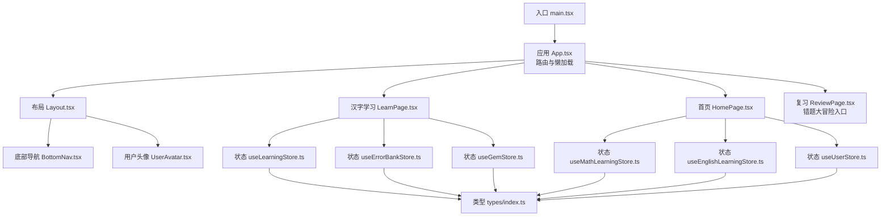
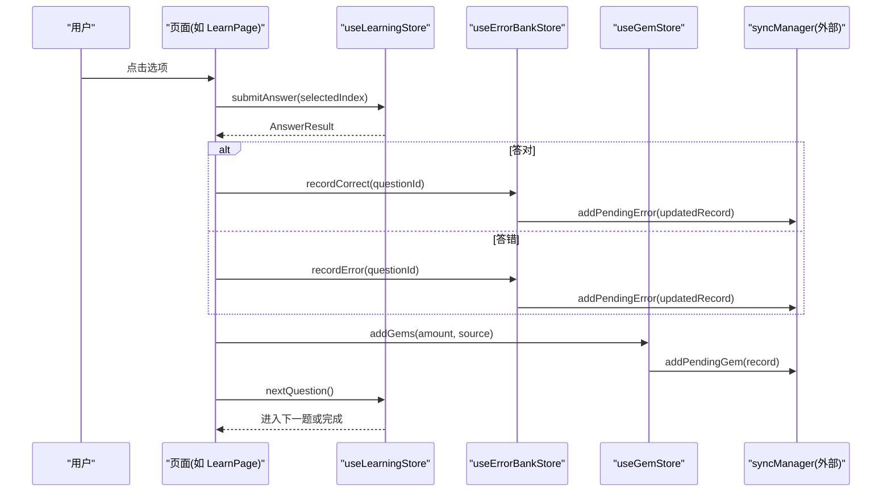
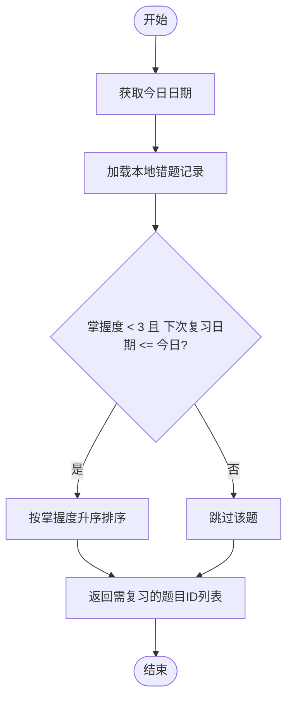
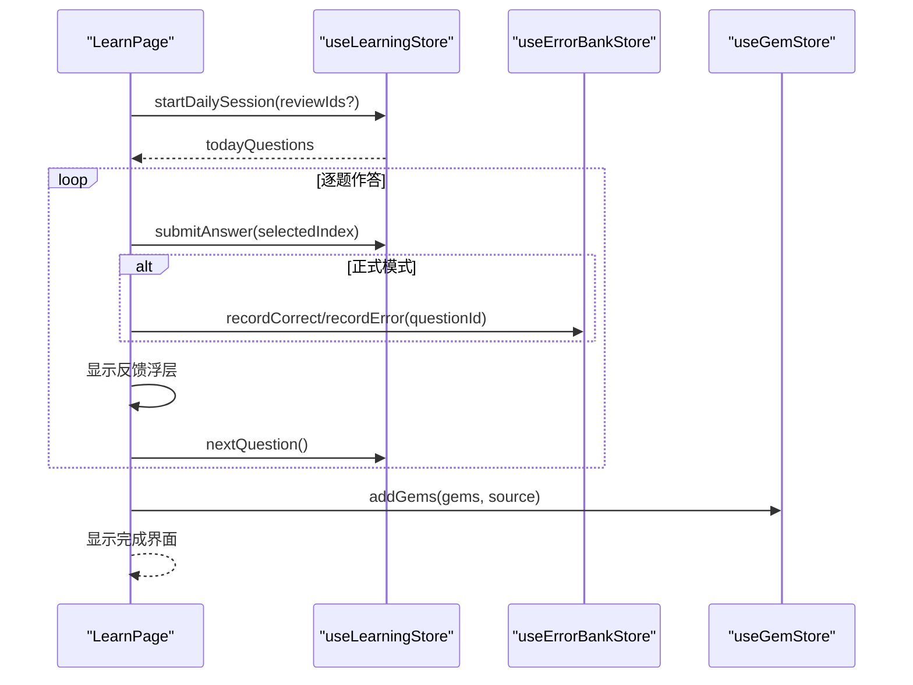
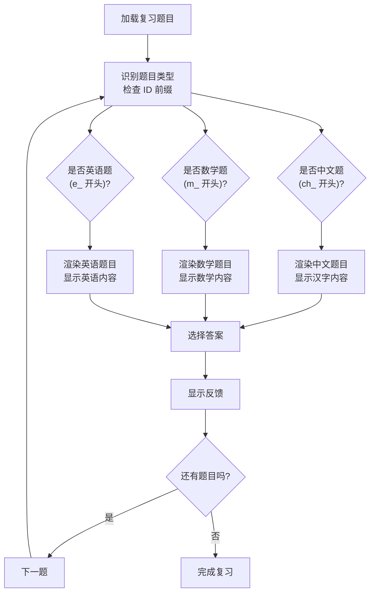
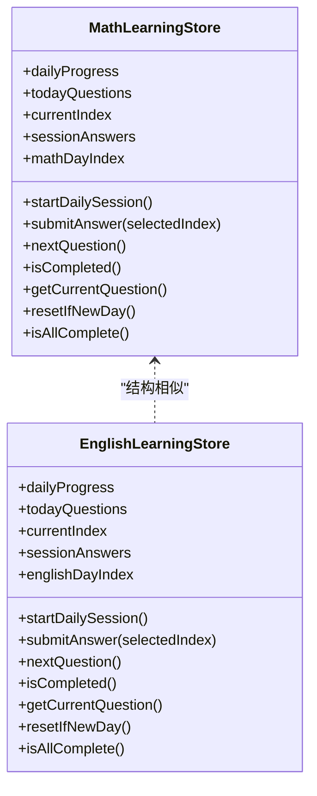
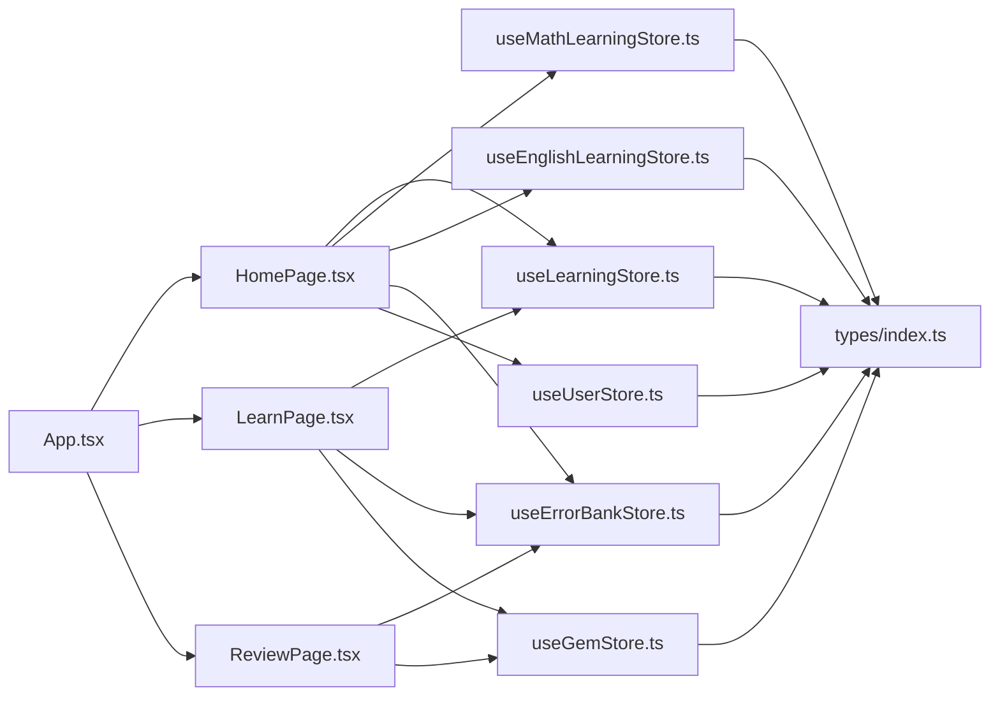

# 错题大冒险

<cite>
**本文引用的文件**   
- [README.md](file://README.md)
- [package.json](file://package.json)
- [AGENTS.md](file://AGENTS.md)
- [src/main.tsx](file://src/main.tsx)
- [src/App.tsx](file://src/App.tsx)
- [src/components/Layout.tsx](file://src/components/Layout.tsx)
- [src/pages/HomePage.tsx](file://src/pages/HomePage.tsx)
- [src/pages/LearnPage.tsx](file://src/pages/LearnPage.tsx)
- [src/pages/ReviewPage.tsx](file://src/pages/ReviewPage.tsx)
- [src/store/useLearningStore.ts](file://src/store/useLearningStore.ts)
- [src/store/useMathLearningStore.ts](file://src/store/useMathLearningStore.ts)
- [src/store/useEnglishLearningStore.ts](file://src/store/useEnglishLearningStore.ts)
- [src/store/useErrorBankStore.ts](file://src/store/useErrorBankStore.ts)
- [src/store/useGemStore.ts](file://src/store/useGemStore.ts)
- [src/store/useUserStore.ts](file://src/store/useUserStore.ts)
- [src/types/index.ts](file://src/types/index.ts)
</cite>

## 更新摘要
**变更内容**   
- 修复了 ReviewPage 组件中的关键 bug，确保中文题目在复习会话中正确显示
- 更新了 isChinese() 函数和中文错误计数逻辑，使用正确的 ID 前缀 'ch_' 替代错误的 'c_'
- 确保了复习界面中中文题目的正确渲染

## 目录
1. [简介](#简介)
2. [项目结构](#项目结构)
3. [核心组件](#核心组件)
4. [架构总览](#架构总览)
5. [详细组件分析](#详细组件分析)
6. [依赖关系分析](#依赖关系分析)
7. [性能考量](#性能考量)
8. [故障排查指南](#故障排查指南)
9. [结论](#结论)
10. [附录](#附录)

## 简介
"错题大冒险"是面向低龄儿童的互动式学习应用，围绕汉字、数学、英语三大模块构建。其核心特色包括：
- 每日固定题量与按天推进的学习路径（最多90天）
- 错题库与间隔复习机制，帮助巩固薄弱知识点
- 宝石奖励体系，正向激励完成学习与挑战
- 鼓励式反馈与动画交互，提升儿童学习体验
- 本地持久化与云端同步能力（通过状态中间件与同步管理器）

本仓库采用 React + TypeScript + Vite + TailwindCSS + Framer Motion + Zustand 技术栈，页面路由使用 react-router-dom，数据持久化使用 zustand/middleware，并预留 Supabase 集成点。

章节来源
- [AGENTS.md:1-21](file://AGENTS.md#L1-L21)
- [package.json:1-37](file://package.json#L1-L37)

## 项目结构
整体采用"功能域 + 页面 + 状态管理"的清晰分层：
- 入口与路由：main.tsx 启动应用，App.tsx 定义路由与懒加载策略
- 页面层：HomePage 作为主导航，LearnPage 为汉字答题页，ReviewPage 承载"错题大冒险"
- 状态层：useLearningStore、useMathLearningStore、useEnglishLearningStore 分别维护三科进度；useErrorBankStore 维护错题库；useGemStore 维护宝石；useUserStore 维护用户信息
- 类型定义：types/index.ts 统一题目、进度、记录等数据结构
- 布局与通用组件：Layout、ProgressBar、FeedbackOverlay 等

图表来源
- [src/main.tsx:1-11](file://src/main.tsx#L1-L11)
- [src/App.tsx:1-58](file://src/App.tsx#L1-L58)
- [src/components/Layout.tsx:1-26](file://src/components/Layout.tsx#L1-L26)
- [src/pages/HomePage.tsx:1-250](file://src/pages/HomePage.tsx#L1-L250)
- [src/pages/LearnPage.tsx:1-485](file://src/pages/LearnPage.tsx#L1-L485)
- [src/pages/ReviewPage.tsx:1-357](file://src/pages/ReviewPage.tsx#L1-L357)
- [src/store/useLearningStore.ts:1-177](file://src/store/useLearningStore.ts#L1-L177)
- [src/store/useMathLearningStore.ts:1-149](file://src/store/useMathLearningStore.ts#L1-L149)
- [src/store/useEnglishLearningStore.ts:1-149](file://src/store/useEnglishLearningStore.ts#L1-L149)
- [src/store/useErrorBankStore.ts:1-105](file://src/store/useErrorBankStore.ts#L1-L105)
- [src/store/useGemStore.ts:1-50](file://src/store/useGemStore.ts#L1-L50)
- [src/store/useUserStore.ts:1-57](file://src/store/useUserStore.ts#L1-L57)
- [src/types/index.ts:1-241](file://src/types/index.ts#L1-L241)

章节来源
- [src/main.tsx:1-11](file://src/main.tsx#L1-L11)
- [src/App.tsx:1-58](file://src/App.tsx#L1-L58)
- [src/components/Layout.tsx:1-26](file://src/components/Layout.tsx#L1-L26)
- [src/pages/HomePage.tsx:1-250](file://src/pages/HomePage.tsx#L1-L250)
- [src/pages/LearnPage.tsx:1-485](file://src/pages/LearnPage.tsx#L1-L485)
- [src/pages/ReviewPage.tsx:1-357](file://src/pages/ReviewPage.tsx#L1-L357)
- [src/store/useLearningStore.ts:1-177](file://src/store/useLearningStore.ts#L1-L177)
- [src/store/useMathLearningStore.ts:1-149](file://src/store/useMathLearningStore.ts#L1-L149)
- [src/store/useEnglishLearningStore.ts:1-149](file://src/store/useEnglishLearningStore.ts#L1-L149)
- [src/store/useErrorBankStore.ts:1-105](file://src/store/useErrorBankStore.ts#L1-L105)
- [src/store/useGemStore.ts:1-50](file://src/store/useGemStore.ts#L1-L50)
- [src/store/useUserStore.ts:1-57](file://src/store/useUserStore.ts#L1-L57)
- [src/types/index.ts:1-241](file://src/types/index.ts#L1-L241)

## 核心组件
- 应用入口与路由
  - main.tsx 创建根节点并挂载 App
  - App.tsx 使用 BrowserRouter 与 Suspense 进行懒加载，区分全屏答题页与带布局页面
- 布局与导航
  - Layout.tsx 提供顶部标题、用户头像与底部导航容器
- 首页与入口
  - HomePage.tsx 展示学科卡片与"错题大冒险"入口，聚合各科目进度与错误数量
- 答题流程
  - LearnPage.tsx 实现单题渲染、选项交互、反馈浮层、练习模式与完成结算
- 复习流程
  - ReviewPage.tsx 实现错题复习功能，支持多科目混合复习与统计展示

章节来源
- [src/main.tsx:1-11](file://src/main.tsx#L1-L11)
- [src/App.tsx:1-58](file://src/App.tsx#L1-L58)
- [src/components/Layout.tsx:1-26](file://src/components/Layout.tsx#L1-L26)
- [src/pages/HomePage.tsx:1-250](file://src/pages/HomePage.tsx#L1-L250)
- [src/pages/LearnPage.tsx:1-485](file://src/pages/LearnPage.tsx#L1-L485)
- [src/pages/ReviewPage.tsx:1-357](file://src/pages/ReviewPage.tsx#L1-L357)

## 架构总览
系统以"页面 + 状态"为核心，结合持久化与同步机制，形成如下数据流：
- 页面发起交互 → 调用对应 Store 方法 → 更新本地状态（持久化）→ 触发同步任务（待上传）
- 错题库根据掌握度与下次复习日期筛选当日需复习的题目
- 宝石奖励在答题完成后发放，并记录来源

图表来源
- [src/pages/LearnPage.tsx:109-193](file://src/pages/LearnPage.tsx#L109-L193)
- [src/store/useLearningStore.ts:106-144](file://src/store/useLearningStore.ts#L106-L144)
- [src/store/useErrorBankStore.ts:32-76](file://src/store/useErrorBankStore.ts#L32-L76)
- [src/store/useGemStore.ts:23-35](file://src/store/useGemStore.ts#L23-35)

## 详细组件分析

### 错题大冒险（Review 入口与错题库）
- 入口位置
  - 首页"挑战关卡"区域提供"错题大冒险"入口，点击跳转至 /review
- 错题库状态
  - useErrorBankStore 维护错题记录，包含错误次数、正确次数、掌握度等级、最近作答与下次复习日期
  - 掌握度等级映射到复习间隔天数，等级越高复习间隔越长，达到最高级不再复习
  - 提供获取当日需复习题目的接口，按掌握度由低到高排序优先复习
- 数据同步
  - 每次记录错误或正确后，将更新后的记录加入待同步队列

图表来源
- [src/store/useErrorBankStore.ts:78-85](file://src/store/useErrorBankStore.ts#L78-L85)

**更新** 修复了中文题目识别的关键 bug，确保复习界面正确显示中文题目

章节来源
- [src/pages/HomePage.tsx:179-229](file://src/pages/HomePage.tsx#L179-L229)
- [src/store/useErrorBankStore.ts:1-105](file://src/store/useErrorBankStore.ts#L1-L105)
- [src/pages/ReviewPage.tsx:36-85](file://src/pages/ReviewPage.tsx#L36-L85)

### 汉字学习（LearnPage 与 useLearningStore）
- 学习会话
  - 首次进入时若当天无题目，则从题库中按 day 序号选取当日题目，并可插入少量错题复习题
  - 每道题提交答案后更新会话结果与每日进度
  - 完成当天全部题目后推进到下一天，并触发批量同步
- 练习模式
  - 支持在完成后再玩一次，随机抽取未做过的题目，不计分不记录
- 反馈与奖励
  - 答对/答错均有积极鼓励文案与音效
  - 完成当天可获得基础宝石，全对额外奖励

图表来源
- [src/pages/LearnPage.tsx:82-193](file://src/pages/LearnPage.tsx#L82-L193)
- [src/store/useLearningStore.ts:73-144](file://src/store/useLearningStore.ts#L73-L144)
- [src/store/useErrorBankStore.ts:32-76](file://src/store/useErrorBankStore.ts#L32-L76)
- [src/store/useGemStore.ts:23-35](file://src/store/useGemStore.ts#L23-L35)

章节来源
- [src/pages/LearnPage.tsx:1-485](file://src/pages/LearnPage.tsx#L1-L485)
- [src/store/useLearningStore.ts:1-177](file://src/store/useLearningStore.ts#L1-L177)

### 复习页面（ReviewPage）
- 复习流程
  - 从错题库获取需要复习的题目，支持中文、数学、英语三种题型混合
  - 每道题提供选项交互、即时反馈与继续按钮
  - 完成所有题目后给予宝石奖励
- 题目识别与渲染
  - 使用 isChinese()、isEnglish()、isMath() 函数根据题目 ID 前缀判断题型
  - 中文题目 ID 以 'ch_' 开头，数学题目以 'm_' 开头，英语题目以 'e_' 开头
- 错误统计
  - 实时统计各科目的错误题目数量，在入口处展示分类统计卡片

**更新** 修复了中文题目识别逻辑，确保 isChinese() 函数使用正确的 'ch_' 前缀进行判断，同时更新了中文错误计数逻辑以匹配实际的题目 ID 格式

图表来源
- [src/pages/ReviewPage.tsx:36-39](file://src/pages/ReviewPage.tsx#L36-L39)
- [src/pages/ReviewPage.tsx:260-341](file://src/pages/ReviewPage.tsx#L260-L341)

章节来源
- [src/pages/ReviewPage.tsx:1-357](file://src/pages/ReviewPage.tsx#L1-L357)

### 数学与英语学习（并行结构）
- 数学与英语均遵循相同模式：按 day 序号取题、每日10题、完成推进下一天
- 各自拥有独立的状态存储与持久化键名，互不影响

图表来源
- [src/store/useMathLearningStore.ts:1-149](file://src/store/useMathLearningStore.ts#L1-L149)
- [src/store/useEnglishLearningStore.ts:1-149](file://src/store/useEnglishLearningStore.ts#L1-L149)

章节来源
- [src/store/useMathLearningStore.ts:1-149](file://src/store/useMathLearningStore.ts#L1-L149)
- [src/store/useEnglishLearningStore.ts:1-149](file://src/store/useEnglishLearningStore.ts#L1-L149)

### 宝石与用户（激励与个性化）
- 宝石
  - 完成每日学习或获得满分时增加宝石，并记录来源以便统计
- 用户
  - 默认内置用户，支持修改头像与姓名，变更时触发同步

章节来源
- [src/store/useGemStore.ts:1-50](file://src/store/useGemStore.ts#L1-L50)
- [src/store/useUserStore.ts:1-57](file://src/store/useUserStore.ts#L1-L57)

## 依赖关系分析
- 页面与状态
  - HomePage 聚合各科进度与错误数量，驱动"错题大冒险"入口
  - LearnPage 依赖 useLearningStore、useErrorBankStore、useGemStore
  - ReviewPage 依赖 useErrorBankStore、useGemStore，以及题目数据源
- 状态与类型
  - 所有 Store 共享 types/index.ts 中的类型定义，确保数据结构一致
- 路由与懒加载
  - App.tsx 对非首页页面进行懒加载，降低首屏体积

图表来源
- [src/App.tsx:1-58](file://src/App.tsx#L1-L58)
- [src/pages/HomePage.tsx:1-250](file://src/pages/HomePage.tsx#L1-L250)
- [src/pages/LearnPage.tsx:1-485](file://src/pages/LearnPage.tsx#L1-L485)
- [src/pages/ReviewPage.tsx:1-357](file://src/pages/ReviewPage.tsx#L1-L357)
- [src/store/useLearningStore.ts:1-177](file://src/store/useLearningStore.ts#L1-L177)
- [src/store/useMathLearningStore.ts:1-149](file://src/store/useMathLearningStore.ts#L1-L149)
- [src/store/useEnglishLearningStore.ts:1-149](file://src/store/useEnglishLearningStore.ts#L1-L149)
- [src/store/useErrorBankStore.ts:1-105](file://src/store/useErrorBankStore.ts#L1-L105)
- [src/store/useGemStore.ts:1-50](file://src/store/useGemStore.ts#L1-L50)
- [src/store/useUserStore.ts:1-57](file://src/store/useUserStore.ts#L1-L57)
- [src/types/index.ts:1-241](file://src/types/index.ts#L1-L241)

章节来源
- [src/App.tsx:1-58](file://src/App.tsx#L1-L58)
- [src/pages/HomePage.tsx:1-250](file://src/pages/HomePage.tsx#L1-L250)
- [src/pages/LearnPage.tsx:1-485](file://src/pages/LearnPage.tsx#L1-L485)
- [src/pages/ReviewPage.tsx:1-357](file://src/pages/ReviewPage.tsx#L1-L357)
- [src/store/useLearningStore.ts:1-177](file://src/store/useLearningStore.ts#L1-L177)
- [src/store/useMathLearningStore.ts:1-149](file://src/store/useMathLearningStore.ts#L1-L149)
- [src/store/useEnglishLearningStore.ts:1-149](file://src/store/useEnglishLearningStore.ts#L1-L149)
- [src/store/useErrorBankStore.ts:1-105](file://src/store/useErrorBankStore.ts#L1-L105)
- [src/store/useGemStore.ts:1-50](file://src/store/useGemStore.ts#L1-L50)
- [src/store/useUserStore.ts:1-57](file://src/store/useUserStore.ts#L1-L57)
- [src/types/index.ts:1-241](file://src/types/index.ts#L1-L241)

## 性能考量
- 路由懒加载：非首页页面按需加载，减少初始包体
- 状态持久化：使用 zustand/persist 避免重复初始化成本
- 动画与交互：Framer Motion 用于轻量动效，注意避免过度重绘
- 音频播放：仅在需要时创建 Audio 实例并设置音量，捕获异常静默处理

[本节为通用指导，无需具体文件引用]

## 故障排查指南
- 无法进入学习会话
  - 检查是否已调用 resetIfNewDay 与 startDailySession，确认当日题目是否为空
- 错题未进入复习
  - 确认 masteryLevel 与 nextReviewDate 是否正确更新，过滤条件是否满足
- 宝石未发放
  - 核对完成判定逻辑与 addGems 调用时机
- 用户信息不同步
  - 检查 setName/setAvatar 是否触发同步，onRehydrateStorage 迁移逻辑是否正常
- **中文题目在复习界面显示异常**
  - 检查 isChinese() 函数是否正确识别 'ch_' 前缀的中文题目 ID
  - 确认中文错误计数逻辑使用正确的 ID 前缀进行过滤
  - 验证题目数据源中的中文题目 ID 格式是否符合预期

**更新** 新增了中文题目显示异常的故障排查指南，重点关注 ID 前缀识别问题

章节来源
- [src/pages/LearnPage.tsx:82-193](file://src/pages/LearnPage.tsx#L82-L193)
- [src/pages/ReviewPage.tsx:36-85](file://src/pages/ReviewPage.tsx#L36-L85)
- [src/store/useErrorBankStore.ts:32-76](file://src/store/useErrorBankStore.ts#L32-L76)
- [src/store/useGemStore.ts:23-35](file://src/store/useGemStore.ts#L23-L35)
- [src/store/useUserStore.ts:40-54](file://src/store/useUserStore.ts#L40-L54)

## 结论
"错题大冒险"通过清晰的页面与状态分层、稳定的每日学习路径与错题库复习机制，构建了适合低龄儿童的正向学习闭环。配合宝石奖励与鼓励式反馈，既保证学习效果又兼顾趣味性。本次修复解决了中文题目在复习界面的显示问题，确保了用户体验的一致性。后续可在以下方面持续优化：
- 完善云端同步与冲突解决策略
- 扩展题型与内容规模，丰富学习曲线
- 增强无障碍与可访问性，适配更多设备与场景

[本节为总结性内容，无需具体文件引用]

## 附录
- 关键类型概览（节选）
  - Question：汉字题目结构，含 content、answer、options、audio 等字段
  - MathQuestion：数学题目结构，含 data 联合类型与 answer/options
  - EnglishQuestion：英语题目结构，含 prompt/content/audio/options/answer
  - ErrorRecord：错题记录，含掌握度与复习日期
  - GemRecord：宝石记录，含 amount/source/date
  - DailyProgress/MathDailyProgress：每日进度结构
- **题目 ID 规范**
  - 中文题目：以 'ch_' 开头，格式为 ch_d{day}_q{number}
  - 数学题目：以 'm_' 开头
  - 英语题目：以 'e_' 开头

**更新** 新增了题目 ID 规范说明，明确各科目题目的 ID 前缀规则

章节来源
- [src/types/index.ts:127-210](file://src/types/index.ts#L127-L210)
- [src/pages/ReviewPage.tsx:36-39](file://src/pages/ReviewPage.tsx#L36-L39)
