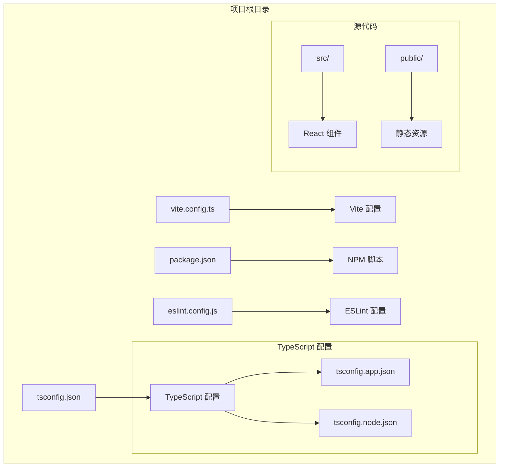
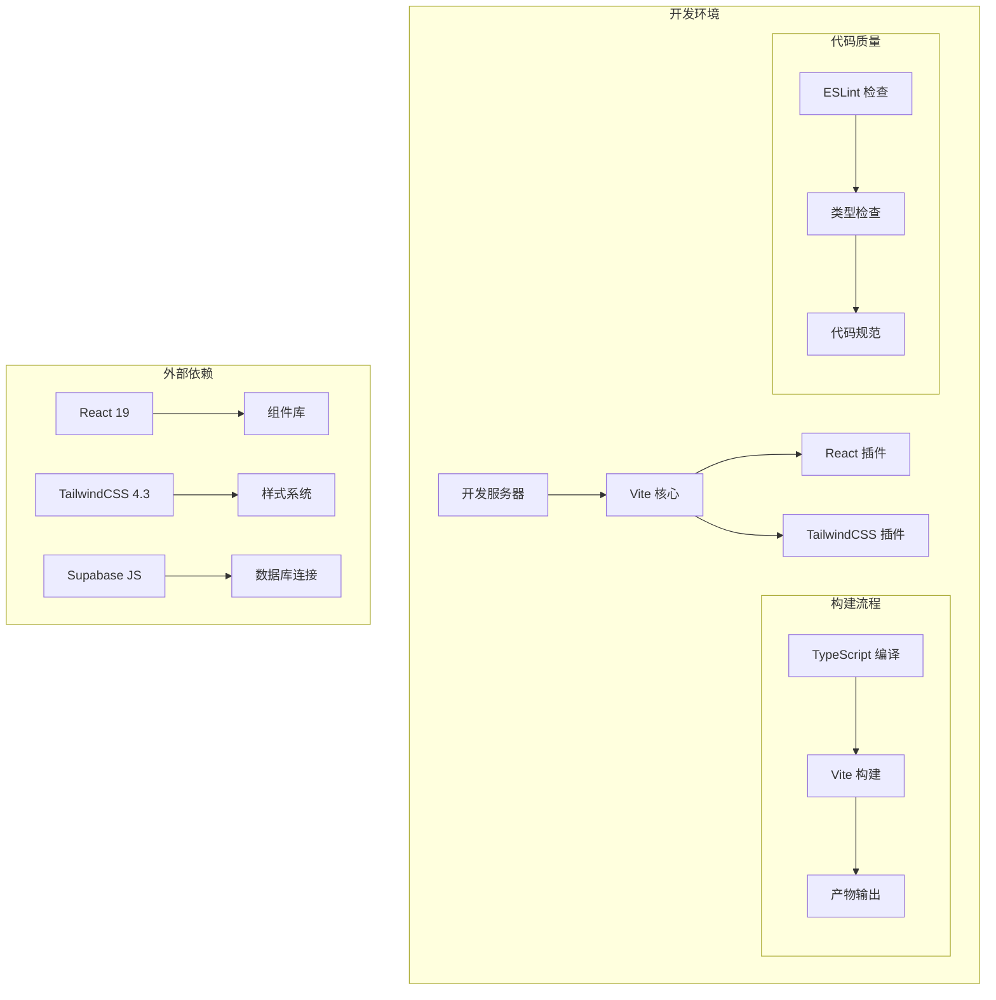
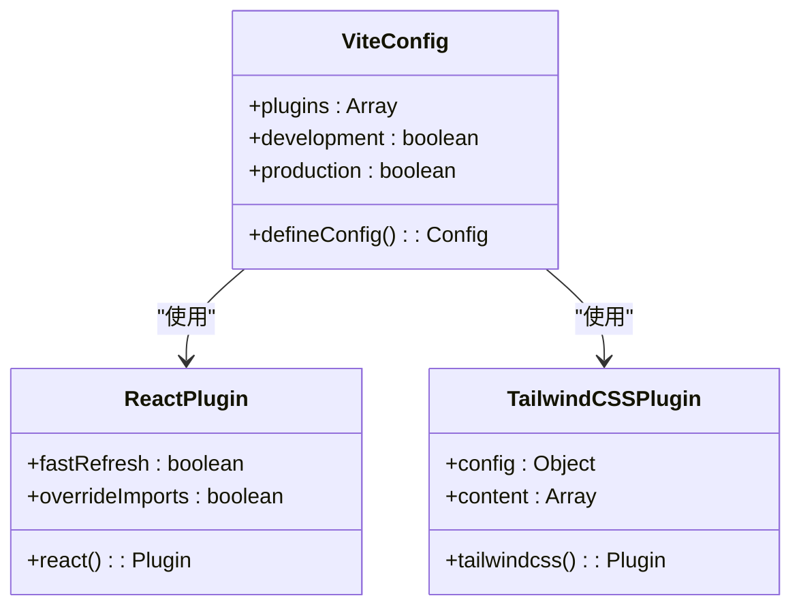
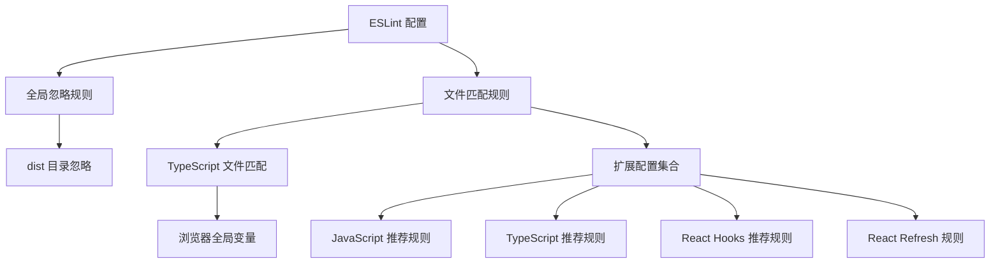
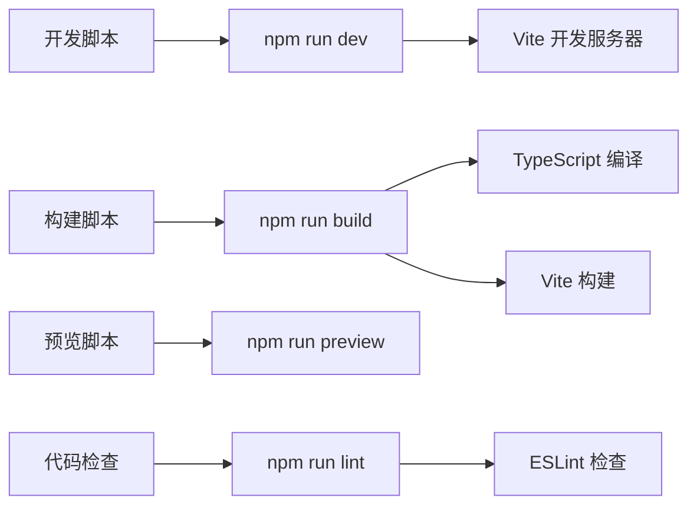

# 开发环境配置

<cite>
**本文档引用的文件**
- [vite.config.ts](file://vite.config.ts)
- [package.json](file://package.json)
- [eslint.config.js](file://eslint.config.js)
- [tsconfig.json](file://tsconfig.json)
- [tsconfig.app.json](file://tsconfig.app.json)
- [tsconfig.node.json](file://tsconfig.node.json)
- [README.md](file://README.md)
</cite>

## 目录
1. [简介](#简介)
2. [项目结构](#项目结构)
3. [核心组件](#核心组件)
4. [架构概览](#架构概览)
5. [详细组件分析](#详细组件分析)
6. [依赖关系分析](#依赖关系分析)
7. [性能考虑](#性能考虑)
8. [故障排除指南](#故障排除指南)
9. [结论](#结论)

## 简介

Rainbow Learning 是一个基于 React + TypeScript + Vite 的现代化前端项目模板。该项目提供了完整的开发环境配置，包括构建系统、类型检查、代码规范和热模块替换等功能。本文档将深入解析项目的各项配置文件，详细说明 Vite 构建配置、TypeScript 编译配置和 ESLint 代码规范配置的具体设置和作用。

## 项目结构

项目采用标准的 Vite + React + TypeScript 结构，主要配置文件分布如下：



**图表来源**
- [vite.config.ts:1-12](file://vite.config.ts#L1-L12)
- [package.json:1-36](file://package.json#L1-L36)
- [tsconfig.json:1-8](file://tsconfig.json#L1-L8)

**章节来源**
- [vite.config.ts:1-12](file://vite.config.ts#L1-L12)
- [package.json:1-36](file://package.json#L1-L36)
- [tsconfig.json:1-8](file://tsconfig.json#L1-L8)

## 核心组件

### Vite 构建配置

Vite 作为现代前端构建工具，提供了快速的开发服务器和高效的生产构建。项目中的配置相对简洁但功能完整。

### TypeScript 编译配置

项目使用双配置文件策略，分别针对应用代码和 Node.js 环境进行优化配置。

### ESLint 代码规范配置

采用最新的 flat config 格式，集成了 React Hooks 和 React Refresh 插件，提供全面的代码质量保证。

**章节来源**
- [vite.config.ts:6-11](file://vite.config.ts#L6-L11)
- [tsconfig.app.json:2-23](file://tsconfig.app.json#L2-L23)
- [eslint.config.js:8-22](file://eslint.config.js#L8-L22)

## 架构概览



**图表来源**
- [vite.config.ts:7-10](file://vite.config.ts#L7-L10)
- [package.json:12-19](file://package.json#L12-L19)
- [package.json:21-33](file://package.json#L21-L33)

## 详细组件分析

### Vite 配置详解

#### 基础配置结构

Vite 配置采用简洁的模块化设计，主要包含以下关键要素：



**图表来源**
- [vite.config.ts:6-11](file://vite.config.ts#L6-L11)

#### 插件集成方案

项目集成了两个核心插件：

1. **@vitejs/plugin-react**: 提供 React 组件的快速刷新和 JSX 转换支持
2.. **@tailwindcss/vite**: 集成 TailwindCSS 工具类到 Vite 构建流程中

**章节来源**
- [vite.config.ts:7-10](file://vite.config.ts#L7-L10)

### TypeScript 配置深度解析

#### 双配置文件架构

项目采用分层配置策略，通过主配置文件协调多个子配置：

```mermaid
erDiagram
TSCONFIG_JSON {
files: array
references: array
}
APP_CONFIG {
target: string
module: string
jsx: string
moduleResolution: string
skipLibCheck: boolean
noEmit: boolean
}
NODE_CONFIG {
target: string
module: string
types: array
moduleResolution: string
skipLibCheck: boolean
noEmit: boolean
}
TSCONFIG_JSON ||--o{ APP_CONFIG : "引用"
TSCONFIG_JSON ||--o{ NODE_CONFIG : "引用"
```

**图表来源**
- [tsconfig.json:3-6](file://tsconfig.json#L3-L6)
- [tsconfig.app.json:2-23](file://tsconfig.app.json#L2-L23)
- [tsconfig.node.json:2-22](file://tsconfig.node.json#L2-L22)

#### 应用配置特性

应用配置专注于前端开发需求：
- **目标环境**: ES2023，确保现代 JavaScript 特性支持
- **模块系统**: ESNext，与 Vite 的打包器模式兼容
- **类型检查**: 启用严格模式，提供完整的类型安全保障
- **JSX 处理**: 使用 react-jsx，优化 React 组件编译

#### Node.js 配置特性

Node.js 配置专门处理构建脚本和开发工具：
- **类型定义**: 包含 Node.js 内置类型
- **模块检测**: 强制模块检测，避免运行时错误
- **构建信息**: 独立的构建缓存文件

**章节来源**
- [tsconfig.app.json:2-23](file://tsconfig.app.json#L2-L23)
- [tsconfig.node.json:2-22](file://tsconfig.node.json#L2-L22)

### ESLint 配置全面分析

#### 配置架构设计

项目采用 flat config 格式，提供更灵活和强大的配置能力：



**图表来源**
- [eslint.config.js:8-22](file://eslint.config.js#L8-L22)

#### 规则扩展机制

配置集成了四个主要的规则扩展：
1. **@eslint/js**: 基础 JavaScript 规则推荐
2. **typescript-eslint**: TypeScript 专用规则
3. **eslint-plugin-react-hooks**: React Hooks 最佳实践
4. **eslint-plugin-react-refresh**: React Fast Refresh 支持

**章节来源**
- [eslint.config.js:10-22](file://eslint.config.js#L10-L22)

## 依赖关系分析

### NPM 脚本配置

项目通过 package.json 提供了完整的开发工作流：



**图表来源**
- [package.json:6-11](file://package.json#L6-L11)

### 外部依赖关系

项目依赖关系呈现清晰的层次结构：

```mermaid
graph TB
subgraph "运行时依赖"
A[react] --> B[React 核心]
C[react-dom] --> D[DOM 操作]
E[framer-motion] --> F[动画库]
G[@supabase/supabase-js] --> H[数据库连接]
I[zustand] --> J[状态管理]
K[tailwindcss] --> L[样式框架]
end
subgraph "开发时依赖"
M[@vitejs/plugin-react] --> N[Vite React 插件]
O[@tailwindcss/vite] --> P[TailwindCSS 集成]
Q[typescript] --> R[类型检查]
S[eslint] --> T[代码规范]
U[vite] --> V[构建工具]
end
```

**图表来源**
- [package.json:12-19](file://package.json#L12-L19)
- [package.json:21-33](file://package.json#L21-L33)

**章节来源**
- [package.json:12-33](file://package.json#L12-L33)

## 性能考虑

### 开发服务器优化

项目在性能方面采用了多项优化措施：

1. **React Compiler 禁用**: 根据项目说明，为了保持开发和构建性能而禁用了 React Compiler
2. **模块解析优化**: 使用 bundler 模式，提高模块解析效率
3. **类型检查跳过**: 在开发环境中跳过库类型检查，加快编译速度

### 构建性能优化

1. **增量编译**: TypeScript 配置启用增量编译，减少重复编译时间
2. **并行处理**: Vite 利用多线程进行并行构建
3. **缓存机制**: 配置独立的构建缓存文件，避免不必要的重新计算

### 内存使用优化

1. **类型检查分离**: 将应用代码和 Node.js 环境的类型检查分离
2. **模块检测**: 强制模块检测，避免运行时内存泄漏
3. **构建信息缓存**: 独立的构建缓存文件，减少磁盘 I/O

## 故障排除指南

### 常见配置问题

#### TypeScript 类型错误

**问题症状**: 编译时出现类型相关错误
**解决方案**: 
1. 检查 tsconfig.app.json 中的类型定义配置
2. 确认模块解析模式设置为 bundler
3. 验证 JSX 处理配置是否正确

#### ESLint 规则冲突

**问题症状**: 代码检查时报错或警告
**解决方案**:
1. 检查 eslint.config.js 中的规则扩展配置
2. 确认 TypeScript 项目路径配置正确
3. 验证全局变量定义是否符合预期

#### Vite 插件冲突

**问题症状**: 开发服务器启动失败或功能异常
**解决方案**:
1. 检查 vite.config.ts 中的插件加载顺序
2. 确认插件版本兼容性
3. 验证插件配置参数

### 性能问题诊断

#### 开发服务器响应慢

**可能原因**:
1. 类型检查过于严格
2. 插件数量过多
3. 依赖包体积过大

**解决建议**:
1. 调整 TypeScript 配置的严格程度
2. 移除不必要的插件
3. 分析依赖包大小并进行优化

#### 构建时间过长

**可能原因**:
1. 缓存失效
2. 代码量过大
3. 配置不当

**解决建议**:
1. 清理构建缓存
2. 实施代码分割
3. 优化配置参数

### 环境兼容性问题

#### 浏览器兼容性

**问题症状**: 在某些浏览器中功能异常
**解决方案**:
1. 检查目标环境配置
2. 添加必要的 polyfill
3. 使用浏览器兼容性测试工具

#### Node.js 版本兼容性

**问题症状**: 在特定 Node.js 版本下运行异常
**解决方案**:
1. 检查 tsconfig.node.json 配置
2. 更新相关依赖包版本
3. 使用版本兼容性测试

**章节来源**
- [README.md:10-12](file://README.md#L10-L12)
- [tsconfig.app.json:10-16](file://tsconfig.app.json#L10-L16)
- [tsconfig.node.json:10-15](file://tsconfig.node.json#L10-L15)

## 结论

Rainbow Learning 项目的开发环境配置展现了现代前端工程的最佳实践。通过精心设计的 Vite 配置、双 TypeScript 配置文件架构和全面的 ESLint 规范，项目为开发者提供了高效、稳定且可扩展的开发体验。

### 主要优势

1. **配置简洁性**: 采用最小必要配置原则，避免过度复杂化
2. **性能优化**: 通过多种技术手段确保开发和构建性能
3. **类型安全**: 完整的 TypeScript 配置提供强类型保障
4. **代码质量**: 全面的 ESLint 配置确保代码一致性

### 扩展建议

1. **React Compiler**: 如需进一步提升性能，可考虑启用 React Compiler
2. **自定义插件**: 根据项目需求添加特定功能的 Vite 插件
3. **监控集成**: 添加构建性能监控和错误追踪
4. **CI/CD 优化**: 配置自动化测试和部署流程

该配置体系为不同经验水平的开发者提供了良好的起点，既满足了快速开发的需求，又为高级定制留足了空间。
