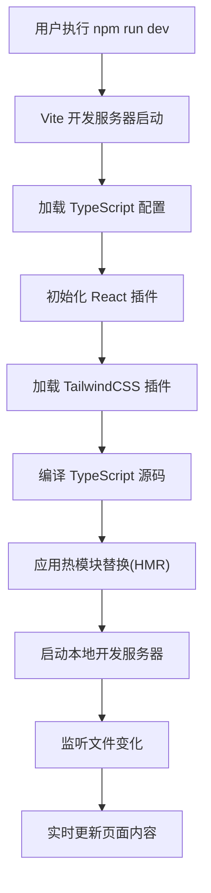
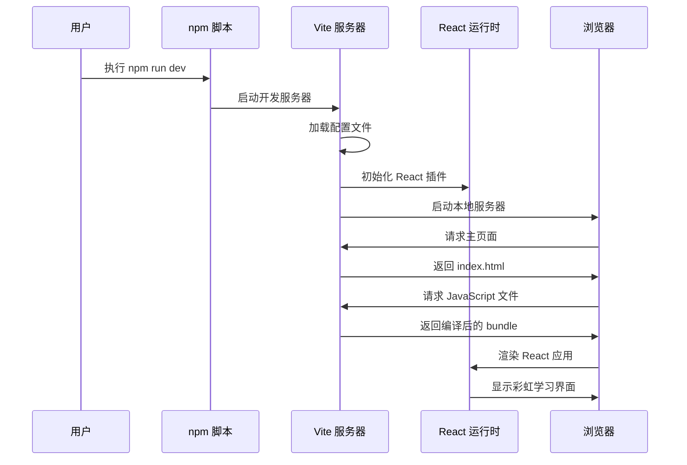
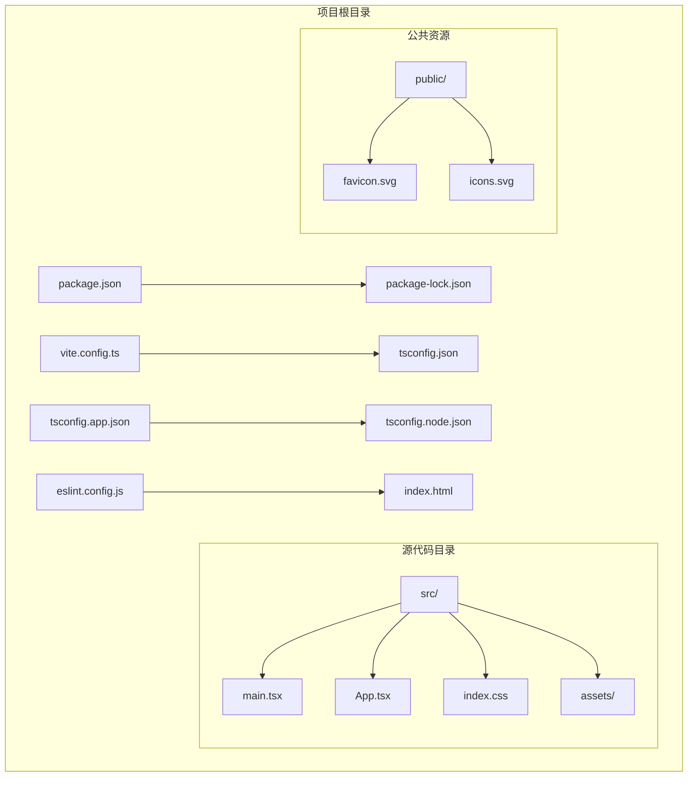

# 快速开始

<cite>
**本文档引用的文件**
- [package.json](file://package.json)
- [README.md](file://README.md)
- [vite.config.ts](file://vite.config.ts)
- [tsconfig.json](file://tsconfig.json)
- [tsconfig.app.json](file://tsconfig.app.json)
- [tsconfig.node.json](file://tsconfig.node.json)
- [eslint.config.js](file://eslint.config.js)
- [index.html](file://index.html)
- [src/main.tsx](file://src/main.tsx)
- [src/App.tsx](file://src/App.tsx)
- [src/index.css](file://src/index.css)
</cite>

## 目录
1. [简介](#简介)
2. [环境要求](#环境要求)
3. [安装步骤](#安装步骤)
4. [项目启动流程](#项目启动流程)
5. [开发命令详解](#开发命令详解)
6. [项目结构概览](#项目结构概览)
7. [关键文件功能说明](#关键文件功能说明)
8. [常见问题解决](#常见问题解决)
9. [性能优化建议](#性能优化建议)
10. [故障排除指南](#故障排除指南)

## 简介

Rainbow Learning 是一个基于现代前端技术栈构建的 React 应用项目，采用 TypeScript、Vite 构建工具和 TailwindCSS 样式框架。该项目提供了完整的开发环境配置，包括热模块替换(HMR)、类型检查、代码规范检查等功能，为开发者提供高效的开发体验。

## 环境要求

在开始开发 Rainbow Learning 项目之前，请确保您的系统满足以下最低要求：

### Node.js 版本要求
- **Node.js**: >= 18.x
- **包管理器**: npm 8.x 或 yarn 1.x

### 开发工具要求
- **TypeScript**: ~6.0.2
- **Vite**: ^8.0.12
- **React**: ^19.2.6
- **TailwindCSS**: ^4.3.1

### 系统要求
- **操作系统**: Windows、macOS 或 Linux
- **内存**: 建议至少 4GB RAM
- **磁盘空间**: 至少 500MB 可用空间

**章节来源**
- [package.json:12-34](file://package.json#L12-L34)
- [tsconfig.app.json:1-26](file://tsconfig.app.json#L1-L26)

## 安装步骤

### 步骤 1：克隆项目
```bash
git clone <repository-url>
cd rainbow-learning
```

### 步骤 2：安装依赖
```bash
npm install
```

### 步骤 3：验证安装
```bash
npm run dev
```

如果一切正常，您应该能看到类似以下的输出：
```
VITE v8.0.12  ready in 120 ms

  ➜  Local:   http://localhost:5173
  ➜  Network: use --host to expose
  ➜  press h + enter to show help
```

### 步骤 4：访问应用
打开浏览器访问 `http://localhost:5173` 查看应用。

**章节来源**
- [package.json:6-11](file://package.json#L6-L11)

## 项目启动流程

### 启动过程概述

Rainbow Learning 的启动流程遵循标准的现代前端开发工作流：



**图表来源**
- [vite.config.ts:1-12](file://vite.config.ts#L1-L12)
- [src/main.tsx:1-11](file://src/main.tsx#L1-L11)

### 启动时序图



**图表来源**
- [package.json:7](file://package.json#L7)
- [index.html:1-14](file://index.html#L1-L14)
- [src/main.tsx:6-10](file://src/main.tsx#L6-L10)

**章节来源**
- [vite.config.ts:6-11](file://vite.config.ts#L6-L11)
- [src/main.tsx:1-11](file://src/main.tsx#L1-L11)

## 开发命令详解

### 开发服务器命令

#### npm run dev
- **作用**: 启动 Vite 开发服务器
- **功能**: 
  - 启动本地开发服务器 (默认端口: 5173)
  - 实时编译 TypeScript 和 JSX
  - 支持热模块替换(HMR)
  - 自动刷新浏览器
- **使用场景**: 日常开发调试
- **命令路径**: [package.json:7](file://package.json#L7)

#### npm run preview
- **作用**: 预览生产构建
- **功能**:
  - 启动静态文件服务器
  - 服务生产构建产物
  - 模拟真实部署环境
- **使用场景**: 构建后测试应用
- **命令路径**: [package.json:10](file://package.json#L10)

### 构建命令

#### npm run build
- **作用**: 生成生产环境构建
- **功能**:
  - 先执行 TypeScript 编译
  - 再执行 Vite 生产构建
  - 生成优化的静态资源
- **输出目录**: `dist/`
- **使用场景**: 部署前准备
- **命令路径**: [package.json:8](file://package.json#L8)

### 代码质量命令

#### npm run lint
- **作用**: 运行 ESLint 代码检查
- **功能**:
  - 检查 TypeScript/JavaScript 代码
  - 应用 React Hooks 规则
  - 检查 React Refresh 规则
- **使用场景**: 代码质量保证
- **命令路径**: [package.json:9](file://package.json#L9)

**章节来源**
- [package.json:6-11](file://package.json#L6-L11)
- [eslint.config.js:1-23](file://eslint.config.js#L1-L23)

## 项目结构概览

Rainbow Learning 采用现代化的前端项目结构，主要分为以下几个核心目录：



**图表来源**
- [package.json:1-36](file://package.json#L1-L36)
- [tsconfig.json:1-8](file://tsconfig.json#L1-L8)

### 目录结构说明

- **src/**: 源代码目录，包含所有 TypeScript 和 React 组件
- **public/**: 静态资源目录，包含图标等公共资源
- **配置文件**: 包含构建、类型检查和代码规范配置

**章节来源**
- [index.html:1-14](file://index.html#L1-L14)
- [tsconfig.json:1-8](file://tsconfig.json#L1-L8)

## 关键文件功能说明

### 核心入口文件

#### src/main.tsx
- **功能**: 应用程序入口点
- **职责**:
  - 创建 React 根节点
  - 渲染 App 组件
  - 启用严格模式
- **关键特性**: 使用 React 18 的新并发特性

#### src/App.tsx
- **功能**: 主应用组件
- **职责**:
  - 提供用户界面
  - 处理用户交互
  - 展示学习资源
- **特性**: 包含计数器功能和导航链接

#### index.html
- **功能**: HTML 模板文件
- **职责**:
  - 定义基础 HTML 结构
  - 引入根容器元素
  - 设置页面元数据

### 构建配置文件

#### vite.config.ts
- **功能**: Vite 构建工具配置
- **插件集成**:
  - React 插件 (支持 JSX 和 HMR)
  - TailwindCSS 插件 (样式处理)
- **开发服务器设置**: 端口、代理等

#### tsconfig.json
- **功能**: TypeScript 编译配置聚合
- **配置组合**: 引用应用和 Node.js 配置

#### tsconfig.app.json
- **功能**: 应用层 TypeScript 配置
- **目标环境**: 浏览器环境
- **编译选项**: ES2023 目标、React JSX 支持

#### tsconfig.node.json
- **功能**: Node.js 层 TypeScript 配置
- **目标环境**: 构建工具环境
- **编译选项**: Node.js 类型支持

### 代码质量配置

#### eslint.config.js
- **功能**: ESLint 代码规范配置
- **规则集**:
  - JavaScript 推荐规则
  - TypeScript 推荐规则
  - React Hooks 规则
  - React Refresh 规则
- **语言选项**: 浏览器环境全局变量

**章节来源**
- [src/main.tsx:1-11](file://src/main.tsx#L1-L11)
- [src/App.tsx:1-123](file://src/App.tsx#L1-L123)
- [vite.config.ts:1-12](file://vite.config.ts#L1-L12)
- [tsconfig.app.json:1-26](file://tsconfig.app.json#L1-L26)
- [eslint.config.js:1-23](file://eslint.config.js#L1-L23)

## 常见问题解决

### 环境问题

#### Node.js 版本不兼容
**问题**: `Error: Your project requires a newer version of Node.js`
**解决方案**:
1. 升级 Node.js 到 18.x 或更高版本
2. 清理缓存: `npm cache clean --force`
3. 删除 node_modules 和 package-lock.json
4. 重新安装依赖: `npm install`

#### 端口被占用
**问题**: `Error: EADDRINUSE: address already in use`
**解决方案**:
1. 修改 Vite 配置中的端口号
2. 关闭占用端口的其他进程
3. 使用 `lsof -i :5173` 查找占用进程

### 依赖安装问题

#### 依赖冲突
**问题**: `peer dep missing`
**解决方案**:
1. 检查 package.json 中的版本兼容性
2. 使用 `npm ls` 查看依赖树
3. 清理并重新安装: `rm -rf node_modules && npm install`

#### 权限问题
**问题**: `Permission denied`
**解决方案**:
1. 使用 `sudo` 命令 (不推荐)
2. 更改 npm 全局目录权限
3. 使用 nvm 管理 Node.js 版本

### 开发服务器问题

#### 热更新失效
**问题**: 修改代码后页面不自动刷新
**解决方案**:
1. 检查网络连接
2. 重启开发服务器
3. 清理浏览器缓存
4. 检查防火墙设置

#### 构建失败
**问题**: `Module not found` 或编译错误
**解决方案**:
1. 检查文件路径是否正确
2. 确认导入语句语法
3. 验证 TypeScript 类型定义
4. 运行 `npm run lint` 检查代码规范

**章节来源**
- [package.json:6-11](file://package.json#L6-L11)
- [vite.config.ts:6-11](file://vite.config.ts#L6-L11)

## 性能优化建议

### 开发阶段优化

#### 启动速度优化
- 使用 Vite 的预构建功能
- 减少不必要的依赖
- 启用懒加载和代码分割

#### 内存使用优化
- 定期清理未使用的依赖
- 监控内存使用情况
- 使用生产模式进行性能测试

### 生产构建优化

#### 代码压缩
- 启用 Tree Shaking
- 移除未使用的代码
- 压缩静态资源

#### 缓存策略
- 配置长期缓存
- 使用内容哈希
- 优化 CDN 设置

### 开发工具优化

#### IDE 配置
- 启用 TypeScript 检查
- 配置 ESLint 自动修复
- 使用格式化工具

#### 浏览器调试
- 启用 React DevTools
- 使用性能面板分析
- 监控网络请求

## 故障排除指南

### 基础诊断步骤

#### 第一步：检查环境
```bash
node --version
npm --version
which node
which npm
```

#### 第二步：验证项目状态
```bash
npm run lint
npm run build
npm run preview
```

#### 第三步：查看错误详情
```bash
# 查看详细错误信息
npm run dev -- --debug

# 检查依赖完整性
npm audit
npm outdated
```

### 常见错误模式

#### 类型检查错误
**症状**: 编译时报错，提示类型不匹配
**解决方法**:
1. 检查 TypeScript 配置
2. 更新类型定义
3. 使用类型断言 (谨慎使用)

#### 模块解析错误
**症状**: `Cannot resolve module`
**解决方法**:
1. 检查文件路径
2. 验证模块导出
3. 检查 tsconfig 配置

#### 样式加载问题
**症状**: 页面样式缺失或显示异常
**解决方法**:
1. 检查 TailwindCSS 配置
2. 验证 CSS 导入
3. 检查构建输出

### 调试技巧

#### 开发者工具使用
- Chrome DevTools 网络面板
- React DevTools 组件面板
- Performance 面板分析性能

#### 日志记录
```javascript
// 添加调试日志
console.log('Debug:', variable);

// 使用条件调试
if (process.env.NODE_ENV === 'development') {
  console.log('Development debug info');
}
```

#### 错误边界
```typescript
// 在 React 中实现错误边界
class ErrorBoundary extends React.Component {
  constructor(props) {
    super(props);
    this.state = { hasError: false };
  }

  static getDerivedStateFromError(error) {
    return { hasError: true };
  }

  render() {
    if (this.state.hasError) {
      return <h1>Something went wrong.</h1>;
    }
    return this.props.children;
  }
}
```

### 社区支持

#### 获取帮助的渠道
- GitHub Issues: 报告 bug 和功能请求
- Stack Overflow: 技术问题讨论
- 官方文档: 最权威的参考资料

#### 贡献指南
1. Fork 项目仓库
2. 创建功能分支
3. 提交代码变更
4. 发起 Pull Request

通过遵循这个快速开始指南，您应该能够成功搭建和运行 Rainbow Learning 项目。遇到任何问题时，请参考故障排除指南或寻求社区支持。记住，现代前端开发是一个持续学习的过程，享受这个过程并不断改进您的技能！