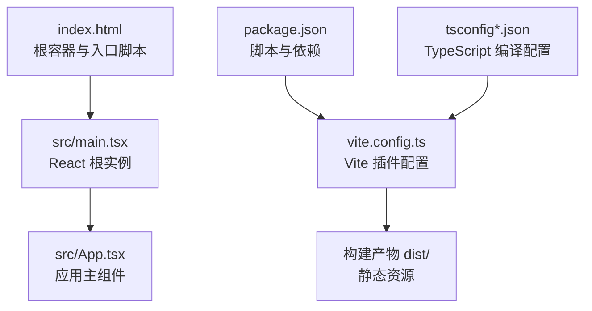
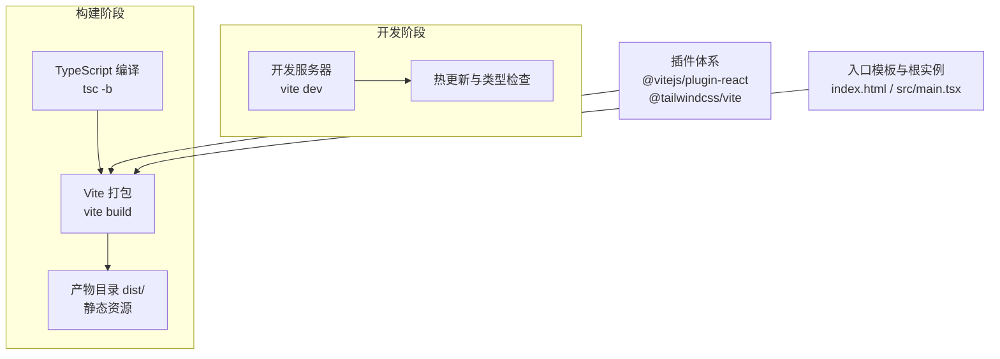
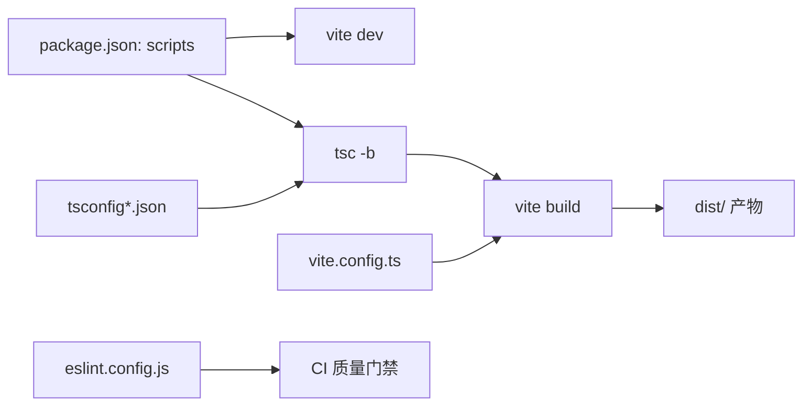

# 构建与部署

<cite>
**本文引用的文件**
- [vite.config.ts](file://vite.config.ts)
- [package.json](file://package.json)
- [index.html](file://index.html)
- [src/main.tsx](file://src/main.tsx)
- [tsconfig.json](file://tsconfig.json)
- [tsconfig.app.json](file://tsconfig.app.json)
- [tsconfig.node.json](file://tsconfig.node.json)
- [eslint.config.js](file://eslint.config.js)
</cite>

## 目录
1. [简介](#简介)
2. [项目结构](#项目结构)
3. [核心组件](#核心组件)
4. [架构总览](#架构总览)
5. [详细组件分析](#详细组件分析)
6. [依赖关系分析](#依赖关系分析)
7. [性能考虑](#性能考虑)
8. [故障排查指南](#故障排查指南)
9. [结论](#结论)
10. [附录](#附录)

## 简介
本指南面向 DevOps 工程师与运维人员，围绕 Rainbow Learning 项目的构建与部署展开，覆盖以下主题：
- Vite 生产构建流程与发布策略
- 开发构建与生产构建的差异与特点
- 面向静态托管、CDN、服务器的部署步骤与注意事项
- 性能优化建议、缓存策略与版本管理方案
- 构建过程的调试方法与常见问题解决思路

## 项目结构
Rainbow Learning 采用 React + TypeScript + Vite 的前端工程化栈，核心入口为 HTML 模板与 React 根组件挂载点，构建脚本通过 Vite 完成打包输出。

图表来源
- [index.html:1-14](file://index.html#L1-L14)
- [src/main.tsx:1-11](file://src/main.tsx#L1-L11)
- [vite.config.ts:1-12](file://vite.config.ts#L1-L12)
- [package.json:1-36](file://package.json#L1-L36)
- [tsconfig.json:1-8](file://tsconfig.json#L1-L8)
- [tsconfig.app.json:1-26](file://tsconfig.app.json#L1-L26)
- [tsconfig.node.json:1-25](file://tsconfig.node.json#L1-L25)

章节来源
- [index.html:1-14](file://index.html#L1-L14)
- [src/main.tsx:1-11](file://src/main.tsx#L1-L11)
- [vite.config.ts:1-12](file://vite.config.ts#L1-L12)
- [package.json:1-36](file://package.json#L1-L36)
- [tsconfig.json:1-8](file://tsconfig.json#L1-L8)
- [tsconfig.app.json:1-26](file://tsconfig.app.json#L1-L26)
- [tsconfig.node.json:1-25](file://tsconfig.node.json#L1-L25)

## 核心组件
- 构建工具链
  - Vite：提供开发服务器与生产打包能力，当前启用 React 与 TailwindCSS 插件。
  - TypeScript：通过独立编译器与 Vite 协同，分别针对应用与 Node 工具链进行类型检查与模块解析。
- 应用入口
  - HTML 模板定义根容器与基础元信息；React 根实例在 main.tsx 中挂载至 DOM。
- 脚本与依赖
  - package.json 提供 dev/build/preview/lint 等脚本，以及运行时与开发时依赖。

章节来源
- [vite.config.ts:1-12](file://vite.config.ts#L1-L12)
- [package.json:1-36](file://package.json#L1-L36)
- [index.html:1-14](file://index.html#L1-L14)
- [src/main.tsx:1-11](file://src/main.tsx#L1-L11)
- [tsconfig.app.json:1-26](file://tsconfig.app.json#L1-L26)
- [tsconfig.node.json:1-25](file://tsconfig.node.json#L1-L25)

## 架构总览
下图展示从源码到构建产物的关键路径与职责分工：

图表来源
- [package.json:6-11](file://package.json#L6-L11)
- [vite.config.ts:6-11](file://vite.config.ts#L6-L11)
- [index.html:1-14](file://index.html#L1-L14)
- [src/main.tsx:1-11](file://src/main.tsx#L1-L11)

## 详细组件分析

### Vite 构建配置与打包策略
- 插件启用
  - React 插件：支持 JSX/TSX 转换与开发期特性。
  - TailwindCSS 插件：集成样式扫描与按需生成。
- 默认行为
  - 开发模式：基于 Vite 内置的 ES 模块与 HMR。
  - 生产模式：由 Vite 进行代码分割、Tree Shaking 与压缩（具体产物优化取决于默认策略与外部配置）。
- 建议扩展点（面向生产）
  - 明确设置产物输出目录与公共路径，便于 CDN/静态托管部署。
  - 启用产物体积报告与第三方库拆分策略，降低首屏加载时间。
  - 配置资源哈希命名与预加载/预连接清单，提升缓存命中率。

章节来源
- [vite.config.ts:6-11](file://vite.config.ts#L6-L11)

### TypeScript 编译配置
- 应用侧（tsconfig.app.json）
  - 使用 bundler 模式与 verbatimModuleSyntax，确保与 Vite 的模块解析一致。
  - JSX 使用 react-jsx，目标与运行时库适配现代浏览器。
- Node 工具侧（tsconfig.node.json）
  - 针对 Vite 配置文件进行独立编译，避免与应用侧冲突。
- 顶层 tsconfig.json
  - 通过 references 组织子配置，提升大型工程的维护性。

章节来源
- [tsconfig.json:1-8](file://tsconfig.json#L1-L8)
- [tsconfig.app.json:1-26](file://tsconfig.app.json#L1-L26)
- [tsconfig.node.json:1-25](file://tsconfig.node.json#L1-L25)

### ESLint 配置与质量门禁
- 推荐规则集：基础 JS、TypeScript、React Hooks、React Refresh。
- 忽略 dist 目录，避免对构建产物进行重复检查。
- 结合 CI 可作为构建前的质量门禁。

章节来源
- [eslint.config.js:1-23](file://eslint.config.js#L1-L23)
- [package.json:9](file://package.json#L9)

### 入口与运行时
- HTML 模板
  - 定义根容器与基础 meta；通过模块脚本引入应用入口。
- React 根实例
  - 在 main.tsx 中将 App 渲染到 #root，严格模式开启。

章节来源
- [index.html:1-14](file://index.html#L1-L14)
- [src/main.tsx:1-11](file://src/main.tsx#L1-L11)

## 依赖关系分析
- 脚本与工具链
  - dev：启动 Vite 开发服务器。
  - build：先执行 tsc -b 进行类型检查与增量编译，再由 Vite 产出生产包。
  - preview：本地预览生产包。
  - lint：运行 ESLint 规则集。
- 外部依赖
  - React 生态与 TailwindCSS 插件由 Vite 集成。
  - Supabase、Framer Motion、Zustand 等运行时依赖在构建中被打包进产物。

图表来源
- [package.json:6-11](file://package.json#L6-L11)
- [vite.config.ts:6-11](file://vite.config.ts#L6-L11)
- [tsconfig.json:1-8](file://tsconfig.json#L1-L8)
- [eslint.config.js:1-23](file://eslint.config.js#L1-L23)

章节来源
- [package.json:1-36](file://package.json#L1-L36)
- [vite.config.ts:1-12](file://vite.config.ts#L1-L12)
- [tsconfig.json:1-8](file://tsconfig.json#L1-L8)
- [eslint.config.js:1-23](file://eslint.config.js#L1-L23)

## 性能考虑
- 产物优化
  - 代码分割：按路由/组件拆分，结合动态导入减少首屏体积。
  - Tree Shaking：保持无副作用模块与 ESM 导出，配合打包器进行死代码剔除。
  - 压缩与格式：启用最小化与现代语法转换，平衡兼容性与体积。
- 缓存策略
  - 资源指纹：对静态资源启用内容哈希命名，实现强缓存与失效回退。
  - 分层缓存：HTML 弱缓存或协商缓存；JS/CSS 长缓存；图片等媒体资源按场景设定。
  - 预加载/预连接：对关键资源使用 rel="modulepreload/preconnect/dns-prefetch"。
- 版本管理
  - 语义化版本：以主版本号为不兼容变更信号，次/修订用于功能与修复。
  - 发布标签：以 v<version> 形式标记 Git Tag，便于回滚与审计。
  - 构建产物签名：对关键资源进行完整性校验（如 Subresource Integrity）。
- 运行时优化
  - 图片与字体：优先 WebP/WOFF2，按需懒加载与占位骨架。
  - 动画与交互：使用轻量级动画库与节流防抖，避免主线程阻塞。

## 故障排查指南
- 构建失败
  - 类型错误：先执行 tsc -b 定位问题，再进行 Vite 构建。
  - 插件冲突：逐项禁用插件（如 TailwindCSS），确认是否由插件导致的解析异常。
  - 模块解析：检查 tsconfig 的 moduleResolution 与 bundler 模式一致性。
- 预览异常
  - 本地预览与生产构建差异：确认环境变量与路由基路径设置。
- 部署后白屏或资源 404
  - 检查静态托管的回退路由配置，确保 SPA 路由回退到 index.html。
  - 确认公共路径（base）与实际部署路径一致。
- 缓存问题
  - 强制刷新或清理浏览器缓存；核对资源指纹与缓存头。
- 性能劣化
  - 使用打包体积报告定位大依赖；评估拆分策略与懒加载。

## 结论
Rainbow Learning 的构建与部署以 Vite 为核心，结合 TypeScript 与 ESLint 实现高质量交付。通过明确的脚本分工、可扩展的 Vite 配置与合理的缓存/版本策略，可在静态托管、CDN 与传统服务器上稳定上线。建议在生产环境中进一步细化产物优化、缓存与版本管理，并将 ESLint 与构建流程纳入 CI，保障持续交付质量。

## 附录

### 开发构建 vs 生产构建
- 开发构建
  - 特点：快速启动、热更新、源映射、严格模式、更宽松的优化策略。
  - 适用：本地调试、联调、快速迭代。
- 生产构建
  - 特点：代码分割、Tree Shaking、压缩、资源指纹、产物体积最小化。
  - 适用：发布到线上环境，需要最佳性能与缓存效果。

### 部署到不同平台的操作指引

- 静态托管（如 GitHub Pages、Netlify、Vercel）
  - 步骤
    - 选择仓库与分支，配置构建命令与输出目录。
    - 设置 SPA 回退路由至 index.html。
    - 配置自定义域名与 HTTPS。
  - 注意事项
    - 确保构建命令正确（例如先 tsc -b 再 vite build）。
    - 若使用子路径部署，需设置公共路径与路由基路径一致。

- CDN（如阿里云 OSS、AWS CloudFront）
  - 步骤
    - 将 dist/ 上传至对象存储桶，开启静态网站托管或 CDN 加速。
    - 配置缓存头与压缩（Gzip/Brotli）。
    - 设置 CORS 与防盗链策略。
  - 注意事项
    - 对静态资源启用长缓存，HTML 使用短缓存或协商缓存。
    - 使用资源指纹与预加载清单提升性能。

- 服务器（Nginx/Apache）
  - 步骤
    - 将 dist/ 放置于站点根目录或虚拟主机目录。
    - 配置回退路由至 index.html，保证 SPA 正常工作。
    - 设置缓存头、Gzip/Brotli 与安全头。
  - 注意事项
    - 确保 index.html 与静态资源路径正确。
    - 如启用 HTTPS，注意 HSTS 与混合内容处理。

### 构建调试方法
- 本地验证
  - 使用 vite preview 在本地模拟生产环境。
  - 检查控制台与网络面板，定位资源加载与渲染问题。
- 日志与报告
  - 通过 Vite 输出日志与打包体积报告，识别大依赖与重复模块。
- CI 集成
  - 在流水线中顺序执行：安装依赖 → 类型检查 → ESLint → 构建 → 预览 → 部署。