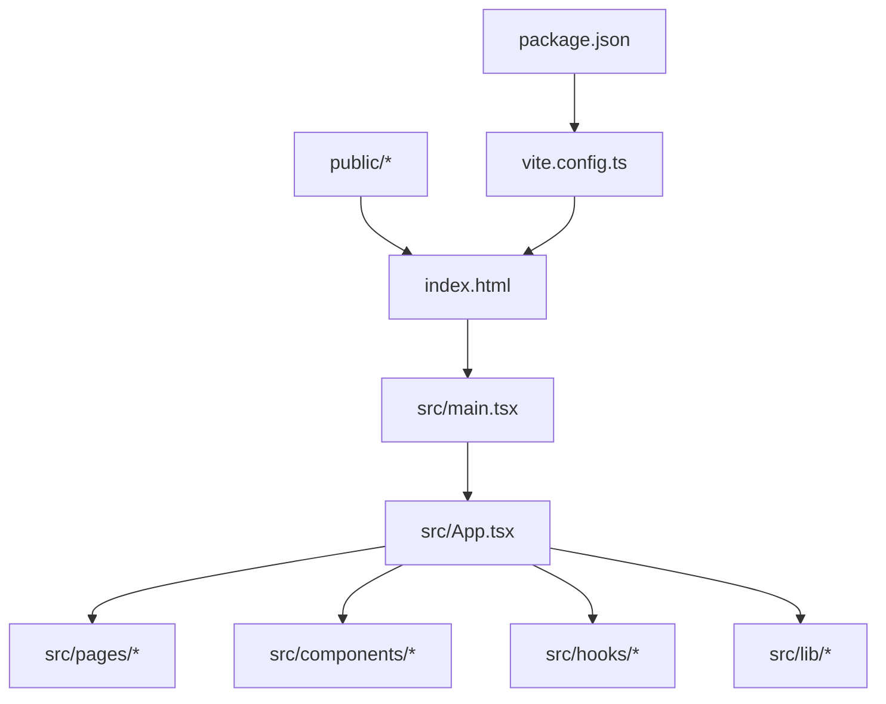
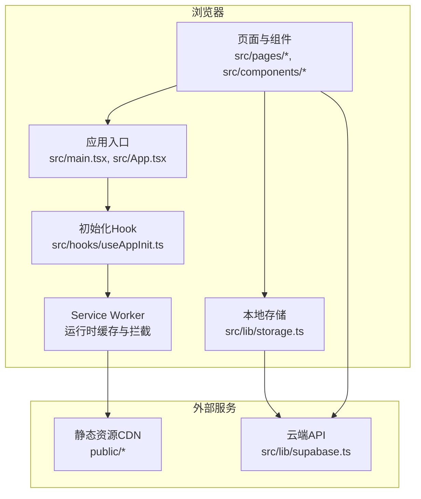
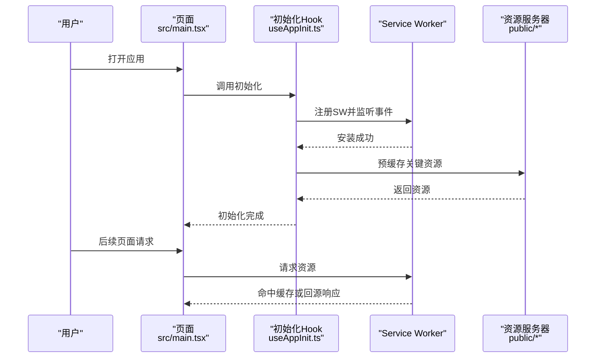
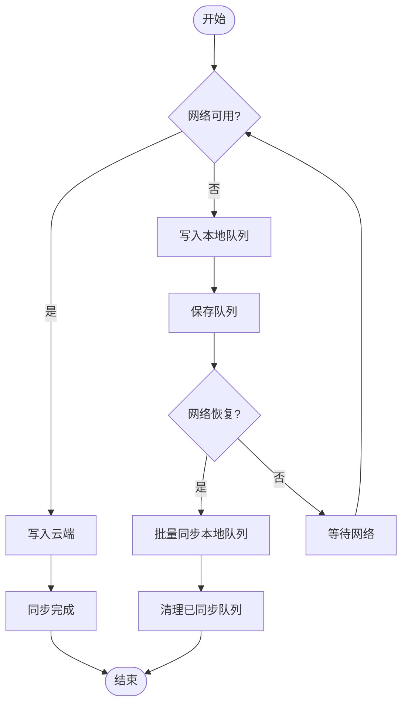
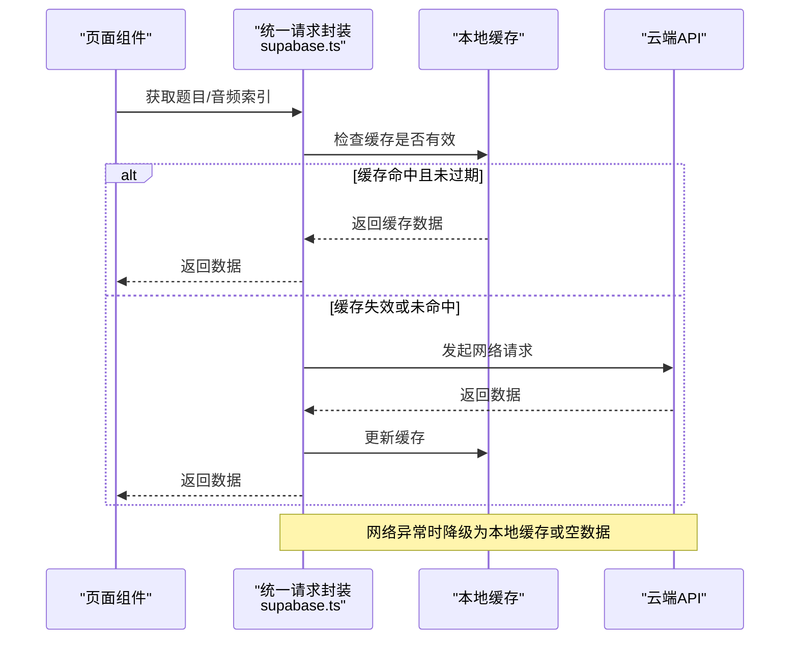
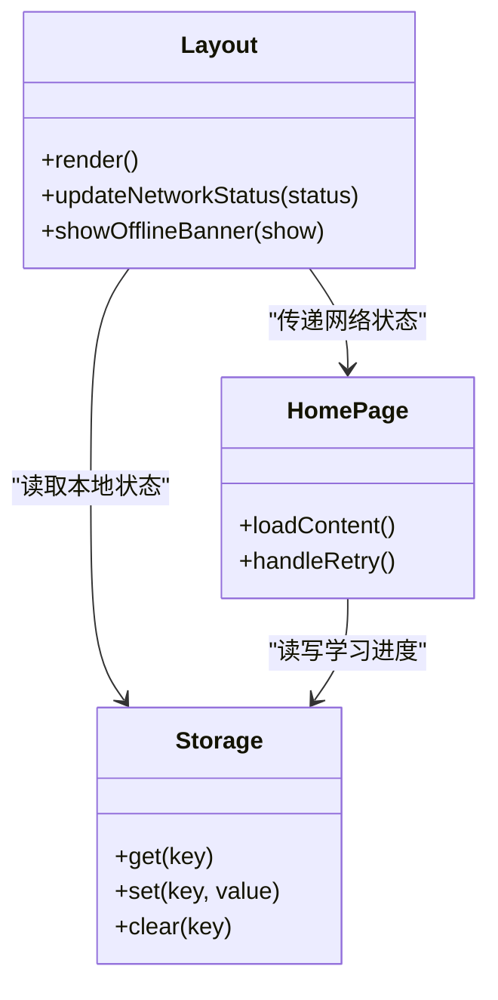
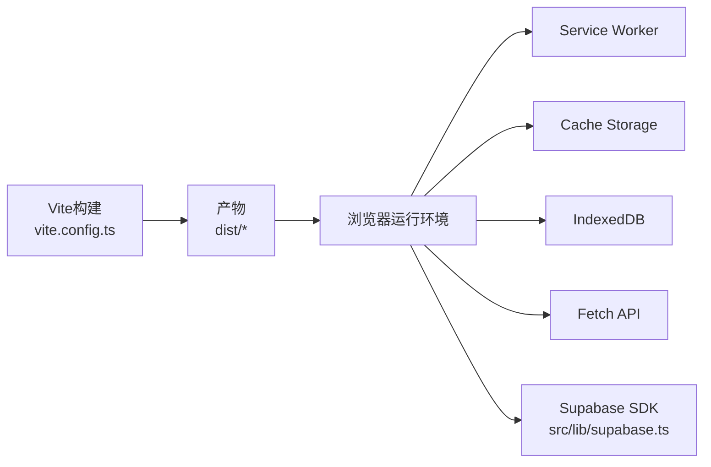

# PWA离线支持

<cite>
**本文档引用的文件**   
- [index.html](file://index.html)
- [package.json](file://package.json)
- [vite.config.ts](file://vite.config.ts)
- [src/main.tsx](file://src/main.tsx)
- [src/App.tsx](file://src/App.tsx)
- [src/hooks/useAppInit.ts](file://src/hooks/useAppInit.ts)
- [src/lib/storage.ts](file://src/lib/storage.ts)
- [src/lib/supabase.ts](file://src/lib/supabase.ts)
- [src/pages/HomePage.tsx](file://src/pages/HomePage.tsx)
- [src/components/Layout.tsx](file://src/components/Layout.tsx)
- [public/fonts/fonts.css](file://public/fonts/fonts.css)
</cite>

## 目录
1. [简介](#简介)
2. [项目结构](#项目结构)
3. [核心组件](#核心组件)
4. [架构总览](#架构总览)
5. [详细组件分析](#详细组件分析)
6. [依赖分析](#依赖分析)
7. [性能考虑](#性能考虑)
8. [故障排查指南](#故障排查指南)
9. [结论](#结论)
10. [附录](#附录)

## 简介
本文件面向“PWA离线支持”目标，结合仓库结构与现有实现，梳理如何在不引入额外框架的前提下，通过Vite生态与浏览器原生能力为应用提供离线可用、资源缓存与状态持久化等关键能力。文档从系统架构、数据流、处理逻辑、集成点与错误处理等维度展开，并给出可视化图示与可操作的优化建议，帮助读者快速理解与落地。

## 项目结构
本项目采用典型的现代前端工程结构：
- 入口与构建配置位于根目录（index.html、vite.config.ts、package.json）
- 业务页面与组件集中在 src/ 下，按功能域划分（pages、components、hooks、lib、store、data）
- 静态资源（音频、字体等）放在 public/ 下，便于构建期直接复制与CDN分发
- 工具脚本在 scripts/ 下，用于生成题目、音频与素材

图表来源
- [index.html:1-200](file://index.html#L1-L200)
- [vite.config.ts:1-200](file://vite.config.ts#L1-L200)
- [package.json:1-200](file://package.json#L1-L200)

章节来源
- [index.html:1-200](file://index.html#L1-L200)
- [package.json:1-200](file://package.json#L1-L200)
- [vite.config.ts:1-200](file://vite.config.ts#L1-L200)

## 核心组件
围绕PWA离线能力，以下模块最为关键：
- 应用初始化与生命周期管理：负责注册Service Worker、监听网络状态、加载必要资源
- 存储与数据层：本地持久化（IndexedDB/LocalStorage）、在线数据同步策略
- 资源与缓存：静态资源预缓存、按需缓存、版本控制与更新机制
- 页面与组件：根据网络状态切换UI提示、降级展示与交互流程

章节来源
- [src/main.tsx:1-200](file://src/main.tsx#L1-L200)
- [src/App.tsx:1-200](file://src/App.tsx#L1-L200)
- [src/hooks/useAppInit.ts:1-200](file://src/hooks/useAppInit.ts#L1-L200)
- [src/lib/storage.ts:1-200](file://src/lib/storage.ts#L1-L200)
- [src/lib/supabase.ts:1-200](file://src/lib/supabase.ts#L1-L200)

## 架构总览
下图展示了PWA离线支持的总体架构与关键交互路径：应用启动时初始化Service Worker与缓存策略；页面请求资源时由Service Worker拦截并按策略命中缓存或回源；网络变化时触发UI与数据层的降级与恢复；用户操作产生的数据优先落盘，待网络恢复后同步至云端。

图表来源
- [src/main.tsx:1-200](file://src/main.tsx#L1-L200)
- [src/App.tsx:1-200](file://src/App.tsx#L1-L200)
- [src/hooks/useAppInit.ts:1-200](file://src/hooks/useAppInit.ts#L1-L200)
- [src/lib/storage.ts:1-200](file://src/lib/storage.ts#L1-L200)
- [src/lib/supabase.ts:1-200](file://src/lib/supabase.ts#L1-L200)

## 详细组件分析

### 应用初始化与Service Worker集成
- 职责：注册SW、监听网络状态、预缓存关键资源、处理版本更新
- 关键点：
  - 在应用启动阶段完成SW注册与事件监听
  - 首次访问时预缓存HTML、CSS、JS与常用字体/图标
  - 监听install/activate/fetch事件，定义缓存策略（如先缓存后回源、缓存优先等）
  - 检测新版本并提示刷新，保证资源一致性

图表来源
- [src/main.tsx:1-200](file://src/main.tsx#L1-L200)
- [src/hooks/useAppInit.ts:1-200](file://src/hooks/useAppInit.ts#L1-L200)

章节来源
- [src/main.tsx:1-200](file://src/main.tsx#L1-L200)
- [src/hooks/useAppInit.ts:1-200](file://src/hooks/useAppInit.ts#L1-L200)

### 本地存储与数据持久化
- 职责：将用户进度、错题集、学习记录等数据持久化到本地，保障离线可用
- 关键点：
  - 选择合适的数据存储方案（IndexedDB适合大对象与结构化数据，LocalStorage适合轻量键值对）
  - 设计读写接口，封装增删改查与事务处理
  - 在网络不可用时写入本地队列，网络恢复后批量同步
  - 数据版本迁移与兼容性处理

图表来源
- [src/lib/storage.ts:1-200](file://src/lib/storage.ts#L1-L200)

章节来源
- [src/lib/storage.ts:1-200](file://src/lib/storage.ts#L1-L200)

### 云端数据同步与离线降级
- 职责：在线时拉取最新题目、故事、音频索引等资源；离线时回退到本地缓存
- 关键点：
  - 使用统一的请求封装，自动处理重试与超时
  - 区分强一致与最终一致场景，合理设置缓存TTL
  - 失败时展示友好提示并提供重试入口
  - 增量更新与差异缓存，减少带宽占用

图表来源
- [src/lib/supabase.ts:1-200](file://src/lib/supabase.ts#L1-L200)

章节来源
- [src/lib/supabase.ts:1-200](file://src/lib/supabase.ts#L1-L200)

### 页面与组件的离线体验
- 职责：根据网络状态切换UI提示、禁用需在线的功能、展示缓存内容
- 关键点：
  - 全局监听网络变化，实时更新状态栏与提示
  - 对需要在线的功能提供“离线模式”降级（如仅展示已缓存内容）
  - 错误边界与重试按钮，提升用户体验

图表来源
- [src/components/Layout.tsx:1-200](file://src/components/Layout.tsx#L1-L200)
- [src/pages/HomePage.tsx:1-200](file://src/pages/HomePage.tsx#L1-L200)
- [src/lib/storage.ts:1-200](file://src/lib/storage.ts#L1-L200)

章节来源
- [src/components/Layout.tsx:1-200](file://src/components/Layout.tsx#L1-L200)
- [src/pages/HomePage.tsx:1-200](file://src/pages/HomePage.tsx#L1-L200)
- [src/lib/storage.ts:1-200](file://src/lib/storage.ts#L1-L200)

### 资源与字体缓存
- 职责：确保字体、图片、音频等静态资源在离线时可快速加载
- 关键点：
  - 将常用字体放入public/fonts并声明缓存策略
  - 使用HTTP缓存头与版本号控制资源更新
  - 按需懒加载非关键资源，减少首屏体积

章节来源
- [public/fonts/fonts.css:1-200](file://public/fonts/fonts.css#L1-L200)

## 依赖分析
- 构建与打包：Vite作为构建工具，配合插件生态简化PWA相关配置
- 运行时依赖：浏览器原生API（Service Worker、Fetch、Cache Storage、IndexedDB）
- 第三方库：Supabase用于云端数据同步与认证（可选）

图表来源
- [vite.config.ts:1-200](file://vite.config.ts#L1-L200)
- [package.json:1-200](file://package.json#L1-L200)
- [src/lib/supabase.ts:1-200](file://src/lib/supabase.ts#L1-L200)

章节来源
- [vite.config.ts:1-200](file://vite.config.ts#L1-L200)
- [package.json:1-200](file://package.json#L1-L200)
- [src/lib/supabase.ts:1-200](file://src/lib/supabase.ts#L1-L200)

## 性能考虑
- 首屏优化：预缓存HTML/CSS/JS与关键字体，减少二次加载耗时
- 资源分级：区分关键与非关键资源，按需懒加载与延迟下载
- 缓存策略：针对不同资源类型采用不同策略（如图片长期缓存、JSON短TTL）
- 增量更新：利用版本号与差异包，降低更新流量与时间
- 内存与存储：定期清理过期缓存，避免占用过多磁盘空间

[本节为通用指导，不直接分析具体文件]

## 故障排查指南
- Service Worker未生效：检查注册时机与权限、浏览器控制台日志、缓存命名冲突
- 缓存未更新：确认版本号与缓存键变更、强制刷新与清除缓存流程
- 网络异常：查看请求封装的重试与超时配置、降级逻辑是否正确
- 数据不一致：核对本地队列与云端同步顺序、冲突解决策略
- 字体加载失败：检查字体文件路径与MIME类型、跨域与缓存头设置

章节来源
- [src/hooks/useAppInit.ts:1-200](file://src/hooks/useAppInit.ts#L1-L200)
- [src/lib/storage.ts:1-200](file://src/lib/storage.ts#L1-L200)
- [src/lib/supabase.ts:1-200](file://src/lib/supabase.ts#L1-L200)

## 结论
通过合理的分层设计与缓存策略，本项目能够在无网环境下提供稳定的基础功能与良好的用户体验。关键在于：
- 明确资源分级与缓存策略
- 完善本地持久化与同步机制
- 强化错误处理与降级体验
- 持续监控与优化性能指标

[本节为总结性内容，不直接分析具体文件]

## 附录
- 术语表：Service Worker、Cache Storage、IndexedDB、TTL、增量更新
- 最佳实践清单：
  - 首次访问即预缓存关键资源
  - 所有网络请求具备超时与重试
  - 本地数据具备版本迁移能力
  - 提供明确的离线提示与重试入口
  - 定期清理过期缓存与队列

[本节为补充信息，不直接分析具体文件]