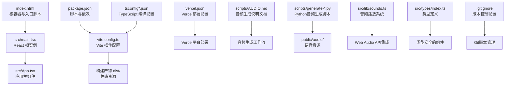
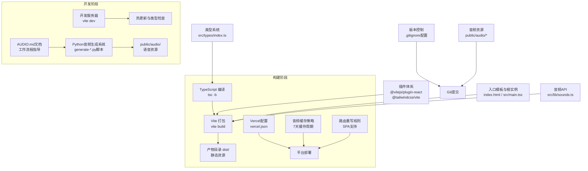
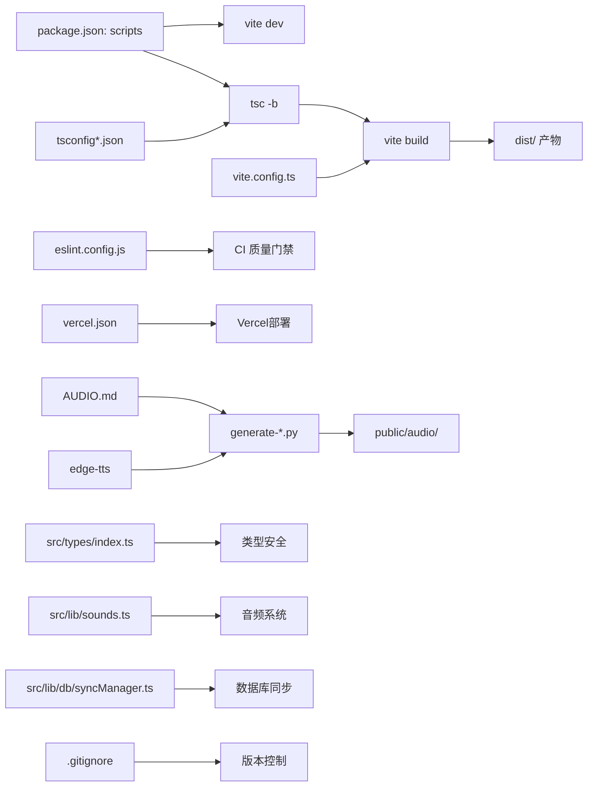

# 构建与部署

<cite>
**本文引用的文件**
- [vercel.json](file://vercel.json)
- [AUDIO.md](file://scripts/AUDIO.md)
- [generate-audio.py](file://scripts/generate-audio.py)
- [generate-char-audio.py](file://scripts/generate-char-audio.py)
- [generate-english-audio.py](file://scripts/generate-english-audio.py)
- [index.ts](file://src/types/index.ts)
- [vite.config.ts](file://vite.config.ts)
- [package.json](file://package.json)
- [index.html](file://index.html)
- [src/main.tsx](file://src/main.tsx)
- [tsconfig.json](file://tsconfig.json)
- [tsconfig.app.json](file://tsconfig.app.json)
- [tsconfig.node.json](file://tsconfig.node.json)
- [eslint.config.js](file://eslint.config.js)
- [src/lib/sounds.ts](file://src/lib/sounds.ts)
- [src/lib/storage.ts](file://src/lib/storage.ts)
- [src/store/useUserStore.ts](file://src/store/useUserStore.ts)
- [src/lib/db/syncManager.ts](file://src/lib/db/syncManager.ts)
- [src/lib/supabase.ts](file://src/lib/supabase.ts)
- [src/hooks/useAppInit.ts](file://src/hooks/useAppInit.ts)
- [.gitignore](file://.gitignore)
</cite>

## 更新摘要
**变更内容**
- 新增完整的音频生成系统工作流程文档，包含三种音频生成脚本的详细使用说明
- 添加静态资源部署要求，明确音频文件的提交和缓存策略
- 完善版本控制注意事项，确保音频资源正确纳入Git版本管理
- 增强Vercel部署配置，优化音频资源的缓存和路由处理
- 扩展Python音频生成脚本，支持中文汉字、英语单词/字母/句子和反馈语音的自动化生成

## 目录
1. [简介](#简介)
2. [项目结构](#项目结构)
3. [核心组件](#核心组件)
4. [架构总览](#架构总览)
5. [详细组件分析](#详细组件分析)
6. [依赖关系分析](#依赖关系分析)
7. [性能考虑](#性能考虑)
8. [故障排查指南](#故障排查指南)
9. [结论](#结论)
10. [附录](#附录)

## 简介
本指南面向 DevOps 工程师与运维人员，围绕 Rainbow Learning 项目的构建与部署展开，覆盖以下主题：
- Vite 生产构建流程与发布策略
- 开发构建与生产构建的差异与特点
- 面向静态托管、CDN、服务器的部署步骤与注意事项
- 性能优化建议、缓存策略与版本管理方案
- 构建过程的调试方法与常见问题解决思路
- **新增**：完整的音频生成系统工作流程，包括静态资源部署要求和版本控制注意事项
- **新增**：Vercel专用部署配置与Python音频生成自动化

## 项目结构
Rainbow Learning 采用 React + TypeScript + Vite 的前端工程化栈，核心入口为 HTML 模板与 React 根组件挂载点，构建脚本通过 Vite 完成打包输出。项目现已扩展为包含完整音频生成系统、类型系统、数据库同步等功能的现代化前端应用。



**图表来源**
- [index.html:1-14](file://index.html#L1-L14)
- [src/main.tsx:1-11](file://src/main.tsx#L1-L11)
- [vite.config.ts:1-17](file://vite.config.ts#L1-L17)
- [package.json:1-37](file://package.json#L1-L37)
- [tsconfig.json:1-8](file://tsconfig.json#L1-L8)
- [tsconfig.app.json:1-26](file://tsconfig.app.json#L1-L26)
- [tsconfig.node.json:1-25](file://tsconfig.node.json#L1-L25)
- [vercel.json:1-23](file://vercel.json#L1-L23)
- [AUDIO.md:1-32](file://scripts/AUDIO.md#L1-L32)
- [generate-audio.py:1-50](file://scripts/generate-audio.py#L1-L50)
- [generate-char-audio.py:1-77](file://scripts/generate-char-audio.py#L1-L77)
- [generate-english-audio.py:1-114](file://scripts/generate-english-audio.py#L1-L114)
- [sounds.ts:1-165](file://src/lib/sounds.ts#L1-L165)
- [index.ts:1-66](file://src/types/index.ts#L1-L66)
- [.gitignore:1-27](file://.gitignore#L1-L27)

**章节来源**
- [index.html:1-14](file://index.html#L1-L14)
- [src/main.tsx:1-11](file://src/main.tsx#L1-L11)
- [vite.config.ts:1-17](file://vite.config.ts#L1-L17)
- [package.json:1-37](file://package.json#L1-L37)
- [tsconfig.json:1-8](file://tsconfig.json#L1-L8)
- [tsconfig.app.json:1-26](file://tsconfig.app.json#L1-L26)
- [tsconfig.node.json:1-25](file://tsconfig.node.json#L1-L25)
- [vercel.json:1-23](file://vercel.json#L1-L23)
- [AUDIO.md:1-32](file://scripts/AUDIO.md#L1-L32)
- [generate-audio.py:1-50](file://scripts/generate-audio.py#L1-L50)
- [generate-char-audio.py:1-77](file://scripts/generate-char-audio.py#L1-L77)
- [generate-english-audio.py:1-114](file://scripts/generate-english-audio.py#L1-L114)
- [sounds.ts:1-165](file://src/lib/sounds.ts#L1-L165)
- [index.ts:1-66](file://src/types/index.ts#L1-L66)
- [.gitignore:1-27](file://.gitignore#L1-L27)

## 核心组件
- **构建工具链**
  - Vite：提供开发服务器与生产打包能力，当前启用 React 与 TailwindCSS 插件。
  - TypeScript：通过独立编译器与 Vite 协同，分别针对应用与 Node 工具链进行类型检查与模块解析。
- **应用入口**
  - HTML 模板定义根容器与基础元信息；React 根实例在 main.tsx 中挂载至 DOM。
- **脚本与依赖**
  - package.json 提供 dev/build/preview/lint 等脚本，以及运行时与开发时依赖。
- **部署配置**
  - vercel.json 提供 Vercel 平台专用的构建命令、输出目录、路由重写和缓存策略。
- **音频系统**
  - **新增**：完整的Python音频生成系统，支持中文汉字、英语单词/字母/句子和反馈语音的自动化生成。
  - Web Audio API提供音效播放功能，支持预录语音文件和浏览器语音合成兜底。
- **类型系统**
  - 完整的 TypeScript 类型定义，确保应用的类型安全性和开发体验。
- **版本控制**
  - **新增**：完善的.gitignore配置，确保音频资源正确纳入版本管理。

**章节来源**
- [vite.config.ts:1-17](file://vite.config.ts#L1-L17)
- [package.json:1-37](file://package.json#L1-L37)
- [index.html:1-14](file://index.html#L1-L14)
- [src/main.tsx:1-11](file://src/main.tsx#L1-L11)
- [tsconfig.app.json:1-26](file://tsconfig.app.json#L1-L26)
- [tsconfig.node.json:1-25](file://tsconfig.node.json#L1-L25)
- [vercel.json:1-23](file://vercel.json#L1-L23)
- [AUDIO.md:1-32](file://scripts/AUDIO.md#L1-L32)
- [generate-audio.py:1-50](file://scripts/generate-audio.py#L1-L50)
- [generate-char-audio.py:1-77](file://scripts/generate-char-audio.py#L1-L77)
- [generate-english-audio.py:1-114](file://scripts/generate-english-audio.py#L1-L114)
- [sounds.ts:1-165](file://src/lib/sounds.ts#L1-L165)
- [index.ts:1-66](file://src/types/index.ts#L1-L66)
- [.gitignore:1-27](file://.gitignore#L1-L27)

## 架构总览
下图展示从源码到构建产物的关键路径与职责分工，包括完整的音频生成系统和Vercel部署流程：



**图表来源**
- [package.json:6-11](file://package.json#L6-L11)
- [vite.config.ts:6-11](file://vite.config.ts#L6-L11)
- [index.html:1-14](file://index.html#L1-L14)
- [src/main.tsx:1-11](file://src/main.tsx#L1-L11)
- [vercel.json:1-23](file://vercel.json#L1-L23)
- [AUDIO.md:1-32](file://scripts/AUDIO.md#L1-L32)
- [generate-audio.py:1-50](file://scripts/generate-audio.py#L1-L50)
- [generate-char-audio.py:1-77](file://scripts/generate-char-audio.py#L1-L77)
- [generate-english-audio.py:1-114](file://scripts/generate-english-audio.py#L1-L114)
- [index.ts:1-66](file://src/types/index.ts#L1-L66)
- [sounds.ts:1-165](file://src/lib/sounds.ts#L1-L165)
- [.gitignore:1-27](file://.gitignore#L1-L27)

## 详细组件分析

### 音频生成系统完整工作流程
**新增** 项目现已建立完整的音频生成系统，支持多种语言和内容类型的自动化语音生成。

#### 前置环境准备
- **Python环境**：需要Python 3.x环境
- **依赖安装**：`pip install edge-tts`（一次性安装）
- **网络连接**：需要联网访问Microsoft Edge TTS服务

#### 三种音频生成脚本

##### 1. 中文汉字发音生成 (`generate-char-audio.py`)
- **语音特性**：使用zh-CN-XiaoxiaoNeural，语速-15%，音调+0Hz
- **内容范围**：涵盖300个常用汉字（分三个阶段）
- **输出位置**：`public/audio/chars/{character}.mp3`
- **批量处理**：每批20个字符，避免速率限制

##### 2. 英语发音生成 (`generate-english-audio.py`)
- **语音特性**：使用en-US-AnaNeural（儿童语音），语速-10%
- **内容来源**：自动读取`src/data/english-questions.json`
- **分类输出**：
  - 单词：`public/audio/en/words/{word}.mp3`
  - 字母：`public/audio/en/letters/{LETTER}.mp3`
  - 句子：`public/audio/en/sentences/{slug}.mp3`
- **智能识别**：自动区分单词、字母和句子内容

##### 3. 反馈语音生成 (`generate-audio.py`)
- **语音特性**：使用zh-CN-XiaoxiaoNeural，语速-10%，音调+5Hz
- **内容分类**：
  - 正确答案鼓励语：6条不同的中文鼓励语句
  - 错误答案温和鼓励语：3条不同的中文鼓励语句
- **输出位置**：`public/audio/correct/` 和 `public/audio/wrong/`

#### 音频生成规则
1. **增量生成**：脚本会跳过已存在的mp3文件，只生成缺失的内容
2. **重新生成**：修改已有音频需要先删除旧文件再重跑脚本
3. **批量处理**：使用异步并发提高生成效率

**章节来源**
- [AUDIO.md:1-32](file://scripts/AUDIO.md#L1-L32)
- [generate-char-audio.py:1-77](file://scripts/generate-char-audio.py#L1-L77)
- [generate-english-audio.py:1-114](file://scripts/generate-english-audio.py#L1-L114)
- [generate-audio.py:1-50](file://scripts/generate-audio.py#L1-L50)

### 静态资源部署要求
**新增** 音频文件作为静态资源，需要特殊的部署处理和版本管理。

#### 文件组织结构
```
public/audio/
├── chars/           # 中文汉字发音
├── correct/         # 正确答案鼓励语音
├── wrong/           # 错误答案鼓励语音  
└── en/              # 英语发音
    ├── words/       # 英语单词
    ├── letters/     # 英语字母
    └── sentences/   # 英语句子
```

#### 部署平台要求
- **Vercel**：自动识别并上传public目录下的静态资源
- **GitHub Pages**：需确保public/audio目录被包含在构建中
- **CDN服务**：需要配置正确的静态资源路径和缓存策略

#### 版本控制注意事项
- **必须提交**：所有生成的音频文件都需要提交到Git仓库
- **文件大小**：音频文件较大，建议使用Git LFS或定期清理
- **更新策略**：修改音频内容后需要重新生成并提交

**章节来源**
- [AUDIO.md:26-32](file://scripts/AUDIO.md#L26-L32)
- [.gitignore:1-27](file://.gitignore#L1-L27)

### Vercel部署配置与优化策略
- **框架识别**
  - 明确指定 framework: "vite"，让Vercel自动识别并优化Vite应用的部署。
- **路由重写**
  - SPA路由重写规则：`/((?!assets|audio|favicon).*)` → `/index.html`
  - 确保所有非静态资源请求都回退到index.html，支持客户端路由。
  - **特别保护**：audio目录被排除在重写规则之外，确保音频文件直接访问。
- **缓存策略**
  - `/assets/(.*)`: 31536000秒（1年）immutable缓存，适合静态资源指纹化。
  - `/audio/(.*)`: 604800秒（7天）缓存，适合音频文件的合理缓存周期。
- **构建配置**
  - buildCommand: "npm run build"，与package.json脚本保持一致。
  - outputDirectory: "dist"，与Vite默认输出目录匹配。

**章节来源**
- [vercel.json:1-23](file://vercel.json#L1-L23)

### Python音频生成脚本
- **语音服务**
  - 使用Microsoft Edge TTS，语音：zh-CN-XiaoxiaoNeural（温暖自然的年轻女性声音）。
  - 语速调整：-10%，音调调整：+5Hz，更适合儿童使用。
- **内容分类**
  - 正确答案鼓励语：6条不同的中文鼓励语句。
  - 错误答案温和鼓励语：3条不同的中文鼓励语句。
- **自动化流程**
  - 异步生成所有音频文件，自动保存到 public/audio/correct/ 和 public/audio/wrong/ 目录。
  - 生成完成后输出完成提示，便于CI/CD集成。

**章节来源**
- [generate-audio.py:1-50](file://scripts/generate-audio.py#L1-L50)

### TypeScript类型定义系统
- **用户类型**
  - User接口：包含id、name、avatar字段，支持URL或emoji。
- **题目类型**
  - QuestionType：'char_to_pic' | 'pic_to_char'，支持看字选图和看图选字。
  - Subject：'chinese'，当前仅支持中文科目。
  - Question接口：完整的题目结构，包含难度、选项、答案等。
- **业务实体**
  - ErrorRecord：错题记录，包含错误次数、正确次数、掌握级别等。
  - GemRecord：宝石记录，包含数量、来源、日期。
  - DailyProgress：每日进度，包含完成状态和答题统计。
- **会话结果**
  - AnswerResult：答题会话中的单题结果，包含选择索引和正确性。

**章节来源**
- [index.ts:1-66](file://src/types/index.ts#L1-L66)

### Vite构建配置与打包策略
- **插件启用**
  - React 插件：支持 JSX/TSX 转换与开发期特性。
  - TailwindCSS 插件：集成样式扫描与按需生成。
- **路径别名**
  - @: 指向 ./src/ 目录，简化模块导入。
- **默认行为**
  - 开发模式：基于 Vite 内置的 ES 模块与 HMR。
  - 生产模式：由 Vite 进行代码分割、Tree Shaking 与压缩。
- **建议扩展点（面向生产）**
  - 明确设置产物输出目录与公共路径，便于 CDN/静态托管部署。
  - 启用产物体积报告与第三方库拆分策略，降低首屏加载时间。
  - 配置资源哈希命名与预加载/预连接清单，提升缓存命中率。

**章节来源**
- [vite.config.ts:1-17](file://vite.config.ts#L1-L17)

### TypeScript编译配置
- **应用侧（tsconfig.app.json）**
  - 使用 bundler 模式与 verbatimModuleSyntax，确保与 Vite 的模块解析一致。
  - JSX 使用 react-jsx，目标与运行时库适配现代浏览器。
- **Node 工具侧（tsconfig.node.json）**
  - 针对 Vite 配置文件进行独立编译，避免与应用侧冲突。
- **顶层 tsconfig.json**
  - 通过 references 组织子配置，提升大型工程的维护性。

**章节来源**
- [tsconfig.json:1-8](file://tsconfig.json#L1-L8)
- [tsconfig.app.json:1-26](file://tsconfig.app.json#L1-L26)
- [tsconfig.node.json:1-25](file://tsconfig.node.json#L1-L25)

### ESLint配置与质量门禁
- **推荐规则集**：基础 JS、TypeScript、React Hooks、React Refresh。
- **忽略 dist 目录**，避免对构建产物进行重复检查。
- **结合 CI 可作为构建前的质量门禁**。

**章节来源**
- [eslint.config.js:1-23](file://eslint.config.js#L1-L23)
- [package.json:9](file://package.json#L9)

### 入口与运行时
- **HTML模板**
  - 定义根容器与基础 meta；通过模块脚本引入应用入口。
- **React根实例**
  - 在 main.tsx 中将 App 渲染到 #root，严格模式开启。

**章节来源**
- [index.html:1-14](file://index.html#L1-L14)
- [src/main.tsx:1-11](file://src/main.tsx#L1-L11)

### 音频系统集成
- **Web Audio API**
  - 提供答对、答错、获得宝石三种音效，使用正弦波和三角波合成。
  - 支持预录语音文件播放，随机选择不同鼓励语句。
  - **新增**：浏览器语音合成兜底机制，当预录音频缺失时自动使用SpeechSynthesis。
- **资源管理**
  - 音频文件位于 /public/audio/ 目录，支持正确答案和错误答案两类。
  - 自动播放处理，静默处理用户未交互时的自动播放限制。
  - **新增**：英文发音的智能选择逻辑，优先使用预录音频，失败时自动降级。
- **Python生成脚本**
  - 自动化生成语音文件，支持多语言和多种语音风格。
  - **新增**：批量处理和增量生成，提高效率并避免重复工作。

**章节来源**
- [sounds.ts:1-165](file://src/lib/sounds.ts#L1-L165)
- [generate-audio.py:1-50](file://scripts/generate-audio.py#L1-L50)
- [generate-char-audio.py:1-77](file://scripts/generate-char-audio.py#L1-L77)
- [generate-english-audio.py:1-114](file://scripts/generate-english-audio.py#L1-L114)

### 数据库同步机制
- **SyncManager**
  - Session粒度批量同步，答题过程只写localStorage，学习完成后批量同步到DB。
  - 支持并行执行多个同步任务，提高同步效率。
- **数据迁移**
  - 从localStorage迁移到Supabase的幂等操作，支持断网恢复。
  - 支持用户信息、宝石记录、错题本、每日进度的完整迁移。
- **实时同步**
  - 页面隐藏时触发同步，注册visibilitychange监听。
  - 即时同步用户信息变更，确保数据一致性。

**章节来源**
- [syncManager.ts:1-112](file://src/lib/db/syncManager.ts#L1-L112)
- [useAppInit.ts:1-189](file://src/hooks/useAppInit.ts#L1-L189)

## 依赖关系分析
- **脚本与工具链**
  - dev：启动 Vite 开发服务器。
  - build：先执行 tsc -b 进行类型检查与增量编译，再由 Vite 产出生产包。
  - preview：本地预览生产包。
  - lint：运行 ESLint 规则集。
- **外部依赖**
  - React 生态与 TailwindCSS 插件由 Vite 集成。
  - Supabase、Framer Motion、Zustand 等运行时依赖在构建中被打包进产物。
- **部署依赖**
  - Vercel平台特定配置，支持SPA路由和缓存优化。
  - Python音频生成脚本，支持自动化语音资源生成。
- **新增依赖**
  - **edge-tts**：Python库，用于Microsoft Edge TTS语音合成。
  - **asyncio**：Python异步编程库，用于并发音频生成。



**图表来源**
- [package.json:6-11](file://package.json#L6-L11)
- [vite.config.ts:6-11](file://vite.config.ts#L6-L11)
- [tsconfig.json:1-8](file://tsconfig.json#L1-L8)
- [eslint.config.js:1-23](file://eslint.config.js#L1-L23)
- [vercel.json:1-23](file://vercel.json#L1-L23)
- [AUDIO.md:1-32](file://scripts/AUDIO.md#L1-L32)
- [generate-audio.py:1-50](file://scripts/generate-audio.py#L1-L50)
- [generate-char-audio.py:1-77](file://scripts/generate-char-audio.py#L1-L77)
- [generate-english-audio.py:1-114](file://scripts/generate-english-audio.py#L1-L114)
- [index.ts:1-66](file://src/types/index.ts#L1-L66)
- [sounds.ts:1-165](file://src/lib/sounds.ts#L1-L165)
- [syncManager.ts:1-112](file://src/lib/db/syncManager.ts#L1-L112)
- [.gitignore:1-27](file://.gitignore#L1-L27)

**章节来源**
- [package.json:1-37](file://package.json#L1-L37)
- [vite.config.ts:1-17](file://vite.config.ts#L1-L17)
- [tsconfig.json:1-8](file://tsconfig.json#L1-L8)
- [eslint.config.js:1-23](file://eslint.config.js#L1-L23)
- [vercel.json:1-23](file://vercel.json#L1-L23)
- [AUDIO.md:1-32](file://scripts/AUDIO.md#L1-L32)
- [generate-audio.py:1-50](file://scripts/generate-audio.py#L1-L50)
- [generate-char-audio.py:1-77](file://scripts/generate-char-audio.py#L1-L77)
- [generate-english-audio.py:1-114](file://scripts/generate-english-audio.py#L1-L114)
- [index.ts:1-66](file://src/types/index.ts#L1-L66)
- [sounds.ts:1-165](file://src/lib/sounds.ts#L1-L165)
- [syncManager.ts:1-112](file://src/lib/db/syncManager.ts#L1-L112)
- [.gitignore:1-27](file://.gitignore#L1-L27)

## 性能考虑
- **产物优化**
  - 代码分割：按路由/组件拆分，结合动态导入减少首屏体积。
  - Tree Shaking：保持无副作用模块与 ESM 导出，配合打包器进行死代码剔除。
  - 压缩与格式：启用最小化与现代语法转换，平衡兼容性与体积。
- **缓存策略**
  - 资源指纹：对静态资源启用内容哈希命名，实现强缓存与失效回退。
  - 分层缓存：HTML 弱缓存或协商缓存；JS/CSS 长缓存；图片等媒体资源按场景设定。
  - 预加载/预连接：对关键资源使用 rel="modulepreload/preconnect/dns-prefetch"。
- **音频优化**
  - **新增**：音频文件缓存：7天缓存周期，平衡加载速度和内容更新。
  - **新增**：Web Audio优化：音效使用简化的波形生成，减少CPU占用。
  - **新增**：智能降级：当预录音频缺失时自动使用浏览器语音合成。
  - **新增**：批量生成：异步并发处理，提高音频生成效率。
- **版本管理**
  - 语义化版本：以主版本号为不兼容变更信号，次/修订用于功能与修复。
  - 发布标签：以 v<version> 形式标记 Git Tag，便于回滚与审计。
  - 构建产物签名：对关键资源进行完整性校验（如 Subresource Integrity）。
- **运行时优化**
  - 图片与字体：优先 WebP/WOFF2，按需懒加载与占位骨架。
  - 动画与交互：使用轻量级动画库与节流防抖，避免主线程阻塞。
  - 数据同步：批量化同步减少网络请求频率。
  - **新增**：音频资源管理：增量生成避免重复下载，智能缓存策略。

## 故障排查指南
- **构建失败**
  - 类型错误：先执行 tsc -b 定位问题，再进行 Vite 构建。
  - 插件冲突：逐项禁用插件（如 TailwindCSS），确认是否由插件导致的解析异常。
  - 模块解析：检查 tsconfig 的 moduleResolution 与 bundler 模式一致性。
- **预览异常**
  - 本地预览与生产构建差异：确认环境变量与路由基路径设置。
- **部署后白屏或资源404**
  - 检查静态托管的回退路由配置，确保 SPA 路由回退到 index.html。
  - 确认公共路径（base）与实际部署路径一致。
  - **新增**：检查Vercel配置中的路由重写规则是否正确。
  - **新增**：确认音频文件路径与public目录结构一致。
- **缓存问题**
  - 强制刷新或清理浏览器缓存；核对资源指纹与缓存头。
  - **新增**：检查Vercel的缓存策略配置是否符合预期。
  - **新增**：验证音频文件的7天缓存策略是否正确生效。
- **音频问题**
  - 静默播放：用户未交互时自动播放会被浏览器阻止，需等待用户交互。
  - 文件路径：确认音频文件路径与public目录结构一致。
  - **新增**：使用Python脚本重新生成音频文件。
  - **新增**：检查edge-tts依赖是否正确安装。
  - **新增**：验证网络连接是否正常，确保能访问Microsoft Edge TTS服务。
  - **新增**：确认音频文件已正确提交到Git仓库。
- **数据库同步问题**
  - 断网恢复：检查localStorage中的待同步数据。
  - 同步失败：查看控制台错误日志，确认网络连接状态。
- **性能劣化**
  - 使用打包体积报告定位大依赖；评估拆分策略与懒加载。
  - **新增**：检查音频文件大小和缓存策略。
  - **新增**：监控音频生成脚本的执行时间和资源消耗。
- **新增**：音频生成问题
  - Python环境问题：确认Python 3.x环境和edge-tts依赖安装。
  - 网络问题：检查网络连接，确保能访问Microsoft Edge TTS服务。
  - 权限问题：确认有权限写入public/audio目录。
  - 速率限制：注意Edge TTS的调用频率限制，合理使用批量处理。

## 结论
Rainbow Learning 的构建与部署以 Vite 为核心，结合 TypeScript 与 ESLint 实现高质量交付。通过明确的脚本分工、可扩展的 Vite 配置与合理的缓存/版本策略，可在静态托管、CDN 与传统服务器上稳定上线。**新增的完整音频生成系统**提供了强大的语音合成功能，支持中文汉字、英语单词/字母/句子和反馈语音的自动化生成。Vercel部署配置提供了专门的SPA优化和缓存策略，完善的版本控制确保音频资源正确纳入Git管理。建议在生产环境中进一步细化产物优化、缓存与版本管理，并将 ESLint 与构建流程纳入 CI，保障持续交付质量。

## 附录

### 开发构建 vs 生产构建
- **开发构建**
  - 特点：快速启动、热更新、源映射、严格模式、更宽松的优化策略。
  - 适用：本地调试、联调、快速迭代。
- **生产构建**
  - 特点：代码分割、Tree Shaking、压缩、资源指纹、产物体积最小化。
  - 适用：发布到线上环境，需要最佳性能与缓存效果。

### 部署到不同平台的操作指引

#### 静态托管（如 GitHub Pages、Netlify）
- **步骤**
  - 选择仓库与分支，配置构建命令与输出目录。
  - 设置 SPA 回退路由至 index.html。
  - 配置自定义域名与 HTTPS。
- **注意事项**
  - 确保构建命令正确（例如先 tsc -b 再 vite build）。
  - 若使用子路径部署，需设置公共路径与路由基路径一致。
  - **新增**：检查路由重写规则是否支持客户端路由。
  - **新增**：确保public/audio目录被包含在构建中。

#### Vercel部署（推荐）
- **步骤**
  - 连接GitHub仓库，选择分支和项目根目录。
  - Vercel自动检测vercel.json配置。
  - 配置环境变量（VITE_SUPABASE_URL、VITE_SUPABASE_ANON_KEY）。
  - 部署完成后配置自定义域名。
- **优势**
  - 自动SPA路由重写，无需手动配置。
  - 智能缓存策略，针对静态资源和音频文件优化。
  - 一键HTTPS和全球CDN加速。
  - 支持Git工作流和预览部署。
- **注意事项**
  - 确保环境变量正确配置。
  - 检查路由重写规则是否符合应用需求。
  - 验证缓存策略是否满足音频文件的更新需求。
  - **新增**：确认音频文件已正确提交到Git仓库。

#### CDN（如阿里云 OSS、AWS CloudFront）
- **步骤**
  - 将 dist/ 上传至对象存储桶，开启静态网站托管或 CDN 加速。
  - 配置缓存头与压缩（Gzip/Brotli）。
  - 设置 CORS 与防盗链策略。
- **注意事项**
  - 对静态资源启用长缓存，HTML 使用短缓存或协商缓存。
  - 使用资源指纹与预加载清单提升性能。
  - **新增**：配置SPA路由回退到index.html。
  - **新增**：确保audio目录的缓存策略设置为7天。

#### 服务器（Nginx/Apache）
- **步骤**
  - 将 dist/ 放置于站点根目录或虚拟主机目录。
  - 配置回退路由至 index.html，保证 SPA 正常工作。
  - 设置缓存头、Gzip/Brotli 与安全头。
- **注意事项**
  - 确保 index.html 与静态资源路径正确。
  - 如启用 HTTPS，注意 HSTS 与混合内容处理。
  - **新增**：配置SPA路由重写规则。
  - **新增**：为audio目录设置7天缓存策略。

### 构建调试方法
- **本地验证**
  - 使用 vite preview 在本地模拟生产环境。
  - 检查控制台与网络面板，定位资源加载与渲染问题。
- **日志与报告**
  - 通过 Vite 输出日志与打包体积报告，识别大依赖与重复模块。
- **CI集成**
  - 在流水线中顺序执行：安装依赖 → 类型检查 → ESLint → 构建 → 预览 → 部署。
- **音频调试**
  - **新增**：使用Python脚本生成音频文件，验证语音服务正常工作。
  - **新增**：检查音频文件路径和缓存策略。
  - **新增**：测试音频播放功能和降级机制。
  - **新增**：验证浏览器语音合成兜底功能。
- **数据库同步调试**
  - **新增**：检查localStorage中的待同步数据。
  - 验证Supabase连接和权限配置。

### 音频资源管理完整指南
**新增** 详细的音频资源管理和生成流程。

#### 环境准备
```bash
# 安装Python依赖（一次性）
pip install edge-tts

# 验证安装
python3 -c "import edge_tts; print('Edge TTS 安装成功')"
```

#### 音频生成工作流
1. **中文汉字发音**
   ```bash
   python3 scripts/generate-char-audio.py
   ```
   - 自动生成300个汉字的发音
   - 输出到 public/audio/chars/ 目录
   - 支持增量生成，跳过已存在文件

2. **英语发音**
   ```bash
   python3 scripts/generate-english-audio.py
   ```
   - 自动读取英语题库内容
   - 生成单词、字母、句子三类音频
   - 输出到 public/audio/en/ 对应子目录

3. **反馈语音**
   ```bash
   python3 scripts/generate-audio.py
   ```
   - 生成正确答案和错误答案的鼓励语音
   - 输出到 public/audio/correct/ 和 public/audio/wrong/

#### 版本控制最佳实践
```bash
# 生成音频后提交
git add public/audio
git commit -m "chore: 更新音频资源"

# 查看音频文件变化
git status public/audio
```

#### 维护建议
- **定期更新**：根据教学内容更新音频文件
- **大小监控**：定期检查音频文件大小，优化存储空间
- **质量检查**：试听生成的音频，确保语音质量和清晰度
- **备份策略**：重要音频文件建议额外备份

#### 故障排查
- **Python环境问题**：确认Python 3.x和edge-tts依赖
- **网络连接问题**：检查网络，确保能访问Microsoft Edge TTS
- **权限问题**：确认有权限写入public/audio目录
- **速率限制**：注意Edge TTS调用频率，合理使用批量处理
- **文件冲突**：修改音频前先删除旧文件，避免增量生成不生效

### 音频生成脚本详细说明

#### generate-char-audio.py
- **功能**：生成中文汉字发音
- **语音配置**：zh-CN-XiaoxiaoNeural，语速-15%，音调+0Hz
- **内容范围**：300个常用汉字（分三个阶段）
- **批量处理**：每批20个字符，避免速率限制

#### generate-english-audio.py  
- **功能**：生成英语发音（单词、字母、句子）
- **语音配置**：en-US-AnaNeural（儿童语音），语速-10%
- **智能识别**：自动区分单词、字母和句子内容
- **内容来源**：读取 src/data/english-questions.json

#### generate-audio.py
- **功能**：生成反馈语音（正确答案和错误答案鼓励语）
- **语音配置**：zh-CN-XiaoxiaoNeural，语速-10%，音调+5Hz
- **内容分类**：6条正确答案鼓励语，3条错误答案鼓励语
- **异步处理**：并发生成提高效率

### 音频系统集成架构
**新增** 音频系统的整体架构设计。

#### 播放优先级
1. **预录音频**：优先使用生成的MP3文件
2. **浏览器语音合成**：当预录音频缺失时使用SpeechSynthesis
3. **静默处理**：两种方式都失败时静默处理

#### 资源管理
- **文件组织**：按语言和功能分类存储
- **缓存策略**：7天缓存周期，平衡更新和性能
- **降级机制**：智能降级确保用户体验

#### 性能优化
- **批量生成**：异步并发提高生成效率
- **增量更新**：只生成缺失的音频文件
- **智能缓存**：利用浏览器缓存减少重复下载