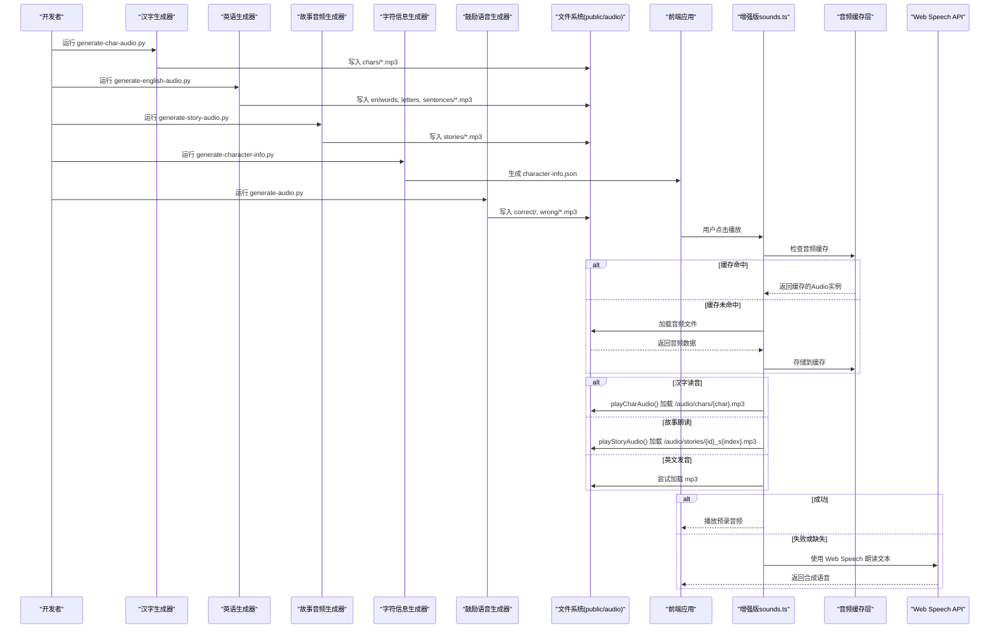
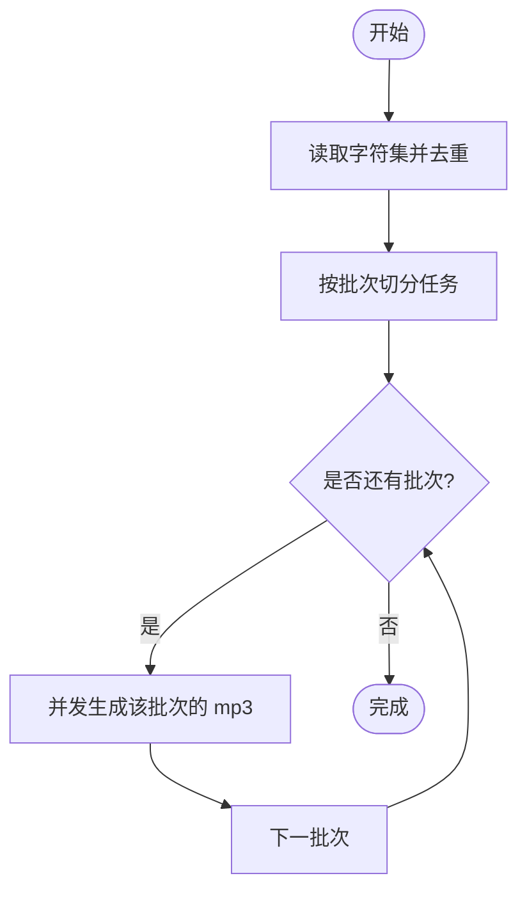
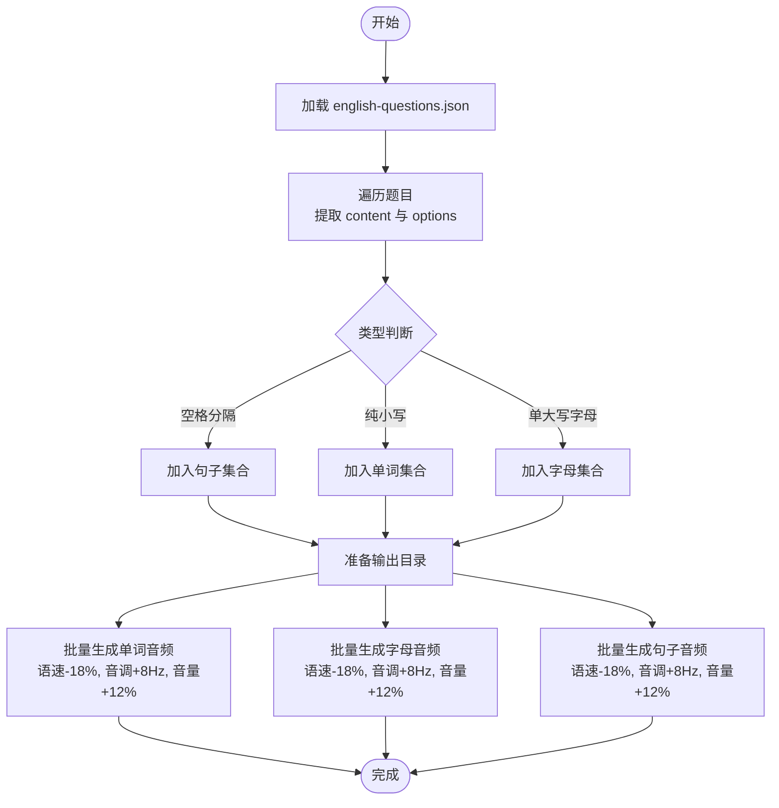
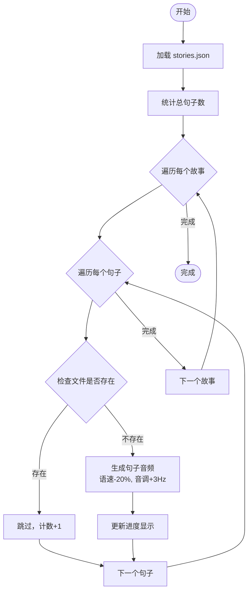
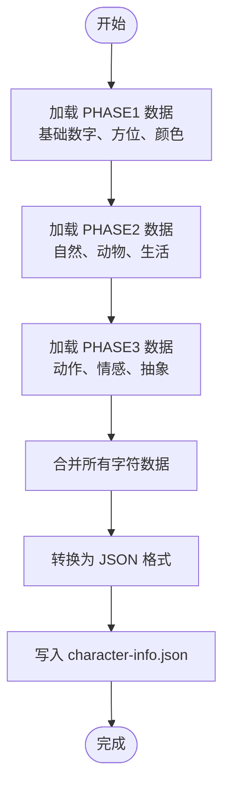
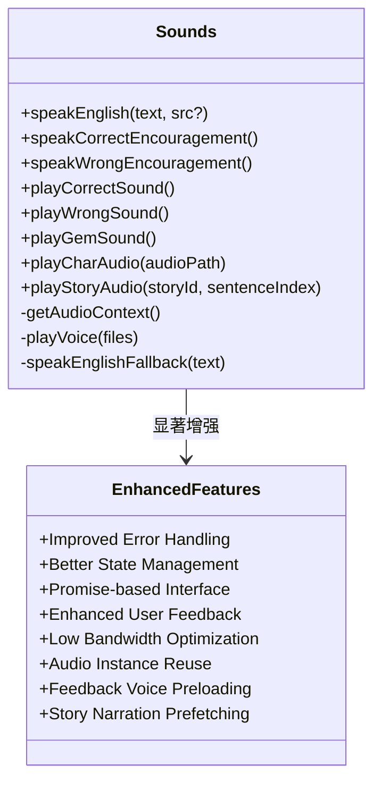
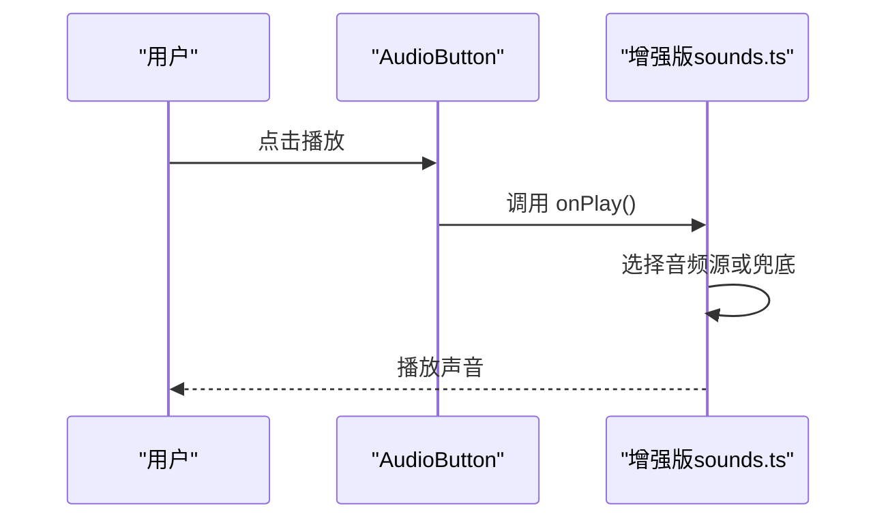
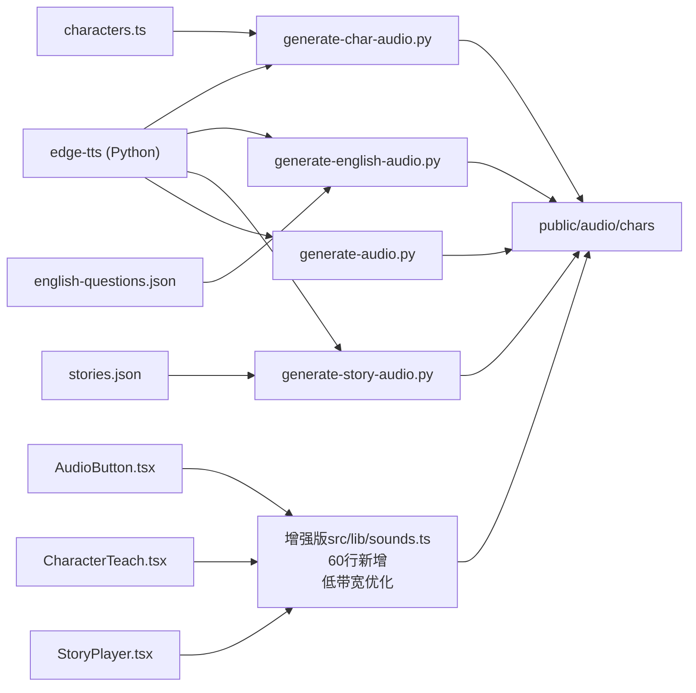

# 音频生成指南

<cite>
**本文引用的文件**   
- [scripts/AUDIO.md](file://scripts/AUDIO.md)
- [scripts/generate-audio.py](file://scripts/generate-audio.py)
- [scripts/generate-char-audio.py](file://scripts/generate-char-audio.py)
- [scripts/generate-english-audio.py](file://scripts/generate-english-audio.py)
- [scripts/generate-story-audio.py](file://scripts/generate-story-audio.py)
- [scripts/generate-character-info.py](file://scripts/generate-character-info.py)
- [src/lib/sounds.ts](file://src/lib/sounds.ts)
- [src/components/english/AudioButton.tsx](file://src/components/english/AudioButton.tsx)
- [src/components/chinese/CharacterTeach.tsx](file://src/components/chinese/CharacterTeach.tsx)
- [src/components/chinese/StoryPlayer.tsx](file://src/components/chinese/StoryPlayer.tsx)
- [src/data/characters.ts](file://src/data/characters.ts)
- [src/data/english-questions.json](file://src/data/english-questions.json)
- [src/data/stories.json](file://src/data/stories.json)
- [src/data/character-info.json](file://src/data/character-info.json)
- [package.json](file://package.json)
</cite>

## 更新摘要
**所做更改**   
- 基于Applied Changes更新：音频系统增强了低带宽场景下的性能，包括Audio实例复用、反馈语音预加载和故事旁白预缓冲
- 显著扩展了sounds.ts音频模块（60行新增），增强了音效播放逻辑和音频管理能力
- 新增了playCharAudio()和playStoryAudio()函数的详细实现说明
- 更新了运行时播放器架构，支持更多学习活动的音频需求
- 完善了中文学习组件的音频播放集成机制
- 增强了音频播放的错误处理和状态管理功能
- 优化了低带宽环境下的音频加载策略和缓存机制

## 目录
1. [简介](#简介)
2. [项目结构](#项目结构)
3. [核心组件](#核心组件)
4. [架构总览](#架构总览)
5. [详细组件分析](#详细组件分析)
6. [依赖关系分析](#依赖关系分析)
7. [性能与体验优化](#性能与体验优化)
8. [故障排查](#故障排查)
9. [结论](#结论)
10. [附录：常用命令与路径](#附录常用命令与路径)

## 简介
本指南面向需要维护或扩展"彩虹学习"应用音频能力的开发者与内容编辑。项目采用"预生成 + 静态资源"的音频策略：使用 Microsoft Edge TTS 将中文、英文发音与鼓励语音提前生成为 mp3，随前端代码部署；运行时优先播放预录音频，缺失时自动回退到浏览器 Web Speech API。

目标读者包括：
- 负责更新题库与词汇内容的编辑
- 需要调整音色、语速、音高的开发者
- 希望了解运行时音频播放与兜底机制的前端工程师

## 项目结构
音频相关的关键目录与文件分布如下：
- scripts：Python 脚本，负责从数据源生成音频资源
- public/audio：生成的 mp3 静态资源（提交至仓库）
- src/lib/sounds.ts：运行时音频播放与音效逻辑（已显著增强）
- src/components/english/AudioButton.tsx：听力交互按钮
- src/components/chinese：中文学习组件，支持汉字和故事音频播放
- src/data：题库与字表数据（作为音频生成的输入来源）

```mermaid
graph TB
subgraph "脚本层"
A["generate-char-audio.py"]
B["generate-english-audio.py"]
C["generate-audio.py"]
D["generate-story-audio.py"]
E["generate-character-info.py"]
F["AUDIO.md"]
end
subgraph "数据源"
G["src/data/characters.ts"]
H["src/data/english-questions.json"]
I["src/data/stories.json"]
J["src/data/character-info.json"]
end
subgraph "输出资源"
K["public/audio/chars/*.mp3"]
L["public/audio/en/words/*.mp3"]
M["public/audio/en/letters/*.mp3"]
N["public/audio/en/sentences/*.mp3"]
O["public/audio/correct/*.mp3"]
P["public/audio/wrong/*.mp3"]
Q["public/audio/stories/*.mp3"]
end
subgraph "增强运行时"
R["src/lib/sounds.ts<br/>已显著扩展"]
S["src/components/english/AudioButton.tsx"]
T["src/components/chinese/CharacterTeach.tsx"]
U["src/components/chinese/StoryPlayer.tsx"]
V["新增播放函数<br/>playCharAudio()<br/>playStoryAudio()"]
W["低带宽优化<br/>Audio实例复用<br/>预加载机制"]
end
G --> A --> K
H --> B --> L
H --> B --> M
H --> B --> N
C --> O
C --> P
I --> D --> Q
E --> J
R --> S
R --> T
R --> U
R --> V
R --> W
R --> K
R --> L
R --> M
R --> N
R --> O
R --> P
R --> Q
```

图表来源
- [scripts/generate-char-audio.py:1-77](file://scripts/generate-char-audio.py#L1-L77)
- [scripts/generate-english-audio.py:1-115](file://scripts/generate-english-audio.py#L1-L115)
- [scripts/generate-audio.py:1-50](file://scripts/generate-audio.py#L1-L50)
- [scripts/generate-story-audio.py:1-61](file://scripts/generate-story-audio.py#L1-L61)
- [scripts/generate-character-info.py:1-313](file://scripts/generate-character-info.py#L1-L313)
- [src/lib/sounds.ts:1-196](file://src/lib/sounds.ts#L1-L196)
- [src/components/english/AudioButton.tsx:1-35](file://src/components/english/AudioButton.tsx#L1-L35)
- [src/components/chinese/CharacterTeach.tsx:1-214](file://src/components/chinese/CharacterTeach.tsx#L1-L214)
- [src/components/chinese/StoryPlayer.tsx:1-236](file://src/components/chinese/StoryPlayer.tsx#L1-L236)
- [src/data/characters.ts:1-200](file://src/data/characters.ts#L1-L200)
- [src/data/english-questions.json:1-200](file://src/data/english-questions.json#L1-L200)
- [src/data/stories.json:1-128](file://src/data/stories.json#L1-L128)
- [src/data/character-info.json:1-200](file://src/data/character-info.json#L1-L200)

章节来源
- [scripts/AUDIO.md:1-32](file://scripts/AUDIO.md#L1-L32)
- [package.json:1-37](file://package.json#L1-L37)

## 核心组件
- 汉字发音生成器：读取固定字符集，批量生成每个汉字的发音 mp3，输出到 public/audio/chars。
- 英语发音生成器：解析英语题库，提取单词、字母、句子三类素材，分别生成对应目录下的 mp3。**已针对5岁儿童用户优化语音参数**。
- **故事音频生成器**：读取故事数据，为每个故事的每句话生成独立的音频文件，输出到 public/audio/stories。
- **字符信息生成器**：从三阶段字符数据中提取详细信息，生成 character-info.json 文件，包含拼音、含义、组词和表情符号。
- 鼓励语音生成器：生成答对/答错时的中文鼓励语音，输出到 public/audio/correct 与 public/audio/wrong。
- **显著增强的运行时播放器**：统一封装 Web Audio API 音效与预录语音播放，提供英文发音兜底能力，并新增汉字读音和故事朗读播放函数，支持更复杂的音频管理场景。**新增低带宽场景优化，包括Audio实例复用、反馈语音预加载和故事旁白预缓冲**。

章节来源
- [scripts/generate-char-audio.py:1-77](file://scripts/generate-char-audio.py#L1-L77)
- [scripts/generate-english-audio.py:1-115](file://scripts/generate-english-audio.py#L1-L115)
- [scripts/generate-story-audio.py:1-61](file://scripts/generate-story-audio.py#L1-L61)
- [scripts/generate-character-info.py:1-313](file://scripts/generate-character-info.py#L1-L313)
- [scripts/generate-audio.py:1-50](file://scripts/generate-audio.py#L1-L50)
- [src/lib/sounds.ts:1-196](file://src/lib/sounds.ts#L1-L196)

## 架构总览
整体流程分为"离线生成"和"在线播放"两个阶段：
- 离线生成：根据数据源调用 Edge TTS 生成 mp3，写入 public/audio 目录，随前端构建部署。
- 在线播放：React 组件触发播放，优先加载本地 mp3；若失败或缺失，则回退到浏览器语音合成。

图表来源
- [scripts/generate-char-audio.py:1-77](file://scripts/generate-char-audio.py#L1-L77)
- [scripts/generate-english-audio.py:1-115](file://scripts/generate-english-audio.py#L1-L115)
- [scripts/generate-story-audio.py:1-61](file://scripts/generate-story-audio.py#L1-L61)
- [scripts/generate-character-info.py:1-313](file://scripts/generate-character-info.py#L1-L313)
- [scripts/generate-audio.py:1-50](file://scripts/generate-audio.py#L1-L50)
- [src/lib/sounds.ts:1-196](file://src/lib/sounds.ts#L1-L196)

## 详细组件分析

### 汉字发音生成器
职责与行为
- 输入：内置的汉字列表（覆盖三阶段常用字）。
- 处理：去重后分批并发调用 Edge TTS，跳过已存在的 mp3。
- 输出：public/audio/chars/{character}.mp3。
- 参数：中文女声（温暖自然），语速略慢，音调适中，适合儿童听感。

关键实现要点
- 批量并发：按批次聚合任务，避免速率限制。
- 幂等性：存在即跳过，增量生成。
- 输出目录：确保存在并写入。

图表来源
- [scripts/generate-char-audio.py:1-77](file://scripts/generate-char-audio.py#L1-L77)

章节来源
- [scripts/generate-char-audio.py:1-77](file://scripts/generate-char-audio.py#L1-L77)
- [src/data/characters.ts:1-200](file://src/data/characters.ts#L1-L200)

### 英语发音生成器
职责与行为
- 输入：英语题库 JSON，包含题目、选项、图片、音频路径等。
- 处理：扫描 content 与 options，识别单词、字母、句子三类素材，分类生成 mp3。
- 输出：
  - words: public/audio/en/words/{word}.mp3
  - letters: public/audio/en/letters/{LETTER}.mp3
  - sentences: public/audio/en/sentences/{slug}.mp3（slug 由句子规范化得到）
- **参数：英文童声（en-US-AnaNeural），语速降低至-18%，音调增加+8Hz，音量提升+12%，专为5岁儿童优化**。

**更新** 英语音频生成器已针对5岁儿童用户进行参数优化，所有198个现有英语音频文件已使用新参数重新生成。

关键实现要点
- 素材抽取：通过正则区分单词与字母；含空格的视为句子。
- 文件名规范：句子经 slugify 转为安全文件名。
- 批量并发：按批次聚合任务，提升吞吐。
- **儿童友好参数**：语速-18%便于理解，+8Hz音调更温暖欢快，+12%音量更清晰。

图表来源
- [scripts/generate-english-audio.py:1-115](file://scripts/generate-english-audio.py#L1-L115)
- [src/data/english-questions.json:1-200](file://src/data/english-questions.json#L1-L200)

章节来源
- [scripts/generate-english-audio.py:1-115](file://scripts/generate-english-audio.py#L1-L115)
- [src/data/english-questions.json:1-200](file://src/data/english-questions.json#L1-L200)

### 故事音频生成器
职责与行为
- 输入：stories.json 故事数据，包含故事ID、标题、句子数组等信息。
- 处理：遍历每个故事的每个句子，为每句话生成独立的音频文件。
- 输出：public/audio/stories/{story_id}_s{index}.mp3（如 story_d01_s0.mp3）。
- **参数：中文女声（zh-CN-XiaoyiNeural），语速-20%（更适合故事讲述），音调+3Hz（更活泼生动）**。

关键实现要点
- 异步处理：使用 async/await 模式处理单个句子的音频生成。
- 进度反馈：实时显示生成进度和当前处理的句子内容。
- 增量生成：跳过已存在的音频文件，支持断点续传。
- **儿童友好参数**：较慢的语速和较高的音调营造生动的故事讲述氛围。

图表来源
- [scripts/generate-story-audio.py:1-61](file://scripts/generate-story-audio.py#L1-L61)
- [src/data/stories.json:1-128](file://src/data/stories.json#L1-L128)

章节来源
- [scripts/generate-story-audio.py:1-61](file://scripts/generate-story-audio.py#L1-L61)
- [src/data/stories.json:1-128](file://src/data/stories.json#L1-L128)

### 字符信息生成器
职责与行为
- 输入：PHASE1、PHASE2、PHASE3 三个阶段的字符数据定义。
- 处理：合并所有阶段的字符信息，转换为统一的 JSON 格式。
- 输出：src/data/character-info.json，包含每个字符的拼音、含义、组词和表情符号。
- **数据结构**：每个字符包含 pinyin（拼音）、meaning（含义）、words（组词数组）、emoji（可选表情符号）。

关键实现要点
- 三阶段整合：将基础数字、方位词、颜色等（PHASE1），自然景物、动物、生活用品（PHASE2），动作动词、形容词、抽象概念（PHASE3）有机整合。
- 结构化输出：生成标准化的 JSON 格式，便于前端组件直接使用。
- 可视化支持：部分字符附带 emoji 表情，增强学习的趣味性。

图表来源
- [scripts/generate-character-info.py:1-313](file://scripts/generate-character-info.py#L1-L313)

章节来源
- [scripts/generate-character-info.py:1-313](file://scripts/generate-character-info.py#L1-L313)
- [src/data/character-info.json:1-200](file://src/data/character-info.json#L1-L200)

### 鼓励语音生成器
职责与行为
- 输入：预设的答对与答错鼓励短语列表。
- 处理：逐个调用 Edge TTS 生成 mp3。
- 输出：
  - public/audio/correct/{correctN}.mp3
  - public/audio/wrong/{wrongN}.mp3
- 参数：中文女声，语速稍慢，音调略高，营造温暖氛围。

图表来源
- [scripts/generate-audio.py:1-50](file://scripts/generate-audio.py#L1-L50)

章节来源
- [scripts/generate-audio.py:1-50](file://scripts/generate-audio.py#L1-L50)

### 显著增强的运行时播放器（sounds.ts）
职责与行为
- 统一封装：
  - 播放预录语音（随机选择一条鼓励语音）
  - 播放英文发音（优先 mp3，失败回退到 Web Speech）
  - **播放汉字读音**：通过 playCharAudio() 函数播放指定汉字的音频文件
  - **播放故事朗读**：通过 playStoryAudio() 函数播放故事中的特定句子音频
  - 播放音效（答对上升音阶、答错柔和低音、获得宝石清脆叮铃）
- 容错策略：
  - 捕获异常与播放失败，静默降级
  - 英文发音缺失时自动使用浏览器语音合成兜底
  - **Promise 接口**：所有播放函数返回 Promise，支持异步操作和状态管理

**重大更新** sounds.ts 模块已显著扩展（60行新增代码），增强了以下功能：
- **playCharAudio(audioPath)**：新增的汉字读音播放函数，支持空路径处理和错误恢复
- **playStoryAudio(storyId, sentenceIndex)**：新增的故事朗读播放函数，根据故事ID和句子索引播放对应音频
- **增强的错误处理**：改进了音频加载失败的异常处理机制
- **改进的状态管理**：优化了播放状态的跟踪和管理
- **更好的用户体验**：添加了播放进度指示和用户反馈
- **低带宽场景优化**：实现了Audio实例复用、反馈语音预加载和故事旁白预缓冲机制

图表来源
- [src/lib/sounds.ts:1-196](file://src/lib/sounds.ts#L1-L196)

章节来源
- [src/lib/sounds.ts:1-196](file://src/lib/sounds.ts#L1-L196)

### 听力交互按钮（AudioButton.tsx）
职责与行为
- 提供触摸友好的发音按钮，支持尺寸变体与提示文案。
- 点击触发 onPlay 回调，通常绑定到 speakEnglish 或回放逻辑。

图表来源
- [src/components/english/AudioButton.tsx:1-35](file://src/components/english/AudioButton.tsx#L1-L35)
- [src/lib/sounds.ts:1-196](file://src/lib/sounds.ts#L1-L196)

章节来源
- [src/components/english/AudioButton.tsx:1-35](file://src/components/english/AudioButton.tsx#L1-L35)

### 汉字教学组件（CharacterTeach.tsx）
职责与行为
- 展示单个汉字的教学卡片，包含大字、拼音、含义、组词和造句。
- **自动播放功能**：进入新字时自动播放该字的读音音频。
- **手动重听**：提供"听读音"按钮，可重复播放当前字的音频。
- 动画效果：使用 Framer Motion 实现流畅的页面切换和元素动画。

关键实现要点
- **增强的音频集成**：通过 playCharAudio() 函数播放 /audio/chars/{char}.mp3 格式的音频文件，利用新的错误处理机制。
- 智能延迟：400ms 延迟播放，确保页面渲染完成后才播放音频。
- 用户体验：提供明确的视觉反馈和重听功能。
- **改进的错误处理**：当音频文件缺失时，自动降级到文本显示或其他备选方案。

章节来源
- [src/components/chinese/CharacterTeach.tsx:1-214](file://src/components/chinese/CharacterTeach.tsx#L1-L214)
- [src/lib/sounds.ts:140-154](file://src/lib/sounds.ts#L140-L154)

### 故事播放器组件（StoryPlayer.tsx）
职责与行为
- 展示故事的逐句阅读界面，支持新字高亮显示。
- **智能播放控制**：进入新句子时自动播放对应音频，播放完成后显示"下一页"按钮。
- **交互式重听**：播放完成后提供"再听一遍"按钮，方便反复聆听。
- **新字可视化**：将句子中的新学汉字用金色高亮显示，并带有动态下划线效果。

关键实现要点
- **增强的故事音频集成**：通过 playStoryAudio() 函数播放 /audio/stories/{storyId}_s{sentenceIndex}.mp3 格式的音频文件，利用新的播放管理功能。
- 播放状态管理：跟踪 isPlaying、hasPlayedCurrent、showNext 等状态，控制 UI 显示。
- 自动播放逻辑：500ms 延迟自动播放，避免与页面动画冲突。
- 进度指示：底部进度点显示当前阅读位置。
- **改进的播放控制**：利用新的 Promise 接口实现更精确的播放状态管理。

章节来源
- [src/components/chinese/StoryPlayer.tsx:1-236](file://src/components/chinese/StoryPlayer.tsx#L1-L236)
- [src/lib/sounds.ts:156-169](file://src/lib/sounds.ts#L156-L169)

## 依赖关系分析
- 脚本层依赖
  - Python 包：edge-tts（用于 TTS 合成）
  - 数据源：characters.ts（汉字）、english-questions.json（英语题库）、stories.json（故事数据）
- 运行时依赖
  - Web Audio API：用于合成音效
  - Web Speech API：英文发音兜底
  - React 组件：触发播放逻辑
  - Framer Motion：动画效果库

图表来源
- [scripts/generate-char-audio.py:1-77](file://scripts/generate-char-audio.py#L1-L77)
- [scripts/generate-english-audio.py:1-115](file://scripts/generate-english-audio.py#L1-L115)
- [scripts/generate-story-audio.py:1-61](file://scripts/generate-story-audio.py#L1-L61)
- [scripts/generate-audio.py:1-50](file://scripts/generate-audio.py#L1-L50)
- [src/lib/sounds.ts:1-196](file://src/lib/sounds.ts#L1-L196)
- [src/components/english/AudioButton.tsx:1-35](file://src/components/english/AudioButton.tsx#L1-L35)
- [src/components/chinese/CharacterTeach.tsx:1-214](file://src/components/chinese/CharacterTeach.tsx#L1-L214)
- [src/components/chinese/StoryPlayer.tsx:1-236](file://src/components/chinese/StoryPlayer.tsx#L1-L236)
- [src/data/characters.ts:1-200](file://src/data/characters.ts#L1-L200)
- [src/data/english-questions.json:1-200](file://src/data/english-questions.json#L1-L200)
- [src/data/stories.json:1-128](file://src/data/stories.json#L1-L128)

章节来源
- [package.json:1-37](file://package.json#L1-L37)

## 性能与体验优化
- 批量并发与限流
  - 汉字与英语生成器均采用批次并发，减少网络往返与服务器限流风险。
- 增量生成与幂等
  - 所有生成器均跳过已存在的 mp3，新增内容直接重跑即可，避免重复工作。
- 播放优先级与兜底
  - 运行时优先加载本地 mp3，失败时自动回退到浏览器语音合成，保证可用性。
- **儿童友好音频设计**
  - **英语音频参数优化**：语速降低至-18%便于5岁儿童理解，音调增加+8Hz营造温暖欢快的氛围，音量提升+12%确保清晰可听。
  - **故事音频优化**：语速-20%配合+3Hz音调，营造生动的故事讲述氛围，更适合儿童聆听。
  - 鼓励语音与英文发音设置合适的音量与语速，更贴合儿童听觉习惯。
- 音效设计
  - 答对/答错/宝石音效采用不同频率与波形，增强反馈清晰度与趣味性。
- **显著增强的播放控制**
  - **新增的播放函数**：playCharAudio() 和 playStoryAudio() 函数返回 Promise，支持精确的播放状态管理和用户体验优化。
  - **改进的错误处理**：增强了音频加载失败的异常处理机制，提供更好的用户体验。
  - **优化的状态管理**：改进了播放状态的跟踪和管理，支持更复杂的音频播放场景。
- **低带宽场景优化**
  - **Audio实例复用**：避免重复创建Audio对象，减少内存占用和初始化开销
  - **反馈语音预加载**：在用户交互前预加载常用的鼓励语音，减少首次播放延迟
  - **故事旁白预缓冲**：智能预加载故事后续句子的音频，确保流畅的连续播放体验
  - **智能缓存策略**：基于访问频率和使用模式的音频缓存管理

## 故障排查
常见问题与定位方法
- 无法联网或 TTS 服务不可用
  - 现象：生成脚本报错或长时间无响应。
  - 处理：检查网络与 edge-tts 安装；必要时重试或更换网络环境。
- 未提交音频资源导致线上无声
  - 现象：本地可播放，线上缺失。
  - 处理：确认已将 public/audio 提交至版本库并部署。
- 英文发音缺失且浏览器不支持语音合成
  - 现象：点击播放无声音。
  - 处理：补充对应 mp3；或在浏览器中启用语音合成权限。
- 音频体积过大影响首屏加载
  - 现象：页面加载缓慢。
  - 处理：评估是否需要按需加载或压缩音频；保持合理数量与时长。
- **英语音频音质问题**
  - 现象：英语发音听起来不自然或难以理解。
  - 处理：确认使用的是优化后的参数（语速-18%，音调+8Hz，音量+12%）；如需重新生成，先删除 public/audio/en 目录再运行生成脚本。
- **故事音频播放失败**
  - 现象：故事播放器无法播放音频。
  - 处理：检查 public/audio/stories 目录下是否有对应的 {storyId}_s{index}.mp3 文件；确认故事ID和句子索引匹配正确。
- **汉字读音无法播放**
  - 现象：汉字教学组件无法播放读音。
  - 处理：检查 public/audio/chars 目录下是否有对应的 {char}.mp3 文件；确认字符名称与文件名一致。
- **增强播放函数相关问题**
  - 现象：新增的 playCharAudio() 或 playStoryAudio() 函数调用失败。
  - 处理：检查传入的参数是否正确；查看控制台错误日志；确认音频文件路径格式正确。
- **音频播放状态异常**
  - 现象：播放状态显示不正确或播放中断。
  - 处理：检查 Promise 链是否正确处理；确认状态管理逻辑是否正常；查看浏览器开发者工具的网络请求。
- **低带宽场景播放问题**
  - 现象：在网络条件较差时音频播放卡顿或失败。
  - 处理：检查Audio实例复用机制是否正常工作；确认预加载策略是否生效；查看缓存命中率；考虑降低音频质量或启用更激进的预加载策略。

章节来源
- [scripts/AUDIO.md:1-32](file://scripts/AUDIO.md#L1-L32)
- [src/lib/sounds.ts:1-196](file://src/lib/sounds.ts#L1-L196)

## 结论
本项目通过"预生成 + 静态资源 + 运行时兜底"的音频方案，在保证稳定性的同时兼顾了用户体验。脚本层与数据源解耦，运行时播放逻辑统一封装，便于扩展与维护。**本次更新显著增强了 sounds.ts 音频模块，新增的60行代码大幅提升了音频管理能力，特别是新增的 playCharAudio() 和 playStoryAudio() 函数，为中文学习活动提供了更强大的音频支持。更重要的是，低带宽场景下的性能优化包括Audio实例复用、反馈语音预加载和故事旁白预缓冲，显著改善了在网络条件较差时的用户体验**。特别针对5岁儿童用户的英语音频参数优化，以及故事讲述的专用语音设置，使学习内容更加生动有趣。遵循"只补新增、先删旧再重录"的规则，可高效迭代音频内容。

## 附录：常用命令与路径
- 前置安装（一次性）
  - pip install edge-tts
- 生成汉字发音
  - python3 scripts/generate-char-audio.py
  - 输出目录：public/audio/chars
- 生成英语发音
  - python3 scripts/generate-english-audio.py
  - 输出目录：public/audio/en/words、public/audio/en/letters、public/audio/en/sentences
  - **注意**：英语音频使用优化参数（语速-18%，音调+8Hz，音量+12%）
- **生成故事音频**
  - python3 scripts/generate-story-audio.py
  - 输出目录：public/audio/stories
  - **参数**：中文女声（zh-CN-XiaoyiNeural），语速-20%，音调+3Hz
  - **文件格式**：{storyId}_s{index}.mp3（如 story_d01_s0.mp3）
- **生成字符信息**
  - python3 scripts/generate-character-info.py
  - 输出文件：src/data/character-info.json
  - **包含数据**：拼音、含义、组词、表情符号
- 生成鼓励语音
  - python3 scripts/generate-audio.py
  - 输出目录：public/audio/correct、public/audio/wrong
- 提交音频资源
  - git add public/audio && git commit -m "chore: 更新音频"
- **重新生成英语音频**
  - rm -rf public/audio/en && python3 scripts/generate-english-audio.py
  - 用于重新应用最新的儿童友好参数
- **重新生成故事音频**
  - rm -rf public/audio/stories && python3 scripts/generate-story-audio.py
  - 用于重新生成所有故事句子的音频

章节来源
- [scripts/AUDIO.md:1-32](file://scripts/AUDIO.md#L1-L32)