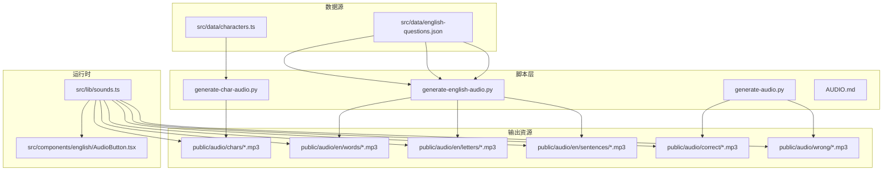
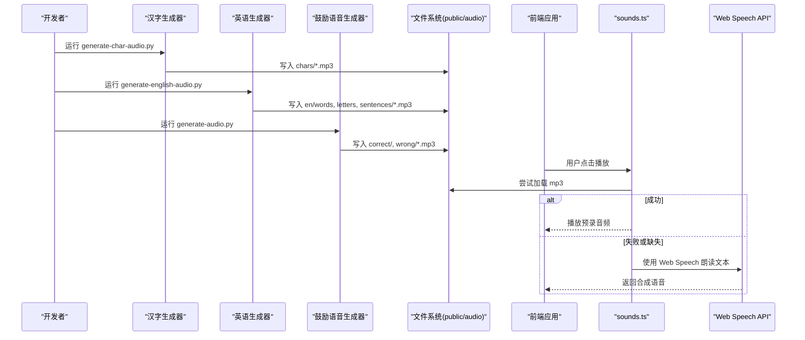
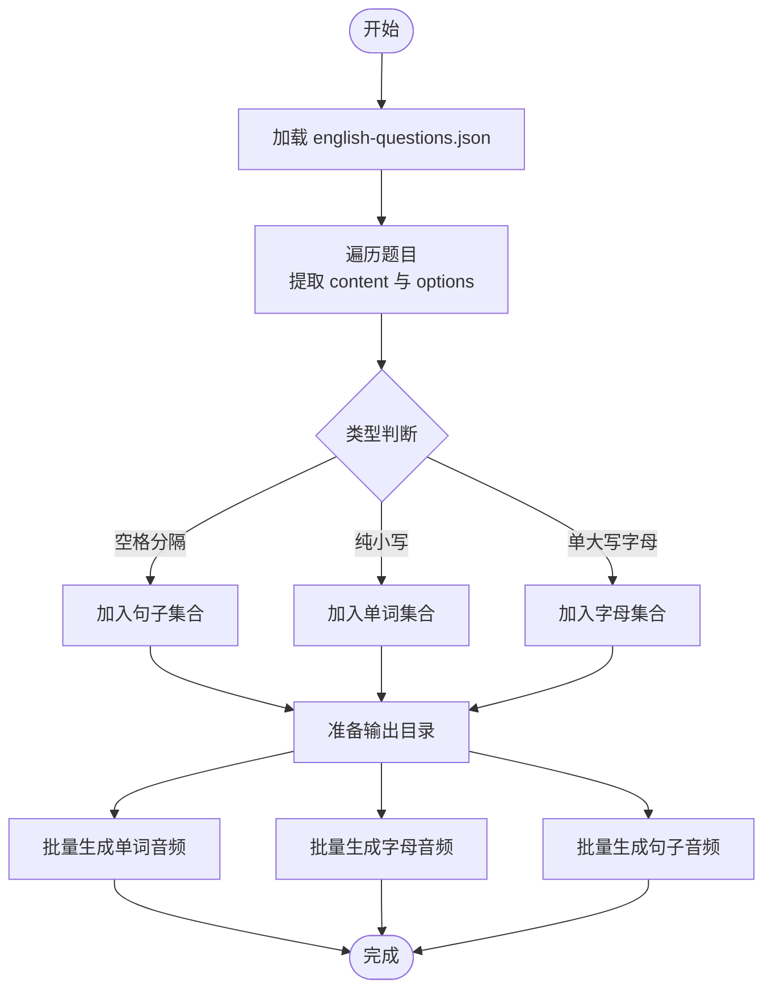
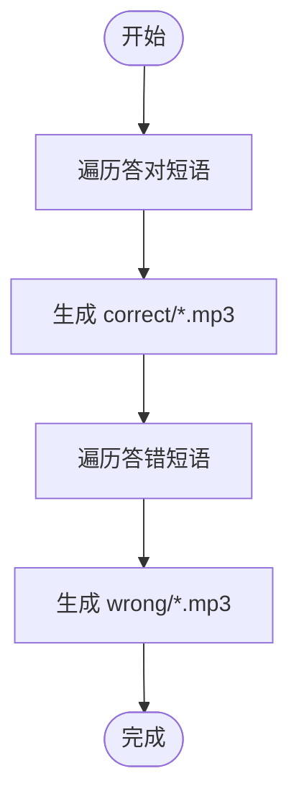
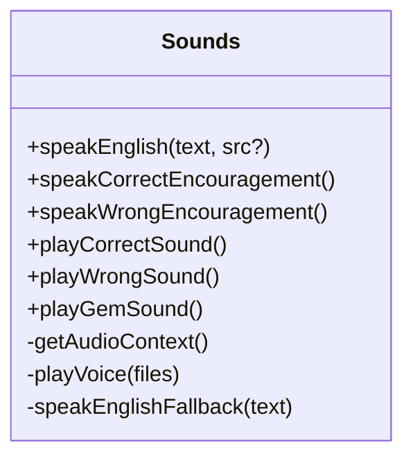
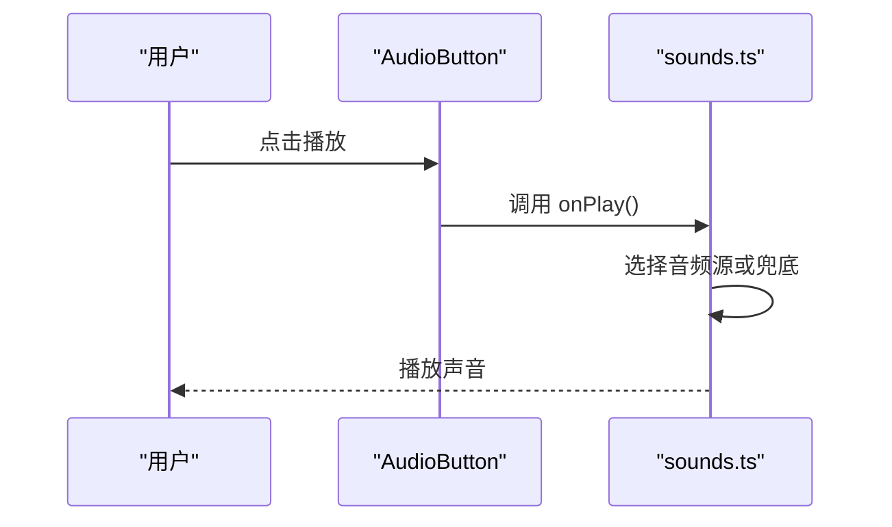
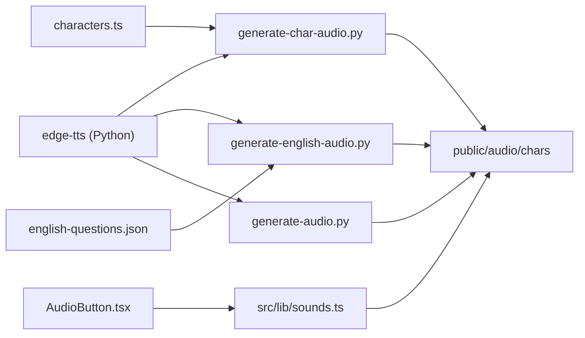

# 音频生成指南

<cite>
**本文引用的文件**   
- [scripts/AUDIO.md](file://scripts/AUDIO.md)
- [scripts/generate-audio.py](file://scripts/generate-audio.py)
- [scripts/generate-char-audio.py](file://scripts/generate-char-audio.py)
- [scripts/generate-english-audio.py](file://scripts/generate-english-audio.py)
- [src/lib/sounds.ts](file://src/lib/sounds.ts)
- [src/components/english/AudioButton.tsx](file://src/components/english/AudioButton.tsx)
- [src/data/characters.ts](file://src/data/characters.ts)
- [src/data/english-questions.json](file://src/data/english-questions.json)
- [package.json](file://package.json)
</cite>

## 目录
1. [简介](#简介)
2. [项目结构](#项目结构)
3. [核心组件](#核心组件)
4. [架构总览](#架构总览)
5. [详细组件分析](#详细组件分析)
6. [依赖关系分析](#依赖关系分析)
7. [性能与体验优化](#性能与体验优化)
8. [故障排查](#故障排查)
9. [结论](#结论)
10. [附录：常用命令与路径](#附录常用命令与路径)

## 简介
本指南面向需要维护或扩展“彩虹学习”应用音频能力的开发者与内容编辑。项目采用“预生成 + 静态资源”的音频策略：使用 Microsoft Edge TTS 将中文、英文发音与鼓励语音提前生成为 mp3，随前端代码部署；运行时优先播放预录音频，缺失时自动回退到浏览器 Web Speech API。

目标读者包括：
- 负责更新题库与词汇内容的编辑
- 需要调整音色、语速、音高的开发者
- 希望了解运行时音频播放与兜底机制的前端工程师

## 项目结构
音频相关的关键目录与文件分布如下：
- scripts：Python 脚本，负责从数据源生成音频资源
- public/audio：生成的 mp3 静态资源（提交至仓库）
- src/lib/sounds.ts：运行时音频播放与音效逻辑
- src/components/english/AudioButton.tsx：听力交互按钮
- src/data：题库与字表数据（作为音频生成的输入来源）

图表来源
- [scripts/generate-char-audio.py:1-77](file://scripts/generate-char-audio.py#L1-L77)
- [scripts/generate-english-audio.py:1-114](file://scripts/generate-english-audio.py#L1-L114)
- [scripts/generate-audio.py:1-50](file://scripts/generate-audio.py#L1-L50)
- [src/lib/sounds.ts:1-165](file://src/lib/sounds.ts#L1-L165)
- [src/components/english/AudioButton.tsx:1-35](file://src/components/english/AudioButton.tsx#L1-L35)
- [src/data/characters.ts:1-200](file://src/data/characters.ts#L1-L200)
- [src/data/english-questions.json:1-200](file://src/data/english-questions.json#L1-L200)

章节来源
- [scripts/AUDIO.md:1-32](file://scripts/AUDIO.md#L1-L32)
- [package.json:1-37](file://package.json#L1-L37)

## 核心组件
- 汉字发音生成器：读取固定字符集，批量生成每个汉字的发音 mp3，输出到 public/audio/chars。
- 英语发音生成器：解析英语题库，提取单词、字母、句子三类素材，分别生成对应目录下的 mp3。
- 鼓励语音生成器：生成答对/答错时的中文鼓励语音，输出到 public/audio/correct 与 public/audio/wrong。
- 运行时播放器：统一封装 Web Audio API 音效与预录语音播放，提供英文发音兜底能力。

章节来源
- [scripts/generate-char-audio.py:1-77](file://scripts/generate-char-audio.py#L1-L77)
- [scripts/generate-english-audio.py:1-114](file://scripts/generate-english-audio.py#L1-L114)
- [scripts/generate-audio.py:1-50](file://scripts/generate-audio.py#L1-L50)
- [src/lib/sounds.ts:1-165](file://src/lib/sounds.ts#L1-L165)

## 架构总览
整体流程分为“离线生成”和“在线播放”两个阶段：
- 离线生成：根据数据源调用 Edge TTS 生成 mp3，写入 public/audio 目录，随前端构建部署。
- 在线播放：React 组件触发播放，优先加载本地 mp3；若失败或缺失，则回退到浏览器语音合成。

图表来源
- [scripts/generate-char-audio.py:1-77](file://scripts/generate-char-audio.py#L1-L77)
- [scripts/generate-english-audio.py:1-114](file://scripts/generate-english-audio.py#L1-L114)
- [scripts/generate-audio.py:1-50](file://scripts/generate-audio.py#L1-L50)
- [src/lib/sounds.ts:1-165](file://src/lib/sounds.ts#L1-L165)

## 详细组件分析

### 汉字发音生成器
职责与行为
- 输入：内置的汉字列表（覆盖三阶段常用字）。
- 处理：去重后分批并发调用 Edge TTS，跳过已存在的 mp3。
- 输出：public/audio/chars/{character}.mp3。
- 参数：中文女声（温暖自然），语速略慢，音调适中，适合儿童听感。

关键实现要点
- 批量并发：按批次聚合任务，避免速率限制。
- 幂等性：存在即跳过，增量生成。
- 输出目录：确保存在并写入。

图表来源
- [scripts/generate-char-audio.py:1-77](file://scripts/generate-char-audio.py#L1-L77)

章节来源
- [scripts/generate-char-audio.py:1-77](file://scripts/generate-char-audio.py#L1-L77)
- [src/data/characters.ts:1-200](file://src/data/characters.ts#L1-L200)

### 英语发音生成器
职责与行为
- 输入：英语题库 JSON，包含题目、选项、图片、音频路径等。
- 处理：扫描 content 与 options，识别单词、字母、句子三类素材，分类生成 mp3。
- 输出：
  - words: public/audio/en/words/{word}.mp3
  - letters: public/audio/en/letters/{LETTER}.mp3
  - sentences: public/audio/en/sentences/{slug}.mp3（slug 由句子规范化得到）
- 参数：英文童声，语速略慢，便于儿童理解。

关键实现要点
- 素材抽取：通过正则区分单词与字母；含空格的视为句子。
- 文件名规范：句子经 slugify 转为安全文件名。
- 批量并发：按批次聚合任务，提升吞吐。

图表来源
- [scripts/generate-english-audio.py:1-114](file://scripts/generate-english-audio.py#L1-L114)
- [src/data/english-questions.json:1-200](file://src/data/english-questions.json#L1-L200)

章节来源
- [scripts/generate-english-audio.py:1-114](file://scripts/generate-english-audio.py#L1-L114)
- [src/data/english-questions.json:1-200](file://src/data/english-questions.json#L1-L200)

### 鼓励语音生成器
职责与行为
- 输入：预设的答对与答错鼓励短语列表。
- 处理：逐个调用 Edge TTS 生成 mp3。
- 输出：
  - public/audio/correct/{correctN}.mp3
  - public/audio/wrong/{wrongN}.mp3
- 参数：中文女声，语速稍慢，音调略高，营造温暖氛围。

图表来源
- [scripts/generate-audio.py:1-50](file://scripts/generate-audio.py#L1-L50)

章节来源
- [scripts/generate-audio.py:1-50](file://scripts/generate-audio.py#L1-L50)

### 运行时播放器（sounds.ts）
职责与行为
- 统一封装：
  - 播放预录语音（随机选择一条鼓励语音）
  - 播放英文发音（优先 mp3，失败回退到 Web Speech）
  - 播放音效（答对上升音阶、答错柔和低音、获得宝石清脆叮铃）
- 容错策略：
  - 捕获异常与播放失败，静默降级
  - 英文发音缺失时自动使用浏览器语音合成兜底

图表来源
- [src/lib/sounds.ts:1-165](file://src/lib/sounds.ts#L1-L165)

章节来源
- [src/lib/sounds.ts:1-165](file://src/lib/sounds.ts#L1-L165)

### 听力交互按钮（AudioButton.tsx）
职责与行为
- 提供触摸友好的发音按钮，支持尺寸变体与提示文案。
- 点击触发 onPlay 回调，通常绑定到 speakEnglish 或回放逻辑。

图表来源
- [src/components/english/AudioButton.tsx:1-35](file://src/components/english/AudioButton.tsx#L1-L35)
- [src/lib/sounds.ts:1-165](file://src/lib/sounds.ts#L1-L165)

章节来源
- [src/components/english/AudioButton.tsx:1-35](file://src/components/english/AudioButton.tsx#L1-L35)

## 依赖关系分析
- 脚本层依赖
  - Python 包：edge-tts（用于 TTS 合成）
  - 数据源：characters.ts（汉字）、english-questions.json（英语题库）
- 运行时依赖
  - Web Audio API：用于合成音效
  - Web Speech API：英文发音兜底
  - React 组件：触发播放逻辑

图表来源
- [scripts/generate-char-audio.py:1-77](file://scripts/generate-char-audio.py#L1-L77)
- [scripts/generate-english-audio.py:1-114](file://scripts/generate-english-audio.py#L1-L114)
- [scripts/generate-audio.py:1-50](file://scripts/generate-audio.py#L1-L50)
- [src/lib/sounds.ts:1-165](file://src/lib/sounds.ts#L1-L165)
- [src/components/english/AudioButton.tsx:1-35](file://src/components/english/AudioButton.tsx#L1-L35)
- [src/data/characters.ts:1-200](file://src/data/characters.ts#L1-L200)
- [src/data/english-questions.json:1-200](file://src/data/english-questions.json#L1-L200)

章节来源
- [package.json:1-37](file://package.json#L1-L37)

## 性能与体验优化
- 批量并发与限流
  - 汉字与英语生成器均采用批次并发，减少网络往返与服务器限流风险。
- 增量生成与幂等
  - 所有生成器均跳过已存在的 mp3，新增内容直接重跑即可，避免重复工作。
- 播放优先级与兜底
  - 运行时优先加载本地 mp3，失败时自动回退到浏览器语音合成，保证可用性。
- 音量与节奏
  - 鼓励语音与英文发音设置合适的音量与语速，更贴合儿童听觉习惯。
- 音效设计
  - 答对/答错/宝石音效采用不同频率与波形，增强反馈清晰度与趣味性。

[本节为通用建议，不直接分析具体文件]

## 故障排查
常见问题与定位方法
- 无法联网或 TTS 服务不可用
  - 现象：生成脚本报错或长时间无响应。
  - 处理：检查网络与 edge-tts 安装；必要时重试或更换网络环境。
- 未提交音频资源导致线上无声
  - 现象：本地可播放，线上缺失。
  - 处理：确认已将 public/audio 提交至版本库并部署。
- 英文发音缺失且浏览器不支持语音合成
  - 现象：点击播放无声音。
  - 处理：补充对应 mp3；或在浏览器中启用语音合成权限。
- 音频体积过大影响首屏加载
  - 现象：页面加载缓慢。
  - 处理：评估是否需要按需加载或压缩音频；保持合理数量与时长。

章节来源
- [scripts/AUDIO.md:1-32](file://scripts/AUDIO.md#L1-L32)
- [src/lib/sounds.ts:1-165](file://src/lib/sounds.ts#L1-L165)

## 结论
本项目通过“预生成 + 静态资源 + 运行时兜底”的音频方案，在保证稳定性的同时兼顾了用户体验。脚本层与数据源解耦，运行时播放逻辑统一封装，便于扩展与维护。遵循“只补新增、先删旧再重录”的规则，可高效迭代音频内容。

[本节为总结，不直接分析具体文件]

## 附录：常用命令与路径
- 前置安装（一次性）
  - pip install edge-tts
- 生成汉字发音
  - python3 scripts/generate-char-audio.py
  - 输出目录：public/audio/chars
- 生成英语发音
  - python3 scripts/generate-english-audio.py
  - 输出目录：public/audio/en/words、public/audio/en/letters、public/audio/en/sentences
- 生成鼓励语音
  - python3 scripts/generate-audio.py
  - 输出目录：public/audio/correct、public/audio/wrong
- 提交音频资源
  - git add public/audio && git commit -m "chore: 更新音频"

章节来源
- [scripts/AUDIO.md:1-32](file://scripts/AUDIO.md#L1-L32)