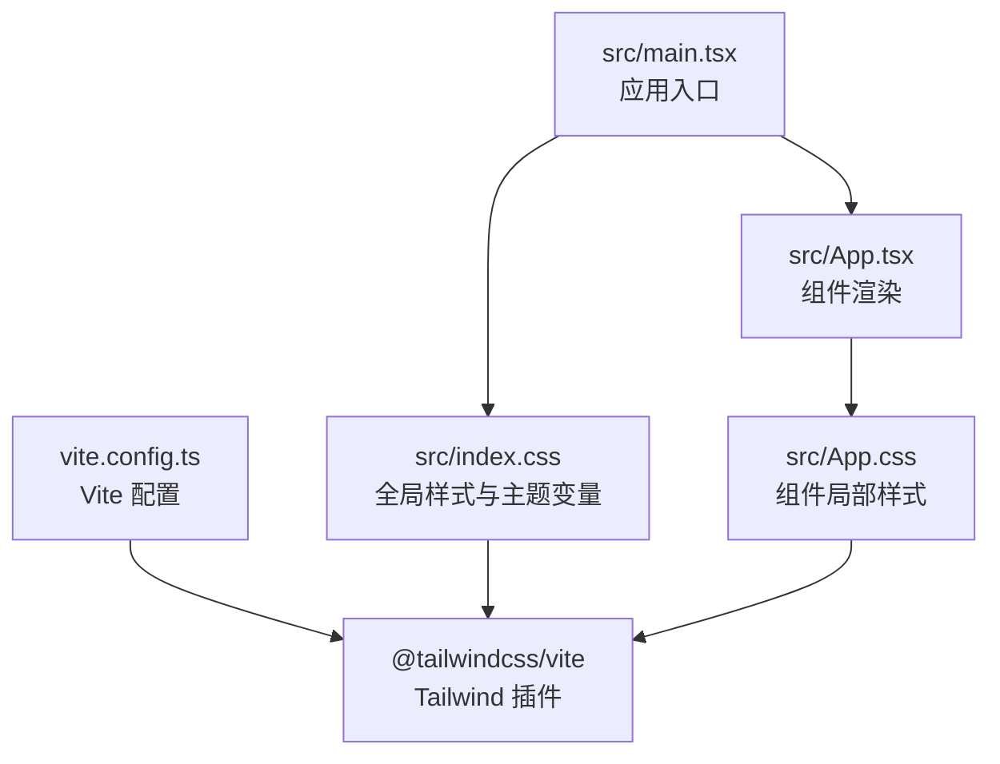
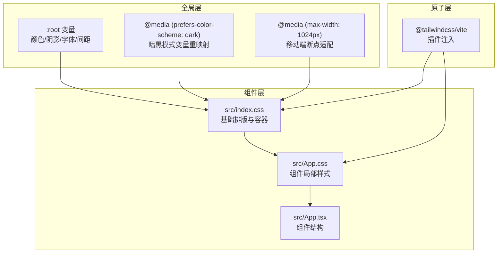
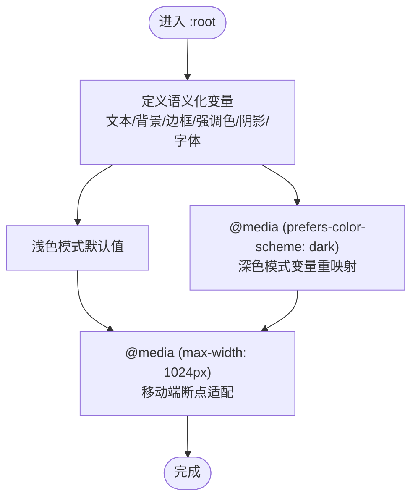
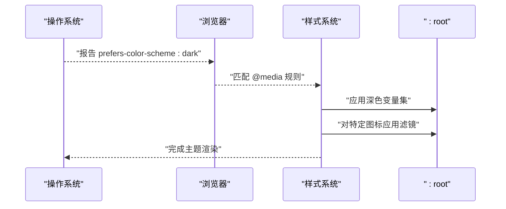
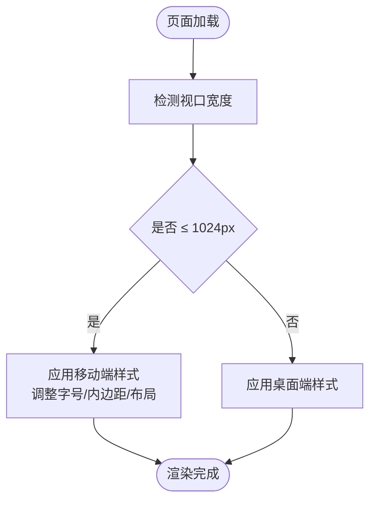
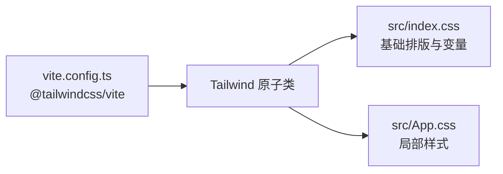
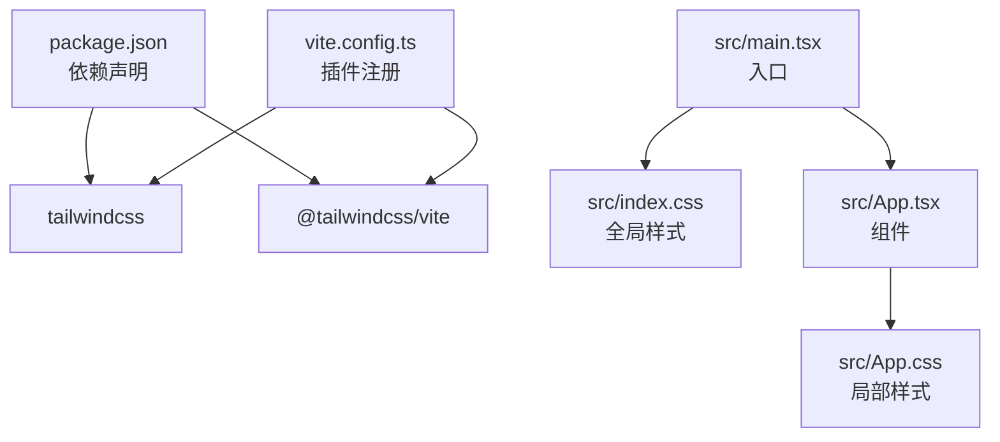

# 样式系统

<cite>
**本文档引用的文件**
- [src/index.css](file://src/index.css)
- [src/App.css](file://src/App.css)
- [src/main.tsx](file://src/main.tsx)
- [src/App.tsx](file://src/App.tsx)
- [package.json](file://package.json)
- [vite.config.ts](file://vite.config.ts)
</cite>

## 目录
1. [简介](#简介)
2. [项目结构](#项目结构)
3. [核心组件](#核心组件)
4. [架构总览](#架构总览)
5. [详细组件分析](#详细组件分析)
6. [依赖分析](#依赖分析)
7. [性能考虑](#性能考虑)
8. [故障排除指南](#故障排除指南)
9. [结论](#结论)
10. [附录](#附录)

## 简介
本文件为 Rainbow Learning 项目的样式系统综合文档，聚焦于视觉设计与样式实现。内容涵盖：
- CSS 变量主题系统与暗黑模式自动检测机制
- 响应式设计断点策略（以 1024px 为核心）
- TailwindCSS 原子化样式的集成与使用方式
- 自定义样式的覆盖方法与样式继承规则
- 颜色系统设计理念、字体排版规范与间距体系
- 主题扩展方案与性能优化建议
- 样式文件间的依赖关系与加载顺序

## 项目结构
样式系统由以下关键文件构成：
- 入口样式：在应用入口中引入全局样式，确保主题变量与基础排版优先生效
- 全局样式：定义 CSS 变量主题、暗黑模式自动检测、基础排版与响应式断点
- 组件样式：局部样式文件，通过变量与原子类组合实现一致的视觉风格
- 构建配置：Vite 集成 TailwindCSS 插件，确保原子类按需生成与构建

**图表来源**
- [src/main.tsx:1-11](file://src/main.tsx#L1-L11)
- [src/index.css:1-114](file://src/index.css#L1-L114)
- [src/App.tsx:1-123](file://src/App.tsx#L1-L123)
- [src/App.css:1-185](file://src/App.css#L1-L185)
- [vite.config.ts:1-12](file://vite.config.ts#L1-L12)

**章节来源**
- [src/main.tsx:1-11](file://src/main.tsx#L1-L11)
- [src/index.css:1-114](file://src/index.css#L1-L114)
- [src/App.tsx:1-123](file://src/App.tsx#L1-L123)
- [src/App.css:1-185](file://src/App.css#L1-L185)
- [vite.config.ts:1-12](file://vite.config.ts#L1-L12)

## 核心组件
- CSS 变量主题系统：在根元素定义语义化变量，统一控制文本、背景、边框、强调色与阴影等视觉属性，并通过媒体查询在不同尺寸下调整字号与布局密度
- 暗黑模式自动检测：利用系统偏好颜色方案媒体查询，在深色模式下重映射变量值，并对特定图标进行滤镜处理以保证可读性
- 响应式断点策略：以 1024px 作为主要断点，针对容器宽度、标题字号、内边距与列表布局进行适配
- TailwindCSS 原子化样式：通过 Vite 插件在构建时注入原子类，减少手写样式体积，提升一致性与复用性
- 组件局部样式：在组件内部使用变量与媒体查询，确保跨页面的一致性与可维护性

**章节来源**
- [src/index.css:3-53](file://src/index.css#L3-L53)
- [src/index.css:30-32](file://src/index.css#L30-L32)
- [src/index.css:82-94](file://src/index.css#L82-L94)
- [vite.config.ts:1-12](file://vite.config.ts#L1-L12)

## 架构总览
样式系统采用“全局变量 + 原子类 + 局部样式”的分层架构：
- 全局层：定义主题变量与基础排版，确保所有组件共享同一视觉语言
- 原子层：由 TailwindCSS 提供，用于快速搭建布局与通用样式
- 组件层：局部样式文件，负责组件特有交互态与复杂布局

**图表来源**
- [src/index.css:3-53](file://src/index.css#L3-L53)
- [src/index.css:30-32](file://src/index.css#L30-L32)
- [src/index.css:82-94](file://src/index.css#L82-L94)
- [src/App.css:1-185](file://src/App.css#L1-L185)
- [src/App.tsx:1-123](file://src/App.tsx#L1-L123)
- [vite.config.ts:1-12](file://vite.config.ts#L1-L12)

## 详细组件分析

### CSS 变量主题系统
- 设计理念：通过语义化变量抽象颜色、阴影、字体族与间距，实现“风格即数据”，便于主题扩展与一致性维护
- 关键变量：
  - 文本与标题色：用于正文与标题的高对比度呈现
  - 背景色与边框色：支撑容器与分隔线的层级表达
  - 强调色与强调背景：用于按钮、链接与高亮状态
  - 阴影：统一的投影效果，增强卡片与浮层的层次感
  - 字体族：无衬线、等宽字体族，兼顾可读性与技术场景
- 使用方式：组件与全局样式均通过 var() 引用变量，确保主题切换时的统一更新

**图表来源**
- [src/index.css:3-53](file://src/index.css#L3-L53)
- [src/index.css:30-32](file://src/index.css#L30-L32)

**章节来源**
- [src/index.css:3-53](file://src/index.css#L3-L53)

### 暗黑模式自动检测与切换机制
- 自动检测：通过系统偏好颜色方案媒体查询自动启用深色变量集，无需用户干预
- 切换机制：当前仓库未实现手动切换逻辑；如需扩展，可在运行时切换根元素的类名或变量，再配合媒体查询同步更新
- 图标适配：深色模式下对社交图标应用反相与亮度增强滤镜，保证在深色背景下的可读性

**图表来源**
- [src/index.css:35-52](file://src/index.css#L35-L52)

**章节来源**
- [src/index.css:35-52](file://src/index.css#L35-L52)

### 响应式设计断点策略
- 断点：以 1024px 为核心断点，适配桌面端到平板端的过渡
- 应用范围：容器宽度、标题字号、内边距、列表布局方向与换行行为等
- 实施方式：在全局与局部样式中统一使用媒体查询，避免重复逻辑

**图表来源**
- [src/index.css:30-32](file://src/index.css#L30-L32)
- [src/index.css:82-94](file://src/index.css#L82-L94)
- [src/App.css:67-70](file://src/App.css#L67-L70)
- [src/App.css:92-95](file://src/App.css#L92-L95)
- [src/App.css:139-153](file://src/App.css#L139-L153)

**章节来源**
- [src/index.css:30-32](file://src/index.css#L30-L32)
- [src/index.css:82-94](file://src/index.css#L82-L94)
- [src/App.css:67-70](file://src/App.css#L67-L70)
- [src/App.css:92-95](file://src/App.css#L92-L95)
- [src/App.css:139-153](file://src/App.css#L139-L153)

### TailwindCSS 原子化样式使用方式
- 集成方式：通过 Vite 插件在构建阶段注入 Tailwind 原子类，减少手写样式体积
- 使用策略：优先使用原子类进行布局与通用样式，局部样式仅用于复杂交互态或无法原子化的场景
- 与变量的结合：在原子类基础上，通过变量控制颜色、阴影与字体等语义化属性

**图表来源**
- [vite.config.ts:1-12](file://vite.config.ts#L1-L12)
- [src/index.css:1](file://src/index.css#L1)
- [src/App.css:1](file://src/App.css#L1)

**章节来源**
- [vite.config.ts:1-12](file://vite.config.ts#L1-L12)
- [package.json:14-18](file://package.json#L14-L18)

### 自定义样式覆盖与继承规则
- 覆盖方式：通过局部样式文件中的选择器权重与媒体查询，覆盖默认原子类或全局变量样式
- 继承规则：全局变量在根元素定义，子元素通过 var() 继承；局部样式在组件作用域内生效，避免全局污染
- 一致性保障：统一使用变量与原子类，减少硬编码值，降低维护成本

**章节来源**
- [src/index.css:3-53](file://src/index.css#L3-L53)
- [src/App.css:1-185](file://src/App.css#L1-L185)

### 颜色系统设计理念
- 语义化命名：颜色变量以语义命名（如文本、背景、强调），而非具体色彩名称
- 对比度与可访问性：标题与正文色在浅色与深色模式下保持高对比度
- 动态阴影：阴影变量统一投影参数，确保卡片与浮层在不同模式下具有一致的层次感

**章节来源**
- [src/index.css:3-14](file://src/index.css#L3-L14)
- [src/index.css:35-47](file://src/index.css#L35-L47)

### 字体排版规范
- 字体族：无衬线字体用于正文与标题，等宽字体用于代码片段
- 字号与行高：标题字号在桌面与移动端有差异化设置，行高与字距保证可读性
- 代码样式：代码块使用等宽字体与背景色，突出技术内容

**章节来源**
- [src/index.css:16-18](file://src/index.css#L16-L18)
- [src/index.css:78-94](file://src/index.css#L78-L94)
- [src/index.css:108-113](file://src/index.css#L108-L113)

### 间距体系
- 容器与分隔：容器使用内边框与最小高度保证内容区域稳定；分隔线使用边框变量统一风格
- 组件间距：组件内部使用间隙与内边距在桌面与移动端分别设置，确保在断点处的视觉平衡

**章节来源**
- [src/index.css:55-65](file://src/index.css#L55-L65)
- [src/App.css:67-70](file://src/App.css#L67-L70)
- [src/App.css:139-153](file://src/App.css#L139-L153)

## 依赖分析
- 构建工具链：Vite 通过 TailwindCSS 插件在构建时生成原子类，减少运行时开销
- 运行时依赖：TailwindCSS 与 @tailwindcss/vite 在生产环境与开发环境中均参与样式生成
- 加载顺序：应用入口先引入全局样式，再渲染组件，确保变量与基础排版在组件渲染前已就绪

**图表来源**
- [package.json:12-19](file://package.json#L12-L19)
- [vite.config.ts:1-12](file://vite.config.ts#L1-L12)
- [src/main.tsx:1-11](file://src/main.tsx#L1-L11)
- [src/index.css:1](file://src/index.css#L1)
- [src/App.tsx:1-123](file://src/App.tsx#L1-L123)
- [src/App.css:1-185](file://src/App.css#L1-L185)

**章节来源**
- [package.json:12-19](file://package.json#L12-L19)
- [vite.config.ts:1-12](file://vite.config.ts#L1-L12)
- [src/main.tsx:1-11](file://src/main.tsx#L1-L11)

## 性能考虑
- 原子类按需生成：TailwindCSS 插件仅生成实际使用的类，减少 CSS 体积
- 变量驱动：通过变量集中管理颜色与阴影，避免重复定义导致的体积膨胀
- 媒体查询合并：在一处定义断点，减少重复规则与计算开销
- 图标滤镜：深色模式下的图标滤镜在构建期确定，避免运行时计算

[本节为通用指导，不直接分析具体文件]

## 故障排除指南
- 暗黑模式未生效：确认系统偏好颜色方案是否为深色，以及媒体查询是否正确匹配
- 响应式断点异常：检查断点处的媒体查询是否被更高等级选择器覆盖
- 原子类无效：确认 Tailwind 插件已在 Vite 中正确注册，且构建产物包含对应类
- 变量未更新：确保组件使用 var() 引用变量，而非硬编码值

**章节来源**
- [src/index.css:35-52](file://src/index.css#L35-L52)
- [vite.config.ts:1-12](file://vite.config.ts#L1-L12)

## 结论
Rainbow Learning 的样式系统以 CSS 变量为主题核心，结合 TailwindCSS 原子类与响应式断点策略，实现了高一致性与可维护性的视觉体系。通过系统偏好自动检测与深色模式变量重映射，提升了用户体验与可访问性。未来可在此基础上扩展手动主题切换与更丰富的语义变量，进一步完善主题生态。

[本节为总结性内容，不直接分析具体文件]

## 附录
- 样式定制指南
  - 新增变量：在根元素定义新的语义化变量，确保浅色与深色模式均有对应值
  - 扩展断点：在现有断点基础上新增或调整移动端样式，保持与桌面端的协调
  - 组件样式：优先使用原子类，局部样式仅用于复杂交互态
- 主题扩展方案
  - 手动切换：在运行时切换根元素类名或变量，配合媒体查询同步更新
  - 多品牌主题：基于变量体系扩展品牌专属变量集，保持与主主题的兼容
- 性能优化建议
  - 合理拆分样式：将通用样式与组件样式分离，减少不必要的重绘
  - 控制变量数量：避免过度细分变量，保持变量表简洁易维护

[本节为通用指导，不直接分析具体文件]