# 样式系统

<cite>
**本文档引用的文件**
- [src/index.css](file://src/index.css)
- [src/main.tsx](file://src/main.tsx)
- [src/App.tsx](file://src/App.tsx)
- [src/components/Layout.tsx](file://src/components/Layout.tsx)
- [src/components/BottomNav.tsx](file://src/components/BottomNav.tsx)
- [src/components/StarAnimation.tsx](file://src/components/StarAnimation.tsx)
- [src/components/ProgressBar.tsx](file://src/components/ProgressBar.tsx)
- [src/components/OptionCard.tsx](file://src/components/OptionCard.tsx)
- [src/components/GemCounter.tsx](file://src/components/GemCounter.tsx)
- [src/components/UserAvatar.tsx](file://src/components/UserAvatar.tsx)
- [src/components/FloatingDecorations.tsx](file://src/components/FloatingDecorations.tsx)
- [src/components/math/MathFloatingDecorations.tsx](file://src/components/math/MathFloatingDecorations.tsx)
- [src/components/math/MathProgressBar.tsx](file://src/components/math/MathProgressBar.tsx)
- [src/components/math/MathOptionCard.tsx](file://src/components/math/MathOptionCard.tsx)
- [src/components/math/MathFeedbackOverlay.tsx](file://src/components/math/MathFeedbackOverlay.tsx)
- [src/components/math/MathDailyComplete.tsx](file://src/components/math/MathDailyComplete.tsx)
- [src/components/math/PatternRenderer.tsx](file://src/components/math/PatternRenderer.tsx)
- [src/components/math/CountingRenderer.tsx](file://src/components/math/CountingRenderer.tsx)
- [src/pages/HomePage.tsx](file://src/pages/HomePage.tsx)
- [src/pages/LearnPage.tsx](file://src/pages/LearnPage.tsx)
- [src/pages/MathLearnPage.tsx](file://src/pages/MathLearnPage.tsx)
- [src/pages/GemPage.tsx](file://src/pages/GemPage.tsx)
- [src/data/math-encouragements.ts](file://src/data/math-encouragements.ts)
- [src/data/math-questions.json](file://src/data/math-questions.json)
- [package.json](file://package.json)
- [vite.config.ts](file://vite.config.ts)
</cite>

## 更新摘要
**变更内容**
- 新增数学主题样式系统：糖果王国主题的粉色和翡翠色配色方案
- 新增数学专用动画效果：candy-fall 糖果飘落动画和数学进度条脉冲效果
- 新增数学装饰元素：MathFloatingDecorations 糖果主题浮动装饰
- 新增数学反馈系统：MathFeedbackOverlay 糖果主题反馈弹窗
- 新增数学每日完成页面：MathDailyComplete 糖果主题完成界面
- 新增数学选项卡片：MathOptionCard 粉色和翡翠色主题卡片
- 新增数学进度条：MathProgressBar 糖果进度条动画
- 新增数学题目渲染器：PatternRenderer 和 CountingRenderer

## 目录
1. [简介](#简介)
2. [项目结构](#项目结构)
3. [核心组件](#核心组件)
4. [架构总览](#架构总览)
5. [详细组件分析](#详细组件分析)
6. [数学主题样式系统](#数学主题样式系统)
7. [依赖分析](#依赖分析)
8. [性能考虑](#性能考虑)
9. [故障排除指南](#故障排除指南)
10. [结论](#结论)
11. [附录](#附录)

## 简介
本文件为 Rainbow Learning 项目的样式系统综合文档，聚焦于现代视觉设计与样式实现。内容涵盖：
- 完整的彩虹主题色彩系统与语义化变量设计
- 现代底部导航系统与浮动粒子动画效果
- 响应式学科卡片设计与进度指示器实现
- TailwindCSS 原子化样式的深度集成与使用方式
- Framer Motion 动画系统的无缝融合
- **新增数学主题样式系统**：糖果王国主题的粉色和翡翠色配色方案
- **新增数学专用动画效果**：candy-fall 糖果飘落动画和数学进度条脉冲效果
- **新增数学装饰元素**：MathFloatingDecorations 糖果主题浮动装饰
- 自定义样式的覆盖方法与样式继承规则
- 颜色系统设计理念、字体排版规范与间距体系
- 主题扩展方案与性能优化建议
- 样式文件间的依赖关系与加载顺序

## 项目结构
样式系统由以下关键文件构成：
- 入口样式：在应用入口中引入全局样式，确保主题变量与基础排版优先生效
- 全局样式：定义完整的 CSS 变量主题、语义化颜色系统与基础排版
- 组件样式：现代化组件通过原子类与语义化变量组合实现一致的视觉风格
- 页面样式：各页面通过组件组合实现复杂的视觉效果与动画
- **数学主题样式**：数学页面专用的糖果主题样式和动画系统
- 构建配置：Vite 集成 TailwindCSS 插件，确保原子类按需生成与构建

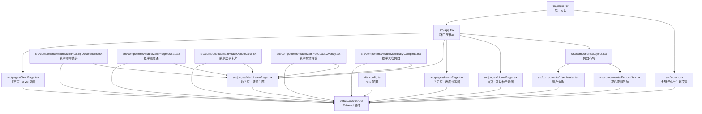

**图表来源**
- [src/main.tsx:1-11](file://src/main.tsx#L1-L11)
- [src/index.css:1-111](file://src/index.css#L1-L111)
- [src/App.tsx:1-40](file://src/App.tsx#L1-L40)
- [src/components/Layout.tsx:1-26](file://src/components/Layout.tsx#L1-L26)
- [src/components/BottomNav.tsx:1-51](file://src/components/BottomNav.tsx#L1-L51)
- [src/components/UserAvatar.tsx:1-27](file://src/components/UserAvatar.tsx#L1-L27)
- [src/pages/HomePage.tsx:1-230](file://src/pages/HomePage.tsx#L1-L230)
- [src/pages/LearnPage.tsx:1-288](file://src/pages/LearnPage.tsx#L1-L288)
- [src/pages/MathLearnPage.tsx:1-353](file://src/pages/MathLearnPage.tsx#L1-L353)
- [src/pages/GemPage.tsx:1-317](file://src/pages/GemPage.tsx#L1-L317)
- [src/components/math/MathFloatingDecorations.tsx:1-16](file://src/components/math/MathFloatingDecorations.tsx#L1-L16)
- [src/components/math/MathProgressBar.tsx:1-36](file://src/components/math/MathProgressBar.tsx#L1-L36)
- [src/components/math/MathOptionCard.tsx:1-69](file://src/components/math/MathOptionCard.tsx#L1-L69)
- [src/components/math/MathFeedbackOverlay.tsx:1-106](file://src/components/math/MathFeedbackOverlay.tsx#L1-L106)
- [src/components/math/MathDailyComplete.tsx:1-69](file://src/components/math/MathDailyComplete.tsx#L1-L69)
- [vite.config.ts:1-12](file://vite.config.ts#L1-L12)

**章节来源**
- [src/main.tsx:1-11](file://src/main.tsx#L1-L11)
- [src/index.css:1-111](file://src/index.css#L1-L111)
- [src/App.tsx:1-40](file://src/App.tsx#L1-L40)
- [src/components/Layout.tsx:1-26](file://src/components/Layout.tsx#L1-L26)
- [src/components/BottomNav.tsx:1-51](file://src/components/BottomNav.tsx#L1-L51)
- [src/components/UserAvatar.tsx:1-27](file://src/components/UserAvatar.tsx#L1-L27)
- [src/pages/HomePage.tsx:1-230](file://src/pages/HomePage.tsx#L1-L230)
- [src/pages/LearnPage.tsx:1-288](file://src/pages/LearnPage.tsx#L1-L288)
- [src/pages/MathLearnPage.tsx:1-353](file://src/pages/MathLearnPage.tsx#L1-L353)
- [src/pages/GemPage.tsx:1-317](file://src/pages/GemPage.tsx#L1-L317)
- [src/components/math/MathFloatingDecorations.tsx:1-16](file://src/components/math/MathFloatingDecorations.tsx#L1-L16)
- [src/components/math/MathProgressBar.tsx:1-36](file://src/components/math/MathProgressBar.tsx#L1-L36)
- [src/components/math/MathOptionCard.tsx:1-69](file://src/components/math/MathOptionCard.tsx#L1-L69)
- [src/components/math/MathFeedbackOverlay.tsx:1-106](file://src/components/math/MathFeedbackOverlay.tsx#L1-L106)
- [src/components/math/MathDailyComplete.tsx:1-69](file://src/components/math/MathDailyComplete.tsx#L1-L69)
- [vite.config.ts:1-12](file://vite.config.ts#L1-L12)

## 核心组件
- 完整彩虹主题色彩系统：定义七种彩虹色、宝石金、卡片背景、文本颜色等完整语义化变量，支持浅色与深色模式
- 现代底部导航系统：固定定位的导航栏，支持激活状态动画、毛玻璃效果与安全区域适配
- 浮动粒子动画系统：首页背景的无限循环粒子动画，支持多种表情符号与随机延迟
- **浮动装饰动画系统**：CSS 动画关键帧定义的完整装饰动画库，包括慢速、中速、快速浮动和漂移效果
- 响应式学科卡片：灵活的学科卡片设计，支持锁定状态、徽章显示与悬停动画效果
- 进度指示器：渐变色进度条，支持动画过渡与百分比显示，集成脉冲动画反馈
- 宝石收集动画：SVG 宝石堆叠动画，支持多种布局模式与闪光效果
- 用户头像系统：可点击的用户头像，支持图片与字符两种显示模式
- **数学主题样式系统**：糖果王国主题的粉色和翡翠色配色方案，支持渐变背景和装饰元素
- **数学专用动画效果**：candy-fall 糖果飘落动画、数学进度条脉冲效果和反馈动画
- **数学装饰元素**：MathFloatingDecorations 糖果主题浮动装饰，包含多种表情符号
- **数学反馈系统**：MathFeedbackOverlay 糖果主题反馈弹窗，支持正确和错误状态的不同样式
- **数学每日完成页面**：MathDailyComplete 糊涂主题完成界面，包含宝石奖励显示
- **数学选项卡片**：MathOptionCard 粉色和翡翠色主题卡片，支持多种状态动画
- **数学进度条**：MathProgressBar 糖果进度条，使用🍬(完成) 🍭(当前) ☆(待做) 表情符号
- Framer Motion 动画集成：广泛使用动画库实现流畅的交互动画效果

**章节来源**
- [src/index.css:3-17](file://src/index.css#L3-L17)
- [src/components/BottomNav.tsx:10-51](file://src/components/BottomNav.tsx#L10-L51)
- [src/pages/HomePage.tsx:8-21](file://src/pages/HomePage.tsx#L8-L21)
- [src/pages/HomePage.tsx:23-68](file://src/pages/HomePage.tsx#L23-L68)
- [src/index.css:50-111](file://src/index.css#L50-L111)
- [src/components/ProgressBar.tsx:8-29](file://src/components/ProgressBar.tsx#L8-L29)
- [src/pages/GemPage.tsx:10-20](file://src/pages/GemPage.tsx#L10-L20)
- [src/pages/GemPage.tsx:24-96](file://src/pages/GemPage.tsx#L24-L96)
- [src/components/UserAvatar.tsx:5-27](file://src/components/UserAvatar.tsx#L5-L27)
- [src/components/math/MathFloatingDecorations.tsx:1-16](file://src/components/math/MathFloatingDecorations.tsx#L1-L16)
- [src/components/math/MathProgressBar.tsx:8-36](file://src/components/math/MathProgressBar.tsx#L8-L36)
- [src/components/math/MathOptionCard.tsx:10-69](file://src/components/math/MathOptionCard.tsx#L10-L69)
- [src/components/math/MathFeedbackOverlay.tsx:11-106](file://src/components/math/MathFeedbackOverlay.tsx#L11-L106)
- [src/components/math/MathDailyComplete.tsx:12-69](file://src/components/math/MathDailyComplete.tsx#L12-L69)

## 架构总览
样式系统采用"全局变量 + 原子类 + 组件样式 + 动画系统"的四层架构：
- 全局层：定义完整的主题变量与基础排版，确保所有组件共享同一视觉语言
- 原子层：由 TailwindCSS 提供，用于快速搭建布局与通用样式
- 组件层：现代化组件文件，负责复杂交互态与视觉效果
- 动画层：**新增数学专用动画系统**，结合 CSS 动画关键帧与 Framer Motion 实现多层次动画效果

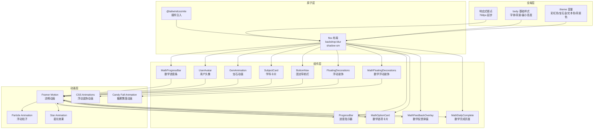

**图表来源**
- [src/index.css:3-42](file://src/index.css#L3-L42)
- [src/components/BottomNav.tsx:10-51](file://src/components/BottomNav.tsx#L10-L51)
- [src/pages/HomePage.tsx:23-68](file://src/pages/HomePage.tsx#L23-L68)
- [src/components/ProgressBar.tsx:8-29](file://src/components/ProgressBar.tsx#L8-L29)
- [src/pages/GemPage.tsx:24-96](file://src/pages/GemPage.tsx#L24-L96)
- [src/components/UserAvatar.tsx:5-27](file://src/components/UserAvatar.tsx#L5-L27)
- [src/components/FloatingDecorations.tsx:1-24](file://src/components/FloatingDecorations.tsx#L1-L24)
- [src/components/math/MathFloatingDecorations.tsx:1-16](file://src/components/math/MathFloatingDecorations.tsx#L1-L16)
- [src/components/math/MathOptionCard.tsx:1-69](file://src/components/math/MathOptionCard.tsx#L1-L69)
- [src/components/math/MathProgressBar.tsx:1-36](file://src/components/math/MathProgressBar.tsx#L1-L36)
- [src/components/math/MathFeedbackOverlay.tsx:1-106](file://src/components/math/MathFeedbackOverlay.tsx#L1-L106)
- [src/components/math/MathDailyComplete.tsx:1-69](file://src/components/math/MathDailyComplete.tsx#L1-L69)

## 详细组件分析

### 完整彩虹主题色彩系统
- 设计理念：通过完整的彩虹色谱（红橙黄绿蓝紫）与辅助色彩（宝石金、卡片背景、文本颜色）构建统一的品牌视觉
- 关键变量：
  - 彩虹色系：七种鲜艳的彩虹颜色，用于各种装饰元素与渐变效果
  - 宝石金：#FFD700，用于宝石相关的视觉元素
  - 背景色系：温暖背景色与卡片背景色，营造舒适的阅读环境
  - 文本色系：主文本色与次要文本色，确保良好的对比度
  - 状态色：正确答案绿色、错误状态紫色等，提供清晰的反馈
- 使用方式：所有组件通过语义化变量引用，确保主题切换时的统一更新

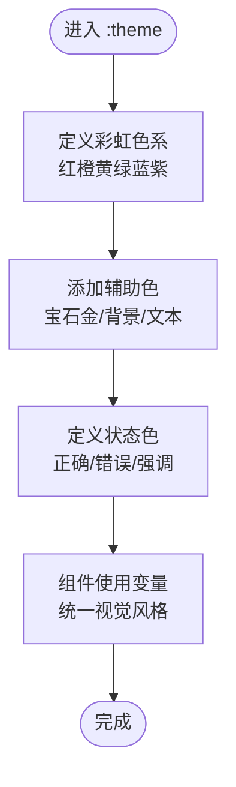

**图表来源**
- [src/index.css:3-17](file://src/index.css#L3-L17)

**章节来源**
- [src/index.css:3-17](file://src/index.css#L3-L17)

### 现代底部导航系统
- 设计特点：固定定位在屏幕底部，支持毛玻璃模糊效果、安全区域适配与激活状态动画
- 技术实现：使用 React Router NavLink 实现路由跳转，Framer Motion 提供缩放动画效果
- 响应式设计：在移动设备上提供最佳的触摸交互体验
- 状态管理：通过 isActive 状态动态切换图标与文字颜色

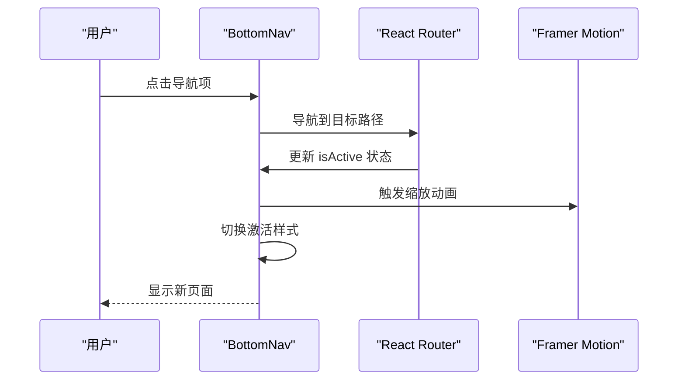

**图表来源**
- [src/components/BottomNav.tsx:14-46](file://src/components/BottomNav.tsx#L14-L46)

**章节来源**
- [src/components/BottomNav.tsx:10-51](file://src/components/BottomNav.tsx#L10-L51)

### 浮动粒子动画系统
- 设计理念：首页背景的无限循环粒子动画，营造梦幻的学习氛围
- 技术实现：使用 Framer Motion 的 animate 和 transition 属性实现复杂的运动轨迹
- 动画效果：每个粒子具有不同的初始位置、延迟时间和运动轨迹
- 性能优化：使用 pointer-events-none 确保动画不影响交互操作

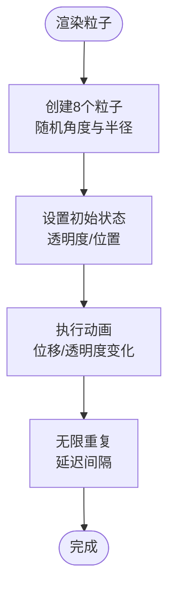

**图表来源**
- [src/pages/HomePage.tsx:8-21](file://src/pages/HomePage.tsx#L8-L21)

**章节来源**
- [src/pages/HomePage.tsx:8-21](file://src/pages/HomePage.tsx#L8-L21)

### **浮动装饰动画系统** **新增**
- 设计理念：通过 CSS 动画关键帧创建丰富的背景装饰效果，增强界面的层次感和动感
- 动画类型：
  - **浮动动画**：垂直方向的上下浮动和轻微旋转，模拟轻盈的物体运动
  - **漂移动画**：水平方向的缓慢移动，营造自然的流动感
  - **脉冲动画**：缩放和透明度变化的循环效果，用于重要的交互反馈
- 关键帧定义：
  - `float-slow`：慢速浮动，振幅较大，旋转角度适中
  - `float-medium`：中速浮动，平衡振幅和速度
  - `float-fast`：快速浮动，适合远距离装饰元素
  - `drift-slow`：慢速漂移，水平方向的温和移动
  - `drift-medium`：中速漂移，增加动感
  - `star-pulse`：脉冲效果，用于强调当前状态
- 原子类系统：提供对应的 CSS 类名，便于在组件中直接使用
- 应用场景：浮动装饰组件、进度指示器的当前状态反馈

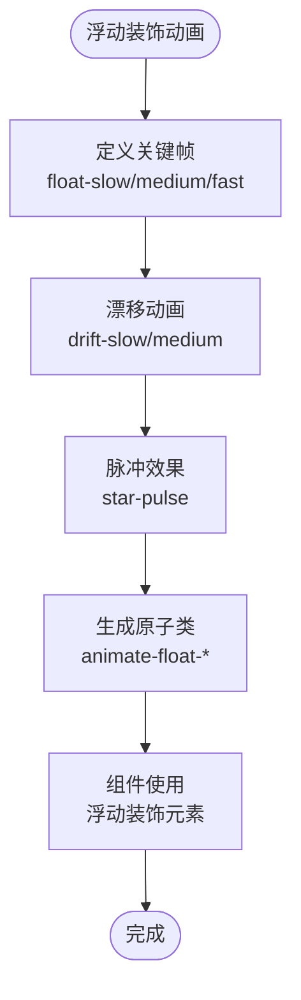

**图表来源**
- [src/index.css:50-111](file://src/index.css#L50-L111)
- [src/components/FloatingDecorations.tsx:8-21](file://src/components/FloatingDecorations.tsx#L8-L21)

**章节来源**
- [src/index.css:50-111](file://src/index.css#L50-L111)
- [src/components/FloatingDecorations.tsx:8-21](file://src/components/FloatingDecorations.tsx#L8-L21)

### 响应式学科卡片设计
- 设计特点：灵活的卡片布局，支持锁定状态、徽章显示与多种动画效果
- 技术实现：使用 Flexbox 实现响应式布局，支持不同屏幕尺寸下的最佳显示效果
- 动画系统：悬停时的上升效果、点击时的缩放效果，以及旋转动画
- 视觉效果：毛玻璃模糊、阴影效果和渐变背景的完美结合

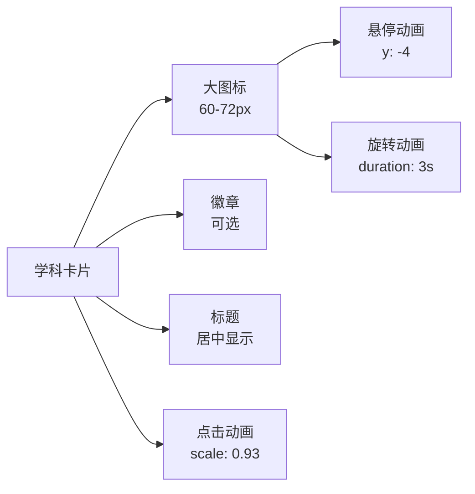

**图表来源**
- [src/pages/HomePage.tsx:23-68](file://src/pages/HomePage.tsx#L23-L68)

**章节来源**
- [src/pages/HomePage.tsx:23-68](file://src/pages/HomePage.tsx#L23-L68)

### 进度指示器实现
- 设计特点：渐变色进度条，从红色到绿色的平滑过渡
- 技术实现：使用 Framer Motion 的动画功能实现进度条的平滑增长效果
- **新增脉冲反馈**：当前进度项使用 `animate-star-pulse` 类实现脉冲动画，提供清晰的状态指示
- 响应式设计：支持不同屏幕尺寸下的最佳显示效果
- 状态反馈：实时显示当前进度与总题数

**章节来源**
- [src/components/ProgressBar.tsx:8-29](file://src/components/ProgressBar.tsx#L8-L29)

### 宝石收集动画系统
- 设计理念：通过 SVG 实现精美的宝石堆叠动画，每颗宝石都有独特的颜色和动画效果
- 技术实现：使用 SVG 路径绘制宝石形状，结合 Framer Motion 实现复杂的动画效果
- 布局算法：根据宝石数量自动调整布局，支持最多15颗宝石的堆叠效果
- 视觉效果：每颗宝石都有高光、阴影和闪光点，营造立体的视觉效果

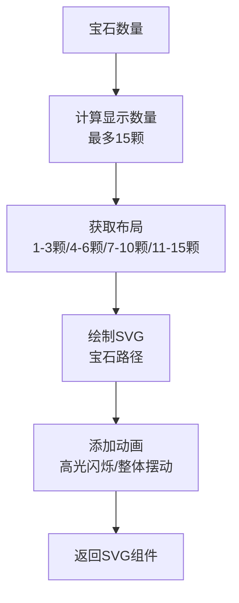

**图表来源**
- [src/pages/GemPage.tsx:99-161](file://src/pages/GemPage.tsx#L99-L161)

**章节来源**
- [src/pages/GemPage.tsx:99-161](file://src/pages/GemPage.tsx#L99-L161)

### 用户头像系统
- 设计特点：圆形头像设计，支持渐变背景和阴影效果
- 技术实现：使用 Framer Motion 的点击动画效果，提供良好的交互反馈
- 内容适配：支持图片头像和字符头像两种显示模式
- 导航功能：点击头像可跳转到个人资料页面

**章节来源**
- [src/components/UserAvatar.tsx:5-27](file://src/components/UserAvatar.tsx#L5-L27)

### Framer Motion 动画集成
- 动画库集成：通过 npm 安装 framer-motion，提供流畅的交互动画
- 组件动画：广泛应用于各个组件，包括导航、卡片、按钮等
- 动画类型：支持基础动画、循环动画、条件动画等多种动画效果
- 性能优化：合理使用动画，避免影响页面性能

**章节来源**
- [src/components/BottomNav.tsx:29-37](file://src/components/BottomNav.tsx#L29-L37)
- [src/pages/HomePage.tsx:45-48](file://src/pages/HomePage.tsx#L45-L48)
- [src/components/OptionCard.tsx:20-26](file://src/components/OptionCard.tsx#L20-L26)

## 数学主题样式系统

### 糖果王国主题配色方案
- 设计理念：以粉色和翡翠色为主色调的糖果主题，营造甜美、活泼的学习氛围
- 主要色彩：
  - 粉色系列：pink-50、pink-100、pink-200、pink-400、pink-500、pink-600
  - 翡翠色系列：emerald-50、emerald-100、emerald-200、emerald-400、emerald-500
  - 玫瑰色系列：rose-50
  - 紫色系列：purple-50、purple-100、purple-200、purple-300、purple-400、purple-500
- 渐变背景：从粉红色到翡翠色再到薄荷色的渐变，营造梦幻的学习环境
- 使用场景：数学页面的整体背景、按钮、进度条和装饰元素

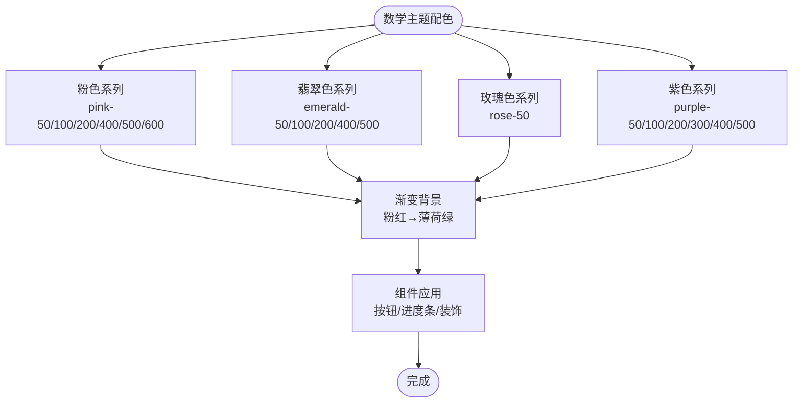

**图表来源**
- [src/pages/MathLearnPage.tsx:224](file://src/pages/MathLearnPage.tsx#L224)
- [src/components/math/MathFeedbackOverlay.tsx:50-53](file://src/components/math/MathFeedbackOverlay.tsx#L50-L53)
- [src/components/math/MathDailyComplete.tsx:50-51](file://src/components/math/MathDailyComplete.tsx#L50-L51)

**章节来源**
- [src/pages/MathLearnPage.tsx:224](file://src/pages/MathLearnPage.tsx#L224)
- [src/components/math/MathFeedbackOverlay.tsx:50-53](file://src/components/math/MathFeedbackOverlay.tsx#L50-L53)
- [src/components/math/MathDailyComplete.tsx:50-51](file://src/components/math/MathDailyComplete.tsx#L50-L51)

### 数学专用动画效果
- 糖果飘落动画：candy-fall 和 candy-fall-slow 两种速度的糖果飘落效果
- 动画特点：垂直飘落配合轻微旋转，营造糖果从天而降的视觉效果
- 应用场景：数学页面的背景装饰元素，使用不同的速度和透明度创造层次感
- 动画参数：使用 CSS @keyframes 定义，支持 3s 和 4.5s 的不同周期

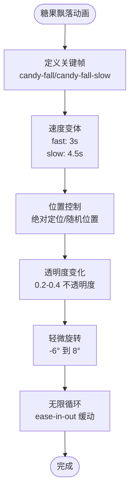

**图表来源**
- [src/index.css:95-109](file://src/index.css#L95-L109)
- [src/components/math/MathFloatingDecorations.tsx:5-12](file://src/components/math/MathFloatingDecorations.tsx#L5-L12)

**章节来源**
- [src/index.css:95-109](file://src/index.css#L95-L109)
- [src/components/math/MathFloatingDecorations.tsx:5-12](file://src/components/math/MathFloatingDecorations.tsx#L5-L12)

### 数学装饰元素系统
- 装饰组件：MathFloatingDecorations 提供 8 个不同位置和大小的装饰元素
- 装饰内容：包含糖果、蛋糕、彩虹、星星等 7 种不同表情符号
- 布局策略：使用绝对定位和百分比坐标，确保在不同屏幕尺寸下都有良好的视觉效果
- 动画组合：结合 candy-fall 和 drift-slow 动画，创造自然的飘动效果

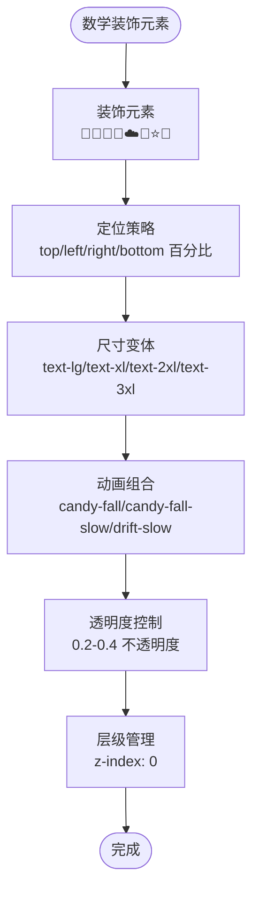

**图表来源**
- [src/components/math/MathFloatingDecorations.tsx:4-13](file://src/components/math/MathFloatingDecorations.tsx#L4-L13)

**章节来源**
- [src/components/math/MathFloatingDecorations.tsx:4-13](file://src/components/math/MathFloatingDecorations.tsx#L4-L13)

### 数学反馈系统
- 正确反馈：使用粉红色渐变背景，包含糖果撒花效果和庆祝动画
- 错误反馈：使用紫色渐变背景，提供正确答案提示和鼓励信息
- 动画效果：使用 Framer Motion 实现弹窗的缩放和淡入淡出效果
- 交互设计：点击任意位置或按钮都可以关闭反馈弹窗

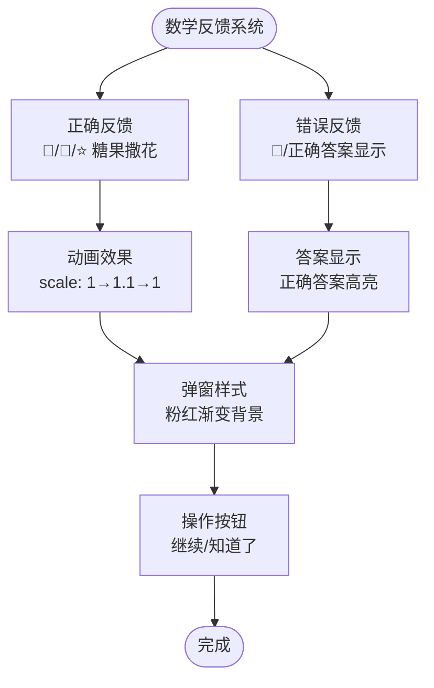

**图表来源**
- [src/components/math/MathFeedbackOverlay.tsx:16-103](file://src/components/math/MathFeedbackOverlay.tsx#L16-L103)

**章节来源**
- [src/components/math/MathFeedbackOverlay.tsx:16-103](file://src/components/math/MathFeedbackOverlay.tsx#L16-L103)

### 数学每日完成页面
- 设计特点：庆祝完成数学学习的专门页面，使用渐变背景和宝石奖励显示
- 奖励系统：根据答题正确率显示不同的宝石奖励数量
- 交互功能：提供再来一次和回到首页两个主要操作按钮
- 动画效果：使用 Framer Motion 实现整体的缩放和淡入效果

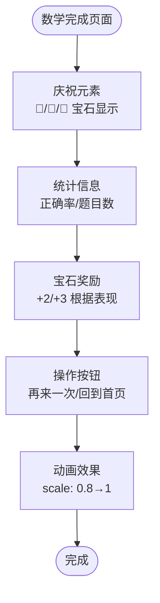

**图表来源**
- [src/components/math/MathDailyComplete.tsx:18-68](file://src/components/math/MathDailyComplete.tsx#L18-L68)

**章节来源**
- [src/components/math/MathDailyComplete.tsx:18-68](file://src/components/math/MathDailyComplete.tsx#L18-L68)

### 数学选项卡片系统
- 颜色主题：使用粉色、黄色、翡翠色、紫色四种主题色，支持悬停效果
- 状态动画：正确、错误、揭示、禁用等状态的动画效果
- 装饰元素：正确状态时显示糖果和星星装饰，增加趣味性
- 响应式设计：支持移动端和桌面端的不同尺寸和交互

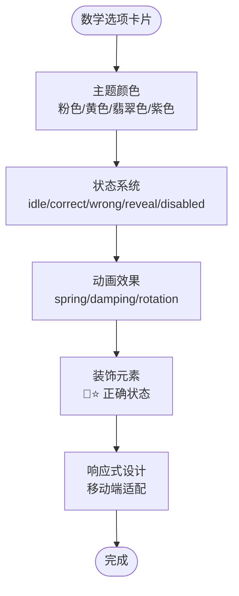

**图表来源**
- [src/components/math/MathOptionCard.tsx:10-34](file://src/components/math/MathOptionCard.tsx#L10-L34)

**章节来源**
- [src/components/math/MathOptionCard.tsx:10-34](file://src/components/math/MathOptionCard.tsx#L10-L34)

### 数学进度条系统
- 设计理念：使用糖果表情符号的进度条，🍬(完成) 🍭(当前) ☆(待做)
- 动画效果：使用 Framer Motion 实现每个进度项的弹跳和缩放效果
- 脉冲反馈：当前进度项使用 star-pulse 动画，突出显示当前状态
- 延迟动画：使用 0.05s 的延迟，创造逐个出现的动画效果

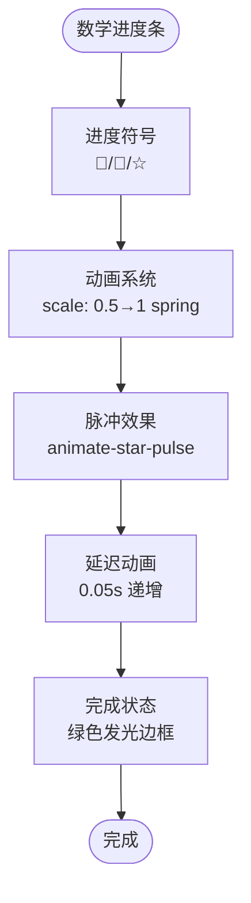

**图表来源**
- [src/components/math/MathProgressBar.tsx:17-31](file://src/components/math/MathProgressBar.tsx#L17-L31)

**章节来源**
- [src/components/math/MathProgressBar.tsx:17-31](file://src/components/math/MathProgressBar.tsx#L17-L31)

## 依赖分析
- 构建工具链：Vite 通过 TailwindCSS 插件在构建时生成原子类，减少运行时开销
- 动画库依赖：Framer Motion 提供流畅的交互动画效果
- 路由系统：React Router 实现页面导航与路由管理
- 状态管理：Zustand 状态管理库，用于用户信息、宝石数量等状态管理
- **数学主题依赖**：数学页面依赖专门的样式变量和动画效果
- 加载顺序：应用入口先引入全局样式，再渲染组件，确保变量与基础排版在组件渲染前已就绪

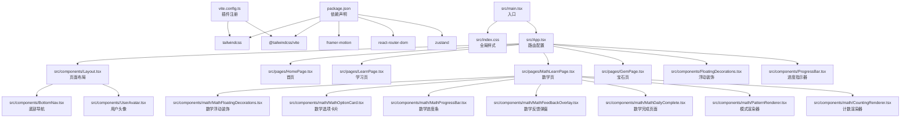

**图表来源**
- [package.json:12-19](file://package.json#L12-L19)
- [vite.config.ts:1-12](file://vite.config.ts#L1-L12)
- [src/main.tsx:1-11](file://src/main.tsx#L1-L11)
- [src/index.css:1](file://src/index.css#L1)
- [src/App.tsx:1-40](file://src/App.tsx#L1-L40)
- [src/components/Layout.tsx:1-26](file://src/components/Layout.tsx#L1-L26)
- [src/components/BottomNav.tsx:1-51](file://src/components/BottomNav.tsx#L1-L51)
- [src/components/UserAvatar.tsx:1-27](file://src/components/UserAvatar.tsx#L1-L27)
- [src/pages/HomePage.tsx:1-230](file://src/pages/HomePage.tsx#L1-L230)
- [src/pages/LearnPage.tsx:1-288](file://src/pages/LearnPage.tsx#L1-L288)
- [src/pages/MathLearnPage.tsx:1-353](file://src/pages/MathLearnPage.tsx#L1-L353)
- [src/pages/GemPage.tsx:1-317](file://src/pages/GemPage.tsx#L1-L317)
- [src/components/FloatingDecorations.tsx:1-24](file://src/components/FloatingDecorations.tsx#L1-L24)
- [src/components/ProgressBar.tsx:1-36](file://src/components/ProgressBar.tsx#L1-L36)
- [src/components/math/MathFloatingDecorations.tsx:1-16](file://src/components/math/MathFloatingDecorations.tsx#L1-L16)
- [src/components/math/MathOptionCard.tsx:1-69](file://src/components/math/MathOptionCard.tsx#L1-L69)
- [src/components/math/MathProgressBar.tsx:1-36](file://src/components/math/MathProgressBar.tsx#L1-L36)
- [src/components/math/MathFeedbackOverlay.tsx:1-106](file://src/components/math/MathFeedbackOverlay.tsx#L1-L106)
- [src/components/math/MathDailyComplete.tsx:1-69](file://src/components/math/MathDailyComplete.tsx#L1-L69)
- [src/components/math/PatternRenderer.tsx:1-51](file://src/components/math/PatternRenderer.tsx#L1-L51)
- [src/components/math/CountingRenderer.tsx:1-61](file://src/components/math/CountingRenderer.tsx#L1-L61)

**章节来源**
- [package.json:12-19](file://package.json#L12-L19)
- [vite.config.ts:1-12](file://vite.config.ts#L1-L12)
- [src/main.tsx:1-11](file://src/main.tsx#L1-L11)

## 性能考虑
- 原子类按需生成：TailwindCSS 插件仅生成实际使用的类，减少 CSS 体积
- SVG 动画优化：宝石动画使用 SVG 而非 Canvas，提供更好的缩放质量和性能
- **CSS 动画性能**：浮动装饰动画使用纯 CSS 实现，避免 JavaScript 动画的性能开销
- **数学动画优化**：糖果飘落动画使用 CSS @keyframes，性能优于 JavaScript 动画
- **动画优化策略**：合理使用动画数量，浮动装饰动画使用 `pointer-events-none` 确保不影响交互
- 动画性能：合理使用 Framer Motion，避免过多同时运行的复杂动画
- 组件懒加载：页面组件按需加载，减少首屏加载时间
- 缓存策略：本地存储用户数据，减少重复请求
- **数学页面优化**：数学页面的动画效果经过优化，确保在移动设备上的流畅运行

## 故障排除指南
- 动画不生效：确认 Framer Motion 已正确安装和导入
- 样式冲突：检查 TailwindCSS 版本兼容性和插件配置
- 响应式问题：验证断点设置和媒体查询的正确性
- **浮动动画问题**：检查 CSS 动画关键帧是否正确加载，确认原子类名称拼写
- **数学动画问题**：检查 candy-fall 和 candy-fall-slow 动画是否正确加载
- **数学主题问题**：验证粉色和翡翠色变量是否正确应用到组件
- 动画卡顿：检查动画复杂度和硬件加速设置
- 性能问题：分析动画数量和组件重渲染情况

**章节来源**
- [src/components/BottomNav.tsx:29-37](file://src/components/BottomNav.tsx#L29-L37)
- [src/pages/GemPage.tsx:24-96](file://src/pages/GemPage.tsx#L24-L96)
- [src/index.css:50-111](file://src/index.css#L50-L111)
- [src/components/math/MathFloatingDecorations.tsx:5-12](file://src/components/math/MathFloatingDecorations.tsx#L5-L12)

## 结论
Rainbow Learning 的样式系统以完整的彩虹主题为核心，结合现代的动画技术和响应式设计，实现了卓越的用户体验。**新增的数学主题样式系统**进一步丰富了项目的视觉表现力，通过糖果王国主题的粉色和翡翠色配色方案、数学专用动画效果和装饰元素，为数学学习页面提供了独特而富有吸引力的视觉体验。系统的模块化架构确保了代码的可维护性和扩展性，数学主题的加入为未来的功能扩展和主题定制奠定了坚实的基础。

## 附录
- 样式定制指南
  - 新增变量：在 :theme 中定义新的语义化变量，确保颜色搭配和谐
  - **新增数学主题**：学习现有的糖果主题模式，为新组件添加合适的数学动画效果
  - 动画扩展：基于现有的 candy-fall 动画模式，可以轻松扩展更多类型的数学装饰动画
  - 响应式设计：遵循现有的断点策略，确保在不同设备上的最佳显示效果
  - **数学主题定制**：可以创建不同的数学主题，如海洋主题、太空主题等
- 主题扩展方案
  - 多主题支持：基于现有的变量系统，可以轻松扩展其他主题
  - 品牌定制：通过修改颜色变量即可实现品牌色彩的定制
  - **动画主题**：可以创建不同的动画主题，如节日主题、季节主题等
  - **数学主题扩展**：可以为不同学科创建专门的主题样式和动画效果
- 性能优化建议
  - **动画优化**：合理控制同时运行的动画数量，数学页面使用 CSS 动画实现更高效
  - 图片优化：使用适当的图片格式和尺寸，减少加载时间
  - 代码分割：继续优化代码分割策略，提高页面加载速度
  - **硬件加速**：利用 CSS transform 和 opacity 属性的硬件加速特性
  - **数学页面优化**：针对数学页面的动画效果进行专门的性能优化