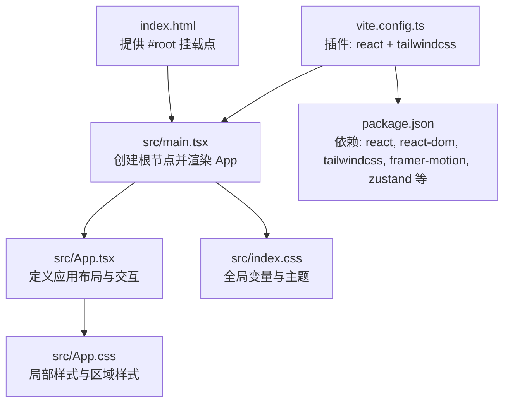
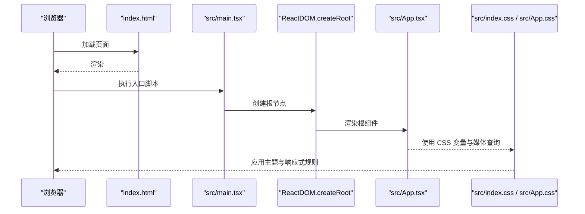
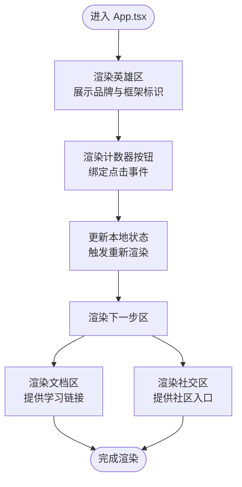
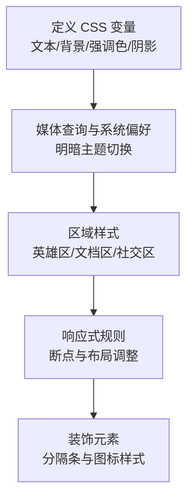
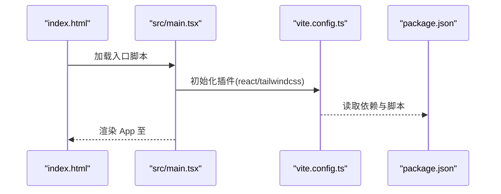
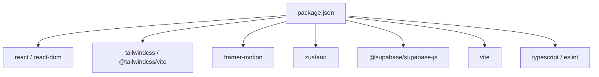

# 核心架构

<cite>
**本文引用的文件**
- [src/App.tsx](file://src/App.tsx)
- [src/main.tsx](file://src/main.tsx)
- [src/App.css](file://src/App.css)
- [src/index.css](file://src/index.css)
- [index.html](file://index.html)
- [vite.config.ts](file://vite.config.ts)
- [package.json](file://package.json)
- [tsconfig.app.json](file://tsconfig.app.json)
- [tsconfig.json](file://tsconfig.json)
- [README.md](file://README.md)
</cite>

## 目录
1. [简介](#简介)
2. [项目结构](#项目结构)
3. [核心组件](#核心组件)
4. [架构总览](#架构总览)
5. [详细组件分析](#详细组件分析)
6. [依赖分析](#依赖分析)
7. [性能考虑](#性能考虑)
8. [故障排查指南](#故障排查指南)
9. [结论](#结论)
10. [附录](#附录)

## 简介
本文件面向 Rainbow Learning 应用的核心架构与组件设计，聚焦于启动流程、组件层次结构、数据流、样式系统与响应式策略，并对主应用组件 App.tsx 的设计思路进行深入解析。同时，结合当前仓库中的实际代码，给出可操作的架构决策与设计权衡建议，帮助开发者在保持简洁的同时实现一致的视觉与交互体验。

## 项目结构
Rainbow Learning 采用最小化但现代的前端工程结构：
- 入口 HTML 提供挂载点与基础元信息
- 入口 TSX 负责渲染根组件
- 根组件 App.tsx 组织三大区域：英雄区、文档区、社交区
- 样式系统由 CSS 变量主题与 Tailwind 集成实现
- 构建工具链基于 Vite，集成 React 与 Tailwind 插件

图表来源
- [index.html:1-14](file://index.html#L1-L14)
- [src/main.tsx:1-11](file://src/main.tsx#L1-L11)
- [src/App.tsx:1-123](file://src/App.tsx#L1-L123)
- [src/App.css:1-185](file://src/App.css#L1-L185)
- [src/index.css:1-114](file://src/index.css#L1-L114)
- [vite.config.ts:1-12](file://vite.config.ts#L1-L12)
- [package.json:1-36](file://package.json#L1-L36)

章节来源
- [index.html:1-14](file://index.html#L1-L14)
- [src/main.tsx:1-11](file://src/main.tsx#L1-L11)
- [vite.config.ts:1-12](file://vite.config.ts#L1-L12)
- [package.json:1-36](file://package.json#L1-L36)

## 核心组件
- 根组件 App.tsx：负责应用整体布局与交互逻辑，包含状态管理（计数器）、图标与图片资源使用、以及三大区域的结构划分。
- 样式系统：以 CSS 变量为主题中心，配合 Tailwind 原子类与局部 CSS 实现主题切换与响应式布局。
- 启动流程：HTML 提供挂载点，TSX 创建根节点，渲染 App 组件，随后由 CSS 变量与媒体查询驱动视觉表现。

章节来源
- [src/App.tsx:1-123](file://src/App.tsx#L1-L123)
- [src/index.css:1-114](file://src/index.css#L1-L114)
- [src/App.css:1-185](file://src/App.css#L1-L185)

## 架构总览
下图展示从浏览器到组件渲染的关键路径，以及样式系统如何通过 CSS 变量与媒体查询实现主题与响应式。

图表来源
- [index.html:1-14](file://index.html#L1-L14)
- [src/main.tsx:1-11](file://src/main.tsx#L1-L11)
- [src/App.tsx:1-123](file://src/App.tsx#L1-L123)
- [src/index.css:1-114](file://src/index.css#L1-L114)
- [src/App.css:1-185](file://src/App.css#L1-L185)

## 详细组件分析

### 主应用组件 App.tsx 设计解析
- 结构组织
  - 英雄区：居中展示品牌与框架标识，包含交互按钮与计数状态。
  - 分隔条：用于视觉分隔与内容留白。
  - 下一步区：分为“文档区”和“社交区”，分别提供学习链接与社区入口。
- 数据流与状态
  - 使用 React 内置状态管理（useState），实现计数器的本地状态更新与渲染。
  - 点击事件绑定到按钮，触发状态变更，体现单向数据流与受控渲染。
- 图标与资源
  - 使用 SVG Symbol 方案加载图标，减少重复资源与提升复用性。
  - 引入图片资源作为装饰元素，增强视觉层次。
- 区域职责
  - 英雄区：引导用户、展示品牌与技术栈、提供互动入口。
  - 文档区：提供官方文档与学习资源链接，便于快速查阅。
  - 社交区：提供社区与平台入口，促进用户连接。

图表来源
- [src/App.tsx:1-123](file://src/App.tsx#L1-L123)

章节来源
- [src/App.tsx:1-123](file://src/App.tsx#L1-L123)

### 样式系统与主题设计
- CSS 变量主题
  - 在根级定义主题变量，覆盖文本、背景、边框、强调色、阴影等，统一跨组件色彩与层级。
  - 通过媒体查询与系统偏好颜色方案实现明暗主题切换，确保在深色模式下的可读性与对比度。
- 响应式设计
  - 在关键断点处调整字体大小、间距与布局方向，保证在桌面与移动端的一致体验。
  - 使用 Flexbox 与媒体查询控制区域布局与列表换行行为。
- 局部样式与区域样式
  - App.css 为各区域提供专用选择器与嵌套规则，确保样式隔离与可维护性。
  - 通过伪元素与定位实现装饰性视觉元素（如分隔条）。

图表来源
- [src/index.css:1-114](file://src/index.css#L1-L114)
- [src/App.css:1-185](file://src/App.css#L1-L185)

章节来源
- [src/index.css:1-114](file://src/index.css#L1-L114)
- [src/App.css:1-185](file://src/App.css#L1-L185)

### 启动流程与构建配置
- 启动流程
  - HTML 提供 #root 容器；TSX 使用 ReactDOM 将 App 渲染至该容器。
  - App 组件负责一次性渲染全部区域，无需额外路由或状态持久化。
- 构建与插件
  - Vite 配置启用 React 与 Tailwind 插件，支持原子类与开发热更新。
  - TypeScript 配置启用 JSX 与 bundler 模式，确保类型安全与模块解析正确。

图表来源
- [index.html:1-14](file://index.html#L1-L14)
- [src/main.tsx:1-11](file://src/main.tsx#L1-L11)
- [vite.config.ts:1-12](file://vite.config.ts#L1-L12)
- [package.json:1-36](file://package.json#L1-L36)

章节来源
- [index.html:1-14](file://index.html#L1-L14)
- [src/main.tsx:1-11](file://src/main.tsx#L1-L11)
- [vite.config.ts:1-12](file://vite.config.ts#L1-L12)
- [package.json:1-36](file://package.json#L1-L36)

### 组件间通信与状态管理
- 本地状态
  - App.tsx 使用 useState 管理计数器状态，属于组件内自洽的状态，适合简单交互。
- 外部状态库
  - 依赖中包含 Zustand，可用于后续扩展全局状态管理（如用户会话、主题偏好等）。
- 通信模式
  - 当前为单向数据流：父组件 App.tsx 通过 props 传递状态给子组件（若引入），或直接在组件内部处理交互。
  - 若未来拆分区域组件，可采用“自上而下传递”或“上下文/状态库”两种模式，视复杂度而定。

章节来源
- [src/App.tsx:1-123](file://src/App.tsx#L1-L123)
- [package.json:1-36](file://package.json#L1-L36)

### 样式继承与区域关系
- 根级继承
  - index.css 定义 :root 变量与全局排版，App.css 通过变量继承实现一致风格。
- 区域继承
  - next-steps 区域内的 docs 与 social 子区共享边框与间距规则，通过相邻选择器与媒体查询实现响应式布局。
- 图标与装饰
  - 通过 SVG Symbol 与伪元素实现跨区域的图标与装饰一致性，避免重复资源。

章节来源
- [src/index.css:1-114](file://src/index.css#L1-L114)
- [src/App.css:1-185](file://src/App.css#L1-L185)

## 依赖分析
- 运行时依赖
  - React 与 React DOM：提供组件模型与渲染能力。
  - Tailwind 与 Tailwind Vite 插件：提供原子类与快速样式迭代。
  - Framer Motion：动画与过渡能力（可选）。
  - Zustand：状态管理（可选）。
  - Supabase JS：数据库/认证能力（可选）。
- 开发依赖
  - Vite、React 插件、TypeScript 与 ESLint 生态，保障开发体验与质量。
- 构建与类型
  - tsconfig.app.json 指定 JSX 与 bundler 解析，确保与 Vite 协同工作。

图表来源
- [package.json:1-36](file://package.json#L1-L36)

章节来源
- [package.json:1-36](file://package.json#L1-L36)
- [tsconfig.app.json:1-26](file://tsconfig.app.json#L1-L26)
- [tsconfig.json:1-8](file://tsconfig.json#L1-L8)

## 性能考虑
- 构建与打包
  - Vite 的按需编译与 HMR 提升开发效率；生产构建通过插件链路优化产物体积。
- 样式体积
  - Tailwind 原子类在开发期灵活，生产期可通过 Purge/Tree-shaking 控制体积。
- 资源加载
  - SVG Symbol 减少重复资源，图片按需引入，避免不必要的网络开销。
- 交互性能
  - 本地状态更新仅影响局部组件，避免全局重渲染；动画建议按需启用。

## 故障排查指南
- 页面空白或未渲染
  - 检查 index.html 中 #root 是否存在且唯一。
  - 确认 main.tsx 中挂载点与入口脚本路径正确。
- 样式不生效
  - 确认 CSS 变量已定义且作用域正确；检查媒体查询断点是否匹配设备宽度。
  - 确保 Tailwind 插件已启用且未被禁用。
- 图标缺失
  - 确认 icons.svg 已放置于 public 目录且路径与 use href 一致。
- TypeScript 报错
  - 检查 tsconfig.app.json 的 jsx 与 bundler 设置是否与 Vite 协同。
  - 确认类型声明与模块解析无冲突。

章节来源
- [index.html:1-14](file://index.html#L1-L14)
- [src/main.tsx:1-11](file://src/main.tsx#L1-L11)
- [src/index.css:1-114](file://src/index.css#L1-L114)
- [vite.config.ts:1-12](file://vite.config.ts#L1-L12)
- [tsconfig.app.json:1-26](file://tsconfig.app.json#L1-L26)

## 结论
Rainbow Learning 的架构以简洁为核心：单一入口、局部组件与集中式主题变量，辅以 Tailwind 原子类与媒体查询实现一致的响应式体验。App.tsx 通过清晰的区域划分承载用户引导与学习入口，配合 CSS 变量与系统偏好实现明暗主题切换。未来可在保持现有结构的基础上，按需引入 Zustand 或 Supabase，以支持更复杂的交互与数据层需求。

## 附录
- 架构决策与设计权衡
  - 选择 React + Vite + Tailwind 的组合，平衡开发效率与构建性能。
  - 使用 CSS 变量主题系统，降低主题切换成本，提高可维护性。
  - 采用 SVG Symbol 与静态资源，简化资源管理与缓存策略。
  - 保留 Zustand 与 Supabase 依赖，为后续功能扩展预留空间。