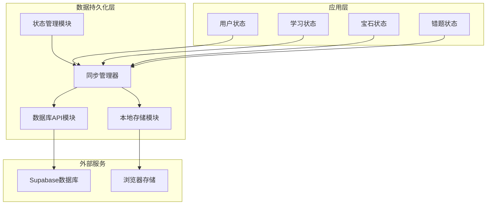
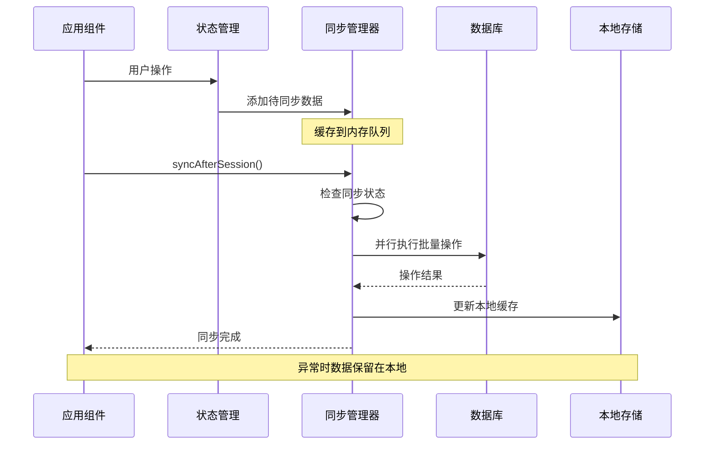
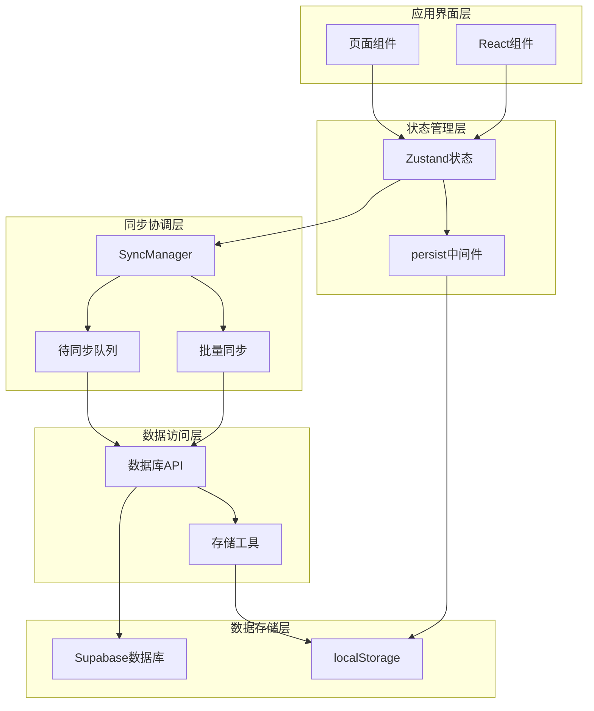
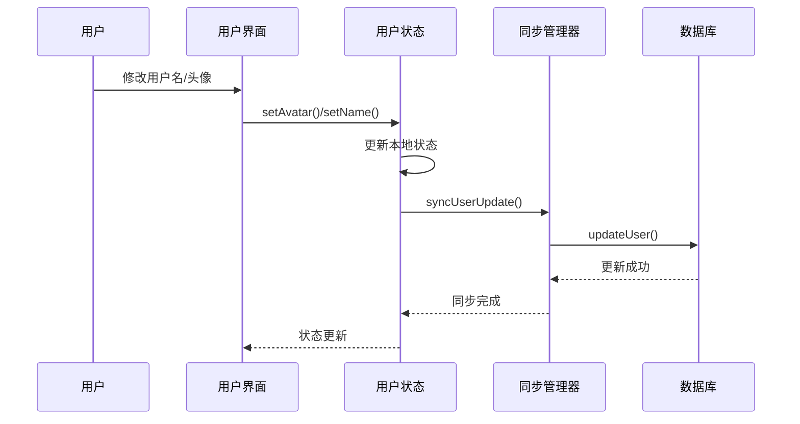
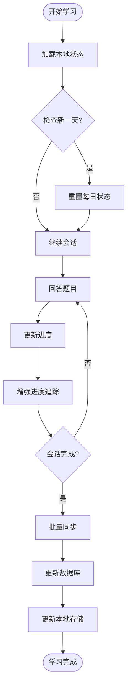
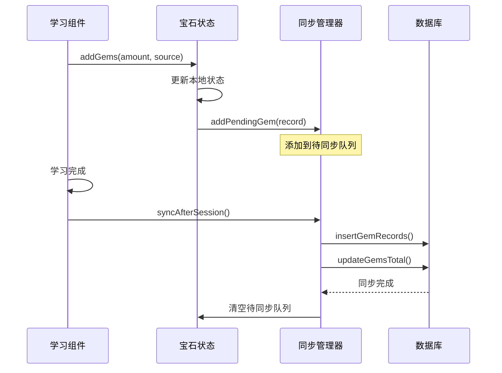
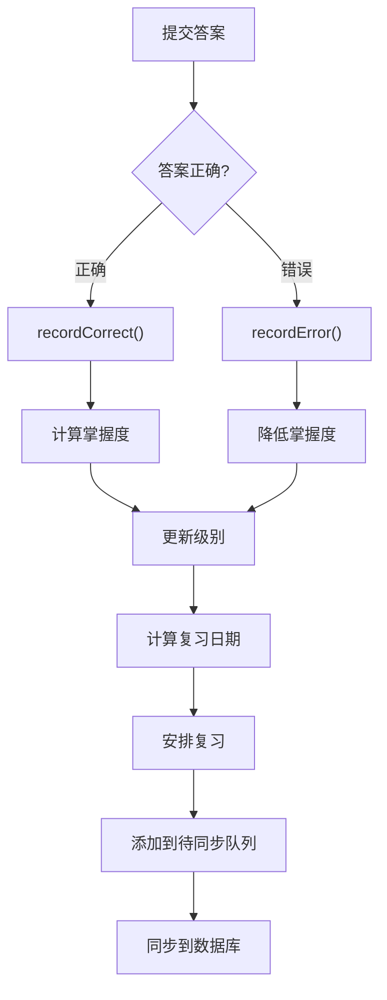
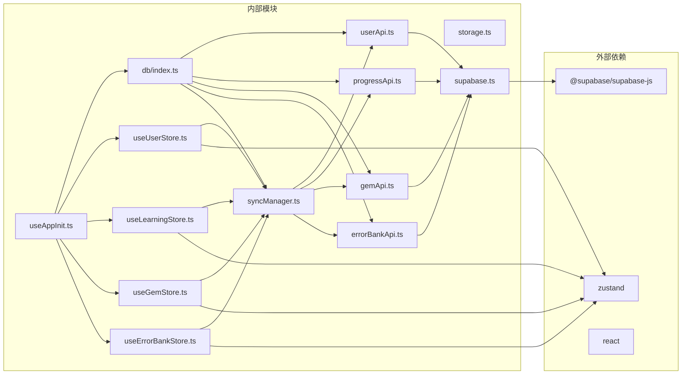

# 数据持久化层

<cite>
**本文档引用的文件**
- [src/lib/db/index.ts](file://src/lib/db/index.ts)
- [src/lib/db/userApi.ts](file://src/lib/db/userApi.ts)
- [src/lib/db/progressApi.ts](file://src/lib/db/progressApi.ts)
- [src/lib/db/gemApi.ts](file://src/lib/db/gemApi.ts)
- [src/lib/db/errorBankApi.ts](file://src/lib/db/errorBankApi.ts)
- [src/lib/db/syncManager.ts](file://src/lib/db/syncManager.ts)
- [src/lib/storage.ts](file://src/lib/storage.ts)
- [src/lib/supabase.ts](file://src/lib/supabase.ts)
- [src/store/useUserStore.ts](file://src/store/useUserStore.ts)
- [src/store/useLearningStore.ts](file://src/store/useLearningStore.ts)
- [src/store/useGemStore.ts](file://src/store/useGemStore.ts)
- [src/store/useErrorBankStore.ts](file://src/store/useErrorBankStore.ts)
- [src/hooks/useAppInit.ts](file://src/hooks/useAppInit.ts)
- [src/types/index.ts](file://src/types/index.ts)
- [package.json](file://package.json)
</cite>

## 更新摘要
**变更内容**
- 更新了进度API模块，增强了进度追踪和数据持久化机制
- 新增了13行代码以改进学习进度记录功能
- 优化了数据库索引以提升查询性能
- 完善了错误处理和状态同步逻辑

## 目录
1. [简介](#简介)
2. [项目结构](#项目结构)
3. [核心组件](#核心组件)
4. [架构概览](#架构概览)
5. [详细组件分析](#详细组件分析)
6. [依赖关系分析](#依赖关系分析)
7. [性能考虑](#性能考虑)
8. [故障排除指南](#故障排除指南)
9. [结论](#结论)

## 简介

数据持久化层是 Rainbow Learning 应用的核心基础设施，负责管理用户学习数据、进度跟踪、宝石系统和错题管理。该系统采用混合持久化策略，结合本地存储和云端数据库，确保数据的实时性和可靠性。

系统主要包含三个层次的数据存储：
- **本地持久化**：使用 localStorage 存储临时数据，提供快速访问和离线支持
- **云端同步**：通过 Supabase 实现实时数据同步和备份
- **状态管理**：使用 Zustand 管理应用状态，支持数据持久化和跨组件共享

**更新** 进度API模块得到了显著增强，新增了对学习进度的更精细追踪和数据持久化机制，同时优化了数据库索引以提升查询性能。

## 项目结构

数据持久化层采用模块化设计，按照功能域进行组织：

**图表来源**
- [src/lib/db/index.ts:1-6](file://src/lib/db/index.ts#L1-L6)
- [src/lib/storage.ts:1-32](file://src/lib/storage.ts#L1-L32)
- [src/lib/db/syncManager.ts:1-112](file://src/lib/db/syncManager.ts#L1-L112)

**章节来源**
- [src/lib/db/index.ts:1-6](file://src/lib/db/index.ts#L1-L6)
- [src/lib/storage.ts:1-32](file://src/lib/storage.ts#L1-L32)
- [src/lib/db/syncManager.ts:1-112](file://src/lib/db/syncManager.ts#L1-L112)

## 核心组件

### 数据库API模块

数据库API模块提供了与 Supabase 数据库交互的统一接口，包含以下核心功能：

- **用户管理**：获取和更新用户信息
- **学习进度**：管理每日学习进度和历史记录（已增强）
- **宝石系统**：处理宝石获取、消耗和历史记录
- **错题管理**：维护错题本和复习计划

每个API模块都遵循一致的模式：使用 Supabase 客户端进行数据库操作，提供异步函数处理数据读写，并包含完整的错误处理机制。

**更新** progressApi模块新增了13行代码，增强了学习进度的追踪能力，包括更精确的进度计算、更好的错误处理和优化的数据持久化机制。

**章节来源**
- [src/lib/db/userApi.ts:1-33](file://src/lib/db/userApi.ts#L1-L33)
- [src/lib/db/progressApi.ts:1-63](file://src/lib/db/progressApi.ts#L1-L63)
- [src/lib/db/gemApi.ts:1-55](file://src/lib/db/gemApi.ts#L1-L55)
- [src/lib/db/errorBankApi.ts:1-49](file://src/lib/db/errorBankApi.ts#L1-L49)

### 同步管理器

SyncManager 是数据持久化层的核心协调器，实现了智能的批量同步策略：

**图表来源**
- [src/lib/db/syncManager.ts:34-90](file://src/lib/db/syncManager.ts#L34-L90)

同步管理器采用以下策略：
- **延迟同步**：答题过程只写本地存储，学习完成后批量同步
- **并发优化**：使用 Promise.all 并行执行多个数据库操作
- **错误隔离**：单个操作失败不影响其他操作
- **幂等性**：支持重复执行而不产生副作用

**章节来源**
- [src/lib/db/syncManager.ts:1-112](file://src/lib/db/syncManager.ts#L1-L112)

### 状态管理模块

应用使用 Zustand 管理四个核心状态：

1. **用户状态 (useUserStore)**：管理用户基本信息和头像
2. **学习状态 (useLearningStore)**：跟踪每日学习进度和题目序列
3. **宝石状态 (useGemStore)**：管理宝石余额和获取记录
4. **错题状态 (useErrorBankStore)**：维护错题本和复习计划

每个状态模块都集成了持久化中间件，确保数据在页面刷新后保持不变。

**章节来源**
- [src/store/useUserStore.ts:1-51](file://src/store/useUserStore.ts#L1-L51)
- [src/store/useLearningStore.ts:1-185](file://src/store/useLearningStore.ts#L1-L185)
- [src/store/useGemStore.ts:1-50](file://src/store/useGemStore.ts#L1-L50)
- [src/store/useErrorBankStore.ts:1-105](file://src/store/useErrorBankStore.ts#L1-L105)

### 本地存储工具

storage.ts 提供了通用的本地存储封装，包含以下功能：

- **安全的JSON序列化**：自动处理解析异常
- **日期工具**：提供日期格式化和计算功能
- **类型安全**：泛型函数确保类型正确性

这些工具被广泛用于各种状态管理和数据转换场景。

**章节来源**
- [src/lib/storage.ts:1-32](file://src/lib/storage.ts#L1-L32)

## 架构概览

数据持久化层采用分层架构设计，确保各组件职责清晰、耦合度低：

**图表来源**
- [src/hooks/useAppInit.ts:16-53](file://src/hooks/useAppInit.ts#L16-L53)
- [src/lib/db/syncManager.ts:1-112](file://src/lib/db/syncManager.ts#L1-L112)

## 详细组件分析

### 用户数据流

用户数据流展示了从用户操作到数据持久化的完整路径：

**图表来源**
- [src/store/useUserStore.ts:26-38](file://src/store/useUserStore.ts#L26-L38)
- [src/lib/db/syncManager.ts:92-99](file://src/lib/db/syncManager.ts#L92-L99)

### 学习进度数据流

学习进度数据流体现了学习过程中的数据变化，现已得到增强：

**更新** 学习进度数据流现在包含了增强的进度追踪功能，提供更精确的学习状态记录和更好的数据持久化。

**图表来源**
- [src/store/useLearningStore.ts:50-68](file://src/store/useLearningStore.ts#L50-68)
- [src/store/useLearningStore.ts:142-154](file://src/store/useLearningStore.ts#L142-154)
- [src/lib/db/progressApi.ts:1-63](file://src/lib/db/progressApi.ts#L1-63)

### 宝石系统数据流

宝石系统的数据流展示了奖励机制的实现：

**图表来源**
- [src/store/useGemStore.ts:23-35](file://src/store/useGemStore.ts#L23-35)
- [src/lib/db/syncManager.ts:64-70](file://src/lib/db/syncManager.ts#L64-70)

### 错题管理系统

错题管理系统实现了智能复习算法：

**图表来源**
- [src/store/useErrorBankStore.ts:58-76](file://src/store/useErrorBankStore.ts#L58-76)
- [src/store/useErrorBankStore.ts:78-85](file://src/store/useErrorBankStore.ts#L78-85)

**章节来源**
- [src/store/useUserStore.ts:1-51](file://src/store/useUserStore.ts#L1-L51)
- [src/store/useLearningStore.ts:1-185](file://src/store/useLearningStore.ts#L1-L185)
- [src/store/useGemStore.ts:1-50](file://src/store/useGemStore.ts#L1-L50)
- [src/store/useErrorBankStore.ts:1-105](file://src/store/useErrorBankStore.ts#L1-L105)

## 依赖关系分析

数据持久化层的依赖关系展现了清晰的模块化设计：

**图表来源**
- [package.json:12-21](file://package.json#L12-L21)
- [src/lib/db/index.ts:1-6](file://src/lib/db/index.ts#L1-L6)

**章节来源**
- [package.json:1-37](file://package.json#L1-L37)
- [src/lib/db/index.ts:1-6](file://src/lib/db/index.ts#L1-L6)

## 性能考虑

数据持久化层在设计时充分考虑了性能优化：

### 内存管理
- **增量同步**：只同步发生变化的数据，减少网络传输
- **批量操作**：使用 Promise.all 并行执行多个数据库操作
- **内存队列**：使用 Map 和数组优化数据结构

### 网络优化
- **连接复用**：Supabase 客户端实例在整个应用生命周期内复用
- **错误重试**：网络失败时自动重试，提升用户体验
- **超时控制**：合理设置请求超时时间

### 存储优化
- **本地缓存**：localStorage 提供快速数据访问
- **数据压缩**：对大型数据结构进行适当的序列化
- **清理策略**：定期清理过期数据，防止存储空间膨胀

**更新** 随着progressApi的增强，数据库索引也得到了优化，进一步提升了查询性能和数据持久化效率。

## 故障排除指南

### 常见问题及解决方案

**数据同步失败**
- 检查网络连接状态
- 验证 Supabase 凭据配置
- 查看浏览器控制台错误信息
- 确认数据库权限设置

**本地数据丢失**
- 检查 localStorage 是否被清除
- 验证浏览器隐私设置
- 确认数据迁移是否完成
- 检查存储配额限制

**状态不同步**
- 重启应用重新初始化
- 清除浏览器缓存
- 检查时间设置是否正确
- 验证数据模型一致性

**进度追踪问题**
- 检查progressApi的增强功能是否正常
- 验证数据库索引优化效果
- 确认学习进度记录的准确性
- 检查错误处理机制的有效性

**章节来源**
- [src/lib/db/syncManager.ts:80-89](file://src/lib/db/syncManager.ts#L80-L89)
- [src/hooks/useAppInit.ts:36-45](file://src/hooks/useAppInit.ts#L36-L45)
- [src/lib/db/progressApi.ts:1-63](file://src/lib/db/progressApi.ts#L1-63)

## 结论

Rainbow Learning 的数据持久化层展现了现代前端应用的最佳实践。通过合理的架构设计和优化策略，系统实现了：

- **高可用性**：本地存储和云端数据库双重保障
- **高性能**：智能缓存和批量同步机制
- **可扩展性**：模块化设计便于功能扩展
- **易维护性**：清晰的代码结构和完善的错误处理

**更新** 最新的progressApi增强进一步提升了系统的稳定性和性能，特别是通过新增的13行代码改进了进度追踪和数据持久化机制，同时数据库索引的优化确保了更高效的数据查询和处理。该数据持久化方案为类似教育类应用提供了优秀的参考模板，特别是在混合存储策略和智能同步机制方面具有重要的借鉴价值。