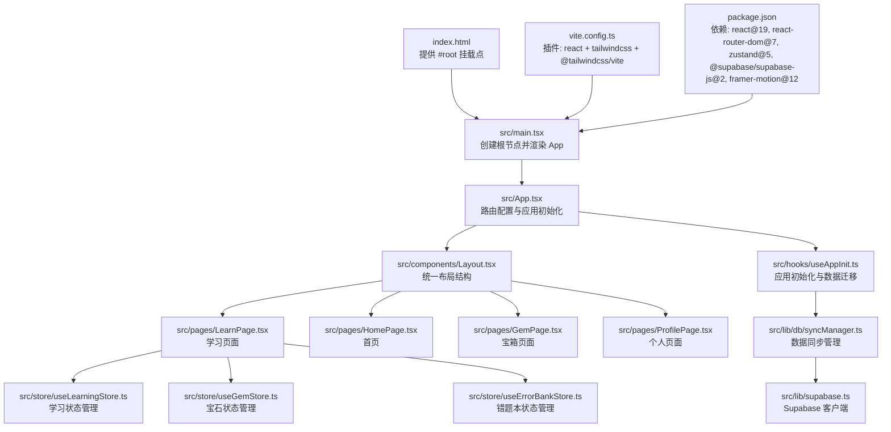
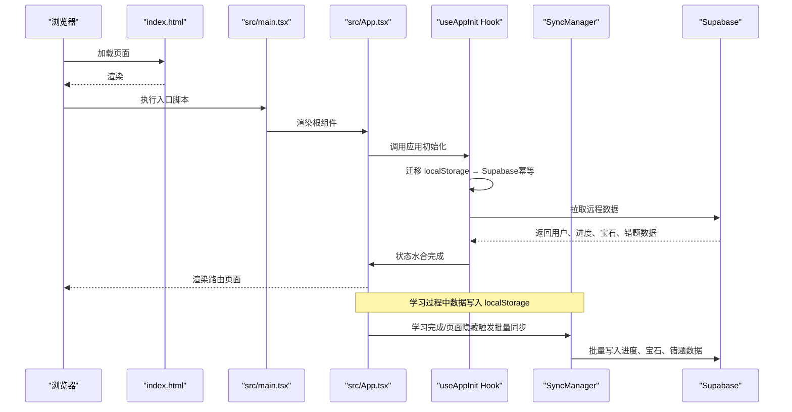
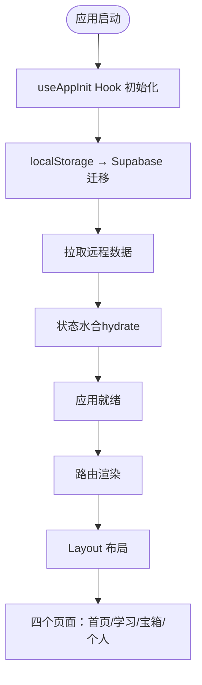
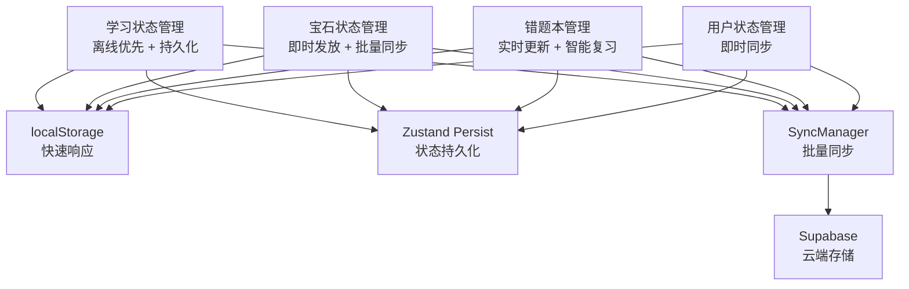
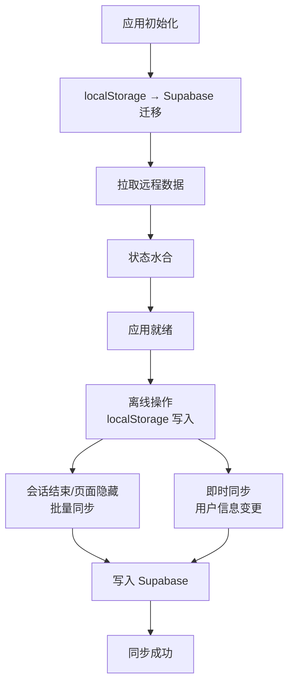
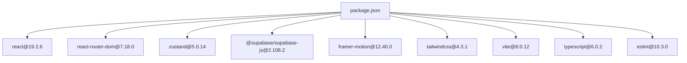

# 核心架构

<cite>
**本文引用的文件**
- [src/App.tsx](file://src/App.tsx)
- [src/main.tsx](file://src/main.tsx)
- [src/components/Layout.tsx](file://src/components/Layout.tsx)
- [src/components/BottomNav.tsx](file://src/components/BottomNav.tsx)
- [src/pages/LearnPage.tsx](file://src/pages/LearnPage.tsx)
- [src/store/useLearningStore.ts](file://src/store/useLearningStore.ts)
- [src/store/useGemStore.ts](file://src/store/useGemStore.ts)
- [src/hooks/useAppInit.ts](file://src/hooks/useAppInit.ts)
- [src/lib/db/syncManager.ts](file://src/lib/db/syncManager.ts)
- [src/lib/supabase.ts](file://src/lib/supabase.ts)
- [src/types/index.ts](file://src/types/index.ts)
- [src/data/questions.json](file://src/data/questions.json)
- [package.json](file://package.json)
- [index.html](file://index.html)
- [vite.config.ts](file://vite.config.ts)
- [tsconfig.app.json](file://tsconfig.app.json)
- [tsconfig.json](file://tsconfig.json)
- [README.md](file://README.md)
</cite>

## 目录
1. [简介](#简介)
2. [项目结构](#项目结构)
3. [核心组件](#核心组件)
4. [架构总览](#架构总览)
5. [详细组件分析](#详细组件分析)
6. [依赖分析](#依赖分析)
7. [性能考虑](#性能考虑)
8. [故障排查指南](#故障排查指南)
9. [结论](#结论)
10. [附录](#附录)

## 简介
本文件面向 Rainbow Learning 应用的核心架构与组件设计，聚焦于 Phase 1 MVP 实现后的完整学习系统架构、离线优先数据持久化策略、Supabase 集成、现代 React 状态管理等核心变更。文档深入解析应用的启动流程、组件层次结构和数据流向，解释主应用组件 App.tsx 的设计思路、四个主要页面区域（首页、学习区、宝箱区、个人区）的职责划分，分析样式系统的组织方式、CSS 变量主题系统和响应式设计实现，包含组件间的通信模式、Zustand 状态管理模式和样式继承关系，提供架构决策的技术考量和设计权衡分析。

## 项目结构
Rainbow Learning 采用现代化的前端工程结构，已完成 Phase 1 MVP 实现：
- 入口 HTML 提供挂载点与基础元信息
- 入口 TSX 负责渲染根组件
- 根组件 App.tsx 集成 React Router 实现多页面路由
- 布局组件 Layout.tsx 提供统一的头部、主内容区和底部导航
- 四个核心页面：LearnPage（学习）、HomePage（首页）、GemPage（宝箱）、ProfilePage（个人）
- 现代状态管理：Zustand Store 管理学习进度、宝石、用户信息、错题本
- 数据持久化：离线优先 + Supabase 同步的混合架构
- 构建工具链基于 Vite，集成 React 19、Tailwind CSS 4、Framer Motion 动画

**图表来源**
- [index.html:1-14](file://index.html#L1-L14)
- [src/main.tsx:1-11](file://src/main.tsx#L1-L11)
- [src/App.tsx:1-40](file://src/App.tsx#L1-L40)
- [src/components/Layout.tsx:1-26](file://src/components/Layout.tsx#L1-L26)
- [src/hooks/useAppInit.ts:1-189](file://src/hooks/useAppInit.ts#L1-L189)
- [src/lib/db/syncManager.ts:1-112](file://src/lib/db/syncManager.ts#L1-L112)
- [src/lib/supabase.ts:1-7](file://src/lib/supabase.ts#L1-L7)
- [src/store/useLearningStore.ts:1-185](file://src/store/useLearningStore.ts#L1-L185)
- [src/store/useGemStore.ts:1-50](file://src/store/useGemStore.ts#L1-L50)
- [vite.config.ts:1-12](file://vite.config.ts#L1-L12)
- [package.json:1-37](file://package.json#L1-L37)

**章节来源**
- [index.html:1-14](file://index.html#L1-L14)
- [src/main.tsx:1-11](file://src/main.tsx#L1-L11)
- [src/App.tsx:1-40](file://src/App.tsx#L1-L40)
- [vite.config.ts:1-12](file://vite.config.ts#L1-L12)
- [package.json:1-37](file://package.json#L1-L37)

## 核心组件
- **根组件 App.tsx**：集成 React Router 7，实现四页面路由配置，使用 useAppInit Hook 进行应用初始化，提供加载状态保护
- **布局组件 Layout.tsx**：统一的头部导航、主内容区和底部导航结构，支持响应式设计
- **应用初始化 Hook**：useAppInit 实现 localStorage → Supabase 的数据迁移、远程数据拉取、状态水合（hydrate）
- **状态管理系统**：四个 Zustand Store 分别管理学习进度、宝石、用户信息、错题本，支持持久化和同步
- **数据同步管理**：SyncManager 实现离线优先的数据同步策略，支持会话级批量同步和即时用户信息同步
- **学习页面 LearnPage**：完整的交互式学习体验，包含题目切换、答案验证、反馈提示、宝石奖励等
- **Supabase 集成**：客户端配置和环境变量管理，支持用户、进度、宝石、错题等数据的云端存储

**章节来源**
- [src/App.tsx:1-40](file://src/App.tsx#L1-L40)
- [src/components/Layout.tsx:1-26](file://src/components/Layout.tsx#L1-L26)
- [src/hooks/useAppInit.ts:1-189](file://src/hooks/useAppInit.ts#L1-L189)
- [src/lib/db/syncManager.ts:1-112](file://src/lib/db/syncManager.ts#L1-L112)

## 架构总览
下图展示 Phase 1 MVP 实现后的完整架构流程，从应用启动到数据同步的关键路径：

**图表来源**
- [src/main.tsx:1-11](file://src/main.tsx#L1-L11)
- [src/App.tsx:1-40](file://src/App.tsx#L1-L40)
- [src/hooks/useAppInit.ts:1-189](file://src/hooks/useAppInit.ts#L1-L189)
- [src/lib/db/syncManager.ts:1-112](file://src/lib/db/syncManager.ts#L1-L112)

## 详细组件分析

### 主应用组件 App.tsx 设计解析
**更新** 完成路由重构，从单一页面升级为四页面应用架构

- **路由配置**
  - 使用 React Router 7 的新语法，支持嵌套路由和布局组件
  - 布局组件 Layout.tsx 包裹所有页面，提供统一的头部、主内容区和底部导航
  - 四个主要路由：首页(/)、学习(/learn)、宝箱(/gems)、个人(/profile)
- **应用初始化**
  - 集成 useAppInit Hook，在应用启动时进行数据迁移和状态水合
  - 提供加载状态保护，防止初始化完成前的界面闪烁
- **组件结构**
  - BrowserRouter 包装 Routes，实现客户端路由
  - Layout 组件提供响应式设计和用户体验

**图表来源**
- [src/App.tsx:1-40](file://src/App.tsx#L1-L40)
- [src/hooks/useAppInit.ts:1-189](file://src/hooks/useAppInit.ts#L1-L189)

**章节来源**
- [src/App.tsx:1-40](file://src/App.tsx#L1-L40)
- [src/components/Layout.tsx:1-26](file://src/components/Layout.tsx#L1-L26)

### 布局系统与导航架构
**更新** 新增统一布局组件和底部导航

- **Layout 组件**
  - 顶部导航栏：品牌标题和用户头像
  - 主内容区：最大宽度限制和响应式间距
  - 底部固定导航：适配移动设备的安全区域
- **底部导航**
  - 四个标签：首页(🏠)、学习(/learn)、宝箱(🎁)、个人(👧🏻)
  - 激活状态的动态效果和颜色变化
  - 支持移动端安全区域适配
- **响应式设计**
  - 使用 CSS 自定义属性实现主题一致性
  - 移动端优先的设计理念，支持横屏和竖屏切换

**章节来源**
- [src/components/Layout.tsx:1-26](file://src/components/Layout.tsx#L1-L26)
- [src/components/BottomNav.tsx:1-51](file://src/components/BottomNav.tsx#L1-L51)

### 学习系统架构与状态管理
**更新** 完整的学习系统架构，包含四个 Zustand Store

- **学习状态管理（useLearningStore）**
  - 离线优先：所有学习操作先写入 localStorage
  - 持久化：使用 Zustand persist middleware 保存状态
  - 会话同步：学习完成后批量同步到 Supabase
  - 日常进度：支持每日重置和连续性追踪
- **宝石状态管理（useGemStore）**
  - 即时宝石发放：答题正确时立即增加宝石
  - 记录追踪：保存宝石获取历史和来源
  - 同步机制：通过 SyncManager 批量同步宝石记录
- **错题本管理（useErrorBankStore）**
  - 实时错题记录：根据答题结果动态更新
  - 复习策略：支持错题优先和间隔复习
  - 数据持久化：自动保存和恢复错题状态
- **用户状态管理（useUserStore）**
  - 用户信息：姓名和头像的本地存储
  - 即时同步：用户信息变更时实时同步到云端

**图表来源**
- [src/store/useLearningStore.ts:1-185](file://src/store/useLearningStore.ts#L1-L185)
- [src/store/useGemStore.ts:1-50](file://src/store/useGemStore.ts#L1-L50)
- [src/lib/db/syncManager.ts:1-112](file://src/lib/db/syncManager.ts#L1-L112)

**章节来源**
- [src/store/useLearningStore.ts:1-185](file://src/store/useLearningStore.ts#L1-L185)
- [src/store/useGemStore.ts:1-50](file://src/store/useGemStore.ts#L1-L50)

### 数据持久化与同步策略
**更新** 实现完整的离线优先数据持久化和 Supabase 集成

- **初始化流程**
  - 数据迁移：localStorage → Supabase 的幂等迁移
  - 远程同步：拉取用户、进度、宝石、错题等数据
  - 状态水合：将远程数据合并到本地状态
- **同步策略**
  - 离线优先：所有用户操作先写入本地存储
  - 会话同步：学习完成后批量同步到云端
  - 即时同步：用户信息变更时立即同步
  - 可见性同步：页面隐藏时自动触发同步
- **错误处理**
  - 网络失败时回退到本地数据
  - 同步失败时数据保留在本地等待重试
  - 迁移失败不影响应用正常运行

**图表来源**
- [src/hooks/useAppInit.ts:1-189](file://src/hooks/useAppInit.ts#L1-L189)
- [src/lib/db/syncManager.ts:1-112](file://src/lib/db/syncManager.ts#L1-L112)

**章节来源**
- [src/hooks/useAppInit.ts:1-189](file://src/hooks/useAppInit.ts#L1-L189)
- [src/lib/db/syncManager.ts:1-112](file://src/lib/db/syncManager.ts#L1-L112)

### 学习页面与交互设计
**更新** 完整的学习体验实现，包含丰富的交互和反馈机制

- **学习流程**
  - 日常会话：每天5道题的固定学习量
  - 复习优先：错题优先出现在当天学习中
  - 练习模式：完成正式学习后可进行额外练习
  - 完成奖励：根据正确率发放不同数量的宝石
- **交互反馈**
  - 答案验证：正确/错误的不同视觉反馈
  - 成就消息：鼓励性的文字反馈
  - 音效系统：正确/错误/宝石获得的音效
  - 动画效果：Framer Motion 提供流畅的转场动画
- **状态管理**
  - 实时进度追踪：当前题目、正确率、剩余数量
  - 选项状态：悬停、选中、正确、错误、揭示等状态
  - 练习模式：独立的状态管理和计分系统

**章节来源**
- [src/pages/LearnPage.tsx:1-288](file://src/pages/LearnPage.tsx#L1-L288)

### Supabase 集成与数据模型
**更新** 完整的云端数据存储和同步实现

- **客户端配置**
  - 环境变量管理：VITE_SUPABASE_URL 和 VITE_SUPABASE_ANON_KEY
  - 客户端创建：@supabase/supabase-js v2.108.2
  - 类型安全：完整的 TypeScript 接口定义
- **数据模型**
  - 用户表：用户基本信息和宝石总数
  - 每日进度表：学习进度和题目序列
  - 宝石记录表：宝石获取历史和来源
  - 错题本表：错题统计和复习计划
- **API 接口**
  - 用户管理：fetchUser、updateUser
  - 进度管理：fetchDailyProgress、upsertDailyProgress
  - 宝石管理：fetchGemRecords、insertGemRecords、updateGemsTotal
  - 错题管理：fetchErrorBank、upsertErrorRecords

**章节来源**
- [src/lib/supabase.ts:1-7](file://src/lib/supabase.ts#L1-L7)
- [src/types/index.ts:1-66](file://src/types/index.ts#L1-L66)

## 依赖分析
**更新** 基于 Phase 1 MVP 实现的完整依赖矩阵

- **运行时依赖**
  - React 19：最新的 React 版本，支持并发特性和新特性
  - React Router 7：新的路由版本，支持嵌套路由和布局组件
  - Zustand 5：现代状态管理库，支持中间件和持久化
  - @supabase/supabase-js 2.108.2：官方 Supabase 客户端
  - Framer Motion 12.40.0：高性能动画库
  - Tailwind CSS 4.3.1：实用优先的 CSS 框架
- **开发依赖**
  - Vite 8.0.12：现代化构建工具
  - TypeScript 6.0.2：类型安全的 JavaScript 超集
  - ESLint 10.3.0：代码质量工具
  - @vitejs/plugin-react 6.0.1：React 支持插件
- **构建配置**
  - tsconfig.app.json：应用配置，支持 JSX 和 bundler 解析
  - tsconfig.json：根配置，支持多项目管理

**图表来源**
- [package.json:1-37](file://package.json#L1-L37)

**章节来源**
- [package.json:1-37](file://package.json#L1-L37)
- [tsconfig.app.json:1-26](file://tsconfig.app.json#L1-L26)
- [tsconfig.json:1-8](file://tsconfig.json#L1-L8)

## 性能考虑
**更新** 基于新架构的性能优化策略

- **启动性能**
  - 应用初始化采用异步流程，避免阻塞 UI 渲染
  - 使用加载状态保护，提供良好的用户体验
  - 数据迁移采用幂等设计，避免重复操作
- **状态管理性能**
  - Zustand 替代 Redux，减少样板代码和内存占用
  - 持久化中间件仅保存必要状态，避免存储膨胀
  - Store 分离设计，支持细粒度的状态更新
- **数据同步性能**
  - 离线优先策略，所有操作立即响应
  - 批量同步减少网络请求次数
  - 并行执行多个同步任务，提升吞吐量
- **构建优化**
  - Vite 提供快速的开发体验和热重载
  - Tree-shaking 和代码分割优化生产包大小
  - Tailwind CSS 4 的原生支持提升构建性能

## 故障排查指南
**更新** 基于新架构的故障排查清单

- **应用启动问题**
  - 检查 Supabase 环境变量是否正确配置
  - 确认网络连接和 Supabase 服务可用性
  - 查看控制台错误信息，确认初始化流程
- **数据同步问题**
  - 检查 localStorage 权限和存储容量
  - 验证 Supabase 表结构和权限设置
  - 监控网络请求，确认同步任务执行
- **状态管理问题**
  - 使用 React DevTools 检查 Store 状态
  - 验证 Zustand 持久化配置和存储键名
  - 检查状态更新函数的调用时机
- **路由和导航问题**
  - 确认 React Router 7 的配置正确
  - 检查 Layout 组件的嵌套结构
  - 验证底部导航的路径映射

**章节来源**
- [src/hooks/useAppInit.ts:1-189](file://src/hooks/useAppInit.ts#L1-L189)
- [src/lib/db/syncManager.ts:1-112](file://src/lib/db/syncManager.ts#L1-L112)
- [src/App.tsx:1-40](file://src/App.tsx#L1-L40)

## 结论
Rainbow Learning 的 Phase 1 MVP 实现标志着从原型到生产级应用的重要跨越。通过采用 React Router 7 的现代路由架构、Zustand 状态管理、Supabase 云端存储和离线优先的数据持久化策略，应用实现了稳定可靠的学习系统。四个核心页面提供了完整的用户体验，从首页引导到学习、宝箱奖励、个人管理的完整闭环。SyncManager 的批量同步机制确保了数据的一致性和可靠性，而 Zustand 的轻量级状态管理提供了优秀的开发体验。这一架构为未来的功能扩展奠定了坚实的基础，包括更复杂的学习算法、个性化推荐和多学科支持等。

## 附录
**更新** 基于新架构的设计决策和技术权衡

- **架构决策**
  - 选择 React Router 7 + Layout 组件的组合，提供清晰的页面结构和导航体验
  - 采用 Zustand 替代 Redux，简化状态管理复杂度，提升开发效率
  - 实现离线优先 + 云端同步的混合策略，平衡性能和可靠性
  - 使用 Supabase 作为后端即服务，减少运维复杂度
- **技术权衡**
  - 状态管理：Zustand vs Redux - 选择前者以减少样板代码和内存占用
  - 数据持久化：localStorage vs IndexedDB - 选择前者以简化实现和兼容性
  - 同步策略：实时同步 vs 批量同步 - 选择后者以提升性能和减少网络开销
  - 动画库：CSS 动画 vs Framer Motion - 选择后者以提供更丰富的交互体验
- **未来扩展**
  - 支持更多学科和题型
  - 实现智能复习算法和个性化学习路径
  - 添加离线学习模式和数据同步队列
  - 集成更多社交功能和成就系统