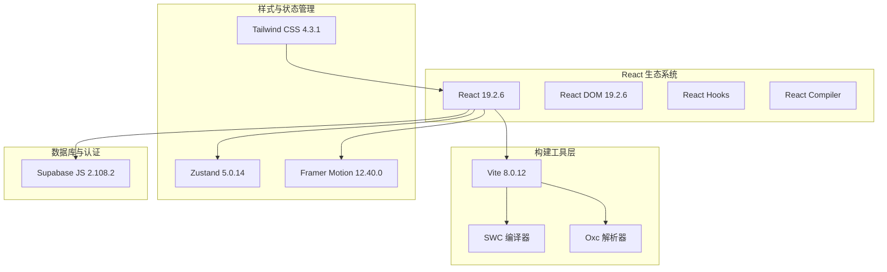
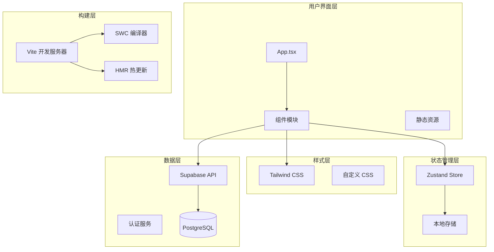
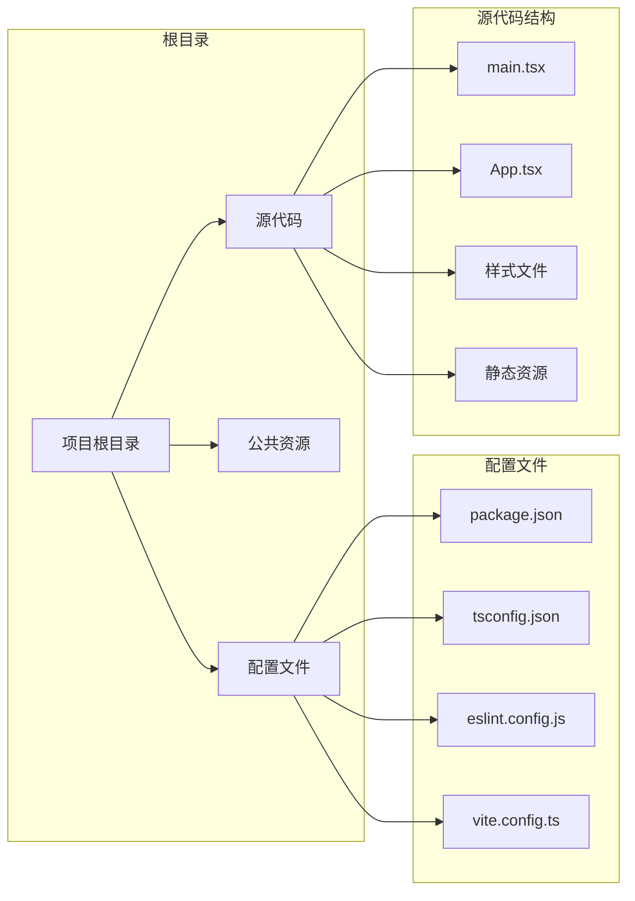
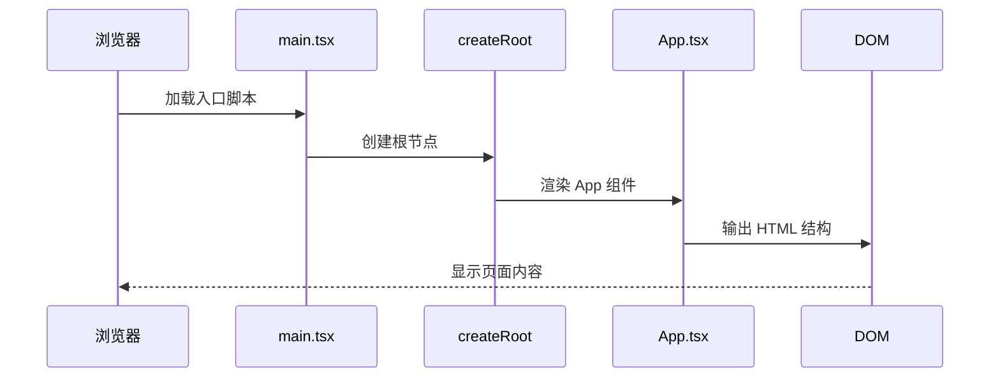
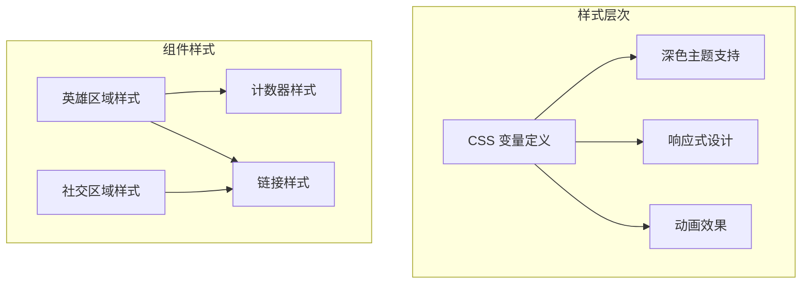
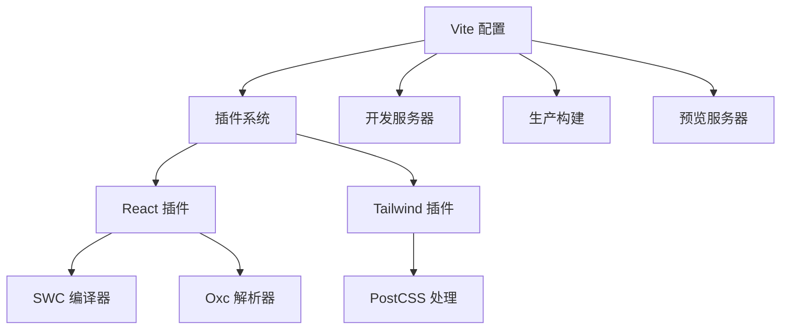
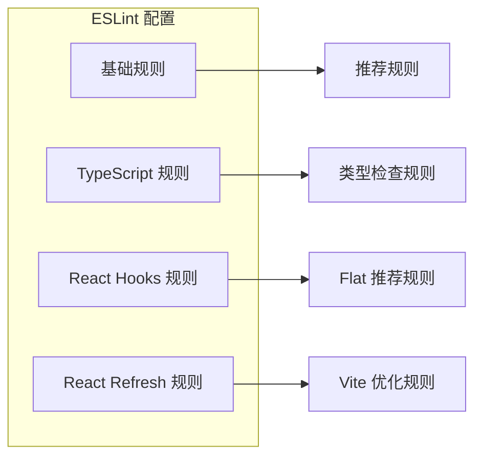
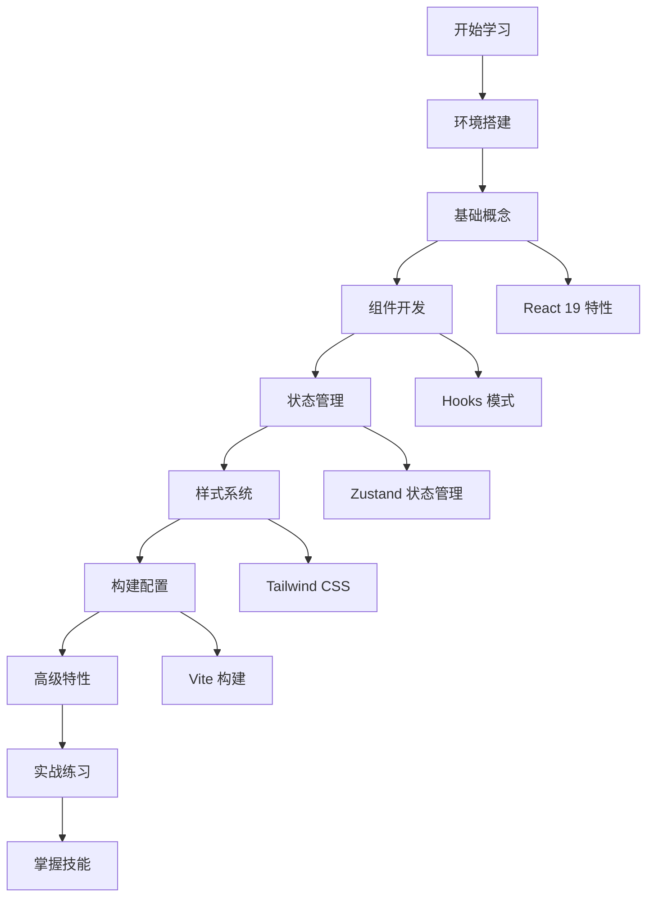
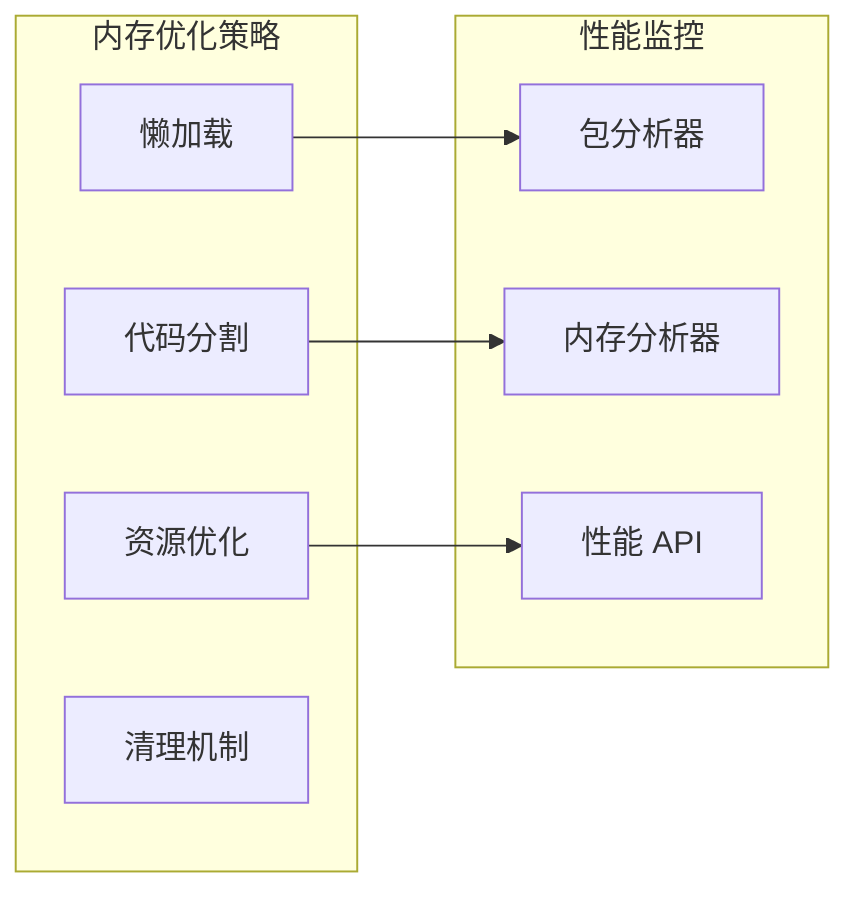

# 项目概述

<cite>
**本文档引用的文件**
- [README.md](file://README.md)
- [package.json](file://package.json)
- [vite.config.ts](file://vite.config.ts)
- [src/main.tsx](file://src/main.tsx)
- [src/App.tsx](file://src/App.tsx)
- [src/index.css](file://src/index.css)
- [src/App.css](file://src/App.css)
- [tsconfig.json](file://tsconfig.json)
- [tsconfig.app.json](file://tsconfig.app.json)
- [eslint.config.js](file://eslint.config.js)
</cite>

## 目录
1. [项目简介](#项目简介)
2. [技术栈概览](#技术栈概览)
3. [项目架构设计](#项目架构设计)
4. [核心组件分析](#核心组件分析)
5. [开发工具链](#开发工具链)
6. [设计理念与学习目标](#设计理念与学习目标)
7. [使用场景与学习路径](#使用场景与学习路径)
8. [性能特性](#性能特性)
9. [总结](#总结)

## 项目简介

Rainbow Learning 是一个基于现代前端技术栈构建的学习平台原型项目，专注于展示 React 19 + Vite + TypeScript 技术组合的最佳实践。该项目不仅是一个功能演示，更是 React 生态系统最新开发工具的综合技术展示平台。

### 项目定位

该项目作为技术演示平台，旨在：
- 展示 React 19 最新特性和开发模式
- 演示 Vite 构建工具的高性能开发体验
- 展现 TypeScript 在大型前端项目中的类型安全优势
- 提供现代化前端开发的完整工具链解决方案

### 核心价值

1. **技术前沿性**：采用 React 19、Vite 8、TypeScript 6 等最新版本
2. **开发效率**：提供快速热模块替换(HMR)和即时编译反馈
3. **代码质量**：集成完整的 ESLint 配置和类型检查
4. **可扩展性**：模块化的架构设计支持功能扩展

## 技术栈概览

### 前端框架层



**图表来源**
- [package.json:12-34](file://package.json#L12-L34)
- [vite.config.ts:1-12](file://vite.config.ts#L1-L12)

### 开发工具链

| 组件 | 版本 | 用途 |
|------|------|------|
| React | ^19.2.6 | 用户界面框架 |
| Vite | ^8.0.12 | 构建工具和开发服务器 |
| TypeScript | ~6.0.2 | 类型安全和开发体验 |
| Tailwind CSS | ^4.3.1 | 实用优先的 CSS 框架 |
| Zustand | ^5.0.14 | 轻量级状态管理 |
| Framer Motion | ^12.40.0 | 动画和过渡效果 |
| Supabase JS | ^2.108.2 | 后端即服务解决方案 |

**章节来源**
- [package.json:12-34](file://package.json#L12-L34)

## 项目架构设计

### 整体架构图



**图表来源**
- [src/main.tsx:1-11](file://src/main.tsx#L1-L11)
- [src/App.tsx:1-123](file://src/App.tsx#L1-L123)
- [vite.config.ts:1-12](file://vite.config.ts#L1-L12)

### 文件组织结构



**图表来源**
- [tsconfig.json:1-8](file://tsconfig.json#L1-L8)
- [tsconfig.app.json:1-26](file://tsconfig.app.json#L1-L26)

## 核心组件分析

### 应用入口组件

应用的入口点采用了标准的 React 19 结构，使用严格模式包装确保更好的错误检测。



**图表来源**
- [src/main.tsx:1-11](file://src/main.tsx#L1-L11)
- [src/App.tsx:1-123](file://src/App.tsx#L1-L123)

### 主要页面组件

App.tsx 作为主要页面组件，包含了以下核心功能区域：

1. **中心展示区**：包含 React 和 Vite 图标的视觉展示
2. **交互按钮**：计数器功能演示状态管理
3. **文档链接区**：提供相关技术文档链接
4. **社区连接区**：展示项目相关的社区资源

**章节来源**
- [src/App.tsx:7-123](file://src/App.tsx#L7-L123)

### 样式系统架构

项目采用了分层的样式架构：



**图表来源**
- [src/index.css:1-114](file://src/index.css#L1-L114)
- [src/App.css:1-185](file://src/App.css#L1-L185)

**章节来源**
- [src/index.css:1-114](file://src/index.css#L1-L114)
- [src/App.css:1-185](file://src/App.css#L1-L185)

## 开发工具链

### 构建配置

Vite 配置文件展示了现代化的构建设置：



**图表来源**
- [vite.config.ts:1-12](file://vite.config.ts#L1-L12)

### TypeScript 配置

项目使用了严格的 TypeScript 配置策略：

| 配置选项 | 值 | 作用 |
|----------|-----|------|
| target | ES2023 | 现代 JavaScript 特性支持 |
| module | ESNext | 模块化打包优化 |
| jsx | react-jsx | React JSX 支持 |
| skipLibCheck | true | 编译性能优化 |
| noEmit | true | 仅类型检查，不生成输出 |

**章节来源**
- [tsconfig.app.json:2-22](file://tsconfig.app.json#L2-L22)

### ESLint 配置



**图表来源**
- [eslint.config.js:1-23](file://eslint.config.js#L1-L23)

**章节来源**
- [eslint.config.js:8-22](file://eslint.config.js#L8-L22)

## 设计理念与学习目标

### 设计哲学

1. **最小化原则**：保持项目结构简洁，避免过度工程化
2. **最佳实践**：遵循 React 生态系统的标准实践
3. **可扩展性**：为未来功能扩展预留空间
4. **教育价值**：通过实际代码展示技术概念

### 学习目标

#### 对初学者的目标
- 理解现代前端开发工具链的工作原理
- 掌握 React 19 的基本开发模式
- 学会使用 Vite 进行快速开发
- 了解 TypeScript 在前端项目中的应用

#### 对有经验开发者的目标
- 深入理解 React 19 的新特性和改进
- 探索 Vite 构建工具的高级配置
- 学习现代化的代码组织和架构模式
- 掌握性能优化的最佳实践

### 教育价值

该项目特别注重：
- **渐进式复杂度**：从简单到复杂的演进过程
- **实际应用场景**：展示真实项目中可能遇到的问题和解决方案
- **工具链整合**：演示各种开发工具如何协同工作
- **性能考量**：在开发体验和运行时性能之间找到平衡

## 使用场景与学习路径

### 初学者学习路径



### 实际应用场景

1. **个人学习项目**：作为学习现代前端技术的起点
2. **团队技术选型参考**：为技术决策提供实证依据
3. **教学演示材料**：用于前端开发课程的教学案例
4. **原型开发模板**：快速启动类似项目的基础模板

### 快速开始指南

```bash
# 克隆项目
git clone <repository-url>
cd rainbow-learning

# 安装依赖
npm install

# 启动开发服务器
npm run dev

# 构建生产版本
npm run build

# 预览生产构建
npm run preview
```

## 性能特性

### 开发性能优化

1. **快速启动**：Vite 提供毫秒级的冷启动时间
2. **热模块替换**：实现无刷新的开发体验
3. **按需编译**：只编译变更的模块
4. **多核编译**：充分利用 CPU 资源

### 运行时性能

1. **Tree Shaking**：自动移除未使用的代码
2. **代码分割**：按需加载组件和资源
3. **缓存策略**：浏览器缓存和 CDN 优化
4. **资源压缩**：生产环境的资源优化

### 内存管理



## 总结

Rainbow Learning 项目成功地展示了现代前端开发的最佳实践，通过 React 19 + Vite + TypeScript 的技术组合，为开发者提供了一个学习和探索的平台。项目不仅具有教育价值，也为实际项目开发提供了宝贵的参考。

### 主要成就

1. **技术栈整合**：完美整合了最新的前端技术
2. **开发体验优化**：提供了流畅的开发和调试体验
3. **代码质量保证**：通过严格的类型检查和代码规范
4. **可扩展架构**：为未来的功能扩展奠定了基础

### 未来发展

该项目可以进一步发展为：
- 更完整的功能实现
- 更丰富的学习资源
- 更完善的测试覆盖
- 更详细的文档说明

通过持续的迭代和改进，Rainbow Learning 将继续成为前端开发学习和实践的重要参考资源。
